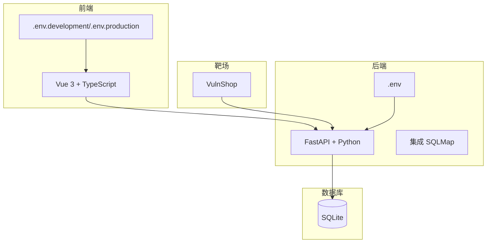
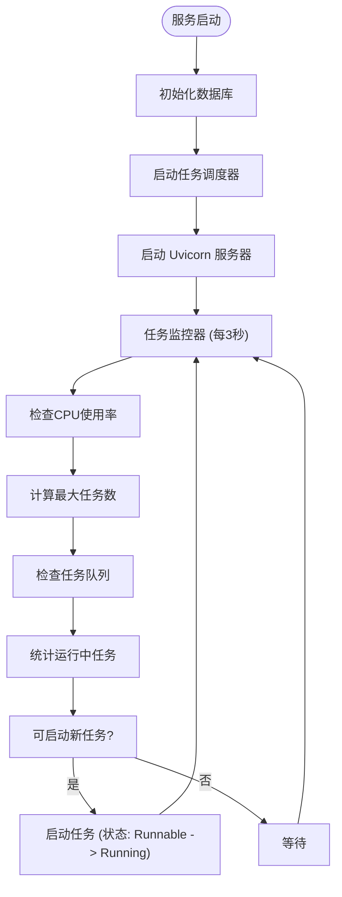
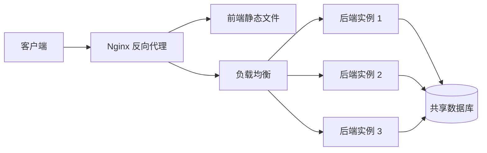

# 部署与运维

<cite>
**本文档引用的文件**  
- [main.py](file://src/backEnd/main.py)
- [app.py](file://src/backEnd/app.py)
- [.env.example](file://src/backEnd/.env.example)
- [config.py](file://src/backEnd/config.py)
- [uvicorn_config.json](file://src/backEnd/uvicorn_config.json)
- [pyproject.toml](file://src/backEnd/pyproject.toml)
- [task_monitor.py](file://src/backEnd/utils/task_monitor.py)
- [webTaskController.py](file://src/backEnd/api/commonApi/webTaskController.py)
- [taskService.py](file://src/backEnd/service/taskService.py)
- [header_processor.py](file://src/backEnd/utils/header_processor.py)
- [scope_matcher.py](file://src/backEnd/utils/scope_matcher.py)
- [DataStore.py](file://src/backEnd/model/DataStore.py)
- [.env.development](file://src/frontEnd/.env.development)
- [.env.production](file://src/frontEnd/.env.production)
- [package.json](file://src/frontEnd/package.json)
</cite>

## 目录
1. [简介](#简介)
2. [项目结构](#项目结构)
3. [部署场景配置](#部署场景配置)
4. [关键配置文件详解](#关键配置文件详解)
5. [服务启动与监控](#服务启动与监控)
6. [日志管理](#日志管理)
7. [性能调优](#性能调优)
8. [高可用性部署方案](#高可用性部署方案)
9. [备份与恢复策略](#备份与恢复策略)
10. [安全加固措施](#安全加固措施)
11. [运维检查清单](#运维检查清单)

## 简介

sqlmapWebUI 是一个现代化的 SQL 注入测试平台，为安全研究人员提供便捷的 SQL 注入测试功能。本部署与运维文档旨在为系统管理员和运维人员提供全面的生产环境部署指南和日常运维实践，确保系统的稳定、安全和高效运行。

该系统采用前后端分离架构，后端基于 FastAPI 框架，前端基于 Vue 3 框架，集成了强大的 SQLMap 工具。系统支持多种部署场景（开发、测试、生产），并提供了丰富的配置选项和安全特性。本文档将详细介绍不同环境的配置方法、关键配置文件的作用、服务启动流程、监控策略、日志管理、性能调优、高可用性方案、备份恢复以及安全加固措施。

**本文档不包含概念性或抽象性内容，因此不提供本节的来源信息。**

## 项目结构

sqlmapWebUI 项目采用清晰的模块化结构，便于维护和扩展。主要目录包括：

- **src/backEnd**: 后端代码，包含 API 路由、数据模型、业务逻辑和工具函数。
- **src/frontEnd**: 前端代码，包含 Vue 组件、API 请求、状态管理和视图。
- **src/burpEx**: Burp Suite 扩展插件，支持 Legacy API 和 Montoya API 两种版本。
- **src/vulnTestServer**: 内置的 VulnShop 漏洞靶场，用于测试和演示。
- **doc**: 项目文档，包含使用指南、功能更新等。

后端核心组件位于 `src/backEnd` 目录下，其中 `main.py` 是应用的入口文件，`app.py` 定义了 FastAPI 应用实例和路由，`model` 目录包含数据模型，`service` 目录包含业务逻辑，`utils` 目录包含各种工具函数。

前端代码位于 `src/frontEnd` 目录下，使用 Vite 作为构建工具，TypeScript 作为开发语言，PrimeVue 作为 UI 组件库。

**图源**  
- [README.md](file://README.md#L175-L208)

## 部署场景配置

sqlmapWebUI 支持开发、测试和生产三种部署场景，每种场景都有其特定的配置需求。

### 开发环境配置

开发环境旨在提供一个快速迭代和调试的平台。配置要点如下：

1.  **环境变量**: 复制 `.env.example` 文件为 `.env`，并设置 `APP_ENV=development` 和 `DEBUG=true`。
2.  **前端**: 使用 `src/frontEnd/.env.development` 文件，其中 `VITE_API_BASE_URL=http://localhost:8775/api` 指向本地后端 API。
3.  **后端**: 使用 `uv run python main.py` 启动，服务默认监听 `127.0.0.1:8775`。
4.  **数据库**: 使用 SQLite 数据库，文件路径为 `./data/app.db`，便于开发人员查看和修改。
5.  **CORS**: 允许来自 `http://localhost:3000` 和 `http://localhost:8080` 的跨域请求，方便前端开发服务器访问。

### 测试环境配置

测试环境应尽可能模拟生产环境，以确保测试结果的可靠性。

1.  **环境变量**: 设置 `APP_ENV=test` 和 `DEBUG=false`，关闭调试模式。
2.  **前端**: 使用 `src/frontEnd/.env.production` 文件，通过相对路径 `/api` 访问后端。
3.  **后端**: 部署在独立的测试服务器上，使用独立的数据库实例。
4.  **安全**: 使用强随机字符串作为 `SECRET_KEY` 和 `API_TOKEN`，避免使用默认值。
5.  **日志**: 将日志级别设置为 `INFO`，记录足够的信息用于问题排查。

### 生产环境配置

生产环境配置以安全、稳定和性能为核心。

1.  **环境变量**: 设置 `APP_ENV=production` 和 `DEBUG=false`，确保调试模式关闭。
2.  **前端**: 构建生产版本 (`pnpm run build`)，并将 `dist` 目录部署到 Web 服务器（如 Nginx）。
3.  **后端**: 使用进程管理工具（如 systemd 或 Supervisor）管理 `main.py` 进程，确保服务的高可用性。
4.  **数据库**: 考虑使用更健壮的数据库系统（如 PostgreSQL）替代 SQLite，或确保 SQLite 数据库文件有良好的备份策略。
5.  **安全**: 严格限制 `CORS_ORIGINS`，仅允许来自前端应用的域名。使用 HTTPS 加密所有通信。
6.  **反向代理**: 使用 Nginx 或 Apache 作为反向代理，处理静态文件、SSL 终止和负载均衡。

**本节来源**  
- [.env.example](file://src/backEnd/.env.example#L1-L71)
- [.env.development](file://src/frontEnd/.env.development#L1-L4)
- [.env.production](file://src/frontEnd/.env.production#L1-L4)

## 关键配置文件详解

### 后端环境变量 (.env)

后端环境变量文件 `.env` 是系统配置的核心，所有配置项均通过此文件定义。

- **应用配置**:
  - `APP_ENV`: 运行环境，可选 `development`、`production`、`test`。
  - `DEBUG`: 调试模式开关，开发环境为 `true`，生产环境必须为 `false`。
  - `HOST` 和 `PORT`: 服务监听的主机和端口。生产环境建议将 `HOST` 设置为 `127.0.0.1`，并通过反向代理暴露服务。
- **安全配置**:
  - `SECRET_KEY`: JWT 密钥，用于生成和验证令牌，必须使用强随机字符串。
  - `API_TOKEN`: API 认证令牌，用于保护 API 端点，必须保密。
- **数据库配置**:
  - `DATABASE_PATH`: SQLite 数据库文件的存储路径。生产环境需确保该路径有充足的磁盘空间和适当的权限。
- **SQLMap 配置**:
  - `SQLMAP_API_URL`: SQLMap API 服务地址，通常为 `http://localhost:8775`。
  - `SQLMAP_OUTPUT_DIR`: SQLMap 扫描结果的输出目录，用于存储扫描报告。
- **日志配置**:
  - `LOG_LEVEL`: 日志级别，可选 `DEBUG`、`INFO`、`WARNING`、`ERROR`、`CRITICAL`。生产环境推荐使用 `INFO`。
  - `LOG_FILE`: 日志文件的存储路径。
- **CORS 配置**:
  - `CORS_ORIGINS`: 允许跨域请求的来源列表，多个来源用逗号分隔。生产环境应精确配置，避免使用通配符。

### 前端环境变量

前端使用 Vite 的环境变量机制，通过 `.env.development` 和 `.env.production` 文件进行配置。

- `VITE_API_BASE_URL`: 前端应用访问后端 API 的基础 URL。开发环境指向本地后端，生产环境使用相对路径 `/api`，由反向代理处理。
- `VITE_APP_TITLE`: 应用标题，可为不同环境设置不同的标题。
- `VITE_ENABLE_MOCK`: 是否启用 Mock 数据，开发时可用于模拟 API 响应。

### Uvicorn 配置 (uvicorn_config.json)

`uvicorn_config.json` 文件定义了 Uvicorn 服务器的日志格式和处理程序。

- **formatters**: 定义了日志的输出格式，包含时间戳、日志级别、模块名、文件名、行号和消息。
- **handlers**: 定义了日志处理程序，`default` 处理器用于错误日志，输出到 `stderr`；`access` 处理器用于访问日志，输出到 `stdout`。
- **loggers**: 配置了 `uvicorn`、`uvicorn.error` 和 `uvicorn.access` 三个日志记录器，指定了它们的处理程序、日志级别和传播行为。

**本节来源**  
- [.env.example](file://src/backEnd/.env.example#L1-L71)
- [uvicorn_config.json](file://src/backEnd/uvicorn_config.json#L1-L45)

## 服务启动与监控

### 服务启动流程

1.  **准备环境**: 确保 Python 3.13+ 和 Node.js 20+ 已安装。使用 `uv sync --extra thirdparty` 安装后端依赖，使用 `pnpm install` 安装前端依赖。
2.  **构建前端**: 在 `src/frontEnd` 目录下执行 `pnpm run build`，生成 `dist` 目录。
3.  **配置后端**: 根据部署场景复制并修改 `.env` 文件。
4.  **启动后端**: 在 `src/backEnd` 目录下执行 `uv run python main.py`。服务将启动并监听指定端口。
5.  **部署前端**: 将 `dist` 目录中的文件部署到 Web 服务器或通过反向代理提供服务。

### 健康检查

系统提供了 `/api/health` 健康检查端点，返回服务的健康状态信息，包括：
- `status`: 当前状态（`healthy`）。
- `timestamp`: 当前时间戳（毫秒）。
- `version`: 系统版本号。
- `uptime`: 服务已运行的秒数。

此端点可用于负载均衡器或监控系统（如 Prometheus）的健康检查。

### 任务监控

系统内置了一个任务监控器，由 `utils/task_monitor.py` 实现。它通过 `BackgroundScheduler` 每 3 秒执行一次 `monitor` 函数，负责：
- **动态调整最大任务数**: 根据 CPU 使用率动态计算 `max_tasks_count`，防止系统过载。
- **任务状态管理**: 检查所有任务的状态，将 `Runnable` 状态的任务启动为 `Running` 状态，并更新已终止任务的状态。
- **并发控制**: 确保同时运行的任务数不超过 `max_tasks_count`。

**图源**  
- [main.py](file://src/backEnd/main.py#L156-L161)
- [task_monitor.py](file://src/backEnd/utils/task_monitor.py#L36-L94)

**本节来源**  
- [main.py](file://src/backEnd/main.py#L156-L161)
- [app.py](file://src/backEnd/app.py#L61-L80)
- [task_monitor.py](file://src/backEnd/utils/task_monitor.py#L1-L94)

## 日志管理

### 日志配置

系统的日志配置由 `uvicorn_config.json` 和代码中的 `logging` 模块共同完成。

- **日志级别**: 通过 `LOG_LEVEL` 环境变量控制，建议生产环境使用 `INFO` 级别，以平衡信息量和性能。
- **日志格式**: 采用统一的格式 `[时间戳] [级别] [模块] [文件名] [行号] 消息`，便于解析和排查问题。
- **日志输出**: 错误日志输出到 `stderr`，访问日志输出到 `stdout`，便于与容器化平台（如 Docker）集成。

### 日志文件

日志文件由 `LOG_FILE` 环境变量指定。运维人员应定期检查日志文件的大小和内容。

- **轮转策略**: 建议使用 `logrotate` 工具对日志文件进行轮转，防止日志文件无限增长。
- **监控告警**: 可以配置监控系统（如 ELK Stack 或 Grafana Loki）收集日志，并对 `ERROR` 和 `CRITICAL` 级别的日志设置告警。

### 日志内容

日志记录了系统的关键操作，包括：
- 服务启动和停止。
- 扫描任务的创建、启动、停止和删除。
- 请求头规则的应用情况。
- 数据库操作。
- 任何异常和错误。

**本节来源**  
- [uvicorn_config.json](file://src/backEnd/uvicorn_config.json#L1-L45)
- [main.py](file://src/backEnd/main.py#L103-L105)
- [app.py](file://src/backEnd/app.py#L1-L80)

## 性能调优

### 最大任务数调优

系统通过 `task_monitor.py` 中的 `get_max_tasks_count()` 函数动态调整最大并发任务数。

- **算法逻辑**: 根据 CPU 使用率调整：
  - CPU 使用率 < 20%：最大任务数 = 逻辑核心数 × 2
  - CPU 使用率 < 50%：最大任务数 = 逻辑核心数
  - CPU 使用率 ≥ 50%：最大任务数 = 逻辑核心数 // 2（至少为 1）
- **调优建议**: 在资源充足的服务器上，可以考虑在 `DataStore` 中设置一个更高的 `max_tasks_count` 初始值，以提高初始并发能力。

### 数据库性能

系统使用 SQLite 作为默认数据库，其性能受磁盘 I/O 影响较大。

- **优化建议**:
  - 将数据库文件存储在高速 SSD 上。
  - 定期对数据库进行 `VACUUM` 操作，回收未使用的空间。
  - 对于大规模部署，建议迁移到 PostgreSQL 或 MySQL 等更强大的数据库系统。

### 缓存机制

系统在 `scope_matcher.py` 中实现了两个缓存：
- **URL 解析缓存**: 缓存已解析的 URL，避免重复解析。
- **正则表达式编译缓存**: 缓存已编译的正则表达式，避免重复编译。

这两个缓存有效提升了作用域匹配的性能。缓存大小有限制，当达到上限时会自动清理旧的缓存项。

**本节来源**  
- [task_monitor.py](file://src/backEnd/utils/task_monitor.py#L11-L33)
- [scope_matcher.py](file://src/backEnd/utils/scope_matcher.py#L27-L346)
- [DataStore.py](file://src/backEnd/model/DataStore.py#L22)

## 高可用性部署方案

为了确保 sqlmapWebUI 在生产环境中的稳定运行，建议采用以下高可用性部署方案。

### 反向代理与负载均衡

使用 Nginx 作为反向代理和负载均衡器。

1.  **静态文件服务**: Nginx 直接提供前端 `dist` 目录下的静态文件，减轻后端压力。
2.  **API 路由**: 将 `/api` 路径的请求代理到后端 FastAPI 服务。
3.  **负载均衡**: 部署多个后端实例，Nginx 将请求分发到不同的实例，实现负载均衡和故障转移。

**图源**  
- [app.py](file://src/backEnd/app.py#L25)
- [.env.production](file://src/frontEnd/.env.production#L1)

### 进程管理

使用 `systemd` 或 `Supervisor` 等进程管理工具来管理 `main.py` 进程。

- **自动重启**: 当进程意外退出时，进程管理工具会自动重启服务。
- **日志收集**: 将进程的标准输出和标准错误重定向到日志文件，便于集中管理。
- **资源限制**: 可以设置内存和 CPU 使用限制，防止单个进程耗尽系统资源。

### 共享存储

在多实例部署中，所有后端实例必须访问同一个数据库和 SQLMap 输出目录。

- **数据库**: 如果使用 SQLite，所有实例必须能访问同一文件系统上的数据库文件。更推荐使用网络数据库（如 PostgreSQL）。
- **输出目录**: SQLMap 的扫描结果目录 `SQLMAP_OUTPUT_DIR` 必须被所有实例共享，通常通过 NFS 或其他网络文件系统实现。

**本节来源**  
- [app.py](file://src/backEnd/app.py#L25)
- [.env.example](file://src/backEnd/.env.example#L43-L53)

## 备份与恢复策略

### 数据库备份

数据库 (`app.db`) 存储了所有任务、配置和规则，是最重要的数据。

- **备份频率**: 建议每天进行一次全量备份。
- **备份方法**: 使用 `sqlite3` 命令行工具的 `.backup` 命令，或在应用停止时直接复制数据库文件。
- **备份存储**: 将备份文件存储在独立的、安全的存储位置，最好是异地备份。

### 配置文件备份

`.env` 文件包含敏感信息（如 `SECRET_KEY`），必须妥善备份。

- **备份内容**: 备份 `src/backEnd/.env` 文件。
- **安全存储**: 对包含敏感信息的备份文件进行加密。

### 恢复流程

1.  停止 sqlmapWebUI 服务。
2.  将备份的数据库文件复制到 `DATABASE_PATH` 指定的位置。
3.  将备份的 `.env` 文件复制到 `src/backEnd` 目录。
4.  启动服务。

**本节来源**  
- [.env.example](file://src/backEnd/.env.example#L43)
- [main.py](file://src/backEnd/main.py#L135-L136)

## 安全加固措施

### 认证与授权

- **JWT 认证**: 系统使用 JWT 进行用户认证，`SECRET_KEY` 必须足够长且随机。
- **API 令牌**: `API_TOKEN` 用于保护 API 端点，防止未授权访问。
- **默认凭证**: 生产环境必须修改 `main.py` 中的默认用户名和密码。

### 输入验证

- **请求头处理**: `header_processor.py` 对请求头名称进行严格验证，只允许字母、数字、连字符和下划线。
- **作用域匹配**: `scope_matcher.py` 对正则表达式进行异常捕获，防止恶意正则表达式导致拒绝服务。

### 安全配置

- **关闭调试模式**: 生产环境必须设置 `DEBUG=false`，防止泄露敏感信息。
- **CORS 限制**: 严格配置 `CORS_ORIGINS`，仅允许受信任的前端域名。
- **HTTPS**: 所有生产环境通信必须通过 HTTPS 加密。
- **文件权限**: 确保 `.env` 文件的权限为 `600`，仅允许所有者读写。

### 漏洞管理

- **依赖更新**: 定期使用 `uv sync --upgrade` 更新 Python 依赖，修复已知漏洞。
- **安全审计**: 定期审查代码，特别是与用户输入处理相关的部分。
- **免责声明**: 系统内置了免责声明，提醒用户仅在授权环境下使用。

**本节来源**  
- [.env.example](file://src/backEnd/.env.example#L32-L37)
- [main.py](file://src/backEnd/main.py#L166-L167)
- [header_processor.py](file://src/backEnd/utils/header_processor.py#L48-L56)
- [scope_matcher.py](file://src/backEnd/utils/scope_matcher.py#L287-L289)

## 运维检查清单

为确保系统的稳定运行，运维人员应定期执行以下检查：

- [ ] **服务状态**: 检查后端服务是否正常运行，`/api/health` 端点是否返回健康状态。
- [ ] **磁盘空间**: 检查数据库文件和日志文件所在磁盘的剩余空间。
- [ ] **日志审查**: 审查日志文件，查找 `ERROR` 或 `WARNING` 级别的条目。
- [ ] **备份验证**: 定期验证数据库备份的完整性和可恢复性。
- [ ] **安全配置**: 确认 `DEBUG` 模式已关闭，`SECRET_KEY` 和 `API_TOKEN` 已设置为强密码。
- [ ] **依赖更新**: 检查并更新 Python 依赖包。
- [ ] **性能监控**: 监控 CPU、内存和磁盘 I/O 使用情况，确保系统资源充足。

**本节来源**  
- [app.py](file://src/backEnd/app.py#L61-L80)
- [.env.example](file://src/backEnd/.env.example#L17-L20)
- [main.py](file://src/backEnd/main.py#L166-L167)