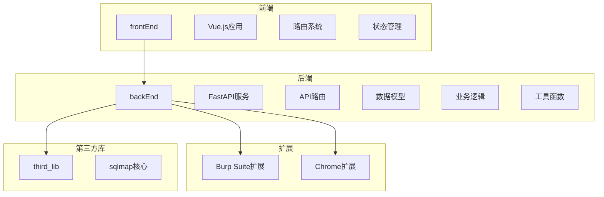

# 安全策略

<cite>
**本文档引用的文件**
- [app.py](file://src/backEnd/app.py)
- [config.py](file://src/backEnd/config.py)
- [main.ts](file://src/frontEnd/src/main.ts)
- [.env.example](file://src/backEnd/.env.example)
- [auth.py](file://src/backEnd/utils/auth.py)
- [guards.ts](file://src/frontEnd/src/router/guards.ts)
- [auth.ts](file://src/frontEnd/src/stores/auth.ts)
- [request.ts](file://src/frontEnd/src/api/request.ts)
- [LogRecorder.py](file://src/backEnd/model/LogRecorder.py)
</cite>

## 目录
1. [项目结构](#项目结构)
2. [核心安全配置](#核心安全配置)
3. [后端安全策略](#后端安全策略)
4. [前端安全策略](#前端安全策略)
5. [安全审计与日志记录](#安全审计与日志记录)
6. [安全配置指南](#安全配置指南)

## 项目结构

sqlmapWebUI项目采用前后端分离的架构设计，后端基于FastAPI框架构建，前端使用Vue.js技术栈。项目结构清晰地划分为多个模块，包括后端API服务、前端用户界面、Burp Suite扩展以及漏洞测试服务器等组件。



**Diagram sources**
- [src/backEnd/app.py](file://src/backEnd/app.py#L20)
- [src/frontEnd/src/main.ts](file://src/frontEnd/src/main.ts#L8)

**Section sources**
- [src/backEnd/app.py](file://src/backEnd/app.py#L1-L80)
- [src/frontEnd/src/main.ts](file://src/frontEnd/src/main.ts#L1-L16)

## 核心安全配置

sqlmapWebUI项目的核心安全配置主要集中在后端的config.py文件和前端的安全初始化配置中。这些配置为整个系统的安全运行提供了基础保障。

### 后端安全配置

后端安全配置主要通过config.py文件和环境变量文件进行管理。系统版本号在config.py中定义，同时通过环境变量文件提供更全面的安全配置选项。

```python
# config.py中的安全相关配置
VERSION = "1.7.9"
MAX_TASKS_COUNT = 3
MAX_TASKS_COUNT_LOCK = threading.Lock()
```

环境变量配置文件提供了更详细的安全部分配置，包括应用环境、调试模式、主机地址、端口设置、JWT密钥、API认证令牌、数据库路径、SQLMap API服务地址、日志级别和CORS来源等。

**Section sources**
- [src/backEnd/config.py](file://src/backEnd/config.py#L7-L8)
- [src/backEnd/.env.example](file://src/backEnd/.env.example#L17-L71)

### 前端安全配置

前端安全配置主要在main.ts文件中进行初始化，通过Vue 3的组合式API和Pinia状态管理库实现安全功能的集成。

```typescript
// main.ts中的安全初始化
import { createApp } from 'vue'
import { createPinia } from 'pinia'
import router from './router'
import { setupPrimeVue } from './primevue'
import App from './App.vue'

const app = createApp(App)
const pinia = createPinia()

app.use(pinia)
app.use(router)
setupPrimeVue(app)

app.mount('#app')
```

**Section sources**
- [src/frontEnd/src/main.ts](file://src/frontEnd/src/main.ts#L1-L16)

## 后端安全策略

### CORS策略配置

后端通过FastAPI的CORSMiddleware中间件实现跨域资源共享(CORS)策略。系统允许开发环境下的localhost所有端口以及后端端口的跨域请求，同时支持携带身份凭证。

```python
app.add_middleware(
    CORSMiddleware,
    allow_origin_regex=r"http://(localhost|127\.0\.0\.1):(517[3-6]|8775)",
    allow_credentials=True,
    allow_methods=["*"],
    allow_headers=["*"]
)
```

这种配置既保证了开发环境的便利性，又通过正则表达式限制了可接受的来源范围，避免了完全开放的CORS策略可能带来的安全风险。

**Section sources**
- [src/backEnd/app.py](file://src/backEnd/app.py#L27-L34)

### 安全头设置

系统在响应中设置了多种安全头，以增强Web应用的安全性。这些安全头包括：

- **X-Content-Type-Options**: nosniff - 防止MIME类型嗅探攻击
- **X-Frame-Options**: DENY - 防止点击劫持攻击
- **X-XSS-Protection**: 1; mode=block - 启用浏览器的XSS过滤器
- **Strict-Transport-Security**: max-age=31536000; includeSubDomains; preload - 强制使用HTTPS连接
- **Referrer-Policy**: strict-origin-when-cross-origin - 控制Referer头的发送
- **Permissions-Policy**: 限制浏览器功能的使用
- **X-Permitted-Cross-Domain-Policies**: none - 禁止Flash和PDF等插件的跨域请求
- **X-Download-Options**: noopen - 防止下载完成后自动打开文件
- **X-DNS-Prefetch-Control**: off - 禁用DNS预取
- **Expect-CT**: max-age=86400, enforce - 强制执行证书透明度策略

这些安全头的设置显著提升了系统的整体安全性，有效防范了多种常见的Web攻击。

**Section sources**
- [src/frontEnd/src/api/task.ts](file://src/frontEnd/src/api/task.ts#L511-L521)

### 认证与授权机制

系统实现了基于IP地址和令牌的双重认证机制。本地访问（localhost或127.0.0.1）自动获得管理员权限，而远程访问则需要提供有效的认证令牌。

```python
def get_current_user(request: Request, token: Optional[str] = None):
    if request.client is None:
        raise HTTPException(
            status_code=status.HTTP_400_BAD_REQUEST,
            detail="Client information not available",
        )

    client_ip = request.client.host
    if client_ip in ["127.0.0.1", "localhost"]:
        return {"user": "admin"}

    if token != "secret-token":
        raise HTTPException(
            status_code=status.HTTP_401_UNAUTHORIZED,
            detail="Invalid authentication credentials",
            headers={"WWW-Authenticate": "Bearer"},
        )
    return {"user": "authenticated"}
```

这种设计既方便了本地开发和测试，又确保了远程访问的安全性。

**Section sources**
- [src/backEnd/utils/auth.py](file://src/backEnd/utils/auth.py#L5-L22)

## 前端安全策略

### 路由守卫配置

前端通过Vue Router的路由守卫实现访问控制，支持本地和远程双模式认证。系统根据访问模式自动调整认证策略。

```typescript
export function setupRouterGuards(router: any) {
  router.beforeEach((
    to: RouteLocationNormalized,
    _from: RouteLocationNormalized,
    next: NavigationGuardNext
  ) => {
    const authStore = useAuthStore()
    
    // 本地访问模式:直接允许访问
    if (authStore.isLocalMode) {
      if (to.path === '/login') {
        next({ path: '/' })
        return
      }
      next()
      return
    }
    
    // 远程访问模式:检查认证
    const requiresAuth = to.meta.requiresAuth !== false
    
    if (requiresAuth && !authStore.isLoggedIn) {
      next({
        path: '/login',
        query: { redirect: to.fullPath },
      })
    } else if (to.path === '/login' && authStore.isLoggedIn) {
      next({ path: '/' })
    } else {
      next()
    }
  })
}
```

这种灵活的路由守卫机制确保了不同访问模式下的安全性，同时提供了良好的用户体验。

**Section sources**
- [src/frontEnd/src/router/guards.ts](file://src/frontEnd/src/router/guards.ts#L11-L47)

### 认证状态管理

系统使用Pinia进行认证状态管理，实现了本地和远程模式的无缝切换。认证状态包括令牌、用户信息、访问模式等。

```typescript
export const useAuthStore = defineStore('auth', () => {
  const token = ref<string | null>(getStorage<string>('token'))
  const userInfo = ref<UserInfo | null>(getStorage<UserInfo>('userInfo'))
  const isLocalMode = ref<boolean>(isLocalAccess())
  const authRequired = ref<boolean>(checkAuthRequired())
  
  const isLoggedIn = computed(() => {
    if (isLocalMode.value) {
      return true
    }
    return !!token.value
  })

  async function login(data: LoginRequest): Promise<void> {
    if (isLocalMode.value) {
      console.log('Local mode: skipping login')
      return
    }

    try {
      const response = await loginApi(data)
      token.value = response.token
      userInfo.value = response.userInfo

      setStorage('token', response.token)
      setStorage('userInfo', response.userInfo)
    } catch (error) {
      console.error('Login failed:', error)
      throw error
    }
  }

  function logout(): void {
    token.value = null
    userInfo.value = null
    removeStorage('token')
    removeStorage('userInfo')
  }
})
```

**Section sources**
- [src/frontEnd/src/stores/auth.ts](file://src/frontEnd/src/stores/auth.ts#L21-L175)

### 请求安全处理

前端实现了完善的请求安全处理机制，包括错误处理、重试策略和网络连接检查。

```typescript
// 请求拦截器
request.interceptors.response.use(
  response => response,
  async (error: AxiosError) => {
    if (error.response) {
      const { status, data } = error.response
      
      // 401未授权处理
      if (status === 401) {
        if (isLocalAccess()) {
          console.warn('Local access mode: ignoring 401 error')
          return Promise.reject(error)
        }
        
        console.warn('Authentication failed, please login again')
        removeStorage('token')
        removeStorage('userInfo')
        
        showError('认证失败，请重新登录', 0)
        
        return Promise.reject(new Error('认证失败,请重新登录'))
      }
      
      // 其他HTTP错误
      const errorMessage = data?.message || `请求失败(${status})`
      showError(errorMessage)
      
      return Promise.reject(new Error(errorMessage))
    }
    
    // 网络错误或超时
    if (error.code === 'ECONNABORTED') {
      showError('请求超时，请稍后重试')
      return Promise.reject(new Error('请求超时'))
    }
    
    // 连接拒绝错误
    if (error.message.includes('Network Error') || error.code === 'ERR_NETWORK') {
      showError('无法连接到后端服务，请检查服务是否启动')
      return Promise.reject(new Error('网络错误'))
    }
    
    // 其他网络错误
    showError('网络错误，请检查网络连接')
    return Promise.reject(error)
  }
)
```

**Section sources**
- [src/frontEnd/src/api/request.ts](file://src/frontEnd/src/api/request.ts#L150-L205)

## 安全审计与日志记录

### 日志记录机制

系统实现了详细的日志记录机制，用于安全审计和故障排查。日志记录器将事件记录到IPC数据库中，实现异步I/O通信。

```python
class LogRecorder(logging.StreamHandler):
    def emit(self, record):
        """
        Record emitted events to IPC database for asynchronous I/O
        communication with the parent process
        """
        conf.databaseCursor.execute("INSERT INTO logs VALUES(NULL, ?, ?, ?, ?)", 
                                    (conf.taskid, time.strftime("%X"), 
                                     record.levelname, 
                                     str(record.msg % record.args if
                                         record.args else record.msg)))
```

这种异步日志记录机制既保证了日志的完整性，又不会影响主程序的性能。

**Section sources**
- [src/backEnd/model/LogRecorder.py](file://src/backEnd/model/LogRecorder.py#L7-L18)

### 健康检查机制

系统提供了健康检查端点，用于监控后端服务的可用性。健康检查返回服务状态、时间戳、版本号和运行时长等信息。

```python
@app.get("/api/health")
def health_check():
    """健康检查端点
    
    返回服务健康状态信息，用于前端监控后端服务可用性
    """
    current_time = time.time()
    uptime = int(current_time - START_TIME)
    
    return {
        "code": 200,
        "success": True,
        "message": "success",
        "data": {
            "status": "healthy",
            "timestamp": int(current_time * 1000),
            "version": VERSION,
            "uptime": uptime
        }
    }
```

前端定期执行健康检查，确保能够及时发现并处理服务异常。

**Section sources**
- [src/backEnd/app.py](file://src/backEnd/app.py#L61-L80)
- [src/frontEnd/src/stores/auth.ts](file://src/frontEnd/src/stores/auth.ts#L108-L144)

## 安全配置指南

### HTTPS配置

为了确保数据传输的安全性，建议在生产环境中启用HTTPS。可以通过以下步骤配置HTTPS：

1. 获取有效的SSL证书
2. 在反向代理（如Nginx）中配置SSL终止
3. 设置Strict-Transport-Security头强制使用HTTPS
4. 配置证书透明度策略

### 安全Cookie属性

配置安全的Cookie属性可以有效防止会话劫持攻击：

- 设置Secure属性，确保Cookie仅通过HTTPS传输
- 设置HttpOnly属性，防止JavaScript访问Cookie
- 设置SameSite属性，防止跨站请求伪造攻击
- 设置合理的过期时间

### 常见Web攻击防范

#### XSS攻击防范
- 使用内容安全策略(CSP)限制脚本执行
- 对用户输入进行严格的验证和转义
- 设置X-Content-Type-Options和X-XSS-Protection头
- 使用安全的模板引擎

#### CSRF攻击防范
- 实现CSRF令牌机制
- 验证请求来源
- 使用SameSite Cookie属性
- 实施双重提交Cookie模式

#### SQL注入防范
- 使用参数化查询或预编译语句
- 对用户输入进行严格的验证
- 使用ORM框架减少手动SQL拼接
- 实施最小权限原则

### 安全审计和日志记录

#### 启用安全审计
- 记录所有关键操作和安全事件
- 实现日志轮转和归档
- 配置日志级别和过滤规则
- 定期审查日志文件

#### 日志记录最佳实践
- 记录足够的上下文信息以便调查
- 保护日志中的敏感信息
- 确保日志文件的完整性和不可篡改性
- 实现集中式日志管理

通过遵循这些安全配置指南，可以显著提升sqlmapWebUI系统的整体安全性，有效防范各种常见的Web攻击。

**Section sources**
- [src/backEnd/app.py](file://src/backEnd/app.py#L61-L80)
- [src/backEnd/config.py](file://src/backEnd/config.py#L7-L8)
- [src/backEnd/.env.example](file://src/backEnd/.env.example#L17-L71)
- [src/backEnd/utils/auth.py](file://src/backEnd/utils/auth.py#L5-L22)
- [src/frontEnd/src/main.ts](file://src/frontEnd/src/main.ts#L1-L16)
- [src/frontEnd/src/router/guards.ts](file://src/frontEnd/src/router/guards.ts#L11-L47)
- [src/frontEnd/src/stores/auth.ts](file://src/frontEnd/src/stores/auth.ts#L21-L175)
- [src/frontEnd/src/api/request.ts](file://src/frontEnd/src/api/request.ts#L150-L205)
- [src/backEnd/model/LogRecorder.py](file://src/backEnd/model/LogRecorder.py#L7-L18)