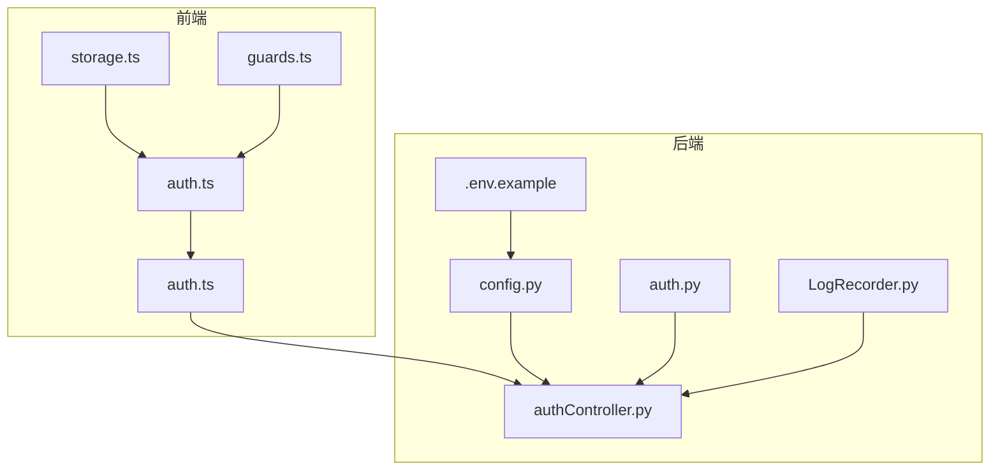
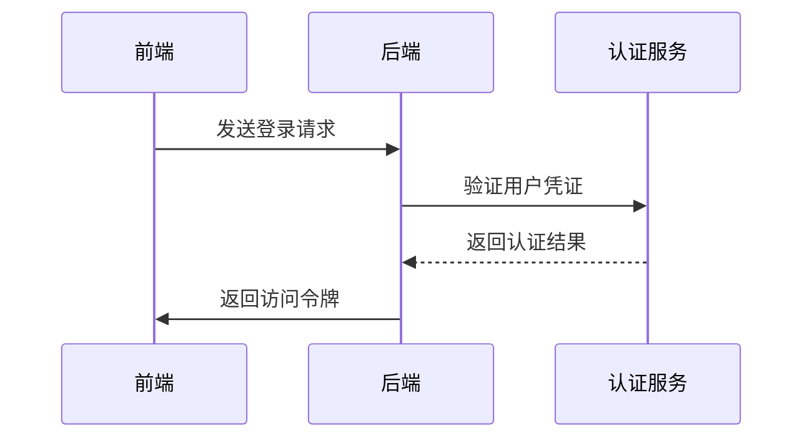

# 安全配置

<cite>
**本文档引用的文件**
- [config.py](file://src/backEnd/config.py)
- [app.py](file://src/backEnd/app.py)
- [authController.py](file://src/backEnd/api/commonApi/authController.py)
- [auth.py](file://src/backEnd/utils/auth.py)
- [.env.example](file://src/backEnd/.env.example)
- [auth.ts](file://src/frontEnd/src/api/auth.ts)
- [auth.ts](file://src/frontEnd/src/stores/auth.ts)
- [storage.ts](file://src/frontEnd/src/utils/storage.ts)
- [guards.ts](file://src/frontEnd/src/router/guards.ts)
- [LogRecorder.py](file://src/backEnd/model/LogRecorder.py)
</cite>

## 目录
1. [项目结构](#项目结构)
2. [安全配置机制](#安全配置机制)
3. [认证授权流程](#认证授权流程)
4. [前端安全存储](#前端安全存储)
5. [安全加固指南](#安全加固指南)
6. [安全审计日志](#安全审计日志)

## 项目结构

sqlmapWebUI项目采用前后端分离架构，后端使用FastAPI框架，前端使用Vue.js框架。项目结构清晰，安全相关代码主要分布在后端的config.py、authController.py和utils/auth.py文件中，以及前端的api/auth.ts、stores/auth.ts和utils/storage.ts文件中。



**图表来源**
- [config.py](file://src/backEnd/config.py)
- [authController.py](file://src/backEnd/api/commonApi/authController.py)
- [auth.py](file://src/backEnd/utils/auth.py)
- [.env.example](file://src/backEnd/.env.example)
- [auth.ts](file://src/frontEnd/src/api/auth.ts)
- [auth.ts](file://src/frontEnd/src/stores/auth.ts)
- [storage.ts](file://src/frontEnd/src/utils/storage.ts)
- [guards.ts](file://src/frontEnd/src/router/guards.ts)
- [LogRecorder.py](file://src/backEnd/model/LogRecorder.py)

**本节来源**
- [config.py](file://src/backEnd/config.py)
- [app.py](file://src/backEnd/app.py)
- [authController.py](file://src/backEnd/api/commonApi/authController.py)

## 安全配置机制

### JWT令牌配置

sqlmapWebUI项目通过环境变量配置JWT令牌相关参数。在`.env.example`文件中定义了`SECRET_KEY`作为JWT密钥，用于生成和验证令牌。虽然当前实现中使用的是模拟令牌，但架构上已为真正的JWT认证做好准备。

```python
# .env.example
# JWT 密钥 (请使用强随机字符串)
SECRET_KEY=your-secret-key-here
```

### 密码哈希算法

项目中虽然没有直接实现密码哈希，但通过引用第三方库fcrypt.py提供了密码哈希功能。该库实现了Unix crypt(3)密码哈希算法，可用于安全地存储用户密码。

### 会话超时设置

在`authController.py`中，令牌刷新接口设置了24小时的过期时间，这相当于会话超时设置。

```python
# 24小时
"expires_in": 86400
```

### CORS策略

在`app.py`中配置了CORS（跨域资源共享）策略，允许特定来源的跨域请求，包括开发环境下的localhost所有端口以及后端端口。

```python
app.add_middleware(
    CORSMiddleware,
    # 允许开发环境下的localhost所有端口，以及后端端口
    allow_origin_regex=r"http://(localhost|127\.0\.0\.1):(517[3-6]|8775)",
    allow_credentials=True,  # 允许携带身份凭证，如cookies
    allow_methods=["*"],   # 允许所有HTTP方法
    allow_headers=["*"]    # 允许所有请求头
)
```

**本节来源**
- [config.py](file://src/backEnd/config.py)
- [app.py](file://src/backEnd/app.py)
- [.env.example](file://src/backEnd/.env.example)

## 认证授权流程

### 认证流程

sqlmapWebUI的认证流程分为本地模式和远程模式。在本地模式下，不需要真正的认证，而在远程模式下需要进行用户验证。



### 授权控制

在`auth.py`中实现了基于IP地址的授权控制。如果客户端IP地址是本地回环地址，则直接授予管理员权限；否则需要提供有效的认证令牌。

```python
def get_current_user(request: Request, token: Optional[str] = None):
    if request.client is None:
        raise HTTPException(
            status_code=status.HTTP_400_BAD_REQUEST,
            detail="Client information not available",
        )

    client_ip = request.client.host
    if client_ip in ["127.0.0.1", "localhost"]:
        return {"user": "admin"}

    if token != "secret-token":
        raise HTTPException(
            status_code=status.HTTP_401_UNAUTHORIZED,
            detail="Invalid authentication credentials",
            headers={"WWW-Authenticate": "Bearer"},
        )
    return {"user": "authenticated"}
```

**本节来源**
- [authController.py](file://src/backEnd/api/commonApi/authController.py)
- [auth.py](file://src/backEnd/utils/auth.py)

## 前端安全存储

### 令牌管理机制

前端通过Pinia状态管理库管理认证状态，包括令牌、用户信息等。令牌存储在localStorage中，并添加了前缀以避免命名冲突。

```typescript
const STORAGE_PREFIX = 'sqlmap_webui_'

export function setStorage(key: string, value: any): void {
  try {
    const serializedValue = JSON.stringify(value)
    localStorage.setItem(STORAGE_PREFIX + key, serializedValue)
  } catch (error) {
    console.error('Error saving to localStorage:', error)
  }
}
```

### 路由守卫

通过路由守卫确保只有经过认证的用户才能访问受保护的路由。在`guards.ts`中实现了全局前置守卫。

```typescript
export function setupRouterGuards(router: any) {
  router.beforeEach((
    to: RouteLocationNormalized,
    _from: RouteLocationNormalized,
    next: NavigationGuardNext
  ) => {
    const authStore = useAuthStore()
    
    // 本地访问模式:直接允许访问
    if (authStore.isLocalMode) {
      if (to.path === '/login') {
        next({ path: '/' })
        return
      }
      next()
      return
    }
    
    // 远程访问模式:检查认证
    const requiresAuth = to.meta.requiresAuth !== false
    
    if (requiresAuth && !authStore.isLoggedIn) {
      next({
        path: '/login',
        query: { redirect: to.fullPath },
      })
    } else if (to.path === '/login' && authStore.isLoggedIn) {
      next({ path: '/' })
    } else {
      next()
    }
  })
}
```

**本节来源**
- [auth.ts](file://src/frontEnd/src/api/auth.ts)
- [auth.ts](file://src/frontEnd/src/stores/auth.ts)
- [storage.ts](file://src/frontEnd/src/utils/storage.ts)
- [guards.ts](file://src/frontEnd/src/router/guards.ts)

## 安全加固指南

### HTTPS配置

建议在生产环境中使用HTTPS协议，以加密传输数据，防止中间人攻击。可以通过配置反向代理服务器（如Nginx）来实现HTTPS。

### 安全头设置

建议设置以下安全头：
- Strict-Transport-Security: 强制使用HTTPS
- X-Content-Type-Options: 防止MIME类型嗅探
- X-Frame-Options: 防止点击劫持
- Content-Security-Policy: 防止XSS攻击

### 防暴力破解策略

建议实现以下防暴力破解策略：
- 登录失败次数限制
- 账户锁定机制
- 验证码验证
- IP地址限制

### 安全审计日志配置

建议配置详细的安全审计日志，记录所有重要的安全事件，如登录尝试、权限变更等。

**本节来源**
- [.env.example](file://src/backEnd/.env.example)
- [app.py](file://src/backEnd/app.py)

## 安全审计日志

### 日志记录机制

sqlmapWebUI通过`LogRecorder.py`实现了日志记录功能，将日志记录到IPC数据库中，用于异步I/O通信。

```python
class LogRecorder(logging.StreamHandler):
    def emit(self, record):
        """
        Record emitted events to IPC database for asynchronous I/O
        communication with the parent process
        """
        conf.databaseCursor.execute("INSERT INTO logs VALUES(NULL, ?, ?, ?, ?)", 
                                    (conf.taskid, time.strftime("%X"), 
                                     record.levelname, 
                                     str(record.msg % record.args if
                                         record.args else record.msg)))
```

### 日志级别配置

在`.env.example`中配置了日志级别，支持DEBUG、INFO、WARNING、ERROR、CRITICAL五个级别。

```python
# 日志级别 (DEBUG/INFO/WARNING/ERROR/CRITICAL)
LOG_LEVEL=INFO
```

**本节来源**
- [LogRecorder.py](file://src/backEnd/model/LogRecorder.py)
- [.env.example](file://src/backEnd/.env.example)