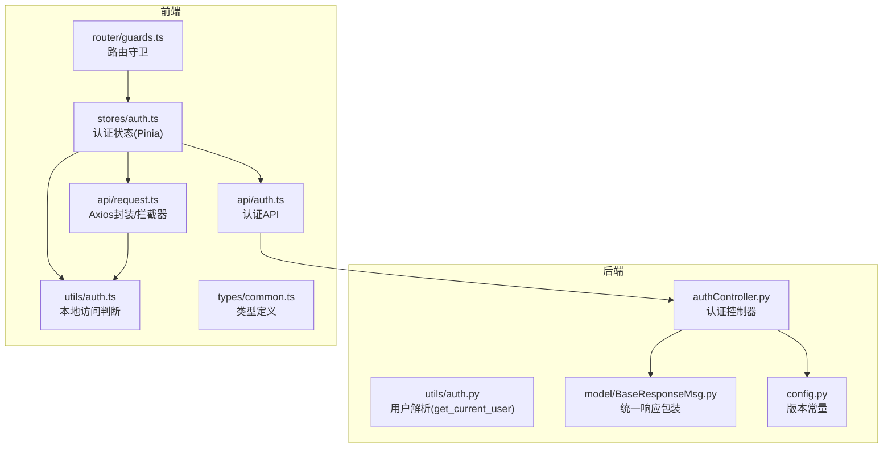
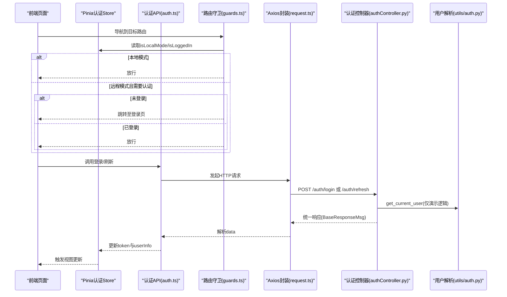
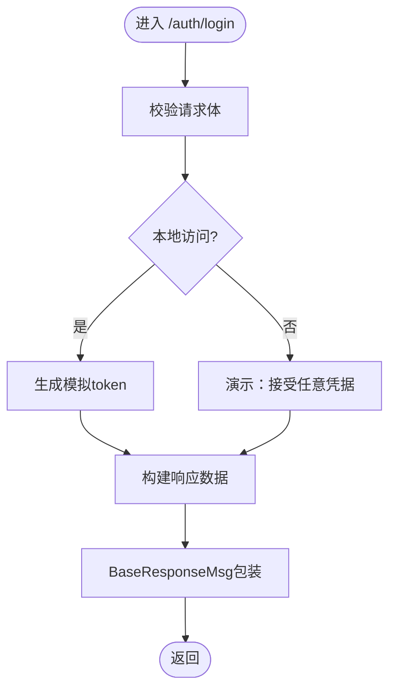
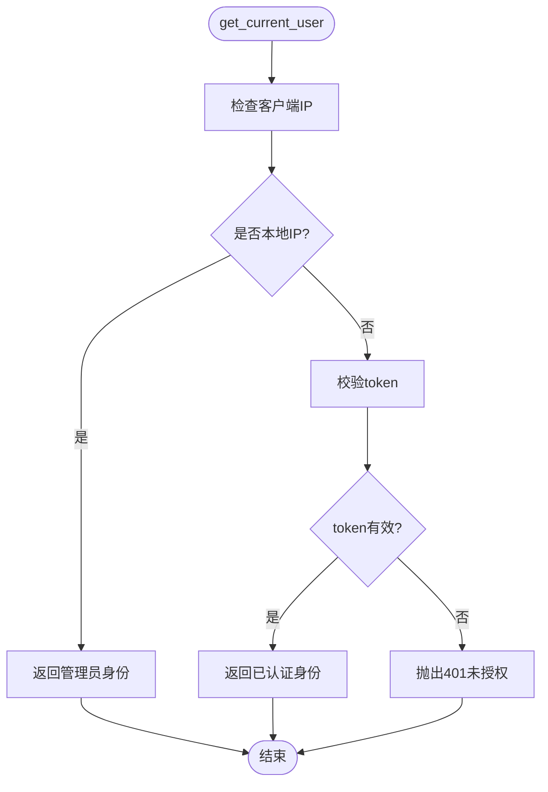
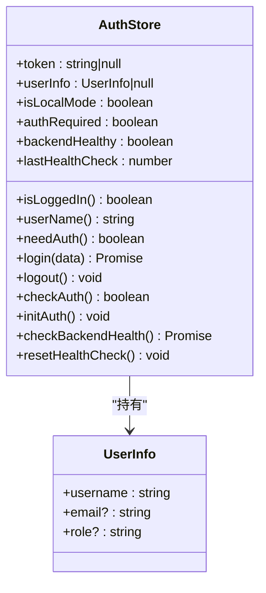
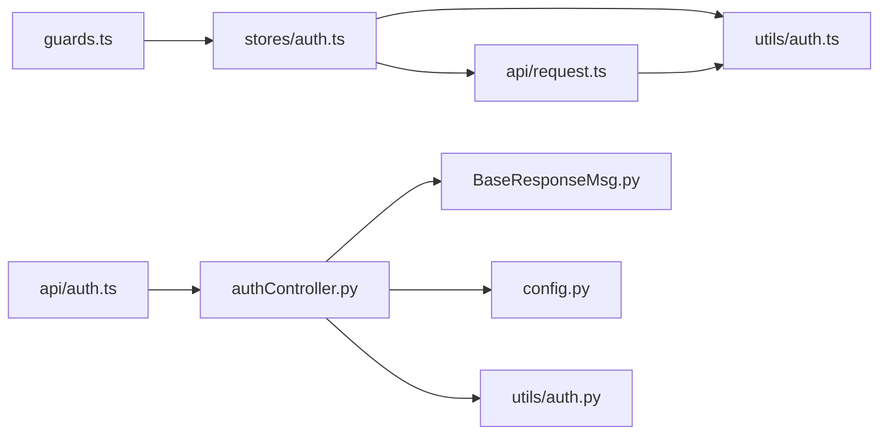

# 授权机制

<cite>
**本文引用的文件**
- [authController.py](file://src/backEnd/api/commonApi/authController.py)
- [auth.py](file://src/backEnd/utils/auth.py)
- [BaseResponseMsg.py](file://src/backEnd/model/BaseResponseMsg.py)
- [config.py](file://src/backEnd/config.py)
- [auth.ts（前端API）](file://src/frontEnd/src/api/auth.ts)
- [auth.ts（Pinia Store）](file://src/frontEnd/src/stores/auth.ts)
- [auth.ts（工具函数）](file://src/frontEnd/src/utils/auth.ts)
- [guards.ts](file://src/frontEnd/src/router/guards.ts)
- [request.ts](file://src/frontEnd/src/api/request.ts)
- [common.ts](file://src/frontEnd/src/types/common.ts)
</cite>

## 目录
1. [引言](#引言)
2. [项目结构与授权相关模块](#项目结构与授权相关模块)
3. [核心组件](#核心组件)
4. [架构总览](#架构总览)
5. [详细组件分析](#详细组件分析)
6. [依赖关系分析](#依赖关系分析)
7. [性能与安全考量](#性能与安全考量)
8. [故障排查指南](#故障排查指南)
9. [结论](#结论)
10. [附录：授权配置指南](#附录授权配置指南)

## 引言
本文件聚焦于 sqlmapWebUI 的授权机制，系统梳理后端 FastAPI 的认证控制器、中间件式用户解析、前端认证状态管理与路由守卫之间的协作关系，并给出 RBAC（基于角色的访问控制）的落地建议与最佳实践。当前仓库中的认证实现处于“演示/单机模式”，即本地访问默认放行、远程访问需要认证；同时后端提供认证接口以适配未来扩展为真实 RBAC 场景。

## 项目结构与授权相关模块
- 后端认证控制器：提供登录、令牌刷新、认证需求检查等接口。
- 后端认证工具：提供基于客户端 IP 与令牌的简易用户解析。
- 前端认证 API：封装 /auth 下的登录、刷新、版本与认证需求检查。
- 前端 Pinia Store：维护 token、用户信息、本地/远程模式、健康检查等状态。
- 前端路由守卫：根据本地/远程模式与路由元信息进行导航控制。
- 前端请求封装：统一注入 Authorization 头、处理 401 等错误。

图表来源
- [authController.py](file://src/backEnd/api/commonApi/authController.py#L1-L150)
- [auth.py](file://src/backEnd/utils/auth.py#L1-L23)
- [BaseResponseMsg.py](file://src/backEnd/model/BaseResponseMsg.py#L1-L21)
- [config.py](file://src/backEnd/config.py#L1-L8)
- [auth.ts（前端API）](file://src/frontEnd/src/api/auth.ts#L1-L34)
- [auth.ts（Pinia Store）](file://src/frontEnd/src/stores/auth.ts#L1-L175)
- [auth.ts（工具函数）](file://src/frontEnd/src/utils/auth.ts#L1-L45)
- [guards.ts](file://src/frontEnd/src/router/guards.ts#L1-L47)
- [request.ts](file://src/frontEnd/src/api/request.ts#L1-L231)
- [common.ts](file://src/frontEnd/src/types/common.ts#L1-L23)

章节来源
- [authController.py](file://src/backEnd/api/commonApi/authController.py#L1-L150)
- [auth.ts（前端API）](file://src/frontEnd/src/api/auth.ts#L1-L34)
- [auth.ts（Pinia Store）](file://src/frontEnd/src/stores/auth.ts#L1-L175)
- [auth.ts（工具函数）](file://src/frontEnd/src/utils/auth.ts#L1-L45)
- [guards.ts](file://src/frontEnd/src/router/guards.ts#L1-L47)
- [request.ts](file://src/frontEnd/src/api/request.ts#L1-L231)
- [BaseResponseMsg.py](file://src/backEnd/model/BaseResponseMsg.py#L1-L21)
- [config.py](file://src/backEnd/config.py#L1-L8)

## 核心组件
- 后端认证控制器（FastAPI）：提供 /auth/login、/auth/refresh、/auth/check-required 三个接口，统一响应体通过 BaseResponseMsg 包装。
- 后端用户解析工具：根据客户端 IP 与令牌判定用户身份，本地 IP 默认放行，远程访问需满足令牌校验。
- 前端认证 API：封装登录、刷新、版本与认证需求检查。
- 前端认证状态管理（Pinia）：持久化 token 与用户信息，区分本地/远程模式，计算登录态与是否需要认证。
- 前端路由守卫：根据路由 meta.requiresAuth 与登录态进行导航控制。
- 前端请求封装：统一注入 Authorization 头，处理 401、网络错误等。

章节来源
- [authController.py](file://src/backEnd/api/commonApi/authController.py#L1-L150)
- [auth.py](file://src/backEnd/utils/auth.py#L1-L23)
- [auth.ts（前端API）](file://src/frontEnd/src/api/auth.ts#L1-L34)
- [auth.ts（Pinia Store）](file://src/frontEnd/src/stores/auth.ts#L1-L175)
- [guards.ts](file://src/frontEnd/src/router/guards.ts#L1-L47)
- [request.ts](file://src/frontEnd/src/api/request.ts#L1-L231)

## 架构总览
后端采用 FastAPI 路由器组织认证接口，前端通过 Pinia Store 统一管理认证状态，Axios 封装负责请求拦截与错误处理，路由守卫结合本地/远程模式与登录态进行导航控制。

图表来源
- [guards.ts](file://src/frontEnd/src/router/guards.ts#L1-L47)
- [auth.ts（Pinia Store）](file://src/frontEnd/src/stores/auth.ts#L1-L175)
- [auth.ts（前端API）](file://src/frontEnd/src/api/auth.ts#L1-L34)
- [request.ts](file://src/frontEnd/src/api/request.ts#L1-L231)
- [authController.py](file://src/backEnd/api/commonApi/authController.py#L1-L150)
- [auth.py](file://src/backEnd/utils/auth.py#L1-L23)

## 详细组件分析

### 后端认证控制器（authController.py）
- 登录接口：接收用户名/密码，返回 token 与用户信息；当前为演示模式，接受任意凭据并返回模拟 token。
- 令牌刷新接口：返回新 token 与过期时间。
- 认证需求检查接口：返回 required=false（本地单机模式），并包含版本信息。

图表来源
- [authController.py](file://src/backEnd/api/commonApi/authController.py#L1-L150)
- [BaseResponseMsg.py](file://src/backEnd/model/BaseResponseMsg.py#L1-L21)
- [config.py](file://src/backEnd/config.py#L1-L8)

章节来源
- [authController.py](file://src/backEnd/api/commonApi/authController.py#L1-L150)
- [BaseResponseMsg.py](file://src/backEnd/model/BaseResponseMsg.py#L1-L21)
- [config.py](file://src/backEnd/config.py#L1-L8)

### 后端用户解析工具（utils/auth.py）
- 本地访问（127.x.x.x 或 localhost）：直接返回管理员身份。
- 远程访问：若未携带特定 token，则抛出 401 并要求 Bearer 认证。
- 该工具体现了“演示模式”的简易鉴权策略，便于后续替换为 JWT/数据库用户表。

图表来源
- [auth.py](file://src/backEnd/utils/auth.py#L1-L23)

章节来源
- [auth.py](file://src/backEnd/utils/auth.py#L1-L23)

### 前端认证 API（auth.ts）
- login：POST /auth/login，返回 token 与 userInfo。
- refreshToken：POST /auth/refresh，返回新 token。
- checkAuthRequired：GET /auth/check-required，返回 required 与模式信息。
- getVersion：GET /version，无需认证。

章节来源
- [auth.ts（前端API）](file://src/frontEnd/src/api/auth.ts#L1-L34)

### 前端认证状态管理（stores/auth.ts）
- 状态：token、userInfo、isLocalMode、authRequired、backendHealthy、lastHealthCheck。
- 计算属性：isLoggedIn、userName、needAuth。
- 行为：login（远程模式才调用后端）、logout、checkAuth、initAuth、健康检查。
- 本地模式：始终视为已登录，跳过后端认证流程。

图表来源
- [auth.ts（Pinia Store）](file://src/frontEnd/src/stores/auth.ts#L1-L175)
- [common.ts](file://src/frontEnd/src/types/common.ts#L1-L23)

章节来源
- [auth.ts（Pinia Store）](file://src/frontEnd/src/stores/auth.ts#L1-L175)
- [common.ts](file://src/frontEnd/src/types/common.ts#L1-L23)

### 前端路由守卫（router/guards.ts）
- 本地模式：直接放行；若访问 /login 则重定向到首页。
- 远程模式：若路由 meta.requiresAuth !== false 且未登录，则跳转到登录页并携带 redirect 参数；已登录访问 /login 则重定向到首页。

章节来源
- [guards.ts](file://src/frontEnd/src/router/guards.ts#L1-L47)

### 前端请求封装（api/request.ts）
- 请求拦截：远程模式自动注入 Authorization: Bearer token。
- 响应拦截：统一业务成功判断；401 在远程模式下清理本地 token 并提示重新登录；本地模式忽略 401。
- 错误处理：网络错误、超时、其他 HTTP 错误分别处理并提示。

章节来源
- [request.ts](file://src/frontEnd/src/api/request.ts#L1-L231)

## 依赖关系分析
- 前端路由守卫依赖 Pinia 认证状态；认证状态依赖工具函数判断本地访问与后端认证需求。
- 前端请求封装依赖工具函数判断本地访问，并在远程模式注入 Authorization 头。
- 后端认证控制器依赖统一响应包装与版本常量。
- 后端用户解析工具被演示场景使用，体现“本地放行、远程校验”的策略。

图表来源
- [guards.ts](file://src/frontEnd/src/router/guards.ts#L1-L47)
- [auth.ts（Pinia Store）](file://src/frontEnd/src/stores/auth.ts#L1-L175)
- [auth.ts（工具函数）](file://src/frontEnd/src/utils/auth.ts#L1-L45)
- [request.ts](file://src/frontEnd/src/api/request.ts#L1-L231)
- [auth.ts（前端API）](file://src/frontEnd/src/api/auth.ts#L1-L34)
- [authController.py](file://src/backEnd/api/commonApi/authController.py#L1-L150)
- [BaseResponseMsg.py](file://src/backEnd/model/BaseResponseMsg.py#L1-L21)
- [config.py](file://src/backEnd/config.py#L1-L8)
- [auth.py](file://src/backEnd/utils/auth.py#L1-L23)

## 性能与安全考量
- 性能
  - 前端健康检查采用定时轮询，避免频繁请求造成压力。
  - Axios 对 GET 请求进行有限重试，提升弱网环境稳定性。
- 安全
  - 当前演示模式未启用强认证，远程访问仅做简单令牌校验；生产环境应替换为 JWT、数据库用户表与细粒度权限。
  - 建议在后端增加速率限制、CSRF 保护与审计日志。
  - 前端 token 存储在本地存储，建议配合 HttpOnly Cookie 与 SameSite 策略（需后端支持）。

[本节为通用指导，不直接分析具体文件]

## 故障排查指南
- 401 未授权
  - 远程模式下出现 401：确认是否携带正确的 Authorization 头；检查本地存储 token 是否存在；查看后端 get_current_user 的令牌校验逻辑。
  - 本地模式下 401：按设计忽略，可检查 isLocalAccess 判断是否误判。
- 登录失败
  - 检查 /auth/login 返回的统一响应结构；确认前端是否正确持久化 token 与 userInfo。
- 导航异常
  - 检查路由守卫逻辑与路由 meta.requiresAuth 设置；确认 Pinia 认证状态初始化是否完成。
- 健康检查失败
  - 查看后端健康接口与前端健康检查间隔；确认网络连通性与后端服务状态。

章节来源
- [request.ts](file://src/frontEnd/src/api/request.ts#L1-L231)
- [auth.ts（Pinia Store）](file://src/frontEnd/src/stores/auth.ts#L1-L175)
- [guards.ts](file://src/frontEnd/src/router/guards.ts#L1-L47)

## 结论
当前 sqlmapWebUI 的授权体系以“本地放行、远程校验”为核心策略，前后端通过统一响应与拦截器形成闭环。尽管演示模式未实现 RBAC，但其结构清晰，便于后续接入 JWT、数据库用户表与细粒度权限控制。建议尽快完善后端认证与权限模型，补齐前端权限状态管理与界面元素的权限控制。

[本节为总结，不直接分析具体文件]

## 附录：授权配置指南

### 1. 角色与权限定义
- 角色建议
  - admin：系统管理员，拥有全部权限。
  - user：普通用户，可执行扫描任务、查看结果等。
- 权限建议
  - 读取类：查看任务列表、任务详情、预设配置、日志。
  - 写入类：新增/编辑/删除任务、预设配置、会话头规则。
  - 管理类：用户管理、系统配置、健康检查。
- 权限与路由映射
  - 通过路由 meta.requiresAuth 与后端接口权限共同控制访问。

章节来源
- [auth.ts（Pinia Store）](file://src/frontEnd/src/stores/auth.ts#L1-L175)
- [guards.ts](file://src/frontEnd/src/router/guards.ts#L1-L47)

### 2. 访问控制列表（ACL）配置
- 基于角色的访问控制（RBAC）
  - 用户登录后返回角色信息，前端根据角色渲染界面元素与导航项。
  - 后端接口层在 get_current_user 中解析用户角色，结合路由与业务逻辑进行权限校验。
- 会话与令牌
  - 远程访问模式下，前端在请求拦截器中注入 Authorization: Bearer token。
  - 后端 get_current_user 校验 token，本地访问默认放行。

章节来源
- [auth.ts（前端API）](file://src/frontEnd/src/api/auth.ts#L1-L34)
- [request.ts](file://src/frontEnd/src/api/request.ts#L1-L231)
- [auth.py](file://src/backEnd/utils/auth.py#L1-L23)

### 3. 基于角色的访问控制（RBAC）落地步骤
- 后端
  - 替换演示逻辑：实现用户认证、JWT 签发与校验、角色与权限映射。
  - 在接口层增加装饰器或中间件，统一校验用户角色与权限。
- 前端
  - 在 Pinia Store 中维护用户角色与权限集合。
  - 在路由守卫与组件中根据角色动态控制界面元素显示与交互。
  - 在菜单与按钮上增加权限位判断，隐藏无权限项。

章节来源
- [authController.py](file://src/backEnd/api/commonApi/authController.py#L1-L150)
- [auth.ts（Pinia Store）](file://src/frontEnd/src/stores/auth.ts#L1-L175)

### 4. 权限变更与继承关系
- 权限变更
  - 用户角色变更后，前端应刷新 token 与权限集合；后端应重新签发/校验 token。
- 权限继承
  - 可设计权限继承树（如 admin 继承 user 的所有权限），减少权限配置复杂度。
- 变更传播
  - 前端在登录成功后持久化最新权限；后端在刷新 token 时同步最新权限。

章节来源
- [auth.ts（Pinia Store）](file://src/frontEnd/src/stores/auth.ts#L1-L175)
- [auth.ts（前端API）](file://src/frontEnd/src/api/auth.ts#L1-L34)