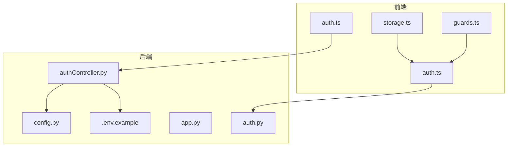
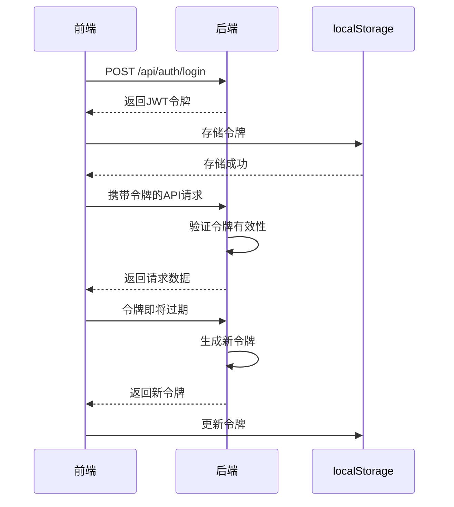
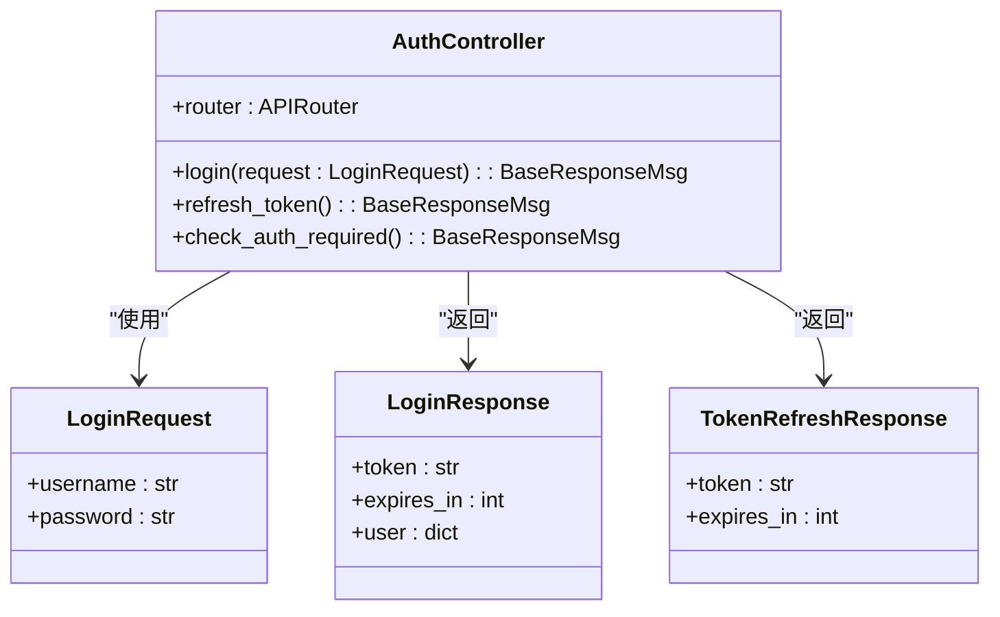
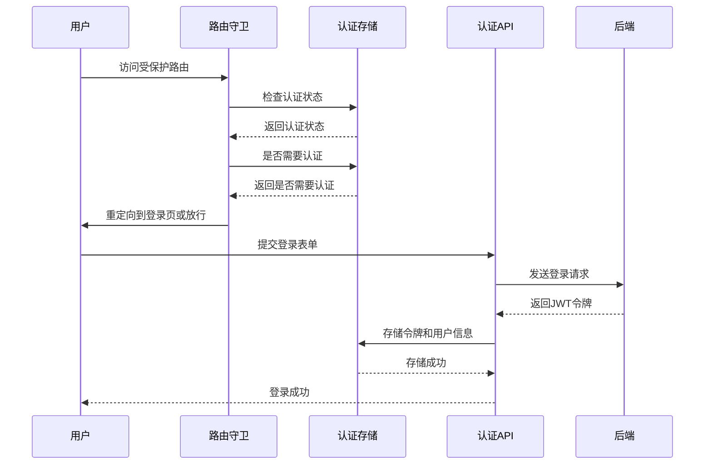
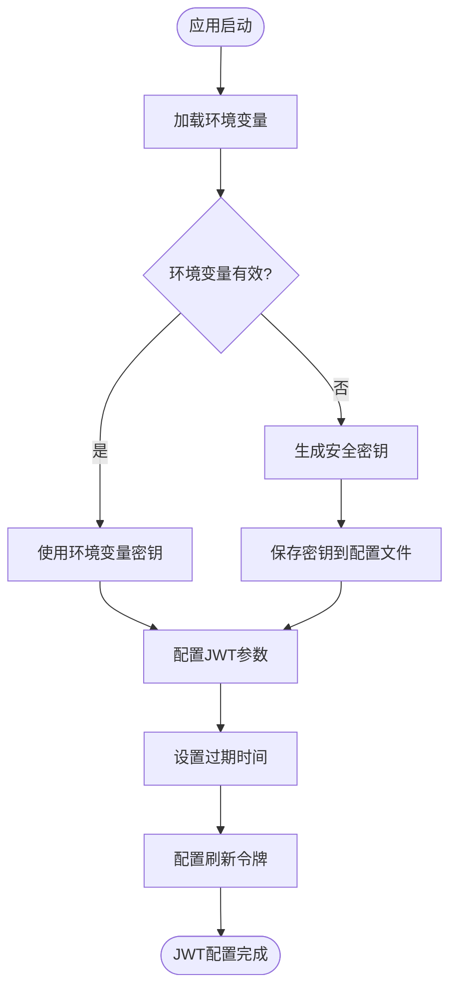
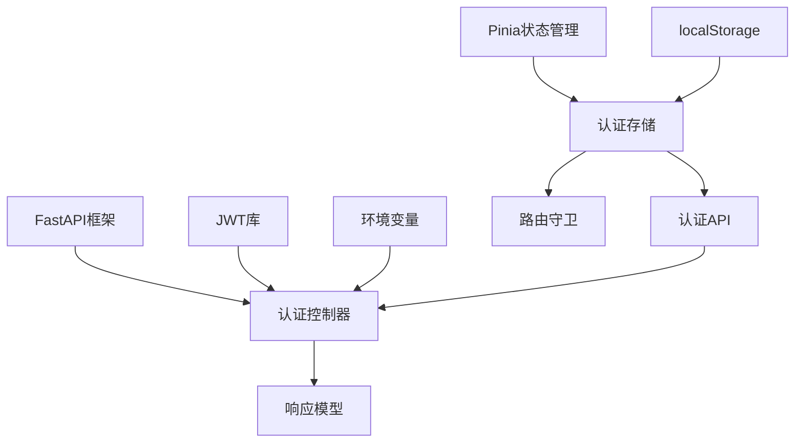

# 认证配置

<cite>
**本文档引用的文件**
- [config.py](file://src/backEnd/config.py)
- [authController.py](file://src/backEnd/api/commonApi/authController.py)
- [auth.ts](file://src/frontEnd/src/api/auth.ts)
- [.env.example](file://src/backEnd/.env.example)
- [auth.py](file://src/backEnd/utils/auth.py)
- [storage.ts](file://src/frontEnd/src/utils/storage.ts)
- [authStore.ts](file://src/frontEnd/src/stores/auth.ts)
- [guards.ts](file://src/frontEnd/src/router/guards.ts)
- [app.py](file://src/backEnd/app.py)
</cite>

## 目录
1. [简介](#简介)
2. [项目结构](#项目结构)
3. [核心组件](#核心组件)
4. [架构概述](#架构概述)
5. [详细组件分析](#详细组件分析)
6. [依赖分析](#依赖分析)
7. [性能考虑](#性能考虑)
8. [故障排除指南](#故障排除指南)
9. [结论](#结论)
10. [附录](#附录)（如有必要）

## 简介
sqlmapWebUI是一个用于SQL注入测试的Web界面工具，其认证机制设计为支持本地单机模式和远程访问模式。在本地单机模式下，系统自动识别本地访问并跳过认证流程，而在远程访问模式下，系统需要进行用户认证。本认证配置文档详细介绍了系统的JWT配置参数、认证API接口实现、前端令牌存储策略以及完整的认证配置指南。

## 项目结构
sqlmapWebUI项目采用前后端分离的架构，后端使用Python FastAPI框架，前端使用Vue.js框架。项目结构清晰地分为后端和前端两个主要部分，其中后端的认证相关代码位于`src/backEnd/api/commonApi/authController.py`，前端的认证相关代码位于`src/frontEnd/src/api/auth.ts`和`src/frontEnd/src/stores/auth.ts`。



**图源**
- [authController.py](file://src/backEnd/api/commonApi/authController.py)
- [auth.ts](file://src/frontEnd/src/api/auth.ts)
- [auth.py](file://src/backEnd/utils/auth.py)
- [.env.example](file://src/backEnd/.env.example)

**节源**
- [authController.py](file://src/backEnd/api/commonApi/authController.py)
- [auth.ts](file://src/frontEnd/src/api/auth.ts)
- [auth.py](file://src/backEnd/utils/auth.py)
- [.env.example](file://src/backEnd/.env.example)

## 核心组件
sqlmapWebUI的认证系统由多个核心组件构成，包括后端的认证控制器、JWT配置、用户认证工具，以及前端的认证API、状态管理、存储工具和路由守卫。这些组件协同工作，实现了完整的用户认证流程。

**节源**
- [authController.py](file://src/backEnd/api/commonApi/authController.py)
- [auth.ts](file://src/frontEnd/src/api/auth.ts)
- [auth.py](file://src/backEnd/utils/auth.py)

## 架构概述
sqlmapWebUI的认证架构采用基于JWT的无状态认证机制，支持本地和远程双模式。系统通过环境变量配置JWT密钥和认证参数，后端提供登录、刷新令牌等API接口，前端负责令牌的存储、刷新和过期处理。



**图源**
- [authController.py](file://src/backEnd/api/commonApi/authController.py)
- [auth.ts](file://src/frontEnd/src/api/auth.ts)
- [storage.ts](file://src/frontEnd/src/utils/storage.ts)

## 详细组件分析

### 认证控制器分析
`authController.py`是后端认证的核心组件，实现了登录、令牌刷新和认证检查等API接口。该组件使用FastAPI框架，通过路由装饰器定义了三个主要的认证接口。

#### 认证控制器类图


**图源**
- [authController.py](file://src/backEnd/api/commonApi/authController.py)

**节源**
- [authController.py](file://src/backEnd/api/commonApi/authController.py)

### 前端认证分析
前端认证系统由多个组件构成，包括认证API、状态管理、存储工具和路由守卫。这些组件协同工作，实现了完整的前端认证流程。

#### 前端认证序列图


**图源**
- [auth.ts](file://src/frontEnd/src/api/auth.ts)
- [auth.ts](file://src/frontEnd/src/stores/auth.ts)
- [guards.ts](file://src/frontEnd/src/router/guards.ts)

**节源**
- [auth.ts](file://src/frontEnd/src/api/auth.ts)
- [auth.ts](file://src/frontEnd/src/stores/auth.ts)
- [guards.ts](file://src/frontEnd/src/router/guards.ts)

### JWT配置分析
sqlmapWebUI的JWT配置主要通过环境变量进行管理，核心配置参数包括JWT密钥、过期时间和刷新令牌设置。

#### JWT配置流程图


**图源**
- [.env.example](file://src/backEnd/.env.example)
- [config.py](file://src/backEnd/config.py)

**节源**
- [.env.example](file://src/backEnd/.env.example)
- [config.py](file://src/backEnd/config.py)

## 依赖分析
sqlmapWebUI的认证系统依赖于多个内部和外部组件，包括FastAPI框架、JWT库、环境变量配置和前端状态管理库。



**图源**
- [authController.py](file://src/backEnd/api/commonApi/authController.py)
- [auth.py](file://src/backEnd/utils/auth.py)
- [auth.ts](file://src/frontEnd/src/stores/auth.ts)

**节源**
- [authController.py](file://src/backEnd/api/commonApi/authController.py)
- [auth.py](file://src/backEnd/utils/auth.py)
- [auth.ts](file://src/frontEnd/src/stores/auth.ts)

## 性能考虑
sqlmapWebUI的认证系统在设计时考虑了性能因素，包括令牌的自动刷新机制、健康检查缓存和本地访问优化。

**节源**
- [authController.py](file://src/backEnd/api/commonApi/authController.py)
- [auth.ts](file://src/frontEnd/src/stores/auth.ts)

## 故障排除指南
当遇到认证相关问题时，可以按照以下步骤进行排查：

1. **检查环境变量配置**：确保`.env`文件中的`SECRET_KEY`已正确设置
2. **验证JWT令牌**：使用在线JWT解码工具检查令牌的有效性
3. **检查前端存储**：在浏览器开发者工具中检查localStorage中的认证信息
4. **查看日志文件**：检查后端日志文件中的认证相关错误信息
5. **测试健康检查**：访问`/api/health`端点检查服务状态

**节源**
- [.env.example](file://src/backEnd/.env.example)
- [app.py](file://src/backEnd/app.py)
- [authController.py](file://src/backEnd/api/commonApi/authController.py)

## 结论
sqlmapWebUI的认证系统设计灵活，支持本地和远程双模式，通过JWT实现安全的无状态认证。系统提供了完整的认证配置指南，包括JWT密钥生成、密码哈希算法配置和会话超时策略设置。未来可以进一步完善真正的用户认证逻辑，增强系统的安全性。

## 附录

### 认证配置指南
#### 生成安全的JWT密钥
```bash
# 使用Python生成32位随机密钥
python -c "import secrets; print(secrets.token_urlsafe(32))"
```

#### 配置密码哈希算法
推荐使用bcrypt算法进行密码哈希，示例代码：
```python
import bcrypt

def hash_password(password: str) -> str:
    salt = bcrypt.gensalt()
    return bcrypt.hashpw(password.encode('utf-8'), salt).decode('utf-8')

def verify_password(password: str, hashed: str) -> bool:
    return bcrypt.checkpw(password.encode('utf-8'), hashed.encode('utf-8'))
```

#### 设置会话超时策略
在`.env`文件中配置会话超时时间：
```env
# JWT令牌过期时间（秒）
JWT_EXPIRATION=3600

# 刷新令牌过期时间（秒）
REFRESH_TOKEN_EXPIRATION=86400

# 令牌刷新提前时间（秒）
TOKEN_REFRESH_WINDOW=300
```

#### 集成外部认证系统
可以通过OAuth2或OpenID Connect集成外部认证系统，示例配置：
```python
from fastapi.security import OAuth2PasswordBearer

oauth2_scheme = OAuth2PasswordBearer(tokenUrl="token")

async def get_current_user(token: str = Depends(oauth2_scheme)):
    # 实现外部认证系统的用户验证逻辑
    pass
```

**节源**
- [.env.example](file://src/backEnd/.env.example)
- [auth.py](file://src/backEnd/utils/auth.py)