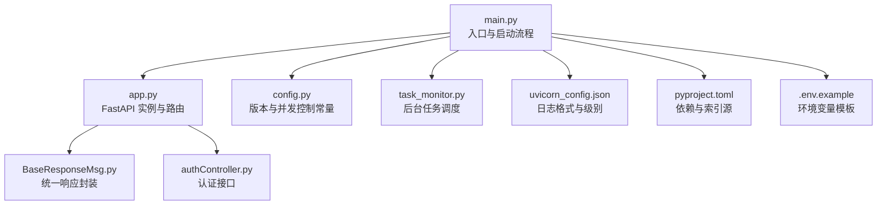
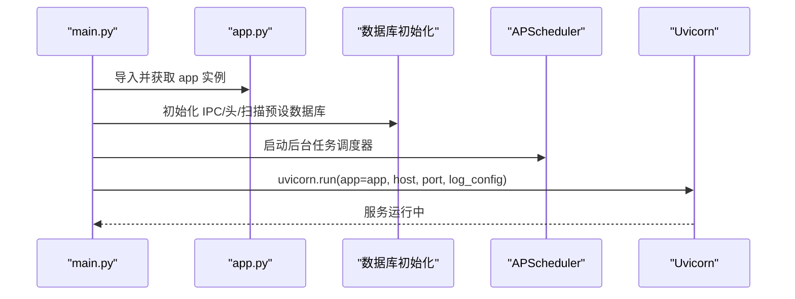
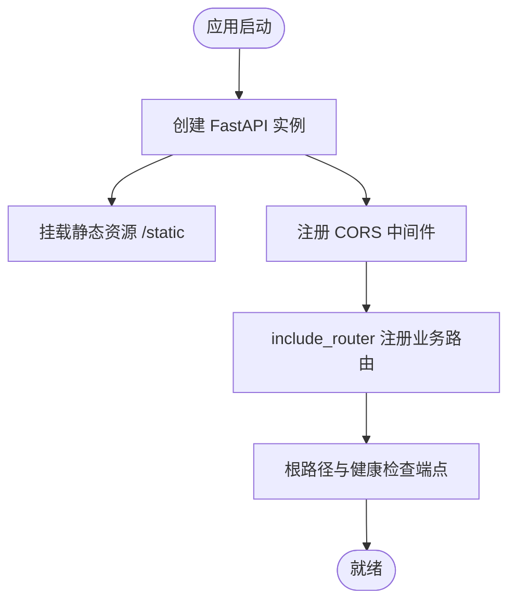
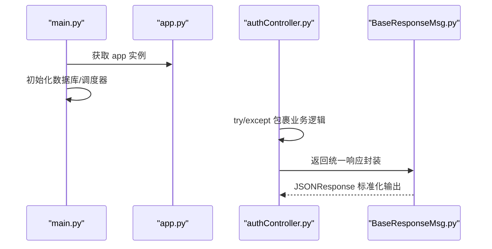
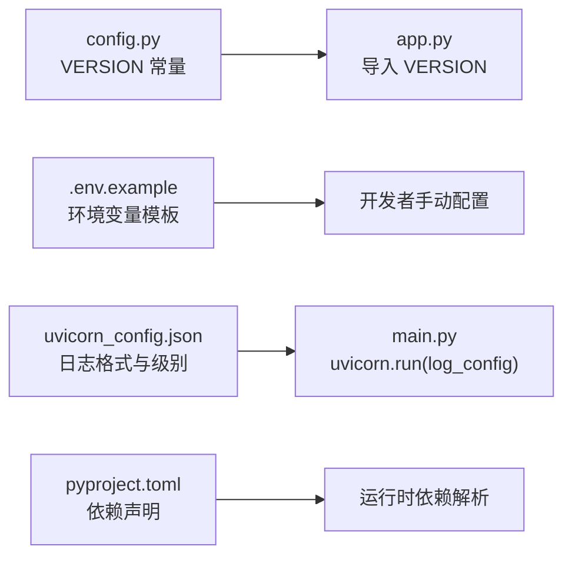
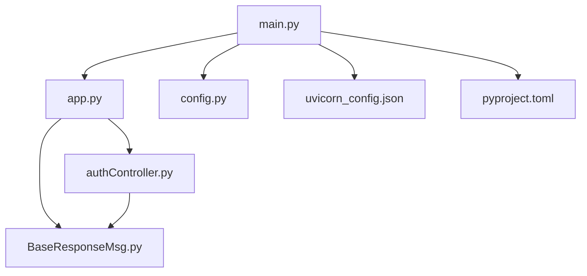

# 应用初始化

<cite>
**本文引用的文件**
- [main.py](file://src/backEnd/main.py)
- [app.py](file://src/backEnd/app.py)
- [config.py](file://src/backEnd/config.py)
- [uvicorn_config.json](file://src/backEnd/uvicorn_config.json)
- [pyproject.toml](file://src/backEnd/pyproject.toml)
- [.env.example](file://src/backEnd/.env.example)
- [task_monitor.py](file://src/backEnd/utils/task_monitor.py)
- [BaseResponseMsg.py](file://src/backEnd/model/BaseResponseMsg.py)
- [authController.py](file://src/backEnd/api/commonApi/authController.py)
</cite>

## 目录
1. [引言](#引言)
2. [项目结构](#项目结构)
3. [核心组件](#核心组件)
4. [架构总览](#架构总览)
5. [详细组件分析](#详细组件分析)
6. [依赖关系分析](#依赖关系分析)
7. [性能考量](#性能考量)
8. [故障排查指南](#故障排查指南)
9. [结论](#结论)

## 引言
本文件聚焦于 FastAPI 应用的启动流程与配置注入机制，围绕以下目标展开：
- 详解 main.py 中 FastAPI 实例的创建过程，包括中间件注册（CORS）、异常处理策略、生命周期事件（startup/shutdown）的处理函数。
- 解释 config.py 中配置参数的加载方式，包括环境变量读取、默认值设置与配置验证。
- 展示配置参数如何从 config.py 注入到 main.py 的 FastAPI 应用中，并讨论配置热更新的可行性与建议。
- 提供应用初始化过程中的常见问题排查方法。

## 项目结构
后端采用 FastAPI + Uvicorn 的标准 Python Web 架构，入口脚本负责初始化数据库、调度器与 Web 服务器；应用层通过 app.py 创建 FastAPI 实例并挂载路由；配置由独立模块提供常量与锁；日志格式通过 uvicorn_config.json 统一配置。

图表来源
- [main.py](file://src/backEnd/main.py#L1-L168)
- [app.py](file://src/backEnd/app.py#L1-L80)
- [config.py](file://src/backEnd/config.py#L1-L8)
- [task_monitor.py](file://src/backEnd/utils/task_monitor.py#L1-L94)
- [BaseResponseMsg.py](file://src/backEnd/model/BaseResponseMsg.py#L1-L21)
- [authController.py](file://src/backEnd/api/commonApi/authController.py#L1-L150)
- [uvicorn_config.json](file://src/backEnd/uvicorn_config.json#L1-L45)
- [pyproject.toml](file://src/backEnd/pyproject.toml#L1-L17)
- [.env.example](file://src/backEnd/.env.example#L1-L71)

章节来源
- [main.py](file://src/backEnd/main.py#L1-L168)
- [app.py](file://src/backEnd/app.py#L1-L80)
- [config.py](file://src/backEnd/config.py#L1-L8)
- [uvicorn_config.json](file://src/backEnd/uvicorn_config.json#L1-L45)
- [pyproject.toml](file://src/backEnd/pyproject.toml#L1-L17)
- [.env.example](file://src/backEnd/.env.example#L1-L71)

## 核心组件
- FastAPI 实例与中间件：在 app.py 中创建 FastAPI 实例，挂载静态资源与 CORS 中间件，注册多组业务路由，并提供根路径与健康检查端点。
- 启动与生命周期：main.py 负责初始化数据库、会话头数据库、扫描预设数据库，启动后台调度器，最后以 Uvicorn 运行 FastAPI 应用。
- 配置参数：config.py 提供版本号与并发控制锁；.env.example 提供环境变量模板；uvicorn_config.json 统一日志格式。
- 统一响应封装：BaseResponseMsg 将业务返回标准化，便于前端消费。
- 认证控制器：authController 提供登录、刷新令牌与认证需求检查接口，内部使用统一响应封装。

章节来源
- [app.py](file://src/backEnd/app.py#L1-L80)
- [main.py](file://src/backEnd/main.py#L118-L168)
- [config.py](file://src/backEnd/config.py#L1-L8)
- [.env.example](file://src/backEnd/.env.example#L1-L71)
- [uvicorn_config.json](file://src/backEnd/uvicorn_config.json#L1-L45)
- [BaseResponseMsg.py](file://src/backEnd/model/BaseResponseMsg.py#L1-L21)
- [authController.py](file://src/backEnd/api/commonApi/authController.py#L1-L150)

## 架构总览
应用初始化的关键路径如下：
- main.py 作为入口，先进行第三方库路径注入与基础环境准备，随后初始化数据库与调度器，最后调用 uvicorn.run(app=app,...) 启动服务。
- app.py 创建 FastAPI 实例，注册 CORS 中间件与静态资源挂载，包含多条业务路由，并提供根路径与健康检查端点。
- config.py 为应用提供版本号等常量；.env.example 提供环境变量模板；uvicorn_config.json 控制日志格式与级别。
- task_monitor.py 通过 APScheduler 后台任务定期监控任务状态并动态调整并发上限。

图表来源
- [main.py](file://src/backEnd/main.py#L118-L168)
- [app.py](file://src/backEnd/app.py#L1-L80)
- [task_monitor.py](file://src/backEnd/utils/task_monitor.py#L1-L94)
- [uvicorn_config.json](file://src/backEnd/uvicorn_config.json#L1-L45)

## 详细组件分析

### FastAPI 实例创建与中间件注册
- 实例创建：在 app.py 中创建 FastAPI 实例，并记录启动时间。
- 静态资源挂载：将构建后的前端静态资源目录挂载到 /static。
- CORS 中间件：允许开发环境 localhost 与后端端口的跨域请求，支持凭据、所有方法与请求头。
- 路由注册：按模块引入各业务路由并统一前缀 /api，标签用于分类管理。
- 根路径与健康检查：根路径返回前端入口页面；/api/health 返回服务健康状态、版本与运行时长。

图表来源
- [app.py](file://src/backEnd/app.py#L1-L80)

章节来源
- [app.py](file://src/backEnd/app.py#L1-L80)

### 生命周期事件与异常处理策略
- 启动事件：main.py 在启动阶段完成数据库初始化、会话头数据库初始化、扫描预设数据库初始化与后台调度器启动。
- 关闭事件：当前实现未显式定义 shutdown 事件处理函数；如需清理资源，可在 FastAPI 实例上注册 lifespan 上下文管理器或使用装饰器形式的 startup/shutdown。
- 异常处理：业务控制器内部使用 try/except 包裹，捕获异常后通过统一响应封装返回错误信息；未见全局异常处理器注册。

图表来源
- [main.py](file://src/backEnd/main.py#L118-L168)
- [authController.py](file://src/backEnd/api/commonApi/authController.py#L1-L150)
- [BaseResponseMsg.py](file://src/backEnd/model/BaseResponseMsg.py#L1-L21)

章节来源
- [main.py](file://src/backEnd/main.py#L118-L168)
- [authController.py](file://src/backEnd/api/commonApi/authController.py#L1-L150)
- [BaseResponseMsg.py](file://src/backEnd/model/BaseResponseMsg.py#L1-L21)

### 配置参数加载与注入
- 版本号注入：app.py 直接从 config.py 导入 VERSION 并在 /api/version 与 /api/health 中使用。
- 环境变量模板：.env.example 提供 APP_ENV、DEBUG、HOST、PORT、SECRET_KEY、API_TOKEN、DATABASE_PATH、SQLMAP_API_URL、LOG_LEVEL、LOG_FILE、CORS_ORIGINS 等键，但当前代码未显式读取这些变量。
- 日志配置：uvicorn_config.json 定义了默认与访问日志格式、级别与处理器，main.py 通过 uvicorn.run(log_config=...) 指定该配置文件。
- 依赖声明：pyproject.toml 声明了 fastapi[standard]、apscheduler、psutil 等可选依赖与镜像源。

图表来源
- [config.py](file://src/backEnd/config.py#L1-L8)
- [app.py](file://src/backEnd/app.py#L1-L80)
- [.env.example](file://src/backEnd/.env.example#L1-L71)
- [uvicorn_config.json](file://src/backEnd/uvicorn_config.json#L1-L45)
- [pyproject.toml](file://src/backEnd/pyproject.toml#L1-L17)

章节来源
- [config.py](file://src/backEnd/config.py#L1-L8)
- [app.py](file://src/backEnd/app.py#L1-L80)
- [.env.example](file://src/backEnd/.env.example#L1-L71)
- [uvicorn_config.json](file://src/backEnd/uvicorn_config.json#L1-L45)
- [pyproject.toml](file://src/backEnd/pyproject.toml#L1-L17)

### 配置热更新与最佳实践
- 当前实现未实现配置热更新：VERSION 通过模块导入注入到 app.py，后续修改 config.py 不会自动生效；如需热更新，建议：
  - 使用配置管理库（如 python-dotenv + pydantic-settings）集中读取 .env 并在运行时校验与缓存。
  - 对于动态参数（如并发上限），可在运行时通过接口或定时任务重新计算并更新共享状态。
  - 对于日志级别与格式，可通过外部配置文件与进程信号触发重新加载（需额外实现）。

章节来源
- [config.py](file://src/backEnd/config.py#L1-L8)
- [app.py](file://src/backEnd/app.py#L1-L80)
- [.env.example](file://src/backEnd/.env.example#L1-L71)
- [uvicorn_config.json](file://src/backEnd/uvicorn_config.json#L1-L45)

## 依赖关系分析
- 模块耦合：
  - main.py 依赖 app.py 提供的 app 实例，同时依赖 config.py 的常量与锁。
  - app.py 依赖 config.py 的 VERSION，并通过 BaseResponseMsg 统一封装响应。
  - authController 依赖 BaseResponseMsg 与 config.VERSION。
- 外部依赖：
  - FastAPI、Uvicorn、APScheduler、psutil 通过 pyproject.toml 声明。
  - 日志格式通过 uvicorn_config.json 配置。

图表来源
- [main.py](file://src/backEnd/main.py#L1-L168)
- [app.py](file://src/backEnd/app.py#L1-L80)
- [config.py](file://src/backEnd/config.py#L1-L8)
- [BaseResponseMsg.py](file://src/backEnd/model/BaseResponseMsg.py#L1-L21)
- [authController.py](file://src/backEnd/api/commonApi/authController.py#L1-L150)
- [uvicorn_config.json](file://src/backEnd/uvicorn_config.json#L1-L45)
- [pyproject.toml](file://src/backEnd/pyproject.toml#L1-L17)

章节来源
- [main.py](file://src/backEnd/main.py#L1-L168)
- [app.py](file://src/backEnd/app.py#L1-L80)
- [config.py](file://src/backEnd/config.py#L1-L8)
- [BaseResponseMsg.py](file://src/backEnd/model/BaseResponseMsg.py#L1-L21)
- [authController.py](file://src/backEnd/api/commonApi/authController.py#L1-L150)
- [uvicorn_config.json](file://src/backEnd/uvicorn_config.json#L1-L45)
- [pyproject.toml](file://src/backEnd/pyproject.toml#L1-L17)

## 性能考量
- 后台任务调度：task_monitor.py 使用 APScheduler 后台线程定期扫描任务状态，动态调整并发上限，避免 CPU 饱和。
- 日志开销：uvicorn_config.json 统一日志格式与级别，减少不必要的日志输出，有助于降低 I/O 开销。
- 资源初始化：main.py 在启动阶段一次性完成数据库与调度器初始化，避免运行时重复初始化带来的抖动。

章节来源
- [task_monitor.py](file://src/backEnd/utils/task_monitor.py#L1-L94)
- [uvicorn_config.json](file://src/backEnd/uvicorn_config.json#L1-L45)
- [main.py](file://src/backEnd/main.py#L118-L168)

## 故障排查指南
- 启动失败
  - 检查 Uvicorn 运行参数与日志配置是否正确（host/port/log_config）。
  - 确认数据库初始化顺序与路径权限，避免 IPC 文件创建失败。
- 路由不可达
  - 确认 app.py 中 include_router 的前缀与标签是否正确，CORS 是否允许目标来源。
- 响应异常
  - 检查业务控制器是否抛出异常且被统一响应封装捕获；确认 BaseResponseMsg 的字段是否符合前端预期。
- 并发过高
  - 检查 task_monitor.py 的并发上限计算逻辑与 CPU 使用率阈值，必要时调整策略。
- 日志不一致
  - 确认 uvicorn_config.json 的日志格式与级别设置，确保与运行环境一致。

章节来源
- [main.py](file://src/backEnd/main.py#L118-L168)
- [app.py](file://src/backEnd/app.py#L1-L80)
- [authController.py](file://src/backEnd/api/commonApi/authController.py#L1-L150)
- [BaseResponseMsg.py](file://src/backEnd/model/BaseResponseMsg.py#L1-L21)
- [task_monitor.py](file://src/backEnd/utils/task_monitor.py#L1-L94)
- [uvicorn_config.json](file://src/backEnd/uvicorn_config.json#L1-L45)

## 结论
本文梳理了 FastAPI 应用的启动流程与配置注入机制，明确了 main.py 与 app.py 的职责边界，总结了中间件与路由注册要点，并指出当前实现未显式定义生命周期事件与配置热更新的现状。建议在后续迭代中补充全局异常处理、生命周期钩子与配置热更新能力，以提升系统的可观测性与可维护性。