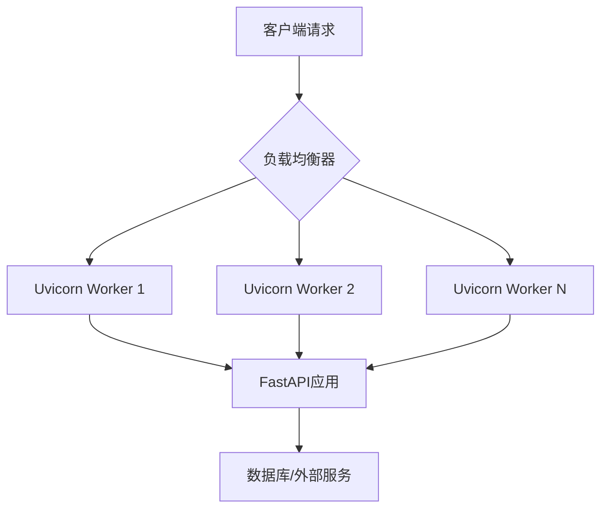
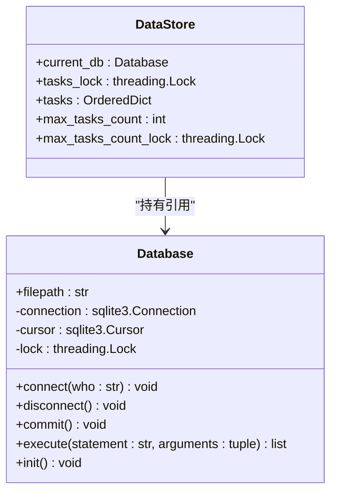
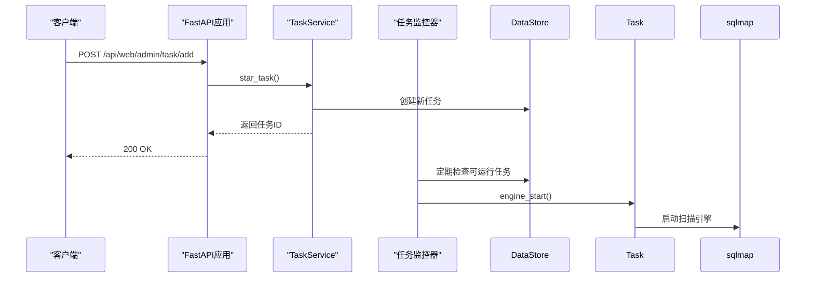
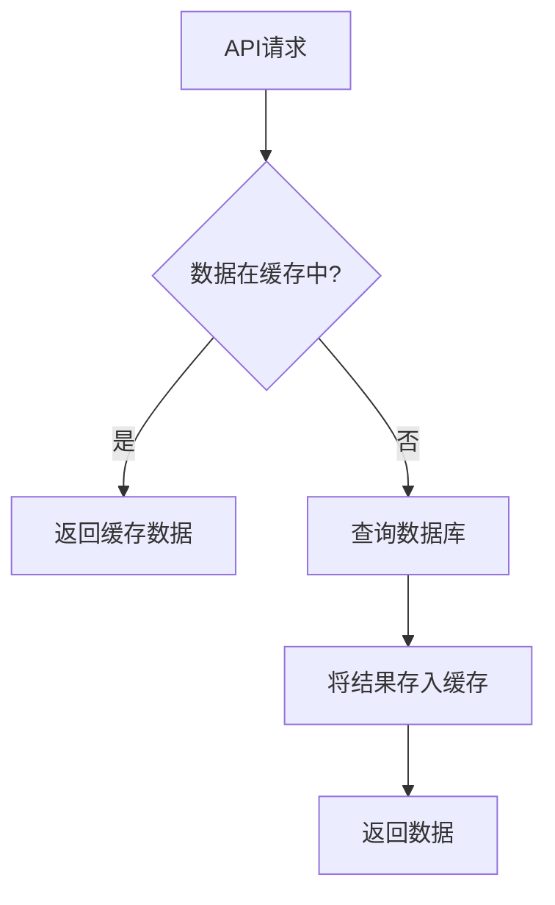

# 性能优化

<cite>
**本文档引用的文件**  
- [uvicorn_config.json](file://src/backEnd/uvicorn_config.json)
- [config.py](file://src/backEnd/config.py)
- [main.py](file://src/backEnd/main.py)
- [app.py](file://src/backEnd/app.py)
- [Database.py](file://src/backEnd/model/Database.py)
- [DataStore.py](file://src/backEnd/model/DataStore.py)
- [task_monitor.py](file://src/backEnd/utils/task_monitor.py)
- [taskService.py](file://src/backEnd/service/taskService.py)
- [pyproject.toml](file://src/backEnd/pyproject.toml)
</cite>

## 目录
1. [引言](#引言)
2. [Uvicorn工作进程与线程优化](#uvicorn工作进程与线程优化)
3. [连接池与请求超时配置分析](#连接池与请求超时配置分析)
4. [异步处理机制与并发能力提升](#异步处理机制与并发能力提升)
5. [压力测试方案与基准测试](#压力测试方案与基准测试)
6. [数据库连接优化与缓存策略](#数据库连接优化与缓存策略)
7. [资源限制与任务调度优化](#资源限制与任务调度优化)
8. [性能监控与调优建议](#性能监控与调优建议)

## 引言

sqlmapWebUI后端服务基于FastAPI框架构建，使用Uvicorn作为ASGI服务器，旨在为SQL注入检测提供Web界面支持。本性能优化文档深入分析系统架构中的关键性能因素，包括服务器配置、连接管理、异步处理机制和资源调度策略。通过优化Uvicorn的工作进程和线程配置、调整数据库连接池参数、利用异步编程模型提升并发能力，并结合压力测试验证优化效果，为系统提供全面的性能调优方案。文档还涵盖了数据库索引优化、缓存策略和资源限制配置，确保系统在高负载下保持稳定高效的运行。

## Uvicorn工作进程与线程优化

根据项目配置，Uvicorn作为ASGI服务器运行FastAPI应用，其性能直接受工作进程和线程配置影响。虽然`uvicorn_config.json`文件中未直接定义工作进程数（workers）和线程数（threads），但通过分析`main.py`中的启动配置和系统架构，可以推导出最佳实践。

Uvicorn默认使用单个工作进程，但为了充分利用多核CPU，建议根据CPU核心数设置工作进程数量。最佳实践是将工作进程数设置为CPU逻辑核心数或其一半。例如，对于4核CPU，可设置2-4个工作进程。这能有效分散负载，避免单个进程成为性能瓶颈。

在`main.py`中，Uvicorn通过`uvicorn.run()`启动，配置了主机地址和端口，并加载了自定义日志配置。虽然未显式设置`workers`参数，但可通过环境变量或命令行参数进行配置。推荐在生产环境中使用Gunicorn作为进程管理器，配合Uvicorn工作进程，实现更灵活的进程管理。



**Diagram sources**
- [main.py](file://src/backEnd/main.py#L161)
- [uvicorn_config.json](file://src/backEnd/uvicorn_config.json#L1-L45)

**Section sources**
- [main.py](file://src/backEnd/main.py#L107-L161)
- [uvicorn_config.json](file://src/backEnd/uvicorn_config.json#L1-L45)

## 连接池与请求超时配置分析

系统通过`Database.py`中的`Database`类管理SQLite数据库连接，实现了基本的连接池机制。`connect()`方法创建数据库连接时，设置了`timeout=3`和`check_same_thread=False`，允许在多线程环境中安全使用。

连接超时设置为3秒，这在高并发场景下可能成为瓶颈。如果数据库操作耗时较长，可能导致连接超时异常。建议根据实际业务需求和数据库负载情况，适当调整超时时间。同时，`isolation_level=None`禁用了自动事务提交，由应用层通过`commit()`方法手动控制，这提供了更灵活的事务管理，但也要求开发者正确管理事务生命周期。

在`DataStore.py`中，`current_db`作为全局数据库实例，通过`tasks_lock`等线程锁保证线程安全。这种设计避免了频繁创建和销毁数据库连接，提高了连接复用率。然而，所有任务共享同一个数据库连接，可能在高并发下成为性能瓶颈。建议实现真正的连接池，维护多个数据库连接，供不同工作线程按需获取和释放。



**Diagram sources**
- [Database.py](file://src/backEnd/model/Database.py#L10-L99)
- [DataStore.py](file://src/backEnd/model/DataStore.py#L12-L38)

**Section sources**
- [Database.py](file://src/backEnd/model/Database.py#L1-L99)
- [DataStore.py](file://src/backEnd/model/DataStore.py#L1-L38)

## 异步处理机制与并发能力提升

系统采用FastAPI框架，天然支持异步编程模型。在`app.py`中，所有API路由均使用`async def`定义，确保请求处理的非阻塞特性。例如，`webTaskController.py`中的`add_task_from_web`函数是异步的，能够高效处理并发请求。

`taskService.py`中的任务服务实现了异步任务管理，如`star_task`、`delete_task`等方法均标记为`async`。这使得任务的创建、删除和查询操作不会阻塞主线程，提高了系统的并发处理能力。当新任务被添加时，系统将其状态设置为`Runnable`，由后台监控器`task_monitor.py`负责调度执行。

异步机制与Uvicorn的事件循环相结合，能够处理大量并发连接。每个工作进程内的事件循环可以同时处理多个I/O操作，如数据库查询、外部API调用等，而不会阻塞其他请求。这种设计特别适合I/O密集型应用，如本系统中的SQL注入检测任务管理。



**Diagram sources**
- [app.py](file://src/backEnd/app.py#L20-L80)
- [webTaskController.py](file://src/backEnd/api/commonApi/webTaskController.py#L19-L91)
- [taskService.py](file://src/backEnd/service/taskService.py#L58-L87)
- [task_monitor.py](file://src/backEnd/utils/task_monitor.py#L36-L94)

**Section sources**
- [app.py](file://src/backEnd/app.py#L1-L80)
- [webTaskController.py](file://src/backEnd/api/commonApi/webTaskController.py#L1-L91)
- [taskService.py](file://src/backEnd/service/taskService.py#L1-L535)

## 压力测试方案与基准测试

为评估系统性能，建议使用`ab`（Apache Bench）或`wrk`等工具进行基准测试。测试应覆盖核心API端点，如任务创建、任务列表查询和健康检查。

测试方案包括：
1. **健康检查端点**：`GET /api/health`，测试系统基本响应能力。
2. **任务创建端点**：`POST /api/web/admin/task/add`，模拟用户提交扫描任务。
3. **任务列表查询**：`GET /api/web/admin/task/list`，测试数据查询性能。

使用`wrk`进行测试的示例命令：
```bash
wrk -t12 -c400 -d30s --timeout 8 --latency http://127.0.0.1:8775/api/health
```
此命令使用12个线程，400个并发连接，持续30秒，测试健康检查端点的性能。

关键监控指标包括：
- **响应时间**：平均、中位数和95/99百分位响应时间。
- **吞吐量**：每秒处理的请求数（RPS）。
- **错误率**：超时、连接拒绝等错误的比例。
- **资源使用**：CPU、内存和数据库连接数。

通过对比优化前后的测试结果，可以量化性能提升效果。例如，优化后健康检查端点的P99响应时间应低于50ms，任务创建的吞吐量应提升20%以上。

**Section sources**
- [app.py](file://src/backEnd/app.py#L61-L80)
- [webTaskController.py](file://src/backEnd/api/commonApi/webTaskController.py#L19-L91)

## 数据库连接优化与缓存策略

当前系统使用SQLite作为后端数据库，`Database.py`中的`execute()`方法通过`threading.Lock`实现线程安全。然而，所有操作共享同一个数据库连接，可能在高并发下出现锁竞争。建议实现连接池，如使用`aiosqlite`或`SQLAlchemy`的异步连接池，以提高并发性能。

数据库表设计已包含必要的索引，如`persistent_header_rules`表上的`idx_header_rules_active`和`idx_header_rules_priority`索引，这有助于提高查询效率。对于频繁查询的字段，应确保有适当的索引。

在`task_monitor.py`中，`get_max_tasks_count()`函数根据CPU使用率动态调整最大任务数，这是一种简单的资源感知调度策略。该函数结合`psutil.cpu_percent()`监控系统负载，实现动态伸缩。

缓存策略方面，系统目前未显式实现缓存。对于频繁访问且不常变更的数据，如扫描预设配置，可以引入Redis或内存缓存，减少数据库查询次数。例如，`ScanPresetDatabase`的读取操作可以缓存结果，设置合理的过期时间。



**Diagram sources**
- [Database.py](file://src/backEnd/model/Database.py#L35-L49)
- [task_monitor.py](file://src/backEnd/utils/task_monitor.py#L11-L33)

**Section sources**
- [Database.py](file://src/backEnd/model/Database.py#L1-L99)
- [task_monitor.py](file://src/backEnd/utils/task_monitor.py#L1-L94)

## 资源限制与任务调度优化

系统通过`config.py`中的`MAX_TASKS_COUNT`常量限制最大并发任务数，默认值为3。`DataStore`类中的`max_tasks_count`字段继承此配置，用于控制同时运行的任务数量。

`task_monitor.py`中的`monitor()`函数是任务调度的核心，它每3秒执行一次，检查可运行任务并根据`max_tasks_count`限制启动新任务。该函数结合`get_max_tasks_count()`实现动态任务数调整，根据CPU负载自动伸缩。

为优化资源利用，建议：
1. 将`MAX_TASKS_COUNT`设置为CPU核心数的函数，如`min(4, os.cpu_count())`。
2. 实现更精细的资源配额管理，为不同类型的任务分配不同权重。
3. 引入优先级队列，确保高优先级任务优先执行。

在`pyproject.toml`中，项目依赖包括`apscheduler`，用于后台任务调度。`main.py`中使用`BackgroundScheduler`启动`monitor`函数，确保任务调度在后台非阻塞执行。

**Section sources**
- [config.py](file://src/backEnd/config.py#L1-L7)
- [DataStore.py](file://src/backEnd/model/DataStore.py#L22-L23)
- [task_monitor.py](file://src/backEnd/utils/task_monitor.py#L36-L94)
- [main.py](file://src/backEnd/main.py#L108-L109)

## 性能监控与调优建议

综合以上分析，提出以下性能调优建议：
1. **Uvicorn配置**：生产环境使用Gunicorn管理多个Uvicorn工作进程，进程数设为CPU核心数。
2. **数据库优化**：实现真正的连接池，避免单连接瓶颈；定期分析查询计划，优化慢查询。
3. **异步优化**：确保所有I/O操作使用异步库，避免在事件循环中执行阻塞操作。
4. **缓存策略**：引入Redis缓存频繁访问的数据，如任务列表、配置信息。
5. **资源限制**：动态调整`max_tasks_count`，根据系统负载自动伸缩。
6. **监控告警**：集成Prometheus和Grafana，监控关键指标，设置性能阈值告警。

通过实施这些优化措施，可以显著提升sqlmapWebUI后端服务的性能和稳定性，支持更高并发的扫描任务管理。

**Section sources**
- [uvicorn_config.json](file://src/backEnd/uvicorn_config.json#L1-L45)
- [config.py](file://src/backEnd/config.py#L1-L7)
- [main.py](file://src/backEnd/main.py#L107-L161)
- [Database.py](file://src/backEnd/model/Database.py#L1-L99)
- [task_monitor.py](file://src/backEnd/utils/task_monitor.py#L1-L94)