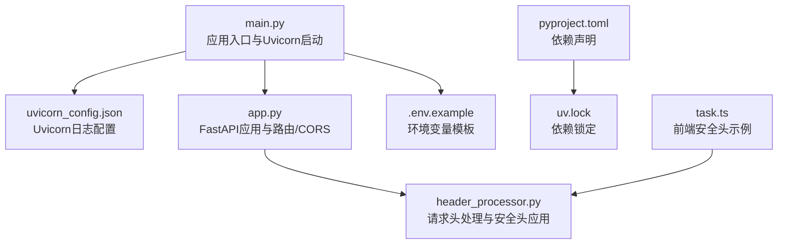
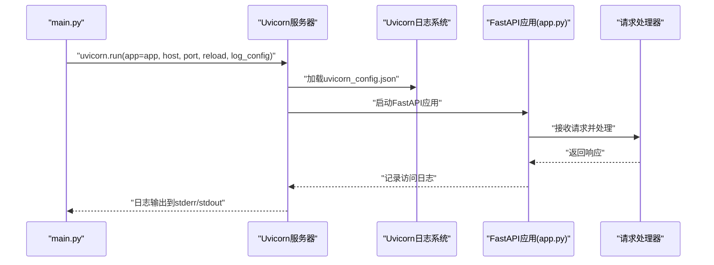
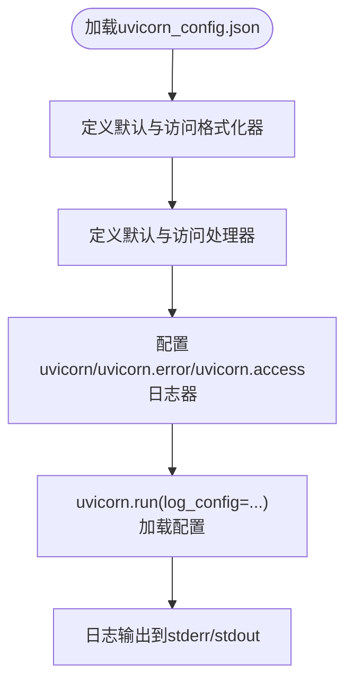
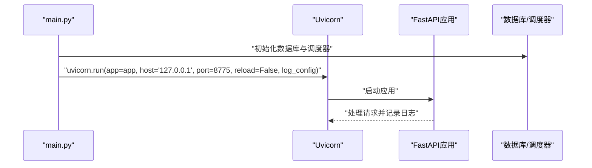
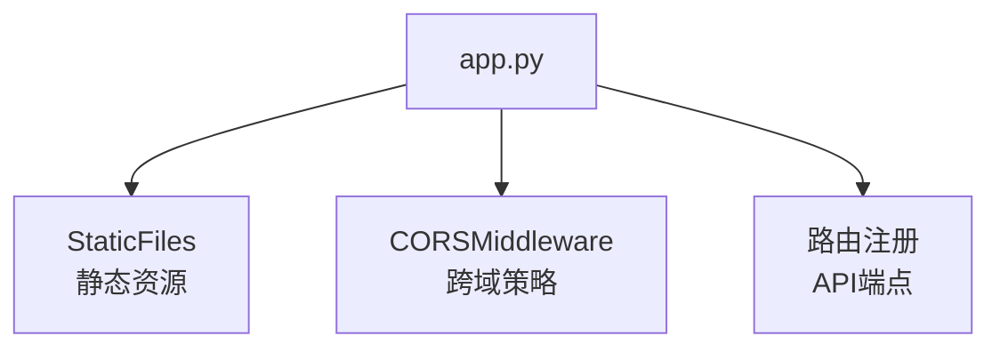
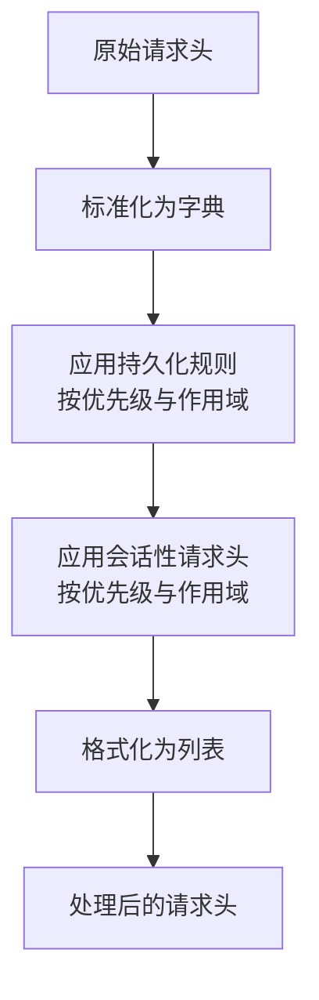
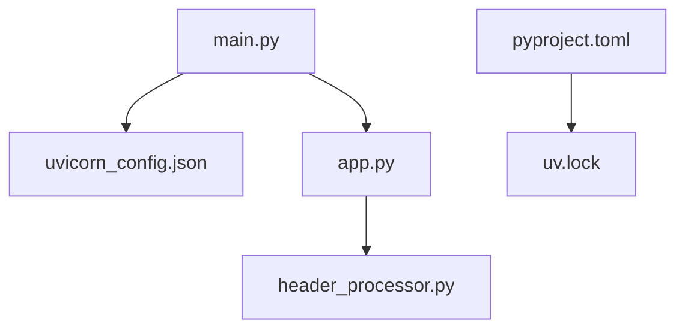

# 服务器配置

<cite>
**本文引用的文件**
- [uvicorn_config.json](file://src/backEnd/uvicorn_config.json)
- [main.py](file://src/backEnd/main.py)
- [app.py](file://src/backEnd/app.py)
- [.env.example](file://src/backEnd/.env.example)
- [pyproject.toml](file://src/backEnd/pyproject.toml)
- [uv.lock](file://src/backEnd/uv.lock)
- [header_processor.py](file://src/backEnd/utils/header_processor.py)
- [auth.py](file://src/backEnd/utils/auth.py)
- [task.ts](file://src/frontEnd/src/api/task.ts)
</cite>

## 目录
1. [简介](#简介)
2. [项目结构](#项目结构)
3. [核心组件](#核心组件)
4. [架构总览](#架构总览)
5. [详细组件分析](#详细组件分析)
6. [依赖关系分析](#依赖关系分析)
7. [性能考量](#性能考量)
8. [故障排查指南](#故障排查指南)
9. [结论](#结论)
10. [附录](#附录)

## 简介
本文件聚焦于 Uvicorn 服务器的配置与使用，围绕项目中的 uvicorn_config.json 展开，系统性解析其日志格式、日志级别、访问日志开关等关键项，并结合实际代码调用 uvicorn.run 的方式，说明如何在不同部署场景（开发、生产、高并发）下进行合理配置。同时，基于项目中已有的安全头策略与认证机制，给出安全配置建议，包括 HTTPS 强制重定向与常见安全头设置思路，帮助读者在保证功能正确性的前提下提升安全性与可观测性。

## 项目结构
与服务器配置直接相关的关键文件如下：
- uvicorn_config.json：Uvicorn 日志系统的 JSON 配置文件，定义默认与访问日志的格式、处理器与日志器。
- main.py：应用入口，负责初始化数据库、调度器与启动 Uvicorn 服务器，并通过 log_config 指定 uvicorn_config.json。
- app.py：FastAPI 应用主体，包含路由、静态文件挂载与 CORS 中间件。
- .env.example：环境变量模板，包含运行环境、主机、端口、日志级别等配置项。
- pyproject.toml：项目依赖声明，包含 uvicorn 版本信息。
- uv.lock：锁定依赖版本，便于复现与审计。
- header_processor.py：请求头处理逻辑，体现安全头策略的应用方式。
- auth.py：认证辅助函数，体现本地环回地址免鉴权与外部请求鉴权的差异。
- task.ts：前端示例，展示常见安全头的注入方式，可用于理解安全头在客户端侧的体现。

**图表来源**
- [main.py](file://src/backEnd/main.py#L1-L168)
- [uvicorn_config.json](file://src/backEnd/uvicorn_config.json#L1-L45)
- [app.py](file://src/backEnd/app.py#L1-L80)
- [.env.example](file://src/backEnd/.env.example#L1-L71)
- [pyproject.toml](file://src/backEnd/pyproject.toml#L1-L17)
- [uv.lock](file://src/backEnd/uv.lock#L659-L700)
- [header_processor.py](file://src/backEnd/utils/header_processor.py#L1-L292)
- [task.ts](file://src/frontEnd/src/api/task.ts#L475-L532)

**章节来源**
- [main.py](file://src/backEnd/main.py#L1-L168)
- [uvicorn_config.json](file://src/backEnd/uvicorn_config.json#L1-L45)
- [app.py](file://src/backEnd/app.py#L1-L80)
- [.env.example](file://src/backEnd/.env.example#L1-L71)
- [pyproject.toml](file://src/backEnd/pyproject.toml#L1-L17)
- [uv.lock](file://src/backEnd/uv.lock#L659-L700)
- [header_processor.py](file://src/backEnd/utils/header_processor.py#L1-L292)
- [task.ts](file://src/frontEnd/src/api/task.ts#L475-L532)

## 核心组件
- Uvicorn 日志配置（uvicorn_config.json）
  - 定义默认与访问日志的格式化器、处理器与日志器，控制日志输出位置与级别。
  - 在 main.py 中通过 uvicorn.run 的 log_config 参数加载该配置。
- 应用入口与服务器启动（main.py）
  - 初始化数据库、调度器与后台任务，随后启动 Uvicorn 服务器。
  - 通过 log_config 指向 uvicorn_config.json，实现统一的日志输出。
- FastAPI 应用与中间件（app.py）
  - 挂载静态文件、配置 CORS，为后续的安全头策略与 HTTPS 强制重定向提供基础。
- 环境变量（.env.example）
  - 提供运行环境、主机、端口、日志级别等配置项，便于在不同环境中切换。
- 依赖与版本（pyproject.toml、uv.lock）
  - 明确 uvicorn 版本，uv.lock 提供锁定的依赖树，便于复现与审计。

**章节来源**
- [uvicorn_config.json](file://src/backEnd/uvicorn_config.json#L1-L45)
- [main.py](file://src/backEnd/main.py#L1-L168)
- [app.py](file://src/backEnd/app.py#L1-L80)
- [.env.example](file://src/backEnd/.env.example#L1-L71)
- [pyproject.toml](file://src/backEnd/pyproject.toml#L1-L17)
- [uv.lock](file://src/backEnd/uv.lock#L659-L700)

## 架构总览
下图展示了从应用启动到 Uvicorn 日志输出的整体流程，以及与 FastAPI 应用的关系。

**图表来源**
- [main.py](file://src/backEnd/main.py#L1-L168)
- [uvicorn_config.json](file://src/backEnd/uvicorn_config.json#L1-L45)
- [app.py](file://src/backEnd/app.py#L1-L80)

## 详细组件分析

### Uvicorn 日志配置（uvicorn_config.json）
- 关键点
  - 默认日志器（uvicorn）与错误日志器（uvicorn.error）分别配置了级别与处理器。
  - 访问日志器（uvicorn.access）独立配置，使用单独的处理器与级别，便于区分错误与访问。
  - 格式化器采用默认的 DefaultFormatter 与 AccessFormatter，支持彩色输出与时间格式。
- 影响
  - 统一日志输出到 stderr/stdout，便于容器化与日志收集。
  - 访问日志与错误日志分离，有利于问题定位与告警策略制定。
- 与代码的关联
  - main.py 中通过 uvicorn.run 的 log_config 指向该配置文件，确保启动时加载。

**图表来源**
- [uvicorn_config.json](file://src/backEnd/uvicorn_config.json#L1-L45)
- [main.py](file://src/backEnd/main.py#L1-L168)

**章节来源**
- [uvicorn_config.json](file://src/backEnd/uvicorn_config.json#L1-L45)
- [main.py](file://src/backEnd/main.py#L1-L168)

### 应用入口与服务器启动（main.py）
- 关键点
  - 初始化数据库、调度器与后台任务。
  - 通过 uvicorn.run 启动服务器，固定监听 127.0.0.1:8775，reload=False，log_config 指向 uvicorn_config.json。
- 影响
  - 本地开发默认仅监听本机，避免暴露给外部网络。
  - 关闭热重载，减少开发环境以外的资源消耗。
- 与日志的关系
  - 通过 log_config 加载 uvicorn_config.json，确保日志输出符合预期。

**图表来源**
- [main.py](file://src/backEnd/main.py#L1-L168)
- [uvicorn_config.json](file://src/backEnd/uvicorn_config.json#L1-L45)

**章节来源**
- [main.py](file://src/backEnd/main.py#L1-L168)

### FastAPI 应用与 CORS（app.py）
- 关键点
  - 挂载静态文件目录，提供前端构建产物。
  - 配置 CORS，允许开发环境下 localhost 与后端端口之间的跨域请求。
- 影响
  - 便于前后端联调，但需注意生产环境应收紧 CORS 策略。
- 与安全头的关系
  - CORS 与安全头（如 HSTS、X-Frame-Options 等）属于不同层面的安全控制，可在后续补充。

**图表来源**
- [app.py](file://src/backEnd/app.py#L1-L80)

**章节来源**
- [app.py](file://src/backEnd/app.py#L1-L80)

### 环境变量与部署（.env.example）
- 关键点
  - APP_ENV、HOST、PORT、LOG_LEVEL 等，便于在不同环境切换。
  - 生产环境建议通过环境变量或外部配置中心管理敏感信息。
- 影响
  - 通过环境变量控制运行参数，降低硬编码风险。

**章节来源**
- [.env.example](file://src/backEnd/.env.example#L1-L71)

### 依赖与版本（pyproject.toml、uv.lock）
- 关键点
  - 明确 uvicorn 版本，uv.lock 提供锁定的依赖树。
- 影响
  - 便于在 CI/CD 中复现一致的运行环境，减少“在我机器上能跑”的问题。

**章节来源**
- [pyproject.toml](file://src/backEnd/pyproject.toml#L1-L17)
- [uv.lock](file://src/backEnd/uv.lock#L659-L700)

### 请求头处理与安全头策略（header_processor.py）
- 关键点
  - 支持持久化规则与会话性请求头，按优先级与作用域匹配应用。
  - 可用于注入安全头（如 Strict-Transport-Security、X-Frame-Options、X-Content-Type-Options 等），并支持针对 HTTPS 协议生效的规则。
- 影响
  - 通过规则化的方式集中管理安全头，避免分散在各处。

**图表来源**
- [header_processor.py](file://src/backEnd/utils/header_processor.py#L1-L292)

**章节来源**
- [header_processor.py](file://src/backEnd/utils/header_processor.py#L1-L292)

### 认证与本地环回（auth.py）
- 关键点
  - 本地环回地址（127.0.0.1、localhost）免鉴权，外部请求需要提供有效令牌。
- 影响
  - 本地开发便捷，生产环境需配合 HTTPS 与更严格的鉴权策略。

**章节来源**
- [auth.py](file://src/backEnd/utils/auth.py#L1-L22)

### 前端安全头示例（task.ts）
- 关键点
  - 前端示例中包含多种安全头（如 X-Content-Type-Options、X-Frame-Options、X-XSS-Protection、Strict-Transport-Security、Referrer-Policy 等）。
- 影响
  - 有助于理解安全头在客户端侧的体现，但最终的安全策略应在服务端统一实施。

**章节来源**
- [task.ts](file://src/frontEnd/src/api/task.ts#L475-L532)

## 依赖关系分析
- Uvicorn 与日志配置
  - main.py 通过 log_config 加载 uvicorn_config.json，确保日志格式与级别一致。
- FastAPI 与中间件
  - app.py 中的 CORS 与静态文件挂载为后续安全头策略提供基础。
- 依赖版本
  - pyproject.toml 与 uv.lock 明确 uvicorn 版本，便于复现与审计。

**图表来源**
- [main.py](file://src/backEnd/main.py#L1-L168)
- [uvicorn_config.json](file://src/backEnd/uvicorn_config.json#L1-L45)
- [app.py](file://src/backEnd/app.py#L1-L80)
- [header_processor.py](file://src/backEnd/utils/header_processor.py#L1-L292)
- [pyproject.toml](file://src/backEnd/pyproject.toml#L1-L17)
- [uv.lock](file://src/backEnd/uv.lock#L659-L700)

**章节来源**
- [main.py](file://src/backEnd/main.py#L1-L168)
- [uvicorn_config.json](file://src/backEnd/uvicorn_config.json#L1-L45)
- [app.py](file://src/backEnd/app.py#L1-L80)
- [header_processor.py](file://src/backEnd/utils/header_processor.py#L1-L292)
- [pyproject.toml](file://src/backEnd/pyproject.toml#L1-L17)
- [uv.lock](file://src/backEnd/uv.lock#L659-L700)

## 性能考量
- 工作进程与线程
  - 项目当前未显式配置 workers 与 threads；默认情况下，Uvicorn 在单进程单线程模型下运行。若需提升吞吐，可考虑在生产环境通过命令行参数或配置文件增加 workers 数量（例如多核 CPU 场景），并结合 uvloop 提升事件循环性能。
- 连接保持与优雅关闭
  - 项目未显式配置 timeout_keep_alive 与 timeout_graceful_shutdown。建议在高并发场景下适当增大 keep-alive 超时，以减少频繁握手带来的开销；同时设置合理的优雅关闭超时，确保在重启或升级时平滑结束请求。
- 日志级别
  - uvicorn_config.json 中默认级别为 INFO。在生产环境建议维持 INFO 或更高，避免 DEBUG 带来的额外 IO 压力；必要时可通过环境变量调整 LOG_LEVEL。
- 访问日志
  - uvicorn.access 独立配置，建议在生产环境开启访问日志，但注意日志量与磁盘 IO；可结合日志采集与轮转策略。

[本节为通用性能建议，不直接分析具体文件，故无“章节来源”标注]

## 故障排查指南
- 启动失败或日志异常
  - 检查 uvicorn_config.json 是否正确加载（main.py 中的 log_config）。确认默认与访问日志处理器的输出流配置是否符合预期。
- 端口占用或绑定失败
  - 确认 HOST 与 PORT 设置，避免与系统或其他进程冲突。开发环境默认监听 127.0.0.1:8775。
- CORS 与跨域问题
  - 生产环境需收紧 CORS 策略，避免宽泛的 allow_origin_regex。参考 app.py 中的 CORS 配置进行调整。
- 安全头未生效
  - 确认 header_processor.py 的规则是否正确配置与应用，特别是针对 HTTPS 协议的规则。同时检查目标 URL 是否满足作用域匹配条件。
- 认证问题
  - 本地环回免鉴权，外部请求需提供有效令牌。检查 auth.py 的鉴权逻辑与令牌传递方式。

**章节来源**
- [main.py](file://src/backEnd/main.py#L1-L168)
- [uvicorn_config.json](file://src/backEnd/uvicorn_config.json#L1-L45)
- [app.py](file://src/backEnd/app.py#L1-L80)
- [header_processor.py](file://src/backEnd/utils/header_processor.py#L1-L292)
- [auth.py](file://src/backEnd/utils/auth.py#L1-L22)

## 结论
本项目通过 uvicorn_config.json 与 main.py 的配合，实现了可控的日志输出与启动流程。在未显式配置 workers、threads、timeout_keep_alive、timeout_graceful_shutdown 的情况下，默认行为适合本地开发。生产环境建议：
- 显式配置 workers 与 threads，结合 uvloop 提升性能；
- 设置合理的 keep-alive 与优雅关闭超时；
- 严格控制 CORS 与安全头策略，优先在服务端统一实施；
- 通过环境变量与外部配置中心管理敏感信息与运行参数。

[本节为总结性内容，不直接分析具体文件，故无“章节来源”标注]

## 附录

### 配置项解析与影响（基于现有文件与代码）
- workers（工作进程数）
  - 当前未显式配置。建议在生产环境根据 CPU 核心数设置，通常为 CPU 核心数或核心数+1。
- threads（线程数）
  - 当前未显式配置。建议与 workers 协同设置，避免过度线程导致上下文切换开销。
- timeout_keep_alive（保持连接超时时间）
  - 当前未显式配置。建议在高并发场景适当增大，减少频繁握手成本。
- timeout_graceful_shutdown（优雅关闭超时时间）
  - 当前未显式配置。建议设置为足以处理完在途请求的时间窗口。
- log_level（日志级别）
  - uvicorn_config.json 中默认为 INFO。生产环境建议维持 INFO 或更高。
- access_log（访问日志开关）
  - uvicorn.access 独立配置，建议在生产环境开启访问日志，注意日志量与 IO。
- ssl_keyfile 和 ssl_certfile（SSL 证书配置）
  - 项目未显式配置。若启用 HTTPS，需在 uvicorn.run 中传入 ssl_keyfile 与 ssl_certfile，或通过命令行参数配置。

[本节为概念性说明，不直接分析具体文件，故无“章节来源”标注]

### 不同部署场景下的配置建议
- 开发环境
  - 主机与端口：127.0.0.1:8775（避免对外暴露）。
  - 日志级别：INFO。
  - CORS：允许 localhost 与后端端口。
  - reload：可开启以便开发调试。
- 生产环境
  - 主机：0.0.0.0 或内网 IP。
  - 端口：80/443（若启用 HTTPS）。
  - workers/threads：根据 CPU 核心数设置。
  - timeout_keep_alive/timeout_graceful_shutdown：根据业务特性设置。
  - 日志级别：INFO。
  - HTTPS：启用 SSL 并配置 ssl_keyfile 与 ssl_certfile。
  - 安全头：通过 header_processor.py 的规则集中管理，优先在服务端实施。
- 高并发场景
  - 增加 workers 与 threads，结合 uvloop。
  - 优化 keep-alive 与优雅关闭超时。
  - 启用访问日志并配合日志采集与轮转。

[本节为通用建议，不直接分析具体文件，故无“章节来源”标注]

### 安全配置建议
- HTTPS 强制重定向
  - 建议在反向代理层（如 Nginx）或服务端中间件中实现 HTTP 到 HTTPS 的重定向，确保所有流量走 TLS。
- 安全头设置
  - 通过 header_processor.py 的持久化规则集中管理，例如：
    - Strict-Transport-Security：仅在 HTTPS 生效。
    - X-Frame-Options：DENY。
    - X-Content-Type-Options：nosniff。
    - X-XSS-Protection：1; mode=block。
    - Referrer-Policy：strict-origin-when-cross-origin。
    - Permissions-Policy：限制摄像头、麦克风等权限。
  - 注意：这些头应由服务端统一注入，而非仅依赖前端示例。

**章节来源**
- [header_processor.py](file://src/backEnd/utils/header_processor.py#L1-L292)
- [task.ts](file://src/frontEnd/src/api/task.ts#L475-L532)