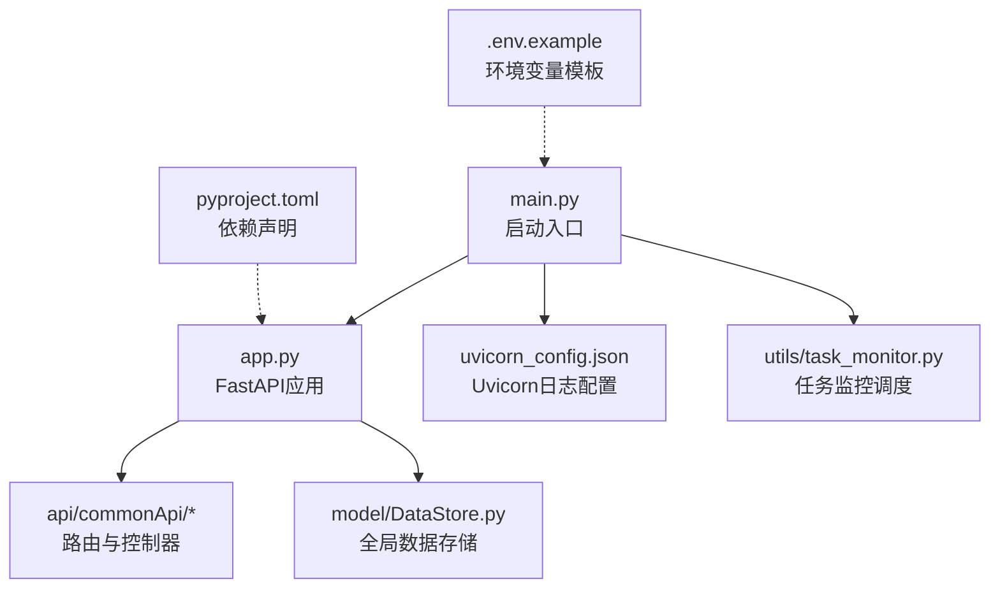
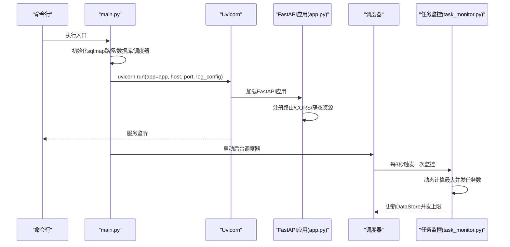
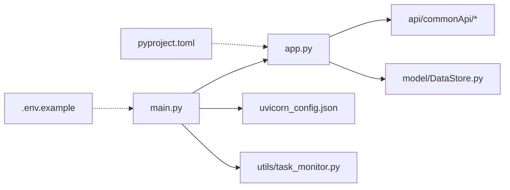

# 服务配置

<cite>
**本文引用的文件列表**
- [main.py](file://src/backEnd/main.py)
- [app.py](file://src/backEnd/app.py)
- [config.py](file://src/backEnd/config.py)
- [uvicorn_config.json](file://src/backEnd/uvicorn_config.json)
- [.env.example](file://src/backEnd/.env.example)
- [pyproject.toml](file://src/backEnd/pyproject.toml)
- [task_monitor.py](file://src/backEnd/utils/task_monitor.py)
- [DataStore.py](file://src/backEnd/model/DataStore.py)
- [configController.py](file://src/backEnd/api/commonApi/configController.py)
</cite>

## 目录
1. [简介](#简介)
2. [项目结构](#项目结构)
3. [核心组件](#核心组件)
4. [架构总览](#架构总览)
5. [详细组件分析](#详细组件分析)
6. [依赖关系分析](#依赖关系分析)
7. [性能考虑与调优](#性能考虑与调优)
8. [故障排查指南](#故障排查指南)
9. [结论](#结论)
10. [附录](#附录)

## 简介
本文件聚焦于sqlmapWebUI后端服务的运行时配置，围绕以下主题展开：
- Uvicorn服务器配置：解析uvicorn_config.json中的日志格式、访问日志、日志级别与输出流等；说明main.py中uvicorn.run的参数注入方式。
- FastAPI应用初始化：解释app.py中FastAPI实例的创建、路由挂载、CORS中间件、静态资源挂载与健康检查端点。
- 服务参数配置：梳理config.py中的服务常量，结合.env.example中的环境变量模板，说明API端口、主机绑定、日志级别等可配置项。
- 性能调优：基于task_monitor.py的动态任务并发控制策略，给出异步工作进程、压力测试与资源监控建议。

## 项目结构
后端服务位于src/backEnd目录，关键文件如下：
- 启动入口：main.py
- FastAPI应用：app.py
- 服务配置：config.py、uvicorn_config.json、.env.example
- 依赖声明：pyproject.toml
- 运行时监控：utils/task_monitor.py
- 全局数据存储：model/DataStore.py
- 配置管理API：api/commonApi/configController.py



图表来源
- [main.py](file://src/backEnd/main.py#L1-L168)
- [app.py](file://src/backEnd/app.py#L1-L80)
- [uvicorn_config.json](file://src/backEnd/uvicorn_config.json#L1-L45)
- [task_monitor.py](file://src/backEnd/utils/task_monitor.py#L1-L94)
- [.env.example](file://src/backEnd/.env.example#L1-L71)
- [pyproject.toml](file://src/backEnd/pyproject.toml#L1-L17)

章节来源
- [main.py](file://src/backEnd/main.py#L1-L168)
- [app.py](file://src/backEnd/app.py#L1-L80)
- [uvicorn_config.json](file://src/backEnd/uvicorn_config.json#L1-L45)
- [.env.example](file://src/backEnd/.env.example#L1-L71)
- [pyproject.toml](file://src/backEnd/pyproject.toml#L1-L17)

## 核心组件
- Uvicorn服务器配置：通过uvicorn_config.json定义默认与访问日志格式、处理器与日志器级别，供uvicorn在运行时加载。
- FastAPI应用初始化：app.py创建FastAPI实例，挂载静态资源、CORS中间件，注册各业务路由，并提供版本与健康检查端点。
- 服务参数与环境变量：config.py提供版本与并发限制相关常量；.env.example提供HOST、PORT、LOG_LEVEL等环境变量模板。
- 运行时监控与并发控制：task_monitor.py根据CPU使用率动态调整最大并发任务数，DataStore维护全局状态。

章节来源
- [uvicorn_config.json](file://src/backEnd/uvicorn_config.json#L1-L45)
- [app.py](file://src/backEnd/app.py#L1-L80)
- [config.py](file://src/backEnd/config.py#L1-L8)
- [.env.example](file://src/backEnd/.env.example#L1-L71)
- [task_monitor.py](file://src/backEnd/utils/task_monitor.py#L1-L94)
- [DataStore.py](file://src/backEnd/model/DataStore.py#L1-L38)

## 架构总览
后端服务启动流程概览：
- main.py负责初始化sqlmap路径、数据库与调度器，随后调用uvicorn.run启动FastAPI应用。
- app.py构建FastAPI应用，注册路由与中间件，提供静态资源与健康检查。
- uvicorn_config.json为uvicorn提供日志格式与输出配置。
- task_monitor.py作为后台调度器周期性执行，动态调整并发任务上限。



图表来源
- [main.py](file://src/backEnd/main.py#L118-L168)
- [app.py](file://src/backEnd/app.py#L1-L80)
- [uvicorn_config.json](file://src/backEnd/uvicorn_config.json#L1-L45)
- [task_monitor.py](file://src/backEnd/utils/task_monitor.py#L1-L94)

## 详细组件分析

### Uvicorn服务器配置（uvicorn_config.json）
- 日志格式与日期格式：统一使用默认与访问两种格式，包含时间、级别、模块、文件名、行号等字段，并设置日期格式。
- 输出流：默认日志输出至标准错误流，访问日志输出至标准输出流。
- 日志器级别：uvicorn、uvicorn.error、uvicorn.access分别设置INFO级别，且uvicorn不向上传播。
- 适用范围：该配置由main.py在uvicorn.run时通过log_config参数注入。

章节来源
- [uvicorn_config.json](file://src/backEnd/uvicorn_config.json#L1-L45)
- [main.py](file://src/backEnd/main.py#L161-L161)

### FastAPI应用初始化与配置注入（app.py）
- 应用创建：创建FastAPI实例，设置静态资源目录为“static”，并返回index.html作为根路径。
- 跨域策略：通过CORS中间件允许特定来源（开发环境localhost与后端端口），支持凭据、所有方法与头。
- 路由注册：按前缀/api与标签注册Chrome/Burp/通用API路由。
- 版本与健康检查：提供/api/version与/api/health端点，前者返回版本信息，后者返回健康状态、时间戳、版本与运行时长。

章节来源
- [app.py](file://src/backEnd/app.py#L1-L80)

### 服务参数与环境变量（config.py、.env.example）
- 服务常量：config.py定义版本号与最大任务数锁等常量，供全局使用。
- 环境变量模板：.env.example提供APP_ENV、DEBUG、HOST、PORT、LOG_LEVEL、LOG_FILE、CORS_ORIGINS等键，便于在不同环境中切换配置。
- 注意：main.py中uvicorn.run直接传入host与port参数，实际部署时应确保与环境变量一致或通过外部配置覆盖。

章节来源
- [config.py](file://src/backEnd/config.py#L1-L8)
- [.env.example](file://src/backEnd/.env.example#L1-L71)
- [main.py](file://src/backEnd/main.py#L161-L161)

### 任务并发控制与动态上限（task_monitor.py、DataStore.py）
- 动态上限策略：根据CPU使用率动态调整最大并发任务数，CPU空闲时提升上限，高负载时降低上限。
- 并发上限维护：通过DataStore.max_tasks_count与锁保护，避免竞态。
- 调度周期：调度器每3秒执行一次监控，筛选可运行任务并启动引擎，维持在上限内。

```mermaid
flowchart TD
Start(["监控开始"]) --> GetCpu["读取CPU使用率"]
GetCpu --> Decide{"CPU使用率阈值判断"}
Decide --> |低(<=20%)| SetHigh["设置高并发上限"]
Decide --> |中(20%-50%)| SetMid["设置中等并发上限"]
Decide --> |高(>50%)| SetLow["设置低并发上限"]
SetHigh --> Update["更新DataStore.max_tasks_count"]
SetMid --> Update
SetLow --> Update
Update --> Iterate["遍历任务队列"]
Iterate --> StartEngine["启动可运行任务"]
StartEngine --> End(["结束"])
```

图表来源
- [task_monitor.py](file://src/backEnd/utils/task_monitor.py#L1-L94)
- [DataStore.py](file://src/backEnd/model/DataStore.py#L1-L38)

章节来源
- [task_monitor.py](file://src/backEnd/utils/task_monitor.py#L1-L94)
- [DataStore.py](file://src/backEnd/model/DataStore.py#L1-L38)

### 配置管理API（configController.py）
- 临时目录配置：提供获取、设置与重置HTTP请求临时目录的接口，支持校验目录存在性与可写性。
- 配置注入：通过工具函数读取/设置临时目录，实现运行时配置变更。

章节来源
- [configController.py](file://src/backEnd/api/commonApi/configController.py#L1-L173)

## 依赖关系分析
- 启动依赖：main.py依赖app.py创建的应用、task_monitor.py提供的监控调度器，以及uvicorn_config.json的日志配置。
- 应用依赖：app.py依赖各API路由模块与config.VERSION，同时引入第三方库（FastAPI、APScheduler、psutil）。
- 配置依赖：.env.example提供环境变量模板，main.py在uvicorn.run中直接指定host/port，与环境变量形成互补。



图表来源
- [main.py](file://src/backEnd/main.py#L1-L168)
- [app.py](file://src/backEnd/app.py#L1-L80)
- [uvicorn_config.json](file://src/backEnd/uvicorn_config.json#L1-L45)
- [task_monitor.py](file://src/backEnd/utils/task_monitor.py#L1-L94)
- [DataStore.py](file://src/backEnd/model/DataStore.py#L1-L38)
- [.env.example](file://src/backEnd/.env.example#L1-L71)
- [pyproject.toml](file://src/backEnd/pyproject.toml#L1-L17)

章节来源
- [main.py](file://src/backEnd/main.py#L1-L168)
- [app.py](file://src/backEnd/app.py#L1-L80)
- [pyproject.toml](file://src/backEnd/pyproject.toml#L1-L17)

## 性能考虑与调优
- 异步工作进程配置
  - 当前main.py通过uvicorn.run启动单进程服务，未显式设置workers参数。若需多进程，可在uvicorn.run中增加workers参数（例如与CPU核心数相关）。
  - 若部署在生产环境，建议结合反向代理（如Nginx）与多进程uvicorn，以充分利用多核CPU。
- 线程与并发
  - FastAPI默认使用异步IO，无需手动设置线程数。若需要同步阻塞任务，可通过后台线程池或子进程处理，但需注意与异步事件循环的交互。
- 超时设置
  - uvicorn_config.json未包含超时配置。如需自定义超时，可在uvicorn.run中传入相应的超时参数（如timeout_keep_alive、timeout_response等）。
- 日志格式与级别
  - uvicorn_config.json已定义默认与访问日志格式及级别。生产环境建议将日志级别调整为INFO或更高，避免过多DEBUG日志影响性能。
- 任务并发调优
  - task_monitor.py根据CPU使用率动态调整最大并发任务数，建议结合实际硬件与业务负载进行验证与微调。
  - DataStore.max_tasks_count_lock保证并发安全，建议在高并发场景下评估锁竞争情况。
- 压力测试方法
  - 使用并发客户端对/api/health与业务路由进行压测，观察CPU使用率与响应时间，结合task_monitor的动态上限策略评估系统承载能力。
- 资源监控指标
  - 关键指标：CPU使用率、内存占用、并发任务数、请求延迟、错误率、uvicorn访问日志统计。
  - 建议使用系统监控工具（如psutil）与APScheduler定时采集，结合日志分析定位瓶颈。

章节来源
- [main.py](file://src/backEnd/main.py#L161-L161)
- [uvicorn_config.json](file://src/backEnd/uvicorn_config.json#L1-L45)
- [task_monitor.py](file://src/backEnd/utils/task_monitor.py#L1-L94)
- [DataStore.py](file://src/backEnd/model/DataStore.py#L1-L38)

## 故障排查指南
- 启动失败
  - 检查main.py中uvicorn.run的host与port参数是否与环境变量一致；确认端口未被占用。
  - 查看uvicorn_config.json格式是否正确，日志输出流是否可写。
- 路由不可用
  - 确认app.py中路由前缀与标签是否正确，CORS配置是否允许前端来源。
- 并发异常
  - 检查task_monitor.py的动态上限逻辑与DataStore并发锁，确认是否存在死锁或竞态条件。
- 配置不生效
  - 确认.env.example中的配置项是否正确命名与赋值；在main.py中uvicorn.run未从环境变量读取，需确保外部配置一致。

章节来源
- [main.py](file://src/backEnd/main.py#L161-L161)
- [app.py](file://src/backEnd/app.py#L1-L80)
- [uvicorn_config.json](file://src/backEnd/uvicorn_config.json#L1-L45)
- [task_monitor.py](file://src/backEnd/utils/task_monitor.py#L1-L94)
- [DataStore.py](file://src/backEnd/model/DataStore.py#L1-L38)
- [.env.example](file://src/backEnd/.env.example#L1-L71)

## 结论
本文系统梳理了sqlmapWebUI后端服务的运行时配置要点，涵盖Uvicorn日志配置、FastAPI应用初始化、服务参数与环境变量、并发控制策略与性能调优建议。通过合理配置与持续监控，可在保证稳定性的同时提升系统吞吐与响应质量。

## 附录
- 依赖声明参考：pyproject.toml中声明了FastAPI标准依赖与apscheduler、psutil等运行时依赖。
- 配置注入建议：在生产环境中，建议将host/port等关键参数从环境变量注入，避免硬编码；同时结合uvicorn_config.json统一日志格式与级别。

章节来源
- [pyproject.toml](file://src/backEnd/pyproject.toml#L1-L17)