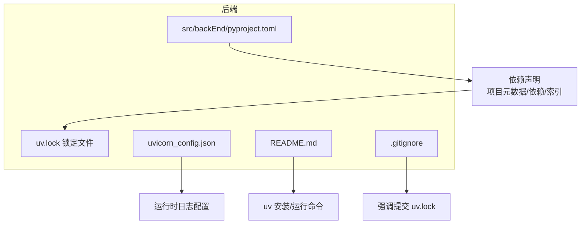
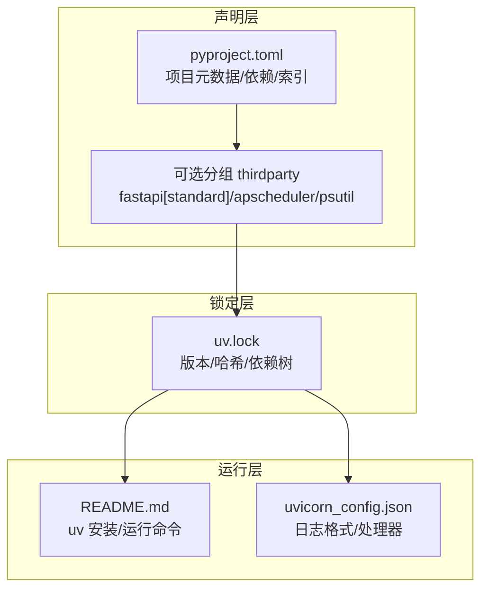
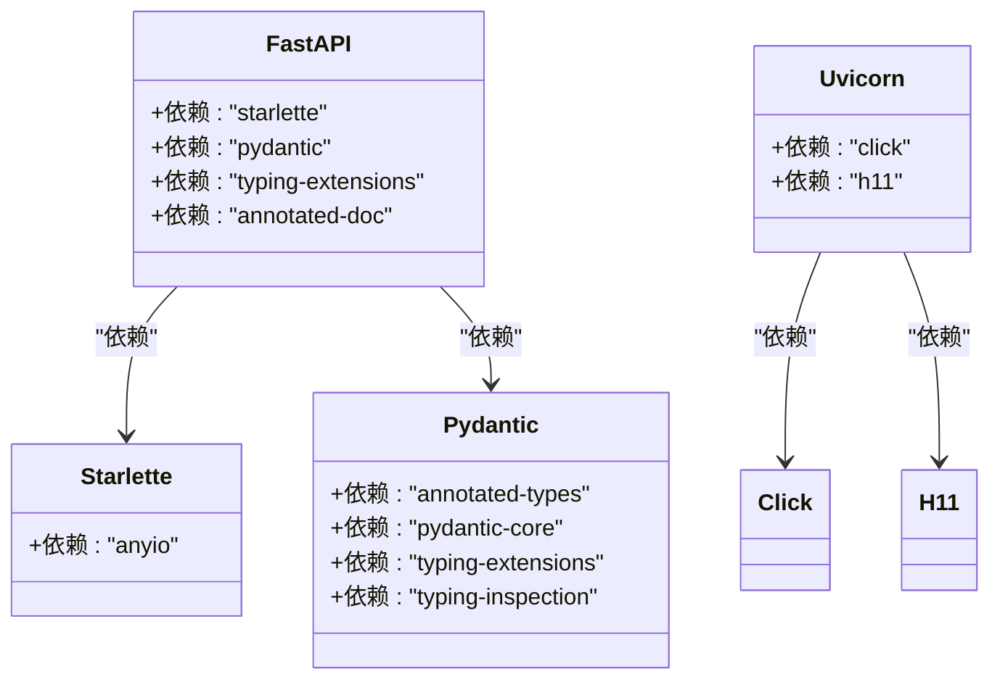
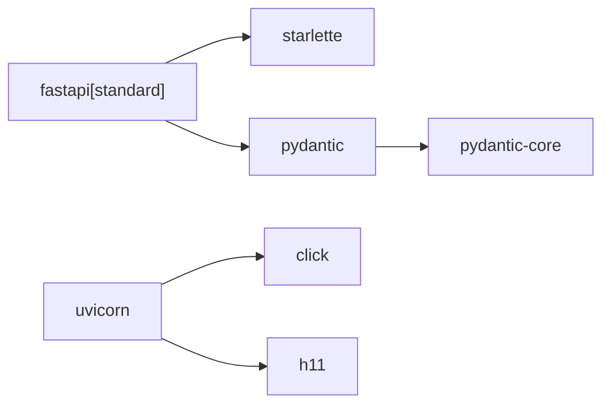

# 依赖管理

<cite>
**本文引用的文件**
- [pyproject.toml](file://src/backEnd/pyproject.toml)
- [uv.lock](file://src/backEnd/uv.lock)
- [uvicorn_config.json](file://src/backEnd/uvicorn_config.json)
- [README.md](file://README.md)
- [.gitignore](file://src/backEnd/.gitignore)
</cite>

## 目录
1. [简介](#简介)
2. [项目结构](#项目结构)
3. [核心组件](#核心组件)
4. [架构总览](#架构总览)
5. [详细组件分析](#详细组件分析)
6. [依赖关系分析](#依赖关系分析)
7. [性能考量](#性能考量)
8. [故障排查指南](#故障排查指南)
9. [结论](#结论)
10. [附录](#附录)

## 简介
本文件聚焦 sqlmapWebUI 的 Python 依赖管理体系，基于后端目录中的 pyproject.toml 与 uv.lock，系统梳理依赖声明、锁定机制、安装与运行流程，并给出 uv 工具的使用建议、冲突解决策略、更新流程与离线部署方案。同时结合 uvicorn 日志配置与项目 README 的安装指引，形成一套可落地的依赖管理实践。

## 项目结构
后端依赖管理的核心文件位于 src/backEnd：
- pyproject.toml：声明项目元数据、依赖与可选分组
- uv.lock：锁定的依赖树与哈希，确保可复现安装
- uvicorn_config.json：uvicorn 日志格式与处理器配置
- README.md：包含 uv 安装与运行命令
- .gitignore：强调 uv.lock 应纳入版本控制

图表来源
- [pyproject.toml](file://src/backEnd/pyproject.toml#L1-L17)
- [uv.lock](file://src/backEnd/uv.lock#L1-L10)
- [uvicorn_config.json](file://src/backEnd/uvicorn_config.json#L1-L45)
- [README.md](file://README.md#L125-L136)
- [.gitignore](file://src/backEnd/.gitignore#L56-L62)

章节来源
- [pyproject.toml](file://src/backEnd/pyproject.toml#L1-L17)
- [uv.lock](file://src/backEnd/uv.lock#L1-L10)
- [uvicorn_config.json](file://src/backEnd/uvicorn_config.json#L1-L45)
- [README.md](file://README.md#L125-L136)
- [.gitignore](file://src/backEnd/.gitignore#L56-L62)

## 核心组件
- 项目元数据与运行时要求
  - 项目名称、版本、描述、Python 版本要求
- 依赖声明
  - 无直接声明 dependencies，通过可选分组 thirdparty 引入核心依赖
- 可选分组 thirdparty
  - fastapi[standard]、apscheduler、psutil
- 索引配置
  - 默认使用清华 TUNA 镜像源，提高国内下载稳定性

章节来源
- [pyproject.toml](file://src/backEnd/pyproject.toml#L1-L17)

## 架构总览
后端依赖管理采用现代 Python 包管理器 uv，通过 pyproject.toml 声明可选分组，使用 uv.lock 锁定具体版本与哈希，确保开发与生产环境一致；uvicorn 日志配置独立于依赖声明，便于统一日志格式。

图表来源
- [pyproject.toml](file://src/backEnd/pyproject.toml#L1-L17)
- [uv.lock](file://src/backEnd/uv.lock#L1-L10)
- [README.md](file://README.md#L125-L136)
- [uvicorn_config.json](file://src/backEnd/uvicorn_config.json#L1-L45)

## 详细组件分析

### 依赖声明与可选分组
- 项目未在 dependencies 中直接声明依赖，而是通过 optional-dependencies.thirdparty 提供一组“第三方”依赖集合，包括：
  - fastapi[standard]：标准扩展集，包含 email-validator、httpx、jinja2、python-multipart、uvicorn 等
  - apscheduler：调度任务
  - psutil：系统与进程信息采集
- 该设计将“运行所需”的依赖集中在一个可选分组中，便于按需安装与维护

章节来源
- [pyproject.toml](file://src/backEnd/pyproject.toml#L1-L17)

### 依赖树与核心库关系
以下类图展示了 FastAPI、Starlette、Pydantic、uvicorn 等核心库之间的依赖关系（来源于 uv.lock 的依赖声明）：

图表来源
- [uv.lock](file://src/backEnd/uv.lock#L100-L123)
- [uv.lock](file://src/backEnd/uv.lock#L590-L600)
- [uv.lock](file://src/backEnd/uv.lock#L342-L361)
- [uv.lock](file://src/backEnd/uv.lock#L668-L691)

章节来源
- [uv.lock](file://src/backEnd/uv.lock#L100-L123)
- [uv.lock](file://src/backEnd/uv.lock#L342-L361)
- [uv.lock](file://src/backEnd/uv.lock#L590-L600)
- [uv.lock](file://src/backEnd/uv.lock#L668-L691)

### uv.lock 的生成与锁定机制
- 生成方式
  - 通过 uv 工具在满足 pyproject.toml 声明的条件下，解析并锁定依赖版本与哈希
- 锁定内容
  - 包含每个依赖的版本、来源索引、可用 wheel 的哈希与大小等元数据
- 作用
  - 确保不同环境与 CI/CD 的安装结果一致，避免“依赖漂移”
- 版本与索引
  - uv.lock 明确 requires-python 与索引来源（例如默认使用清华 TUNA 镜像）

章节来源
- [uv.lock](file://src/backEnd/uv.lock#L1-L10)

### uvicorn 日志配置
- 默认与访问日志格式
  - 使用 uvicorn 内置的 DefaultFormatter 与 AccessFormatter
  - 输出包含时间、级别、模块、文件名、行号等字段
- 处理器与日志器
  - default 处理器输出到 stderr
  - access 处理器输出到 stdout
  - 控制 uvicorn、uvicorn.error、uvicorn.access 的日志级别与传播行为

章节来源
- [uvicorn_config.json](file://src/backEnd/uvicorn_config.json#L1-L45)

### 安装与运行流程（基于 uv）
- 创建虚拟环境
  - 使用 uv 创建隔离环境（推荐使用 uv 的 venv 功能）
- 安装生产依赖
  - 在 src/backEnd 目录下执行 uv sync --extra thirdparty，安装可选分组 thirdparty 中声明的依赖
- 启动服务
  - 使用 uv run python main.py 启动后端主程序

章节来源
- [README.md](file://README.md#L125-L136)

## 依赖关系分析
- 依赖耦合与内聚
  - FastAPI 作为入口框架，依赖 Starlette 与 Pydantic，形成清晰的分层
  - uvicorn 作为 ASGI 服务器，依赖 click 与 h11，提供高性能与可配置的日志
- 直接与间接依赖
  - fastapi[standard] 间接引入 email-validator、httpx、jinja2、python-multipart、uvicorn 等
  - pydantic-core 作为 Pydantic 的底层实现，被 pydantic 依赖
- 可能的循环依赖
  - 当前依赖树未见循环依赖迹象
- 外部依赖与集成点
  - 通过 uv.lock 可追溯到镜像源（清华 TUNA），便于离线与镜像配置

图表来源
- [uv.lock](file://src/backEnd/uv.lock#L100-L123)
- [uv.lock](file://src/backEnd/uv.lock#L342-L361)
- [uv.lock](file://src/backEnd/uv.lock#L590-L600)
- [uv.lock](file://src/backEnd/uv.lock#L668-L691)

章节来源
- [uv.lock](file://src/backEnd/uv.lock#L100-L123)
- [uv.lock](file://src/backEnd/uv.lock#L342-L361)
- [uv.lock](file://src/backEnd/uv.lock#L590-L600)
- [uv.lock](file://src/backEnd/uv.lock#L668-L691)

## 性能考量
- uv 作为现代包管理器，具备更快的解析与安装速度，有助于缩短首次安装与增量安装时间
- 通过 uv.lock 锁定版本与哈希，减少网络波动带来的安装不确定性
- uvicorn 的高性能与可选事件循环（uvloop）在非 PyPy 平台可进一步提升并发性能（uv.lock 中 uvloop 的可选依赖）

章节来源
- [uv.lock](file://src/backEnd/uv.lock#L681-L690)

## 故障排查指南
- 依赖安装失败
  - 检查 Python 版本是否满足 requires-python（>=3.13）
  - 确认 uv.lock 与 pyproject.toml 保持一致，必要时重新生成锁文件
  - 若网络受限，配置镜像源或使用离线安装
- 日志异常
  - 检查 uvicorn_config.json 的 formatter、handler 与 logger 配置是否正确
  - 确认日志级别与输出流设置符合预期
- 版本不一致
  - 回归到已知稳定的 uv.lock 提交，或重新执行 uv sync

章节来源
- [pyproject.toml](file://src/backEnd/pyproject.toml#L1-L17)
- [uv.lock](file://src/backEnd/uv.lock#L1-L10)
- [uvicorn_config.json](file://src/backEnd/uvicorn_config.json#L1-L45)

## 结论
sqlmapWebUI 的后端依赖管理以 uv 为核心，通过 pyproject.toml 的可选分组与 uv.lock 的严格锁定，实现了可复现、可维护的依赖体系。FastAPI、Starlette、Pydantic、uvicorn 等核心库的依赖关系清晰，配合 uvicorn 日志配置，能够满足开发与生产的稳定需求。建议在团队与 CI/CD 中坚持提交 uv.lock，并在受限网络环境下合理配置镜像源或采用离线安装策略。

## 附录

### 使用 uv 创建虚拟环境、安装生产依赖与启动服务的命令序列
- 进入后端目录
  - cd src/backEnd
- 创建并激活虚拟环境（uv venv）
  - uv venv
  - uv pip install -e .
- 安装生产依赖（thirdparty 可选分组）
  - uv sync --extra thirdparty
- 启动服务
  - uv run python main.py

章节来源
- [README.md](file://README.md#L125-L136)

### 依赖冲突解决策略
- 优先使用 uv.lock 的已解析版本，避免手动升级导致的冲突
- 如需升级，先在隔离环境中尝试，确认兼容性后再合并
- 对于 fastapi[standard] 等可选扩展，按需启用，减少不必要的依赖链

章节来源
- [uv.lock](file://src/backEnd/uv.lock#L100-L123)
- [uv.lock](file://src/backEnd/uv.lock#L681-L690)

### 依赖更新流程
- 在本地开发环境执行 uv pip install --upgrade <package> 进行受控升级
- 重新生成并校验 uv.lock，确保所有环境一致
- 在 CI 中验证安装与运行

章节来源
- [uv.lock](file://src/backEnd/uv.lock#L1-L10)

### 安全漏洞检查方法
- 使用 uv pip check 检查已安装依赖的冲突与不兼容
- 使用 uv pip list --outdated 查看可升级项
- 结合镜像源与锁定文件，避免引入不受信任的版本

章节来源
- [uv.lock](file://src/backEnd/uv.lock#L1-L10)

### 离线环境下的依赖安装与镜像源配置
- 离线安装
  - 将 uv.lock 与依赖包缓存（.uv 目录）一并迁移至离线环境
  - 在离线环境执行 uv sync，利用本地缓存完成安装
- 镜像源配置
  - pyproject.toml 已配置默认镜像源（清华 TUNA），可在网络受限时显著提升安装速度
  - 也可在 uv 配置中设置全局镜像源，或在安装时指定索引

章节来源
- [.gitignore](file://src/backEnd/.gitignore#L56-L62)
- [pyproject.toml](file://src/backEnd/pyproject.toml#L15-L17)