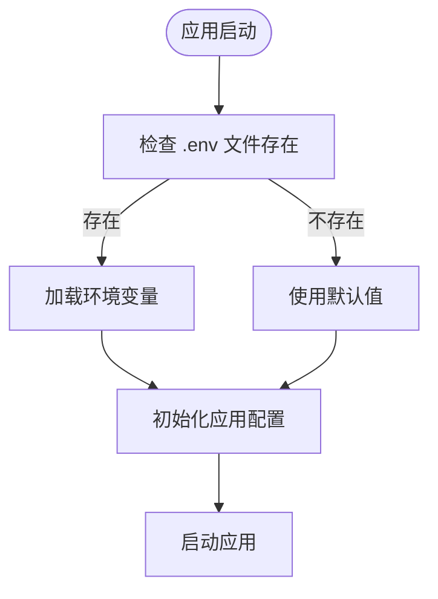

# 环境变量

<cite>
**本文档引用的文件**  
- [.env.example](file://src/backEnd/.env.example)
- [main.py](file://src/backEnd/main.py)
- [app.py](file://src/backEnd/app.py)
- [uvicorn_config.json](file://src/backEnd/uvicorn_config.json)
- [pyproject.toml](file://src/backEnd/pyproject.toml)
- [uv.lock](file://src/backEnd/uv.lock)
</cite>

## 目录
1. [环境变量体系概述](#环境变量体系概述)
2. [.env.example 文件详解](#envexample-文件详解)
3. 环境变量加载机制
4. 不同环境下的配置示例
5. 敏感信息保护策略
6. 常见配置错误排查
7. 最佳实践指南

## 环境变量体系概述

sqlmapWebUI 项目采用基于 Python 的环境变量配置体系，通过 `.env` 文件管理应用的各种配置参数。该系统使用 `python-dotenv` 库来加载环境变量，实现了配置与代码的分离，提高了应用的可移植性和安全性。环境变量体系涵盖了应用配置、安全配置、数据库配置、SQLMap 配置、日志配置和 CORS 配置等多个方面，为应用的灵活部署和安全管理提供了基础支持。

**Section sources**
- [.env.example](file://src/backEnd/.env.example)
- [pyproject.toml](file://src/backEnd/pyproject.toml)
- [uv.lock](file://src/backEnd/uv.lock)

## .env.example 文件详解

`.env.example` 文件是 sqlmapWebUI 项目的环境变量配置模板，包含了所有可配置的环境变量及其默认值。该文件详细说明了每个环境变量的作用、可选值和配置建议，是配置项目环境的基础文档。

### 应用配置

应用配置部分定义了应用的基本运行参数。

- **APP_ENV**: 应用运行环境，可选值为 `development`、`production` 或 `test`。该变量用于区分不同环境下的行为模式。
- **DEBUG**: 应用调试模式开关，可选值为 `true` 或 `false`。在开发环境中通常设置为 `true` 以启用详细的错误信息输出。
- **HOST**: 应用主机地址，默认值为 `0.0.0.0`，表示监听所有网络接口。
- **PORT**: 应用端口，默认值为 `8000`，可根据需要修改为其他可用端口。

### 安全配置

安全配置部分涉及应用的安全相关参数。

- **SECRET_KEY**: JWT 密钥，用于生成和验证 JWT 令牌。建议使用强随机字符串，长度至少为 32 个字符。
- **API_TOKEN**: API 认证令牌，用于保护 API 端点。同样建议使用强随机字符串，并定期轮换。

### 数据库配置

数据库配置部分定义了数据库连接参数。

- **DATABASE_PATH**: 数据库文件路径，使用 SQLite 作为后端数据库。默认值为 `./data/app.db`，可根据需要修改为其他路径。

### SQLMap 配置

SQLMap 配置部分定义了与 SQLMap 工具的集成参数。

- **SQLMAP_API_URL**: SQLMap API 服务地址，默认值为 `http://localhost:8775`。如果 SQLMap 服务运行在其他主机或端口上，需要相应修改此值。
- **SQLMAP_OUTPUT_DIR**: SQLMap 输出目录，默认值为 `./third_lib/sqlmap/output`。该目录用于存储 SQLMap 扫描结果。

### 日志配置

日志配置部分定义了应用的日志记录参数。

- **LOG_LEVEL**: 日志级别，可选值为 `DEBUG`、`INFO`、`WARNING`、`ERROR` 或 `CRITICAL`。根据环境选择合适的日志级别。
- **LOG_FILE**: 日志文件路径，默认值为 `./logs/app.log`。确保该路径具有写入权限。

### CORS 配置

CORS 配置部分定义了跨域资源共享策略。

- **CORS_ORIGINS**: 允许的跨域来源，多个来源用逗号分隔。默认值为 `http://localhost:3000,http://localhost:8080`，可根据前端应用的实际地址进行修改。

**Section sources**
- [.env.example](file://src/backEnd/.env.example)

## 环境变量加载机制

sqlmapWebUI 项目通过 `python-dotenv` 库实现环境变量的加载。在项目启动时，系统会自动读取 `.env` 文件中的环境变量，并将其加载到操作系统环境中。这一过程确保了配置的灵活性和安全性。



**Diagram sources**
- [.env.example](file://src/backEnd/.env.example)
- [main.py](file://src/backEnd/main.py)

**Section sources**
- [.env.example](file://src/backEnd/.env.example)
- [main.py](file://src/backEnd/main.py)

## 不同环境下的配置示例

### 开发环境配置

```env
APP_ENV=development
DEBUG=true
HOST=0.0.0.0
PORT=8000
SECRET_KEY=dev-secret-key-1234567890
API_TOKEN=dev-api-token-1234567890
DATABASE_PATH=./data/dev.db
SQLMAP_API_URL=http://localhost:8775
SQLMAP_OUTPUT_DIR=./third_lib/sqlmap/output
LOG_LEVEL=DEBUG
LOG_FILE=./logs/dev.log
CORS_ORIGINS=http://localhost:3000,http://localhost:8080
```

### 生产环境配置

```env
APP_ENV=production
DEBUG=false
HOST=0.0.0.0
PORT=8000
SECRET_KEY=your-production-secret-key-here
API_TOKEN=your-production-api-token-here
DATABASE_PATH=/var/data/sqlmapwebui/prod.db
SQLMAP_API_URL=http://sqlmap-service:8775
SQLMAP_OUTPUT_DIR=/var/data/sqlmapwebui/output
LOG_LEVEL=INFO
LOG_FILE=/var/log/sqlmapwebui/app.log
CORS_ORIGINS=https://your-frontend-domain.com
```

### 测试环境配置

```env
APP_ENV=test
DEBUG=false
HOST=0.0.0.0
PORT=8000
SECRET_KEY=test-secret-key-1234567890
API_TOKEN=test-api-token-1234567890
DATABASE_PATH=./data/test.db
SQLMAP_API_URL=http://localhost:8775
SQLMAP_OUTPUT_DIR=./third_lib/sqlmap/output/test
LOG_LEVEL=WARNING
LOG_FILE=./logs/test.log
CORS_ORIGINS=http://localhost:3000
```

**Section sources**
- [.env.example](file://src/backEnd/.env.example)

## 敏感信息保护策略

为了保护敏感信息，sqlmapWebUI 项目采取了多项安全措施：

1. **.env 文件排除**: `.env` 文件已被添加到 `.gitignore` 中，防止敏感信息被提交到版本控制系统。
2. **强密钥要求**: 对于 `SECRET_KEY` 和 `API_TOKEN` 等敏感变量，要求使用强随机字符串，并定期轮换。
3. **权限控制**: 确保配置文件和相关目录具有适当的文件系统权限，限制非授权访问。
4. **环境隔离**: 不同环境使用不同的配置文件，避免生产环境的敏感信息泄露到开发或测试环境。

**Section sources**
- [.env.example](file://src/backEnd/.env.example)

## 常见配置错误排查

### 环境变量未生效

**问题**: 修改 `.env` 文件后，应用未使用新的配置值。

**解决方案**: 
1. 确认 `.env` 文件位于正确的目录（`src/backEnd/`）。
2. 检查环境变量名称是否拼写正确。
3. 重启应用以确保新的环境变量被加载。

### 数据库连接失败

**问题**: 应用无法连接到 SQLite 数据库。

**解决方案**:
1. 确认 `DATABASE_PATH` 指定的目录存在且具有写入权限。
2. 检查路径是否正确，特别是相对路径和绝对路径的区别。
3. 确保没有其他进程锁定数据库文件。

### CORS 错误

**问题**: 前端应用无法访问后端 API。

**解决方案**:
1. 检查 `CORS_ORIGINS` 是否包含前端应用的实际地址。
2. 确认前端应用的协议（http/https）和端口与配置匹配。
3. 检查浏览器控制台的详细错误信息。

**Section sources**
- [.env.example](file://src/backEnd/.env.example)
- [app.py](file://src/backEnd/app.py)

## 最佳实践指南

1. **使用强密钥**: 为 `SECRET_KEY` 和 `API_TOKEN` 生成强随机字符串，建议使用密码管理器或专门的密钥生成工具。
2. **定期轮换密钥**: 定期更新敏感密钥，降低密钥泄露的风险。
3. **环境隔离**: 为不同环境维护独立的配置文件，避免配置混淆。
4. **备份配置**: 定期备份重要的配置文件，防止意外丢失。
5. **文档化配置**: 为团队成员提供详细的配置文档，确保配置的一致性和可维护性。

**Section sources**
- [.env.example](file://src/backEnd/.env.example)