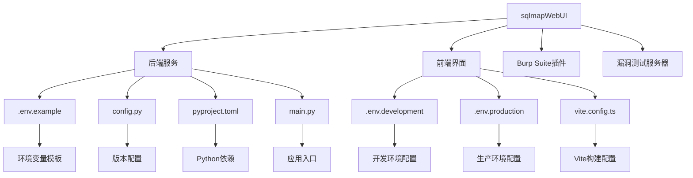

# 环境配置

<cite>
**本文档引用的文件**   
- [.env.example](file://src/backEnd/.env.example)
- [config.py](file://src/backEnd/config.py)
- [pyproject.toml](file://src/backEnd/pyproject.toml)
- [main.py](file://src/backEnd/main.py)
- [app.py](file://src/backEnd/app.py)
- [uvicorn_config.json](file://src/backEnd/uvicorn_config.json)
- [.env.development](file://src/frontEnd/.env.development)
- [.env.production](file://src/frontEnd/.env.production)
- [vite.config.ts](file://src/frontEnd/vite.config.ts)
- [config.ts](file://src/frontEnd/src/stores/config.ts)
</cite>

## 目录
1. [项目结构](#项目结构)
2. [核心环境变量配置](#核心环境变量配置)
3. [后端配置机制](#后端配置机制)
4. [前端环境配置](#前端环境配置)
5. [Python依赖管理](#python依赖管理)
6. [多环境配置最佳实践](#多环境配置最佳实践)

## 项目结构

sqlmapWebUI项目采用前后端分离的架构设计，包含后端API服务、前端UI界面、Burp Suite插件和漏洞测试服务器等多个组件。项目主要结构如下：



**图源**
- [.env.example](file://src/backEnd/.env.example)
- [pyproject.toml](file://src/backEnd/pyproject.toml)
- [.env.development](file://src/frontEnd/.env.development)
- [.env.production](file://src/frontEnd/.env.production)
- [vite.config.ts](file://src/frontEnd/vite.config.ts)

**本节来源**
- [src/backEnd/.env.example](file://src/backEnd/.env.example)
- [src/backEnd/pyproject.toml](file://src/backEnd/pyproject.toml)
- [src/frontEnd/.env.development](file://src/frontEnd/.env.development)
- [src/frontEnd/.env.production](file://src/frontEnd/.env.production)
- [src/frontEnd/vite.config.ts](file://src/frontEnd/vite.config.ts)

## 核心环境变量配置

sqlmapWebUI项目通过环境变量实现多环境配置管理，主要分为后端和前端两部分。

### 后端环境变量

后端环境变量定义在`.env.example`文件中，作为配置模板：

```env
# 应用配置
APP_ENV=development
DEBUG=true
HOST=0.0.0.0
PORT=8000

# 安全配置
SECRET_KEY=your-secret-key-here
API_TOKEN=your-api-token-here

# 数据库配置
DATABASE_PATH=./data/app.db

# SQLMap配置
SQLMAP_API_URL=http://localhost:8775
SQLMAP_OUTPUT_DIR=./third_lib/sqlmap/output

# 日志配置
LOG_LEVEL=INFO
LOG_FILE=./logs/app.log

# CORS配置
CORS_ORIGINS=http://localhost:3000,http://localhost:8080
```

**配置说明：**
- **APP_ENV**: 应用运行环境，可设置为development、production或test
- **DEBUG**: 调试模式开关，开发环境设为true，生产环境设为false
- **SECRET_KEY**: JWT密钥，用于API认证，必须使用强随机字符串
- **DATABASE_PATH**: SQLite数据库文件路径
- **SQLMAP_API_URL**: SQLMap API服务地址
- **CORS_ORIGINS**: 允许的跨域请求来源，多个来源用逗号分隔

### 前端环境变量

前端环境变量分别定义在`.env.development`和`.env.production`文件中：

```env
# 开发环境配置 (.env.development)
VITE_API_BASE_URL=http://localhost:8775/api
VITE_APP_TITLE=SqlmapWebUI - 开发环境
VITE_ENABLE_MOCK=false

# 生产环境配置 (.env.production)
VITE_API_BASE_URL=/api
VITE_APP_TITLE=SqlmapWebUI
VITE_ENABLE_MOCK=false
```

**配置说明：**
- **VITE_API_BASE_URL**: API基础URL，开发环境指向本地API服务，生产环境使用相对路径
- **VITE_APP_TITLE**: 应用标题，用于区分不同环境
- **VITE_ENABLE_MOCK**: 是否启用模拟数据，用于前端独立开发

**本节来源**
- [src/backEnd/.env.example](file://src/backEnd/.env.example)
- [src/frontEnd/.env.development](file://src/frontEnd/.env.development)
- [src/frontEnd/.env.production](file://src/frontEnd/.env.production)

## 后端配置机制

### 配置文件加载

后端配置主要通过`.env`文件和Python代码中的常量实现。项目使用标准的环境变量加载机制：

1. **环境变量加载**: 应用启动时自动读取`.env`文件中的环境变量
2. **默认值设置**: 如果环境变量未设置，则使用代码中定义的默认值
3. **配置验证**: 在应用启动时验证关键配置项的完整性

### 版本配置管理

`config.py`文件中定义了应用版本号：

```python
VERSION = "1.7.9"
```

该版本号在`app.py`中被引用，用于API版本查询：

```python
from config import VERSION

@app.get("/api/version")
def get_version():
    return {
        "code": 200,
        "success": True,
        "message": "success",
        "data": {
            "version": VERSION
        }
    }
```

### 日志配置

日志配置通过`uvicorn_config.json`文件实现：

```json
{
    "version": 1,
    "disable_existing_loggers": false,
    "formatters": {
        "default": {
            "fmt": "[%(asctime)s] [%(levelname)s] [%(module)s] [%(filename)s] [Line: %(lineno)d] %(message)s",
            "datefmt": "%Y-%m-%d %H:%M:%S"
        }
    },
    "handlers": {
        "default": {
            "formatter": "default",
            "class": "logging.StreamHandler",
            "stream": "ext://sys.stderr"
        }
    },
    "loggers": {
        "uvicorn": {
            "handlers": ["default"],
            "level": "INFO"
        }
    }
}
```

**本节来源**
- [src/backEnd/config.py](file://src/backEnd/config.py)
- [src/backEnd/app.py](file://src/backEnd/app.py)
- [src/backEnd/uvicorn_config.json](file://src/backEnd/uvicorn_config.json)
- [src/backEnd/main.py](file://src/backEnd/main.py)

## 前端环境配置

### Vite构建配置

前端使用Vite作为构建工具，`vite.config.ts`文件中定义了开发服务器和代理配置：

```typescript
export default defineConfig({
    server: {
        port: 5173,
        proxy: {
            '/api': {
                target: 'http://localhost:8775',
                changeOrigin: true,
            },
        },
    },
    build: {
        outDir: '../backEnd/static',
        emptyOutDir: true,
    }
})
```

**关键配置：**
- **开发服务器端口**: 5173
- **API代理**: 将`/api`请求代理到后端API服务
- **构建输出**: 输出到后端`static`目录

### 配置状态管理

前端使用Pinia进行状态管理，`config.ts`文件中定义了配置存储：

```typescript
export const useConfigStore = defineStore('config', () => {
    const apiBaseUrl = ref<string>(import.meta.env.VITE_API_BASE_URL || '/api')
    const theme = ref<'light' | 'dark'>((getStorage<'light' | 'dark'>('theme') ?? 'light') as 'light' | 'dark')
    const language = ref<string>((getStorage<string>('language') ?? 'zh-CN') as string)
    const autoRefreshInterval = ref<number>((getStorage<number>('autoRefreshInterval') ?? 15) as number)
    
    // ... 其他配置
})
```

**配置优先级：**
1. 环境变量值
2. localStorage中保存的用户偏好
3. 默认值

**本节来源**
- [src/frontEnd/vite.config.ts](file://src/frontEnd/vite.config.ts)
- [src/frontEnd/src/stores/config.ts](file://src/frontEnd/src/stores/config.ts)
- [src/frontEnd/.env.development](file://src/frontEnd/.env.development)
- [src/frontEnd/.env.production](file://src/frontEnd/.env.production)

## Python依赖管理

### 依赖定义

Python依赖在`pyproject.toml`文件中定义：

```toml
[project]
name = "sqlmapwebui"
version = "0.1.0"
requires-python = ">=3.13"
dependencies = []

[project.optional-dependencies]
thirdparty = [
    "fastapi[standard]",
    "apscheduler",
    "psutil",
]
```

**依赖说明：**
- **FastAPI**: Web框架，包含标准依赖
- **APScheduler**: 任务调度器
- **psutil**: 系统资源监控

### 虚拟环境和依赖安装

项目使用`uv`作为Python包管理工具，安装步骤如下：

```bash
# 进入后端目录
cd src/backEnd

# 同步依赖（包括可选依赖）
uv sync --extra thirdparty

# 运行应用
uv run python main.py
```

### 依赖管理最佳实践

1. **使用虚拟环境**: 避免依赖冲突
2. **锁定依赖版本**: 通过`uv.lock`文件确保环境一致性
3. **区分依赖类型**: 将可选依赖与核心依赖分开管理
4. **定期更新依赖**: 保持安全性和兼容性

**本节来源**
- [src/backEnd/pyproject.toml](file://src/backEnd/pyproject.toml)
- [CLAUDE.md](file://CLAUDE.md)

## 多环境配置最佳实践

### 环境配置策略

#### 1. 环境隔离
- **开发环境**: 启用调试模式，使用本地API服务
- **测试环境**: 关闭调试模式，使用测试API服务
- **生产环境**: 关闭调试模式，优化性能配置

#### 2. 敏感信息保护
- **不提交.env文件**: `.env`文件已添加到`.gitignore`
- **使用强密钥**: SECRET_KEY必须使用强随机字符串
- **环境变量管理**: 敏感信息通过环境变量注入，不硬编码在代码中

#### 3. 配置文件版本控制
- **提交模板文件**: 提交`.env.example`作为配置模板
- **文档化配置**: 在README中详细说明配置项
- **配置验证**: 启动时验证必要配置项

### 环境切换方法

#### 1. 后端环境切换
```bash
# 开发环境
cp .env.example .env
# 编辑.env文件，设置APP_ENV=development

# 生产环境
cp .env.example .env
# 编辑.env文件，设置APP_ENV=production, DEBUG=false
```

#### 2. 前端环境切换
- 开发环境自动使用`.env.development`
- 生产环境自动使用`.env.production`
- 构建时根据NODE_ENV自动选择配置

### 配置验证和调试

#### 1. 健康检查API
```python
@app.get("/api/health")
def health_check():
    current_time = time.time()
    uptime = int(current_time - START_TIME)
    
    return {
        "code": 200,
        "success": True,
        "message": "success",
        "data": {
            "status": "healthy",
            "timestamp": int(current_time * 1000),
            "version": VERSION,
            "uptime": uptime
        }
    }
```

#### 2. 配置检查清单
- [ ] 环境变量文件已创建
- [ ] SECRET_KEY已设置为强随机字符串
- [ ] 数据库路径可写
- [ ] 日志目录已创建
- [ ] CORS配置正确

**本节来源**
- [src/backEnd/.env.example](file://src/backEnd/.env.example)
- [src/backEnd/main.py](file://src/backEnd/main.py)
- [src/backEnd/app.py](file://src/backEnd/app.py)
- [src/frontEnd/.env.development](file://src/frontEnd/.env.development)
- [src/frontEnd/.env.production](file://src/frontEnd/.env.production)