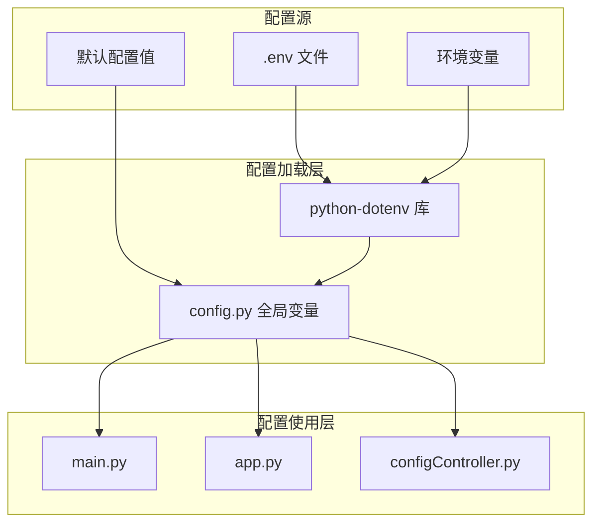
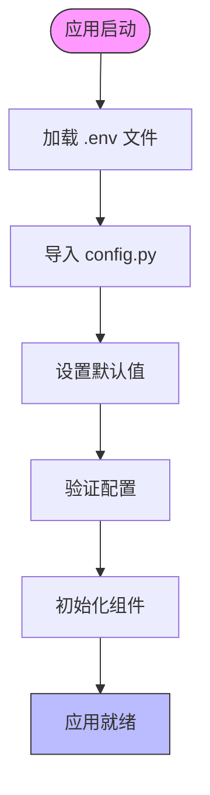

# 配置加载

<cite>
**本文档引用的文件**
- [config.py](file://src/backEnd/config.py)
- [main.py](file://src/backEnd/main.py)
- [app.py](file://src/backEnd/app.py)
- [.env.example](file://src/backEnd/.env.example)
- [configController.py](file://src/backEnd/api/commonApi/configController.py)
- [pyproject.toml](file://src/backEnd/pyproject.toml)
- [uvicorn_config.json](file://src/backEnd/uvicorn_config.json)
- [vulnTestServer/config.py](file://src/vulnTestServer/config.py)
</cite>

## 目录
1. [项目结构](#项目结构)
2. [核心配置机制](#核心配置机制)
3. [配置加载流程](#配置加载流程)
4. [环境变量与默认值](#环境变量与默认值)
5. [配置验证与错误处理](#配置验证与错误处理)
6. [配置热重载与扩展](#配置热重载与扩展)
7. [部署环境优化](#部署环境优化)

## 项目结构

sqlmapWebUI项目的配置系统分布在多个文件和目录中，形成了一个分层的配置管理体系。核心配置位于`src/backEnd`目录下，其中`config.py`文件定义了全局常量和配置，而`.env.example`文件提供了环境变量的模板。配置管理API通过`api/commonApi/configController.py`实现，允许运行时动态修改配置。此外，`pyproject.toml`文件中声明了`python-dotenv`作为依赖，表明项目使用该库来加载环境变量。

**图表来源**
- [.env.example](file://src/backEnd/.env.example)
- [config.py](file://src/backEnd/config.py)
- [pyproject.toml](file://src/backEnd/pyproject.toml)

**本节来源**
- [config.py](file://src/backEnd/config.py)
- [.env.example](file://src/backEnd/.env.example)
- [pyproject.toml](file://src/backEnd/pyproject.toml)

## 核心配置机制

sqlmapWebUI的配置管理系统基于Python的模块级变量和环境变量加载机制，而非Pydantic的Settings模型。系统通过`python-dotenv`库从`.env`文件中加载环境变量，并结合硬编码的默认值来构建完整的配置。`config.py`文件中定义了`MAX_TASKS_COUNT`和`VERSION`等全局常量，这些常量在应用启动时被其他模块导入使用。配置的分组通过模块化的方式实现，不同的配置项被组织在不同的文件中，如数据库配置在`model/Database.py`中，日志配置在`uvicorn_config.json`中。

**本节来源**
- [config.py](file://src/backEnd/config.py)
- [.env.example](file://src/backEnd/.env.example)
- [main.py](file://src/backEnd/main.py)

## 配置加载流程

配置加载流程始于应用启动时的`main.py`文件。首先，系统通过`sys.path`的修改确保能够正确导入项目模块。然后，在`main`函数中，系统初始化日志、数据库连接和调度器。配置的加载主要通过两个途径：一是通过`python-dotenv`自动加载`.env`文件中的环境变量，二是通过`config.py`中的硬编码默认值。当应用需要特定配置时，如SQLMap API的URL或输出目录，它会优先使用环境变量的值，如果不存在则使用默认值。整个加载过程是隐式的，依赖于Python的模块导入机制和`python-dotenv`的自动加载功能。

**图表来源**
- [main.py](file://src/backEnd/main.py)
- [config.py](file://src/backEnd/config.py)
- [.env.example](file://src/backEnd/.env.example)

**本节来源**
- [main.py](file://src/backEnd/main.py)
- [config.py](file://src/backEnd/config.py)

## 环境变量与默认值

项目通过`.env.example`文件定义了所有支持的环境变量及其默认值。这些变量涵盖了应用配置（如`APP_ENV`、`DEBUG`）、安全配置（如`SECRET_KEY`、`API_TOKEN`）、数据库配置（如`DATABASE_PATH`）、SQLMap配置（如`SQLMAP_API_URL`、`SQLMAP_OUTPUT_DIR`）、日志配置（如`LOG_LEVEL`、`LOG_FILE`）和CORS配置（如`CORS_ORIGINS`）。当`.env`文件中的变量未设置时，系统会使用`config.py`中定义的硬编码默认值。例如，`MAX_TASKS_COUNT`的默认值为3，而`VERSION`的值为"1.7.9"。这种设计允许开发者在不同环境中灵活调整配置，同时保证了应用在缺少配置时仍能正常运行。

**本节来源**
- [.env.example](file://src/backEnd/.env.example)
- [config.py](file://src/backEnd/config.py)

## 配置验证与错误处理

sqlmapWebUI的配置验证主要在运行时进行，特别是在配置控制器中。`configController.py`文件中的`set_temp_dir_config`函数在设置临时目录时会进行多项验证：检查目录路径是否为空、尝试创建不存在的目录、验证目录是否可写。如果任何验证失败，函数会返回相应的错误信息和HTTP状态码。例如，如果目录不可写，会返回400 Bad Request状态码。此外，系统在启动时也会进行隐式的配置验证，如数据库连接的初始化。如果配置错误导致组件无法初始化，系统会捕获异常并打印错误信息，但不会阻止应用启动。

**本节来源**
- [configController.py](file://src/backEnd/api/commonApi/configController.py)
- [main.py](file://src/backEnd/main.py)

## 配置热重载与扩展

项目支持部分配置的热重载，主要通过API接口实现。`configController.py`提供了对HTTP请求临时文件目录的动态配置，允许在运行时更改或重置该目录。这通过`/api/config/temp-dir`的GET、POST和POST `/reset`端点实现。对于扩展配置项，开发者可以在`.env`文件中添加新的环境变量，并在`config.py`中定义相应的默认值。然后，在需要使用该配置的模块中导入`config.py`并使用该变量。虽然项目没有提供通用的配置热重载机制，但其模块化的设计使得添加新的配置项和API端点相对简单。

**本节来源**
- [configController.py](file://src/backEnd/api/commonApi/configController.py)
- [config.py](file://src/backEnd/config.py)

## 部署环境优化

在不同部署环境下，可以通过调整环境变量来优化配置。在开发环境中，建议启用调试模式（`DEBUG=true`）并使用内存数据库以加快开发速度。在生产环境中，应关闭调试模式，使用持久化数据库，并设置适当的日志级别（如`LOG_LEVEL=INFO`）。对于高负载环境，可以通过调整`MAX_TASKS_COUNT`来控制并发任务数，避免系统资源耗尽。此外，应通过`CORS_ORIGINS`严格限制允许的跨域来源，提高安全性。在容器化部署中，可以将`.env`文件作为配置卷挂载，实现配置与代码的分离。

**本节来源**
- [.env.example](file://src/backEnd/.env.example)
- [config.py](file://src/backEnd/config.py)
- [uvicorn_config.json](file://src/backEnd/uvicorn_config.json)