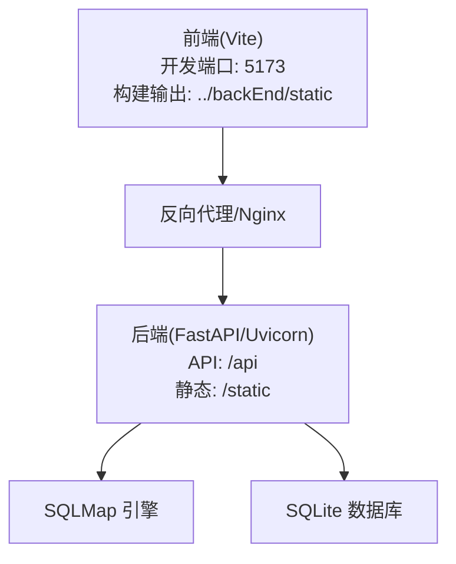
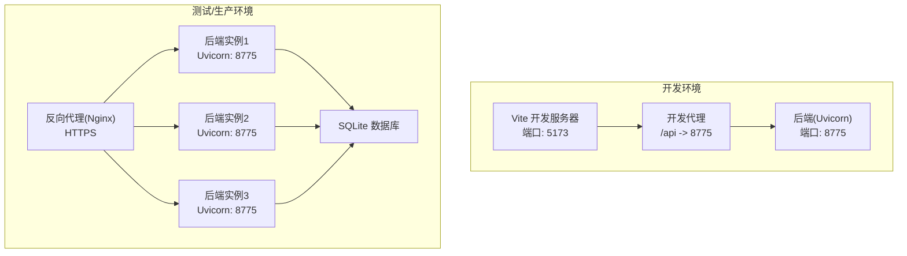
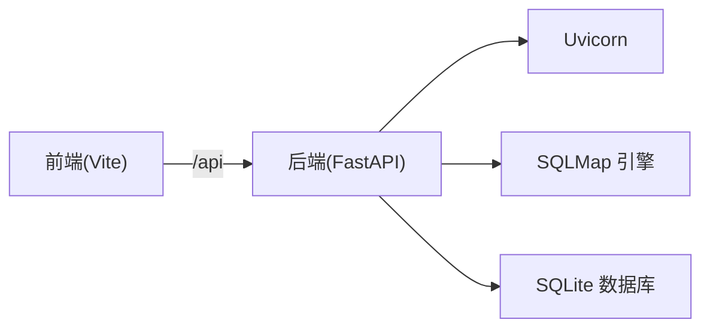

# 部署配置

<cite>
**本文引用的文件**
- [src/backEnd/.env.example](file://src/backEnd/.env.example)
- [src/backEnd/config.py](file://src/backEnd/config.py)
- [src/backEnd/uvicorn_config.json](file://src/backEnd/uvicorn_config.json)
- [src/backEnd/main.py](file://src/backEnd/main.py)
- [src/backEnd/app.py](file://src/backEnd/app.py)
- [src/backEnd/pyproject.toml](file://src/backEnd/pyproject.toml)
- [src/backEnd/README.md](file://src/backEnd/README.md)
- [README.md](file://README.md)
- [src/frontEnd/.env.development](file://src/frontEnd/.env.development)
- [src/frontEnd/.env.production](file://src/frontEnd/.env.production)
- [src/frontEnd/vite.config.ts](file://src/frontEnd/vite.config.ts)
</cite>

## 目录
1. [简介](#简介)
2. [项目结构](#项目结构)
3. [核心组件](#核心组件)
4. [架构总览](#架构总览)
5. [详细组件分析](#详细组件分析)
6. [依赖关系分析](#依赖关系分析)
7. [性能考虑](#性能考虑)
8. [故障排查指南](#故障排查指南)
9. [结论](#结论)
10. [附录](#附录)

## 简介
本文件面向运维与开发团队，提供 sqlmapWebUI 在不同环境（开发、测试、生产）下的完整部署配置说明。重点解析后端配置文件与环境变量，解释 .env.example 的使用方法与最佳实践；深入说明 Uvicorn 服务器配置项（uvicorn_config.json）；给出前后端分离部署、反向代理与负载均衡的推荐架构；并提供配置验证步骤与常见错误排查方法，帮助快速、稳定地交付系统。

## 项目结构
sqlmapWebUI 采用前后端分离架构：
- 后端：FastAPI + Uvicorn，提供 REST API 与静态资源托管，位于 src/backEnd。
- 前端：Vue 3 + Vite，位于 src/frontEnd，构建产物输出至后端 static 目录供 FastAPI 托管。
- 静态资源：后端通过挂载 static 目录提供前端构建产物，统一由后端对外提供服务。

图表来源
- [src/frontEnd/vite.config.ts](file://src/frontEnd/vite.config.ts#L40-L48)
- [src/backEnd/app.py](file://src/backEnd/app.py#L24-L34)
- [src/backEnd/main.py](file://src/backEnd/main.py#L161-L161)

章节来源
- [README.md](file://README.md#L169-L174)
- [src/frontEnd/vite.config.ts](file://src/frontEnd/vite.config.ts#L40-L48)
- [src/backEnd/app.py](file://src/backEnd/app.py#L24-L34)

## 核心组件
- 环境变量与配置文件
  - 后端环境变量模板：src/backEnd/.env.example
  - 后端应用入口：src/backEnd/main.py
  - FastAPI 应用：src/backEnd/app.py
  - Uvicorn 日志配置：src/backEnd/uvicorn_config.json
  - 版本与并发限制：src/backEnd/config.py
  - 包管理与索引：src/backEnd/pyproject.toml
- 前端环境变量
  - 开发环境：src/frontEnd/.env.development
  - 生产环境：src/frontEnd/.env.production
  - 开发代理与构建配置：src/frontEnd/vite.config.ts

章节来源
- [src/backEnd/.env.example](file://src/backEnd/.env.example#L16-L71)
- [src/backEnd/main.py](file://src/backEnd/main.py#L161-L161)
- [src/backEnd/app.py](file://src/backEnd/app.py#L24-L34)
- [src/backEnd/uvicorn_config.json](file://src/backEnd/uvicorn_config.json#L1-L45)
- [src/backEnd/config.py](file://src/backEnd/config.py#L1-L8)
- [src/backEnd/pyproject.toml](file://src/backEnd/pyproject.toml#L1-L17)
- [src/frontEnd/.env.development](file://src/frontEnd/.env.development#L1-L4)
- [src/frontEnd/.env.production](file://src/frontEnd/.env.production#L1-L4)
- [src/frontEnd/vite.config.ts](file://src/frontEnd/vite.config.ts#L40-L48)

## 架构总览
sqlmapWebUI 的部署架构建议如下：
- 开发环境：前端本地开发服务器（Vite），通过代理将 /api 转发到后端 API（默认 8775）。后端直接运行 uvicorn，不暴露公网。
- 测试/生产环境：后端以 Uvicorn 运行，监听 0.0.0.0:8775；通过反向代理（Nginx）对外提供 HTTPS 服务，并将 /api 转发到后端；静态资源由后端统一托管。
- 负载均衡：多实例后端通过反向代理做负载均衡；数据库为 SQLite，适合单实例部署；若需高可用，建议迁移到外部数据库并在上游做读写分离与备份策略。

图表来源
- [src/frontEnd/vite.config.ts](file://src/frontEnd/vite.config.ts#L40-L48)
- [src/backEnd/README.md](file://src/backEnd/README.md#L271-L288)

章节来源
- [src/backEnd/README.md](file://src/backEnd/README.md#L271-L288)

## 详细组件分析

### 后端配置与环境变量
- .env.example 模板
  - 应用配置：运行环境、调试模式、主机与端口
  - 安全配置：JWT 密钥、API 认证令牌
  - 数据库配置：SQLite 路径
  - SQLMap 配置：SQLMap API 地址、输出目录
  - 日志配置：日志级别、日志文件路径
  - CORS 配置：允许的跨域来源
- 使用建议
  - 复制 .env.example 并重命名为 .env，填写真实值，不要提交到版本库
  - 在生产环境务必设置强随机 SECRET_KEY 与 API_TOKEN
  - LOG_LEVEL 建议在生产设为 INFO 或更高，避免泄露敏感信息
  - CORS_ORIGINS 在生产环境应严格限定来源，避免宽泛放行

章节来源
- [src/backEnd/.env.example](file://src/backEnd/.env.example#L16-L71)

### Uvicorn 服务器配置（uvicorn_config.json）
- 日志格式与输出
  - default/access 格式器：统一时间格式与颜色输出
  - handlers：stderr/stdout 分离，便于容器日志采集
- 日志器配置
  - uvicorn、uvicorn.error、uvicorn.access 分别设置级别与传播行为
- 运行方式
  - 开发：main.py 中直接调用 uvicorn.run(host="127.0.0.1", port=8775, log_config=...)，便于本地调试
  - 生产：通过命令行或配置文件启动，建议使用配置文件集中管理

章节来源
- [src/backEnd/uvicorn_config.json](file://src/backEnd/uvicorn_config.json#L1-L45)
- [src/backEnd/main.py](file://src/backEnd/main.py#L161-L161)

### FastAPI 应用与静态资源
- CORS 配置
  - 允许 localhost:5173-5176（前端开发端口）与后端 8775 的跨域请求
  - 生产环境应收紧来源白名单
- 静态资源
  - 挂载 static 目录，前端构建产物输出到此处，统一由后端提供
- 健康检查与版本
  - /api/health 与 /api/version 便于监控与发布追踪

章节来源
- [src/backEnd/app.py](file://src/backEnd/app.py#L24-L34)
- [src/backEnd/app.py](file://src/backEnd/app.py#L45-L80)

### 版本与并发限制
- 版本常量：用于 API 返回与健康检查
- 并发限制：最大任务数与互斥锁，避免资源争用

章节来源
- [src/backEnd/config.py](file://src/backEnd/config.py#L1-L8)

### 包管理与索引
- 项目依赖与可选依赖（FastAPI 标准、调度器、系统工具）
- 使用 uv 包管理器，配置国内镜像源以提升下载速度

章节来源
- [src/backEnd/pyproject.toml](file://src/backEnd/pyproject.toml#L1-L17)

### 前端环境变量与代理
- 开发环境 .env.development
  - VITE_API_BASE_URL 指向后端 API（默认 8775）
  - VITE_APP_TITLE、VITE_ENABLE_MOCK 控制标题与是否启用 Mock
- 生产环境 .env.production
  - VITE_API_BASE_URL 通常设为 /api，由反向代理转发
- Vite 开发代理
  - 将 /api 代理到后端 8775，解决跨域问题
- 构建输出
  - 构建产物输出到 ../backEnd/static，由后端统一托管

章节来源
- [src/frontEnd/.env.development](file://src/frontEnd/.env.development#L1-L4)
- [src/frontEnd/.env.production](file://src/frontEnd/.env.production#L1-L4)
- [src/frontEnd/vite.config.ts](file://src/frontEnd/vite.config.ts#L40-L48)
- [src/frontEnd/vite.config.ts](file://src/frontEnd/vite.config.ts#L56-L72)

## 依赖关系分析
- 后端依赖
  - FastAPI、调度器 APScheduler、系统工具 psutil
  - Uvicorn 日志配置文件
- 前端依赖
  - Vue 3、TypeScript、PrimeVue、Vite、ESBuild 等
- 关键耦合点
  - 前端通过 /api 访问后端，开发阶段由 Vite 代理转发
  - 后端静态资源由 FastAPI 托管，统一对外提供

图表来源
- [src/frontEnd/vite.config.ts](file://src/frontEnd/vite.config.ts#L40-L48)
- [src/backEnd/app.py](file://src/backEnd/app.py#L24-L34)

章节来源
- [src/frontEnd/vite.config.ts](file://src/frontEnd/vite.config.ts#L40-L48)
- [src/backEnd/app.py](file://src/backEnd/app.py#L24-L34)

## 性能考虑
- 日志级别与输出
  - 生产环境建议降低日志冗余，避免磁盘 IO 压力
  - 使用容器日志收集（stdout/stderr）统一采集
- 静态资源
  - 构建时启用 Gzip 压缩与分包策略，减少首屏加载时间
- 并发与任务
  - 合理设置最大任务数，避免 CPU/内存过载
- 反向代理
  - 启用 gzip/keep-alive、合理超时与缓冲区大小
  - 多实例部署时，使用健康检查与自动扩缩容

## 故障排查指南
- 启动失败
  - 检查后端端口占用与权限（默认 8775）
  - 确认 .env 文件存在且变量正确
- CORS 错误
  - 开发环境：确认 Vite 代理已启用并指向 8775
  - 生产环境：核对 CORS_ORIGINS 白名单
- 静态资源 404
  - 确认前端已构建并将产物放入后端 static 目录
- API 500
  - 查看后端日志（uvicorn_config.json 控制的日志级别）
  - 检查数据库文件路径与权限
- 健康检查异常
  - 访问 /api/health，确认返回状态 healthy 与版本号一致

章节来源
- [src/backEnd/app.py](file://src/backEnd/app.py#L45-L80)
- [src/backEnd/uvicorn_config.json](file://src/backEnd/uvicorn_config.json#L1-L45)
- [src/frontEnd/vite.config.ts](file://src/frontEnd/vite.config.ts#L56-L72)

## 结论
通过规范的环境变量管理、严格的 CORS 与日志配置、合理的前后端分离与反向代理部署，sqlmapWebUI 可在开发、测试与生产环境中稳定运行。建议在生产环境收紧安全配置、启用 HTTPS、使用容器化与反向代理，并建立完善的监控与日志采集体系。

## 附录

### 环境配置清单与最佳实践
- 开发环境
  - 后端：直接运行 main.py，默认监听 127.0.0.1:8775
  - 前端：Vite 开发服务器 5173，/api 代理到 8775
  - 日志级别：DEBUG，便于定位问题
- 测试/生产环境
  - 后端：Uvicorn 监听 0.0.0.0:8775，使用 uvicorn_config.json
  - 反向代理：Nginx 转发 /api 到后端，静态资源由后端提供
  - 安全：严格 CORS 白名单、强随机密钥、HTTPS
  - 日志：INFO 或更高，容器日志采集

章节来源
- [src/backEnd/README.md](file://src/backEnd/README.md#L271-L288)
- [src/backEnd/main.py](file://src/backEnd/main.py#L161-L161)
- [src/frontEnd/vite.config.ts](file://src/frontEnd/vite.config.ts#L40-L48)

### 部署流程（建议）
- 准备
  - 复制 .env.example 为 .env，按环境填写变量
  - 前端构建：pnpm run build，产物进入后端 static
- 启动
  - 后端：uv run uvicorn app:app --config uvicorn_config.json
  - 前端：开发阶段使用 Vite，生产阶段由后端托管静态资源
- 验证
  - 访问 /api/health 与 /api/version
  - 前端页面可正常加载并调用 /api

章节来源
- [src/backEnd/README.md](file://src/backEnd/README.md#L271-L288)
- [src/frontEnd/vite.config.ts](file://src/frontEnd/vite.config.ts#L56-L72)