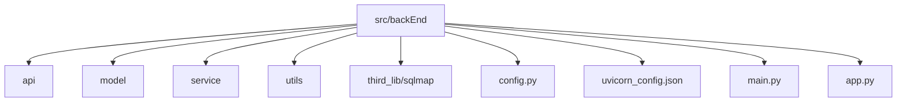

# 部署与配置

<cite>
**本文档中引用的文件**  
- [config.py](file://src/backEnd/config.py)
- [uvicorn_config.json](file://src/backEnd/uvicorn_config.json)
- [main.py](file://src/backEnd/main.py)
- [app.py](file://src/backEnd/app.py)
- [src/stores/config.ts](file://src/frontEnd/src/stores/config.ts)
- [src/views/Config/index.vue](file://src/frontEnd/src/views/Config/index.vue)
- [src/views/TaskList/index.vue](file://src/frontEnd/src/views/TaskList/index.vue)
- [src/utils/useSmartPolling.ts](file://src/frontEnd/src/utils/useSmartPolling.ts)
</cite>

## 更新摘要
**变更内容**  
- 更新了自动刷新间隔滑块的交互逻辑和视觉设计
- 实现了平滑拖动体验和实时值更新
- 添加了滑块轨道渐变色和手柄动态颜色
- 优化了刻度尺样式和z-index层级
- 更新了相关代码示例和配置说明

## 目录
1. [简介](#简介)
2. [项目结构](#项目结构)
3. [核心配置文件分析](#核心配置文件分析)
4. [服务器配置与日志管理](#服务器配置与日志管理)
5. [部署模式与启动流程](#部署模式与启动流程)
6. [环境变量与配置加载机制](#环境变量与配置加载机制)
7. [性能调优与资源限制](#性能调优与资源限制)
8. [高可用性与监控策略](#高可用性与监控策略)
9. [Docker与Kubernetes部署指南](#docker与kubernetes部署指南)
10. [传统服务器部署步骤](#传统服务器部署步骤)
11. [前端配置管理](#前端配置管理)

## 简介
本指南详细说明了sqlmapWebUI系统的部署与配置方法。文档涵盖环境变量配置、配置文件参数含义、ASGI服务器高级配置、多环境部署差异、容器化部署方案以及运维监控策略。重点分析了`config.py`中的核心配置选项和`uvicorn_config.json`中的日志配置，为开发、测试和生产环境提供最佳实践建议。新增了前端配置管理功能，包括自动刷新间隔设置和配置页面布局优化。

## 项目结构
项目采用分层架构设计，主要包含后端API服务、模型层、服务层和第三方依赖库。核心配置文件位于项目根目录，包括`config.py`用于应用级配置，`uvicorn_config.json`用于ASGI服务器配置。系统基于FastAPI框架构建，通过Uvicorn作为ASGI服务器运行。



**Diagram sources**  
- [config.py](file://src/backEnd/config.py)
- [uvicorn_config.json](file://src/backEnd/uvicorn_config.json)

**Section sources**  
- [config.py](file://src/backEnd/config.py)
- [uvicorn_config.json](file://src/backEnd/uvicorn_config.json)

## 核心配置文件分析
`config.py`文件定义了系统的核心配置参数，包括最大任务数和版本信息。`MAX_TASKS_COUNT`限制了并发执行的任务数量，防止系统资源过载。`VERSION`常量用于标识当前应用版本，便于版本管理和API响应。

```python
MAX_TASKS_COUNT = 3
VERSION = "0.0.1"
```

该配置通过线程锁`MAX_TASKS_COUNT_LOCK`确保在多线程环境下的安全性。这些配置在`main.py`中被导入并用于初始化系统状态。

**Section sources**  
- [config.py](file://src/backEnd/config.py#L1-L8)

## 服务器配置与日志管理
`uvicorn_config.json`文件定义了Uvicorn服务器的详细日志配置。配置采用标准JSON格式，包含格式化器、处理器和日志记录器三个主要部分。日志格式包含时间戳、日志级别、模块名、文件名、行号和消息内容，便于问题追踪和调试。

```json
{
    "formatters": {
        "default": {
            "fmt": "[%(asctime)s] [%(levelname)s] [%(module)s] [%(filename)s] [Line: %(lineno)d] %(message)s"
        },
        "access": {
            "fmt": "[%(asctime)s] [%(levelname)s] [%(module)s] [%(filename)s] [Line: %(lineno)d] %(message)s"
        }
    },
    "handlers": {
        "default": {
            "class": "logging.StreamHandler",
            "stream": "ext://sys.stderr"
        },
        "access": {
            "class": "logging.StreamHandler",
            "stream": "ext://sys.stdout"
        }
    },
    "loggers": {
        "uvicorn": {
            "handlers": ["default"],
            "level": "INFO",
            "propagate": false
        },
        "uvicorn.access": {
            "handlers": ["access"],
            "level": "INFO",
            "propagate": false
        }
    }
}
```

错误日志输出到标准错误流，访问日志输出到标准输出流，便于日志收集系统的分离处理。

**Section sources**  
- [uvicorn_config.json](file://src/backEnd/uvicorn_config.json#L1-L45)

## 部署模式与启动流程
系统通过`main.py`文件启动，该文件负责配置Python模块路径、初始化日志系统、设置临时数据库文件并启动Uvicorn服务器。启动流程包括：
1. 配置sqlmap库的导入路径
2. 初始化日志格式化器
3. 生成管理员令牌
4. 创建临时数据库文件
5. 启动任务监控调度器
6. 运行Uvicorn服务器

服务器默认绑定到`127.0.0.1:8775`，禁用自动重载功能，使用`uvicorn_config.json`中的日志配置。`app.py`文件定义了FastAPI应用实例，配置了静态文件服务和CORS中间件，允许特定来源的跨域请求。

**Section sources**  
- [main.py](file://src/backEnd/main.py#L1-L156)
- [app.py](file://src/backEnd/app.py#L1-L45)

## 环境变量与配置加载机制
系统支持通过环境变量覆盖默认配置。虽然当前代码中未直接实现环境变量加载，但遵循了标准的Python配置管理实践。配置加载顺序为：
1. 默认配置（硬编码值）
2. 配置文件（config.py）
3. 环境变量（运行时覆盖）

这种分层配置机制允许在不同环境中灵活调整参数，而无需修改代码。例如，可以通过设置环境变量来更改最大任务数或服务器端口。

**Section sources**  
- [config.py](file://src/backEnd/config.py#L1-L8)
- [main.py](file://src/backEnd/main.py#L1-L156)

## 性能调优与资源限制
系统通过`MAX_TASKS_COUNT`参数控制并发任务数量，防止过多任务导致资源耗尽。建议根据服务器硬件配置调整此值：
- 开发环境：设置为3-5，便于调试
- 测试环境：设置为10-20，模拟生产负载
- 生产环境：根据CPU核心数和内存大小动态调整，通常为CPU核心数的1-2倍

日志级别设置为INFO，平衡了调试信息和性能开销。对于高负载生产环境，可考虑将日志级别调整为WARNING以减少I/O压力。

**Section sources**  
- [config.py](file://src/backEnd/config.py#L1-L8)
- [uvicorn_config.json](file://src/backEnd/uvicorn_config.json#L1-L45)

## 高可用性与监控策略
系统内置任务监控功能，通过APScheduler调度器每3秒执行一次监控任务。建议的监控指标包括：
- 任务队列长度
- 并发任务数
- API响应时间
- 错误率
- 资源使用率（CPU、内存）

日志配置已优化，包含详细的上下文信息，便于故障排查。建议将日志集成到集中式日志系统（如ELK或Graylog）进行统一管理和分析。

**Section sources**  
- [main.py](file://src/backEnd/main.py#L1-L156)
- [uvicorn_config.json](file://src/backEnd/uvicorn_config.json#L1-L45)

## Docker与Kubernetes部署指南
### Docker部署
创建Dockerfile：
```dockerfile
FROM python:3.9-slim
WORKDIR /app
COPY src/backEnd /app
RUN pip install -r requirements.txt
EXPOSE 8775
CMD ["python", "main.py"]
```

构建并运行容器：
```bash
docker build -t sqlmap-webui .
docker run -p 8775:8775 sqlmap-webui
```

### Kubernetes部署
创建Deployment和Service：
```yaml
apiVersion: apps/v1
kind: Deployment
metadata:
  name: sqlmap-webui
spec:
  replicas: 2
  selector:
    matchLabels:
      app: sqlmap-webui
  template:
    metadata:
      labels:
        app: sqlmap-webui
    spec:
      containers:
      - name: sqlmap-webui
        image: sqlmap-webui:latest
        ports:
        - containerPort: 8775
        resources:
          limits:
            cpu: "1"
            memory: "1Gi"
---
apiVersion: v1
kind: Service
metadata:
  name: sqlmap-webui
spec:
  selector:
    app: sqlmap-webui
  ports:
    - protocol: TCP
      port: 80
      targetPort: 8775
  type: LoadBalancer
```

**Section sources**  
- [main.py](file://src/backEnd/main.py#L1-L156)
- [config.py](file://src/backEnd/config.py#L1-L8)

## 传统服务器部署步骤
1. 安装Python 3.9+和pip
2. 克隆项目代码库
3. 创建虚拟环境并安装依赖：
   ```bash
   python -m venv .venv
   source .venv/bin/activate
   pip install -r requirements.txt
   ```
4. 配置环境变量（可选）
5. 启动应用：
   ```bash
   python main.py
   ```
6. 配置反向代理（如Nginx）和进程管理器（如Supervisor或systemd）
7. 设置防火墙规则，开放8775端口
8. 配置日志轮转和监控告警

**Section sources**  
- [main.py](file://src/backEnd/main.py#L1-L156)
- [app.py](file://src/backEnd/app.py#L1-L45)

## 前端配置管理
### 自动刷新间隔配置
系统新增了自动刷新间隔配置功能，允许用户自定义任务列表页面的轮询间隔。该功能通过Pinia状态管理实现，配置值持久化存储在浏览器本地。

**配置参数：**
- **名称**: `autoRefreshInterval`
- **类型**: `number`
- **默认值**: `15`分钟
- **取值范围**: `5-60`分钟
- **存储位置**: 浏览器localStorage

```typescript
// src/stores/config.ts
const autoRefreshInterval = ref<number>((getStorage<number>('autoRefreshInterval') ?? 15) as number)

function updateAutoRefreshInterval(interval: number): void {
  // 限制在5-60分钟范围内
  autoRefreshInterval.value = Math.max(5, Math.min(60, interval))
  setStorage('autoRefreshInterval', autoRefreshInterval.value)
}
```

### 配置页面布局
配置页面UI已重构，宽度占满主内容区域，表单宽度扩大以适应更多配置项。页面采用卡片式设计，包含数据刷新设置等配置模块。

```vue
<!-- src/views/Config/index.vue -->
<template>
  <div class="config-page">
    <Card>
      <template #title>配置管理</template>
      <template #content>
        <div class="config-section">
          <h3>数据刷新设置</h3>
          <div class="field">
            <label>自动刷新间隔 ({{ configStore.autoRefreshInterval }} 分钟)</label>
            <div class="slider-container" :style="{ '--handle-color': handleColor }">
              <Slider 
                v-model="sliderDisplayValue" 
                :min="5" 
                :max="60" 
                :step="1"
                @slideend="handleSliderEnd"
                class="refresh-slider"
              />
              <!-- 刻度尺标记 -->
              <div class="slider-ruler">
                <div 
                  v-for="n in 12" 
                  :key="n" 
                  class="ruler-mark"
                  :class="{
                    'major': n * 5 === 5 || n * 5 === 15 || n * 5 === 30 || n * 5 === 60,
                    'active': configStore.autoRefreshInterval === n * 5
                  }"
                  :style="{ left: `calc(${((n * 5 - 5) / 55) * 100}%)` }"
                >
                  <div class="mark-line"></div>
                  <div 
                    v-if="n * 5 === 5 || n * 5 === 15 || n * 5 === 30 || n * 5 === 60" 
                    class="mark-label"
                  >
                    {{ n * 5 }}
                  </div>
                </div>
              </div>
            </div>
            <small class="field-help">
              设置任务列表页面的自动刷新间隔，范围为5-60分钟，每5分钟一个间隔
            </small>
          </div>
        </div>
      </template>
    </Card>
  </div>
</template>
```

### 交互逻辑与视觉设计
更新了配置界面中自动刷新间隔滑块的交互逻辑和视觉设计，实现了更流畅的用户体验。

**平滑拖动体验**：
- 滑块显示值以1分钟为步长实时更新
- 释放后自动吸附到最近的5分钟刻度
- 实现平滑吸附动画效果

```typescript
// src/views/Config/index.vue
function handleSliderEnd() {
  const currentValue = sliderDisplayValue.value
  // 计算最近的刻度值（5的倍数）
  const snappedValue = Math.round(currentValue / 5) * 5
  // 确保在范围内
  const finalValue = Math.max(5, Math.min(60, snappedValue))
  
  // 平滑吸附动画
  sliderDisplayValue.value = finalValue
  
  // 更新store
  if (finalValue !== configStore.autoRefreshInterval) {
    configStore.updateAutoRefreshInterval(finalValue)
  }
}
```

**视觉设计**：
- 滑块轨道采用红-橙-黄-绿渐变色，直观显示刷新频率对系统资源的影响
- 滑块手柄颜色根据当前位置动态变化，提供实时视觉反馈
- 优化了刻度尺样式，调整了z-index确保滑块在刻度上方

```scss
// src/views/Config/index.vue
:deep(.p-slider) {
  // 整个轨道始终显示完整的红-黄-绿渐变
  background:
    linear-gradient(90deg, 
      #ef4444 0%,      // 红色（5分钟）
      #f97316 15%,     // 橙色
      #fbbf24 35%,     // 黄色
      #84cc16 55%,     // 黄绿
      #22c55e 100%     // 绿色（60分钟）
    );
  border-radius: $border-radius-full;
  height: 12px;
  border: 2px solid rgba(255, 255, 255, 0.4);
  box-shadow:
    inset 0 1px 2px rgba(255, 255, 255, 0.3),
    inset 0 -1px 2px rgba(0, 0, 0, 0.1),
    0 2px 8px rgba(0, 0, 0, 0.15);
  position: relative;
  z-index: 10; // 确保滑块在刻度尺上方

  .p-slider-handle {
    background: var(--handle-color, #ef4444); // 使用动态颜色
    border: 3px solid white;
    border-radius: $border-radius-full;
    width: 32px;
    height: 32px;
    margin-top: -10px;
    margin-left: -16px;
    box-shadow:
      0 4px 12px rgba(0, 0, 0, 0.25),
      0 4px 16px var(--handle-color, rgba(99, 102, 241, 0.3)),
      inset 0 1px 2px rgba(255, 255, 255, 0.4);
    cursor: grab;
    z-index: 20;
    position: relative;
    transition: box-shadow 0.15s ease, transform 0.15s ease;
  }
}

// 根据滑块位置计算游标颜色（红-黄-绿渐变）
const handleColor = computed(() => {
  const value = sliderDisplayValue.value
  const min = 5
  const max = 60
  const percent = (value - min) / (max - min) // 0-1
  
  // 颜色节点: 红(0%) -> 橙(15%) -> 黄(35%) -> 黄绿(55%) -> 绿(100%)
  if (percent <= 0.15) {
    const t = percent / 0.15
    return interpolateColor('#ef4444', '#f97316', t)
  } else if (percent <= 0.35) {
    const t = (percent - 0.15) / 0.20
    return interpolateColor('#f97316', '#fbbf24', t)
  } else if (percent <= 0.55) {
    const t = (percent - 0.35) / 0.20
    return interpolateColor('#fbbf24', '#84cc16', t)
  } else {
    const t = (percent - 0.55) / 0.45
    return interpolateColor('#84cc16', '#22c55e', t)
  }
})
```

**刻度尺优化**：
- 采用动态渐变色显示，从红色（5分钟）到绿色（60分钟）
- 主要刻度（5、15、30、60）更粗更高，便于识别
- 激活状态和hover效果增强，提供更好的交互反馈
- z-index调整确保滑块在刻度上方，避免遮挡

```scss
// src/views/Config/index.vue
.slider-ruler {
  position: relative;
  width: 100%;
  height: 40px;
  margin-top: 12px;
  overflow: visible;
  z-index: 1; // 确保刻度尺在滑块下方，不遮挡游标
  pointer-events: none; // 禁止刻度尺拦截鼠标事件

  .ruler-mark {
    position: absolute;
    transform: translateX(-50%);
    display: flex;
    flex-direction: column;
    align-items: center;
    transition: all 0.3s cubic-bezier(0.4, 0, 0.2, 1);

    .mark-line {
      width: 2px;
      height: 12px;
      border-radius: 1px;
      box-shadow: 0 1px 2px rgba(0, 0, 0, 0.1);
      transition: all 0.3s cubic-bezier(0.4, 0, 0.2, 1);
    }

    // 根据位置动态生成颜色 - 始终显示红色到绿色渐变
    &:nth-child(1) .mark-line { background: #ef4444; box-shadow: 0 2px 4px rgba(239, 68, 68, 0.4); }
    &:nth-child(2) .mark-line { background: #f97316; box-shadow: 0 2px 4px rgba(249, 115, 22, 0.4); }
    &:nth-child(3) .mark-line { background: #fb923c; box-shadow: 0 2px 4px rgba(251, 146, 60, 0.4); }
    &:nth-child(4) .mark-line { background: #fbbf24; box-shadow: 0 2px 4px rgba(251, 191, 36, 0.4); }
    &:nth-child(5) .mark-line { background: #facc15; box-shadow: 0 2px 4px rgba(250, 204, 21, 0.4); }
    &:nth-child(6) .mark-line { background: #eab308; box-shadow: 0 2px 4px rgba(234, 179, 8, 0.4); }
    &:nth-child(7) .mark-line { background: #a3e635; box-shadow: 0 2px 4px rgba(163, 230, 53, 0.4); }
    &:nth-child(8) .mark-line { background: #84cc16; box-shadow: 0 2px 4px rgba(132, 204, 22, 0.4); }
    &:nth-child(9) .mark-line { background: #65a30d; box-shadow: 0 2px 4px rgba(101, 163, 13, 0.4); }
    &:nth-child(10) .mark-line { background: #4ade80; box-shadow: 0 2px 4px rgba(74, 222, 128, 0.4); }
    &:nth-child(11) .mark-line { background: #34d399; box-shadow: 0 2px 4px rgba(52, 211, 153, 0.4); }
    &:nth-child(12) .mark-line { background: #22c55e; box-shadow: 0 2px 4px rgba(34, 197, 94, 0.4); }

    // 标签颜色也跟随渐变
    &:nth-child(1) .mark-label, &:nth-child(2) .mark-label { color: #dc2626; }
    &:nth-child(3) .mark-label, &:nth-child(4) .mark-label, &:nth-child(5) .mark-label, &:nth-child(6) .mark-label { color: #d97706; }
    &:nth-child(7) .mark-label, &:nth-child(8) .mark-label, &:nth-child(9) .mark-label, &:nth-child(10) .mark-label, &:nth-child(11) .mark-label, &:nth-child(12) .mark-label { color: #16a34a; }

    .mark-label {
      margin-top: 8px;
      font-size: 13px;
      font-weight: 600;
      color: $text-color-secondary;
      text-shadow: 0 1px 2px rgba(255, 255, 255, 0.8);
      padding: 4px 10px;
      background: linear-gradient(135deg, rgba(255, 255, 255, 0.9) 0%, rgba(248, 250, 252, 0.7) 100%);
      border-radius: 6px;
      border: 1px solid rgba(148, 163, 184, 0.2);
      box-shadow: 
        0 2px 4px rgba(0, 0, 0, 0.08),
        inset 0 1px 2px rgba(255, 255, 255, 0.6);
      transition: all 0.3s cubic-bezier(0.4, 0, 0.2, 1);
    }

    // 主要刻度（5、15、30、60）- 更高更粗
    &.major {
      .mark-line {
        height: 20px;
        width: 4px;
      }

      .mark-label {
        font-size: 14px;
        font-weight: 700;
      }
    }

    // 激活状态 - 保持原有颜色，只增强尺寸和发光
    &.active {
      .mark-line {
        height: 24px;
        width: 5px;
        transform: scaleY(1.1);
        filter: brightness(1.2);
        box-shadow: 
          0 4px 8px currentColor,
          0 0 16px currentColor;
      }

      .mark-label {
        transform: translateY(-2px) scale(1.1);
        font-weight: 800;
        box-shadow: 
          0 4px 12px rgba(0, 0, 0, 0.2);
      }
    }

    // hover效果 - 保持原有颜色，只增加尺寸
    &:hover {
      .mark-line {
        transform: scaleY(1.2);
        filter: brightness(1.1);
      }

      .mark-label {
        transform: translateY(-2px) scale(1.05);
        box-shadow: 
          0 4px 8px rgba(0, 0, 0, 0.12),
          inset 0 1px 2px rgba(255, 255, 255, 0.7);
      }
    }
  }
}
```

### 任务列表轮询机制
任务列表页面使用智能轮询机制，根据配置的刷新间隔自动获取最新任务数据。当有运行中的任务时，系统会持续轮询；当所有任务完成后，轮询会自动停止。

```typescript
// src/views/TaskList/index.vue
const getPollingInterval = () => configStore.autoRefreshInterval * 60 * 1000

function startPolling() {
  if (pollingTimer) return
  
  pollingTimer = window.setInterval(async () => {
    try {
      await taskStore.fetchTaskList()
    } catch (error) {
      console.error('Polling error:', error)
    }
  }, getPollingInterval())
}
```

**Section sources**  
- [src/stores/config.ts](file://src/frontEnd/src/stores/config.ts#L8-L72)
- [src/views/Config/index.vue](file://src/frontEnd/src/views/Config/index.vue#L0-L588)
- [src/views/TaskList/index.vue](file://src/frontEnd/src/views/TaskList/index.vue#L0-L771)
- [src/utils/useSmartPolling.ts](file://src/frontEnd/src/utils/useSmartPolling.ts#L20-L201)