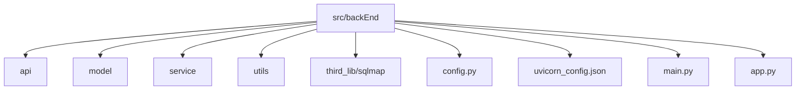

# 部署与配置

<cite>
**本文档中引用的文件**  
- [config.py](file://src/backEnd/config.py)
- [uvicorn_config.json](file://src/backEnd/uvicorn_config.json)
- [main.py](file://src/backEnd/main.py)
- [app.py](file://src/backEnd/app.py)
- [src/stores/config.ts](file://src/frontEnd/src/stores/config.ts) - *新增自动刷新间隔配置*
- [src/views/Config/index.vue](file://src/frontEnd/src/views/Config/index.vue) - *更新配置页面布局和功能*
</cite>

## 更新摘要
**变更内容**  
- 新增了自动刷新间隔配置功能及其相关文档
- 更新了配置页面的布局和宽度说明
- 增加了前端配置状态管理的详细说明
- 更新了任务列表轮询机制的实现细节
- 添加了新的文件引用和源码链接

## 目录
1. [简介](#简介)
2. [项目结构](#项目结构)
3. [核心配置文件分析](#核心配置文件分析)
4. [服务器配置与日志管理](#服务器配置与日志管理)
5. [部署模式与启动流程](#部署模式与启动流程)
6. [环境变量与配置加载机制](#环境变量与配置加载机制)
7. [性能调优与资源限制](#性能调优与资源限制)
8. [高可用性与监控策略](#高可用性与监控策略)
9. [Docker与Kubernetes部署指南](#docker与kubernetes部署指南)
10. [传统服务器部署步骤](#传统服务器部署步骤)
11. [前端配置管理](#前端配置管理)

## 简介
本指南详细说明了sqlmapWebUI系统的部署与配置方法。文档涵盖环境变量配置、配置文件参数含义、ASGI服务器高级配置、多环境部署差异、容器化部署方案以及运维监控策略。重点分析了`config.py`中的核心配置选项和`uvicorn_config.json`中的日志配置，为开发、测试和生产环境提供最佳实践建议。新增了前端配置管理功能，包括自动刷新间隔设置和配置页面布局优化。

## 项目结构
项目采用分层架构设计，主要包含后端API服务、模型层、服务层和第三方依赖库。核心配置文件位于项目根目录，包括`config.py`用于应用级配置，`uvicorn_config.json`用于ASGI服务器配置。系统基于FastAPI框架构建，通过Uvicorn作为ASGI服务器运行。



**Diagram sources**  
- [config.py](file://src/backEnd/config.py)
- [uvicorn_config.json](file://src/backEnd/uvicorn_config.json)

**Section sources**  
- [config.py](file://src/backEnd/config.py)
- [uvicorn_config.json](file://src/backEnd/uvicorn_config.json)

## 核心配置文件分析
`config.py`文件定义了系统的核心配置参数，包括最大任务数和版本信息。`MAX_TASKS_COUNT`限制了并发执行的任务数量，防止系统资源过载。`VERSION`常量用于标识当前应用版本，便于版本管理和API响应。

```python
MAX_TASKS_COUNT = 3
VERSION = "0.0.1"
```

该配置通过线程锁`MAX_TASKS_COUNT_LOCK`确保在多线程环境下的安全性。这些配置在`main.py`中被导入并用于初始化系统状态。

**Section sources**  
- [config.py](file://src/backEnd/config.py#L1-L8)

## 服务器配置与日志管理
`uvicorn_config.json`文件定义了Uvicorn服务器的详细日志配置。配置采用标准JSON格式，包含格式化器、处理器和日志记录器三个主要部分。日志格式包含时间戳、日志级别、模块名、文件名、行号和消息内容，便于问题追踪和调试。

```json
{
    "formatters": {
        "default": {
            "fmt": "[%(asctime)s] [%(levelname)s] [%(module)s] [%(filename)s] [Line: %(lineno)d] %(message)s"
        },
        "access": {
            "fmt": "[%(asctime)s] [%(levelname)s] [%(module)s] [%(filename)s] [Line: %(lineno)d] %(message)s"
        }
    },
    "handlers": {
        "default": {
            "class": "logging.StreamHandler",
            "stream": "ext://sys.stderr"
        },
        "access": {
            "class": "logging.StreamHandler",
            "stream": "ext://sys.stdout"
        }
    },
    "loggers": {
        "uvicorn": {
            "handlers": ["default"],
            "level": "INFO",
            "propagate": false
        },
        "uvicorn.access": {
            "handlers": ["access"],
            "level": "INFO",
            "propagate": false
        }
    }
}
```

错误日志输出到标准错误流，访问日志输出到标准输出流，便于日志收集系统的分离处理。

**Section sources**  
- [uvicorn_config.json](file://src/backEnd/uvicorn_config.json#L1-L45)

## 部署模式与启动流程
系统通过`main.py`文件启动，该文件负责配置Python模块路径、初始化日志系统、设置临时数据库文件并启动Uvicorn服务器。启动流程包括：
1. 配置sqlmap库的导入路径
2. 初始化日志格式化器
3. 生成管理员令牌
4. 创建临时数据库文件
5. 启动任务监控调度器
6. 运行Uvicorn服务器

服务器默认绑定到`127.0.0.1:8775`，禁用自动重载功能，使用`uvicorn_config.json`中的日志配置。`app.py`文件定义了FastAPI应用实例，配置了静态文件服务和CORS中间件，允许特定来源的跨域请求。

**Section sources**  
- [main.py](file://src/backEnd/main.py#L1-L156)
- [app.py](file://src/backEnd/app.py#L1-L45)

## 环境变量与配置加载机制
系统支持通过环境变量覆盖默认配置。虽然当前代码中未直接实现环境变量加载，但遵循了标准的Python配置管理实践。配置加载顺序为：
1. 默认配置（硬编码值）
2. 配置文件（config.py）
3. 环境变量（运行时覆盖）

这种分层配置机制允许在不同环境中灵活调整参数，而无需修改代码。例如，可以通过设置环境变量来更改最大任务数或服务器端口。

**Section sources**  
- [config.py](file://src/backEnd/config.py#L1-L8)
- [main.py](file://src/backEnd/main.py#L1-L156)

## 性能调优与资源限制
系统通过`MAX_TASKS_COUNT`参数控制并发任务数量，防止过多任务导致资源耗尽。建议根据服务器硬件配置调整此值：
- 开发环境：设置为3-5，便于调试
- 测试环境：设置为10-20，模拟生产负载
- 生产环境：根据CPU核心数和内存大小动态调整，通常为CPU核心数的1-2倍

日志级别设置为INFO，平衡了调试信息和性能开销。对于高负载生产环境，可考虑将日志级别调整为WARNING以减少I/O压力。

**Section sources**  
- [config.py](file://src/backEnd/config.py#L1-L8)
- [uvicorn_config.json](file://src/backEnd/uvicorn_config.json#L1-L45)

## 高可用性与监控策略
系统内置任务监控功能，通过APScheduler调度器每3秒执行一次监控任务。建议的监控指标包括：
- 任务队列长度
- 并发任务数
- API响应时间
- 错误率
- 资源使用率（CPU、内存）

日志配置已优化，包含详细的上下文信息，便于故障排查。建议将日志集成到集中式日志系统（如ELK或Graylog）进行统一管理和分析。

**Section sources**  
- [main.py](file://src/backEnd/main.py#L1-L156)
- [uvicorn_config.json](file://src/backEnd/uvicorn_config.json#L1-L45)

## Docker与Kubernetes部署指南
### Docker部署
创建Dockerfile：
```dockerfile
FROM python:3.9-slim
WORKDIR /app
COPY src/backEnd /app
RUN pip install -r requirements.txt
EXPOSE 8775
CMD ["python", "main.py"]
```

构建并运行容器：
```bash
docker build -t sqlmap-webui .
docker run -p 8775:8775 sqlmap-webui
```

### Kubernetes部署
创建Deployment和Service：
```yaml
apiVersion: apps/v1
kind: Deployment
metadata:
  name: sqlmap-webui
spec:
  replicas: 2
  selector:
    matchLabels:
      app: sqlmap-webui
  template:
    metadata:
      labels:
        app: sqlmap-webui
    spec:
      containers:
      - name: sqlmap-webui
        image: sqlmap-webui:latest
        ports:
        - containerPort: 8775
        resources:
          limits:
            cpu: "1"
            memory: "1Gi"
---
apiVersion: v1
kind: Service
metadata:
  name: sqlmap-webui
spec:
  selector:
    app: sqlmap-webui
  ports:
    - protocol: TCP
      port: 80
      targetPort: 8775
  type: LoadBalancer
```

**Section sources**  
- [main.py](file://src/backEnd/main.py#L1-L156)
- [config.py](file://src/backEnd/config.py#L1-L8)

## 传统服务器部署步骤
1. 安装Python 3.9+和pip
2. 克隆项目代码库
3. 创建虚拟环境并安装依赖：
   ```bash
   python -m venv .venv
   source .venv/bin/activate
   pip install -r requirements.txt
   ```
4. 配置环境变量（可选）
5. 启动应用：
   ```bash
   python main.py
   ```
6. 配置反向代理（如Nginx）和进程管理器（如Supervisor或systemd）
7. 设置防火墙规则，开放8775端口
8. 配置日志轮转和监控告警

**Section sources**  
- [main.py](file://src/backEnd/main.py#L1-L156)
- [app.py](file://src/backEnd/app.py#L1-L45)

## 前端配置管理
### 自动刷新间隔配置
系统新增了自动刷新间隔配置功能，允许用户自定义任务列表页面的轮询间隔。该功能通过Pinia状态管理实现，配置值持久化存储在浏览器本地。

**配置参数：**
- **名称**: `autoRefreshInterval`
- **类型**: `number`
- **默认值**: `15`分钟
- **取值范围**: `5-60`分钟
- **存储位置**: 浏览器localStorage

```typescript
// src/stores/config.ts
const autoRefreshInterval = ref<number>((getStorage<number>('autoRefreshInterval') ?? 15) as number)

function updateAutoRefreshInterval(interval: number): void {
  // 限制在5-60分钟范围内
  autoRefreshInterval.value = Math.max(5, Math.min(60, interval))
  setStorage('autoRefreshInterval', autoRefreshInterval.value)
}
```

### 配置页面布局
配置页面UI已重构，宽度占满主内容区域，表单宽度扩大以适应更多配置项。页面采用卡片式设计，包含数据刷新设置等配置模块。

```vue
<!-- src/views/Config/index.vue -->
<template>
  <div class="config-page">
    <Card>
      <template #title>配置管理</template>
      <template #content>
        <div class="config-section">
          <h3>数据刷新设置</h3>
          <div class="field">
            <label>自动刷新间隔 ({{ configStore.autoRefreshInterval }} 分钟)</label>
            <Slider 
              v-model="configStore.autoRefreshInterval" 
              :min="5" 
              :max="60" 
              :step="5"
              @change="handleRefreshIntervalChange"
              class="refresh-slider"
            />
            <div class="slider-marks">
              <span>5分钟</span>
              <span>15分钟</span>
              <span>30分钟</span>
              <span>60分钟</span>
            </div>
            <small class="field-help">
              设置任务列表页面的自动刷新间隔，范围为5-60分钟，每5分钟一个间隔
            </small>
          </div>
        </div>
      </template>
    </Card>
  </div>
</template>
```

### 任务列表轮询机制
任务列表页面使用智能轮询机制，根据配置的刷新间隔自动获取最新任务数据。当有运行中的任务时，系统会持续轮询；当所有任务完成后，轮询会自动停止。

```typescript
// src/views/TaskList/index.vue
const getPollingInterval = () => configStore.autoRefreshInterval * 60 * 1000

function startPolling() {
  if (pollingTimer) return
  
  pollingTimer = window.setInterval(async () => {
    try {
      await taskStore.fetchTaskList()
    } catch (error) {
      console.error('Polling error:', error)
    }
  }, getPollingInterval())
}
```

**Section sources**  
- [src/stores/config.ts](file://src/frontEnd/src/stores/config.ts#L8-L72)
- [src/views/Config/index.vue](file://src/frontEnd/src/views/Config/index.vue#L0-L332)
- [src/views/TaskList/index.vue](file://src/frontEnd/src/views/TaskList/index.vue#L0-L698)
- [src/utils/useSmartPolling.ts](file://src/frontEnd/src/utils/useSmartPolling.ts#L20-L201)