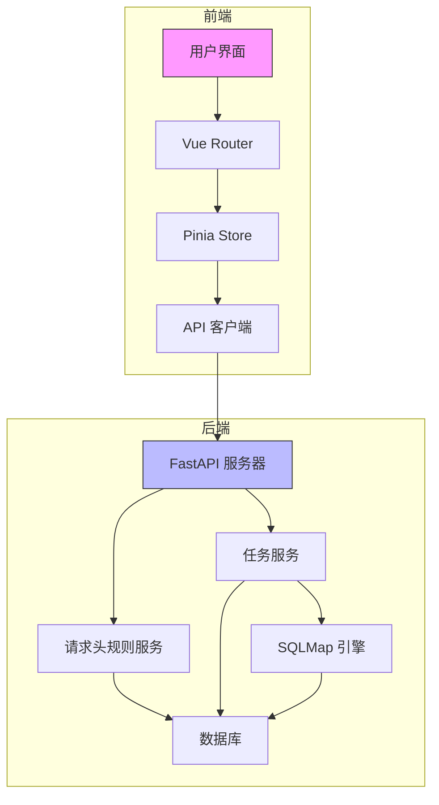
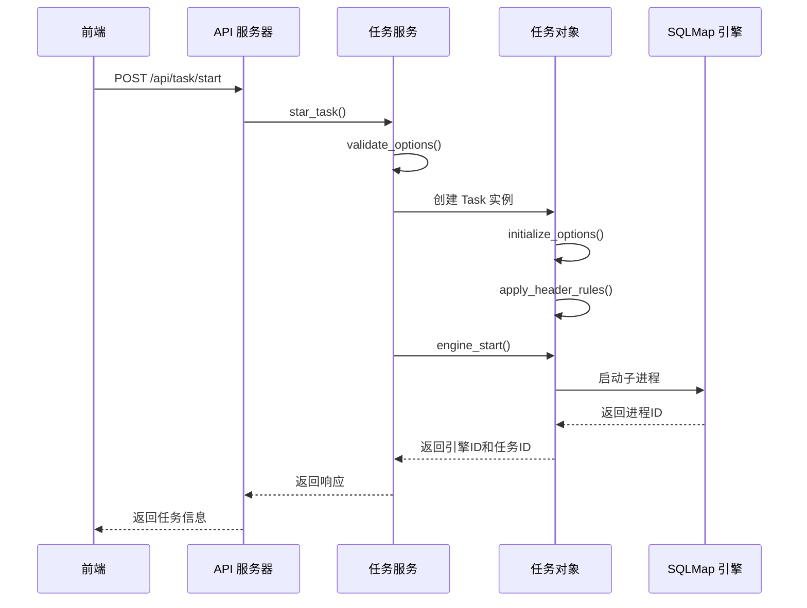
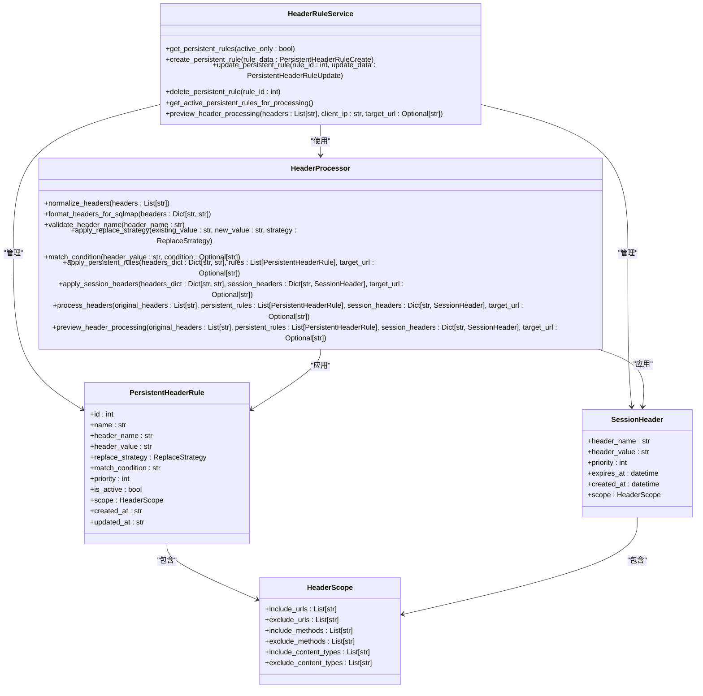
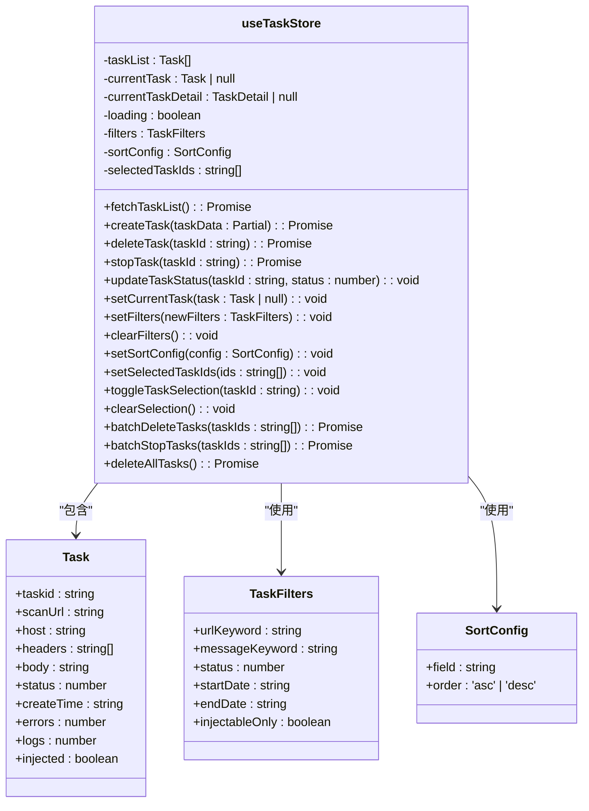
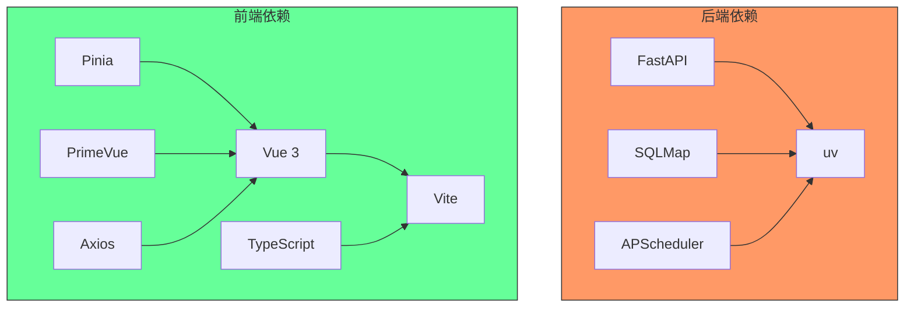
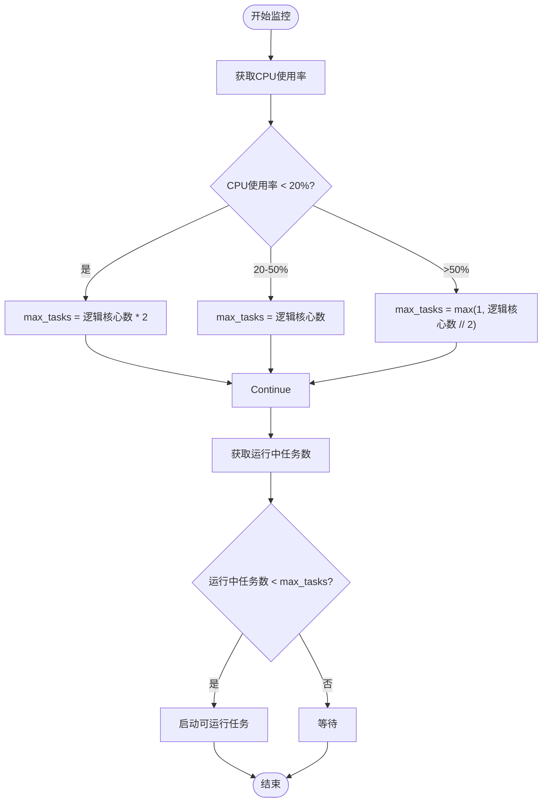

# 项目文档

<cite>
**本文档引用的文件**   
- [README.md](file://README.md)
- [app.py](file://src/backEnd/app.py)
- [main.py](file://src/backEnd/main.py)
- [config.py](file://src/backEnd/config.py)
- [Task.py](file://src/backEnd/model/Task.py)
- [taskService.py](file://src/backEnd/service/taskService.py)
- [task_monitor.py](file://src/backEnd/utils/task_monitor.py)
- [headerController.py](file://src/backEnd/api/commonApi/headerController.py)
- [headerRuleService.py](file://src/backEnd/service/headerRuleService.py)
- [header_processor.py](file://src/backEnd/utils/header_processor.py)
- [DataStore.py](file://src/backEnd/model/DataStore.py)
- [package.json](file://src/frontEnd/package.json)
- [main.ts](file://src/frontEnd/src/main.ts)
- [index.ts](file://src/frontEnd/src/router/index.ts)
- [task.ts](file://src/frontEnd/src/stores/task.ts)
</cite>

## 目录
1. [简介](#简介)
2. [项目结构](#项目结构)
3. [核心组件](#核心组件)
4. [架构概述](#架构概述)
5. [详细组件分析](#详细组件分析)
6. [依赖分析](#依赖分析)
7. [性能考虑](#性能考虑)
8. [故障排除指南](#故障排除指南)
9. [结论](#结论)

## 简介

sqlmapWebUI 是一个现代化的 SQLMap Web 界面，为安全研究人员提供便捷的 SQL 注入测试平台。该项目采用前后端分离架构，前端使用 Vue 3 和 TypeScript 构建用户界面，后端使用 FastAPI 框架提供 RESTful API 服务，集成 SQLMap 作为核心的 SQL 注入检测引擎。

项目主要功能包括任务管理、实时日志查看、扫描结果展示、HTTP 请求查看、批量操作以及与 Chrome 扩展和 Burp Suite 插件的集成。系统还提供了灵活的请求头规则配置功能，允许用户定义持久化规则和会话性请求头，以满足复杂的测试需求。

**Section sources**
- [README.md](file://README.md#L1-L160)

## 项目结构

该项目采用清晰的分层架构，主要分为前端和后端两个部分。后端代码位于 `src/backEnd` 目录，前端代码位于 `src/frontEnd` 目录。

```mermaid
graph TB
subgraph "项目根目录"
doc[doc/]
src[src/]
gitignore[.gitignore]
gitmodules[.gitmodules]
CLAUDE[CLAUDE.md]
DISCLAIMER[DISCLAIMER.md]
README[README.md]
README_EN[README_EN.md]
pnpm[pnpm-lock.yaml]
end
subgraph "src"
backEnd[src/backEnd/]
frontEnd[src/frontEnd/]
end
subgraph "backEnd"
api[src/backEnd/api/]
model[src/backEnd/model/]
service[src/backEnd/service/]
utils[src/backEnd/utils/]
third_lib[src/backEnd/third_lib/sqlmap/]
app[app.py]
main[main.py]
config[config.py]
end
subgraph "frontEnd"
src_front[src/frontEnd/src/]
package[package.json]
vite[vite.config.ts]
end
subgraph "api"
chrome[src/backEnd/api/chromeExApi/]
burp[src/backEnd/api/burpSuiteExApi/]
common[src/backEnd/api/commonApi/]
end
subgraph "model"
requestModel[src/backEnd/model/requestModel/]
BaseResponseMsg[src/backEnd/model/BaseResponseMsg.py]
DataStore[src/backEnd/model/DataStore.py]
Database[src/backEnd/model/Database.py]
HeaderBatch[src/backEnd/model/HeaderBatch.py]
HeaderDatabase[src/backEnd/model/HeaderDatabase.py]
HeaderScope[src/backEnd/model/HeaderScope.py]
LogRecorder[src/backEnd/model/LogRecorder.py]
PersistentHeaderRule[src/backEnd/model/PersistentHeaderRule.py]
SessionHeader[src/backEnd/model/SessionHeader.py]
StdDbOut[src/backEnd/model/StdDbOut.py]
Task[src/backEnd/model/Task.py]
TaskStatus[src/backEnd/model/TaskStatus.py]
end
subgraph "service"
headerRuleService[src/backEnd/service/headerRuleService.py]
taskService[src/backEnd/service/taskService.py]
end
subgraph "utils"
auth[src/backEnd/utils/auth.py]
content_type_helper[src/backEnd/utils/content_type_helper.py]
header_parser[src/backEnd/utils/header_parser.py]
header_processor[src/backEnd/utils/header_processor.py]
scope_matcher[src/backEnd/utils/scope_matcher.py]
session_header_manager[src/backEnd/utils/session_header_manager.py]
task_monitor[src/backEnd/utils/task_monitor.py]
end
subgraph "frontEnd src"
api[src/frontEnd/src/api/]
components[src/frontEnd/src/components/]
stores[src/frontEnd/src/stores/]
types[src/frontEnd/src/types/]
utils[src/frontEnd/src/utils/]
views[src/frontEnd/src/views/]
App[App.vue]
main[main.ts]
primevue[primevue.ts]
style[style.css]
end
subgraph "doc"
CONSOLE[CONSOLE_CHECK_AND_FIX_REPORT.md]
FEATURE[FEATURE_UPDATES.md]
HEADER[HEADER_CONFIG_COMPLETE_SUMMARY.md]
HEADER_UI[HEADER_CONFIG_UI_IMPLEMENTATION.md]
HEADER_USER[HEADER_CONFIG_USER_GUIDE.md]
SCOPE[SCOPE_FEATURE_COMPLETION.md]
end
doc --> src
src --> backEnd
src --> frontEnd
backEnd --> api
backEnd --> model
backEnd --> service
backEnd --> utils
backEnd --> third_lib
backEnd --> app
backEnd --> main
backEnd --> config
api --> chrome
api --> burp
api --> common
model --> requestModel
model --> BaseResponseMsg
model --> DataStore
model --> Database
model --> HeaderBatch
model --> HeaderDatabase
model --> HeaderScope
model --> LogRecorder
model --> PersistentHeaderRule
model --> SessionHeader
model --> StdDbOut
model --> Task
model --> TaskStatus
service --> headerRuleService
service --> taskService
utils --> auth
utils --> content_type_helper
utils --> header_parser
utils --> header_processor
utils --> scope_matcher
utils --> session_header_manager
utils --> task_monitor
frontEnd --> src_front
frontEnd --> package
frontEnd --> vite
src_front --> api
src_front --> components
src_front --> stores
src_front --> types
src_front --> utils
src_front --> views
src_front --> App
src_front --> main
src_front --> primevue
src_front --> style
doc --> CONSOLE
doc --> FEATURE
doc --> HEADER
doc --> HEADER_UI
doc --> HEADER_USER
doc --> SCOPE
```

**Diagram sources**
- [README.md](file://README.md#L82-L108)

**Section sources**
- [README.md](file://README.md#L82-L108)

## 核心组件

该项目的核心组件包括任务管理、请求头规则处理和前后端通信机制。后端通过 FastAPI 框架暴露 RESTful API，前端通过 Vue 3 和 Pinia 构建响应式用户界面。任务管理组件负责创建、监控和管理 SQLMap 扫描任务，而请求头规则处理组件则允许用户定义和应用自定义的请求头规则。

系统通过 `DataStore` 类实现全局数据存储，包括任务列表、数据库连接和会话管理器。`Task` 类封装了单个扫描任务的所有信息和操作，而 `TaskService` 类提供了任务管理的业务逻辑。请求头规则通过 `headerRuleService` 和 `header_processor` 组件进行处理，支持持久化规则和会话性请求头。

**Section sources**
- [app.py](file://src/backEnd/app.py#L1-L67)
- [main.py](file://src/backEnd/main.py#L1-L163)
- [DataStore.py](file://src/backEnd/model/DataStore.py#L1-L34)
- [Task.py](file://src/backEnd/model/Task.py#L1-L207)
- [taskService.py](file://src/backEnd/service/taskService.py#L1-L532)
- [headerRuleService.py](file://src/backEnd/service/headerRuleService.py#L1-L800)
- [header_processor.py](file://src/backEnd/utils/header_processor.py#L1-L292)

## 架构概述

该项目采用典型的前后端分离架构，前端负责用户界面展示和交互，后端负责业务逻辑处理和与 SQLMap 引擎的集成。前后端通过 RESTful API 进行通信，API 端点主要由 FastAPI 框架提供。



**Diagram sources**
- [app.py](file://src/backEnd/app.py#L1-L67)
- [main.py](file://src/backEnd/main.py#L1-L163)
- [taskService.py](file://src/backEnd/service/taskService.py#L1-L532)
- [headerRuleService.py](file://src/backEnd/service/headerRuleService.py#L1-L800)

## 详细组件分析

### 任务管理组件分析

任务管理是系统的核心功能，负责创建、监控和管理 SQL 注入扫描任务。当用户创建新任务时，前端通过 API 发送请求，后端的 `taskService` 组件接收请求并创建 `Task` 对象。



**Diagram sources**
- [taskService.py](file://src/backEnd/service/taskService.py#L58-L87)
- [Task.py](file://src/backEnd/model/Task.py#L19-L143)

### 请求头规则处理组件分析

请求头规则处理组件允许用户定义持久化规则和会话性请求头，这些规则在扫描任务启动前被应用到 HTTP 请求中。系统提供了完整的 CRUD 操作和批量处理功能。



**Diagram sources**
- [headerRuleService.py](file://src/backEnd/service/headerRuleService.py#L32-L800)
- [header_processor.py](file://src/backEnd/utils/header_processor.py#L12-L292)
- [PersistentHeaderRule.py](file://src/backEnd/model/PersistentHeaderRule.py)
- [SessionHeader.py](file://src/backEnd/model/SessionHeader.py)
- [HeaderScope.py](file://src/backEnd/model/HeaderScope.py)

### 前端状态管理分析

前端使用 Pinia 进行状态管理，`useTaskStore` 是核心的状态管理器，负责管理任务列表、当前任务、过滤器和排序配置等状态。



**Diagram sources**
- [task.ts](file://src/frontEnd/src/stores/task.ts#L1-L367)

## 依赖分析

该项目的依赖关系清晰，前后端分离，各组件职责明确。后端主要依赖 FastAPI 框架、SQLMap 引擎和 APScheduler 调度器，前端依赖 Vue 3、Pinia、PrimeVue 等现代前端技术栈。



**Diagram sources**
- [package.json](file://src/frontEnd/package.json#L1-L39)
- [pyproject.toml](file://src/backEnd/pyproject.toml)
- [uv.lock](file://src/backEnd/uv.lock)

## 性能考虑

系统在性能方面进行了多项优化。首先，通过 `task_monitor` 组件实现了任务调度，根据 CPU 使用率动态调整最大并发任务数，避免系统过载。其次，使用 `DataStore` 类的线程锁机制确保多线程环境下的数据安全。



**Diagram sources**
- [task_monitor.py](file://src/backEnd/utils/task_monitor.py#L1-L94)
- [DataStore.py](file://src/backEnd/model/DataStore.py#L1-L34)

## 故障排除指南

当系统出现问题时，可以按照以下步骤进行排查：

1. **检查后端服务是否正常运行**：访问 `http://localhost:8775/api/health` 检查健康状态。
2. **检查前端服务是否正常运行**：访问 `http://localhost:5173` 查看前端界面。
3. **检查日志文件**：查看后端日志以获取详细的错误信息。
4. **检查数据库连接**：确保 `DataStore.current_db` 和 `DataStore.header_db` 连接正常。
5. **检查任务状态**：通过 `list_task` API 检查任务列表和状态。

常见问题包括数据库连接失败、SQLMap 引擎启动失败和跨域请求被阻止。对于数据库连接问题，确保 `Database.filepath` 正确初始化；对于 SQLMap 引擎问题，检查 Python 环境和依赖包；对于跨域问题，确保 `CORSMiddleware` 配置正确。

**Section sources**
- [app.py](file://src/backEnd/app.py#L22-L30)
- [main.py](file://src/backEnd/main.py#L134-L149)
- [taskService.py](file://src/backEnd/service/taskService.py#L102-L176)

## 结论

sqlmapWebUI 项目是一个功能完善的 SQL 注入测试平台，通过现代化的技术栈为安全研究人员提供了便捷的测试工具。项目架构清晰，前后端分离，组件职责明确，易于维护和扩展。

系统的核心优势在于其灵活的请求头规则处理机制和完善的任务管理功能。通过持久化规则和会话性请求头，用户可以精确控制扫描过程中的 HTTP 请求头，满足复杂的测试需求。同时，系统提供了实时日志、扫描结果展示和批量操作等实用功能，大大提升了测试效率。

未来可以考虑增加更多高级功能，如扫描策略优化、结果分析报告生成和团队协作功能，进一步提升产品的竞争力。