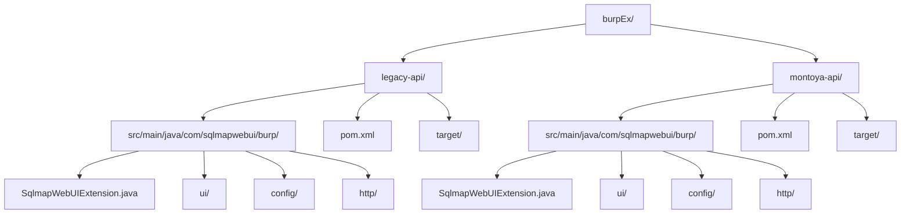
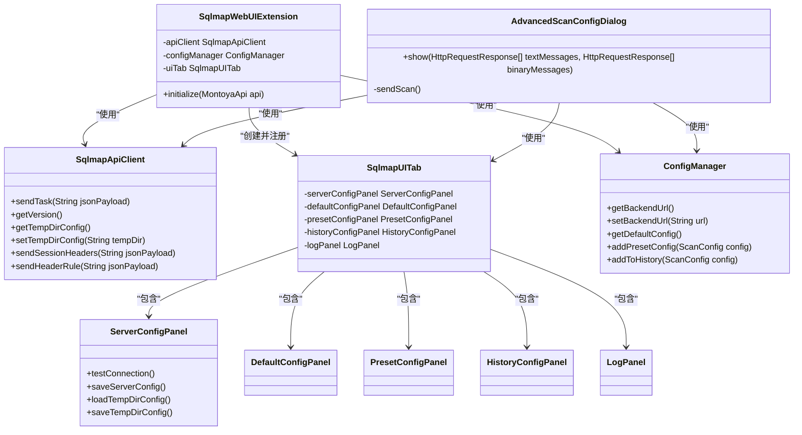
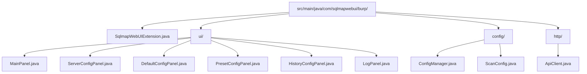

# Burp Suite 集成指南

<cite>
**本文档引用的文件**   
- [SqlmapWebUIExtension.java](file://src/burpEx/montoya-api/src/main/java/com/sqlmapwebui/burp/SqlmapWebUIExtension.java)
- [SqlmapApiClient.java](file://src/burpEx/montoya-api/src/main/java/com/sqlmapwebui/burp/SqlmapApiClient.java)
- [SqlmapUITab.java](file://src/burpEx/montoya-api/src/main/java/com/sqlmapwebui/burp/SqlmapUITab.java)
- [ConfigManager.java](file://src/burpEx/montoya-api/src/main/java/com/sqlmapwebui/burp/ConfigManager.java)
- [ServerConfigPanel.java](file://src/burpEx/montoya-api/src/main/java/com/sqlmapwebui/burp/panels/ServerConfigPanel.java)
- [AdvancedScanConfigDialog.java](file://src/burpEx/montoya-api/src/main/java/com/sqlmapwebui/burp/dialogs/AdvancedScanConfigDialog.java)
- [admin.py](file://src/backEnd/api/burpSuiteExApi/admin.py)
- [taskService.py](file://src/backEnd/service/taskService.py)
- [headerController.py](file://src/backEnd/api/commonApi/headerController.py)
- [README.md](file://src/burpEx/README.md)
- [README.md](file://README.md)
</cite>

## 目录
1. [简介](#简介)
2. [项目结构](#项目结构)
3. [核心功能](#核心功能)
4. [版本选择与兼容性](#版本选择与兼容性)
5. [安装与构建](#安装与构建)
6. [配置与使用](#配置与使用)
7. [API 接口说明](#api-接口说明)
8. [架构设计](#架构设计)
9. [故障排除](#故障排除)
10. [开发指南](#开发指南)

## 简介

Burp Suite 扩展插件是 SQLMap WebUI 项目的重要组成部分，旨在为安全研究人员提供一个无缝的集成体验。通过该插件，用户可以直接从 Burp Suite 的任意 HTTP 请求上下文（如 Proxy、Repeater、Target 等）将请求发送到 SQLMap WebUI 后端进行 SQL 注入检测。

该插件提供了丰富的功能，包括配置管理、任务提交、活动日志记录等，极大地简化了从漏洞发现到自动化测试的流程。插件分为两个版本：`legacy-api` 和 `montoya-api`，以适应不同版本的 Burp Suite。

**Section sources**
- [README.md](file://src/burpEx/README.md#L1-L224)
- [README.md](file://README.md#L1-L281)

## 项目结构

Burp Suite 扩展的项目结构清晰，主要分为两个独立的模块，分别对应不同的 Burp Suite API 版本。



**Diagram sources**
- [README.md](file://src/burpEx/README.md#L7-L25)

**Section sources**
- [README.md](file://src/burpEx/README.md#L7-L25)

## 核心功能

Burp Suite 插件提供了以下核心功能：

| 功能 | 说明 |
| :--- | :--- |
| **提交扫描任务** | 通过右键菜单将 HTTP 请求发送到后端进行扫描 |
| **默认配置管理** | 设置和保存默认的扫描参数（Level, Risk, DBMS 等） |
| **常用配置管理** | 创建、编辑和删除常用的扫描配置，便于快速选择 |
| **配置选择** | 提交任务时，可选择使用默认配置、常用配置或历史记录中的配置 |
| **活动日志** | 记录所有操作和发送结果，便于追踪和审计 |

> **注意**: 插件端仅负责发送请求，任务管理和结果查看请使用 Web 前端。

### 右键菜单

插件在 Burp Suite 的 HTTP 请求上下文菜单中添加了以下选项：

- **发送到 SQLMap WebUI (Send to SQLMap WebUI)** - 使用默认配置直接发送扫描任务。
- **发送到 SQLMap WebUI (选择配置)... (Send to SQLMap WebUI (选择配置)...)** - 弹出配置选择对话框，允许用户选择或自定义扫描参数。

### UI 标签页

插件在 Burp Suite 的 Extender 标签页中添加了一个名为 "SQLMap WebUI" 的标签页，包含以下子标签页：

| 标签页 | 功能 |
| :--- | :--- |
| 服务器配置 | 设置后端服务器的 URL 并测试连接状态 |
| 默认配置 | 配置 Level、Risk、DBMS、Technique、Batch 等默认扫描参数 |
| 常用配置 | 管理常用配置列表，支持添加、编辑和删除 |
| 历史配置 | 查看和管理最近使用过的配置 |
| 活动日志 | 查看操作日志和发送历史 |

**Section sources**
- [README.md](file://src/burpEx/README.md#L27-L54)

## 版本选择与兼容性

为了适应不同版本的 Burp Suite，插件提供了两个独立的版本。

| Burp Suite 版本 | 推荐插件 | Java 要求 |
| :--- | :--- | :--- |
| 2023.1+ | montoya-api | Java 17+ |
| 较老版本 | legacy-api | Java 11+ |

`montoya-api` 版本利用了 Burp Suite 2023.1 引入的现代化 API，提供了更好的性能和更简洁的代码结构。对于使用最新版 Burp Suite 的用户，强烈推荐使用此版本。

**Section sources**
- [README.md](file://src/burpEx/README.md#L57-L61)

## 安装与构建

### 构建方式

#### Montoya API (推荐)

```bash
cd montoya-api
mvn clean package -DskipTests
```

生成文件: `target/sqlmap-webui-burp-montoya-*.jar`

#### Legacy API

```bash
cd legacy-api
mvn clean package -DskipTests
```

生成文件: `target/sqlmap-webui-burp-legacy-*-jar-with-dependencies.jar`

### 安装方式

1.  打开 Burp Suite。
2.  进入 **Extender** → **Extensions** 标签页。
3.  点击 **Add** 按钮。
4.  选择对应版本的 JAR 文件。
5.  点击 **Next** 完成安装。

**Section sources**
- [README.md](file://src/burpEx/README.md#L62-L88)

## 配置与使用

### 1. 配置服务器

1.  进入插件的「服务器配置」标签页。
2.  设置后端 URL，例如 `http://localhost:8775`。
3.  点击「测试连接」按钮，验证与后端服务的连接状态。连接成功后，状态指示灯会变为绿色。

### 2. 配置默认参数

在「默认配置」标签页中，可以设置以下参数：

- **Level**: 检测级别 (1-5)，级别越高，测试的向量越多。
- **Risk**: 风险级别 (1-3)，风险越高，可能对目标系统造成的影响越大。
- **DBMS**: 指定目标数据库类型，留空则由 SQLMap 自动检测。
- **Technique**: 选择使用的注入技术，如布尔盲注(B)、报错注入(E)、联合查询(U)等。
- **Batch**: 启用批处理模式，减少用户交互。

### 3. 发送请求

1.  在 Burp Suite 的 Proxy、Repeater 或 Target 等位置选中一个或多个 HTTP 请求。
2.  右键单击，选择 "Send to SQLMap WebUI" 使用默认配置发送。
3.  或选择 "Send to SQLMap WebUI (选择配置)..." 以弹出高级配置对话框，进行更精细的控制。

### 4. 查看结果

发送请求后，需要在 SQLMap WebUI 的 Web 前端界面查看扫描任务的进度和结果。插件本身不显示任务详情，仅负责任务的提交。

**Section sources**
- [README.md](file://src/burpEx/README.md#L92-L115)

## API 接口说明

Burp Suite 插件通过 HTTP API 与后端进行通信。插件需要后端提供以下接口：

| 接口 | 方法 | 说明 |
| :--- | :--- | :--- |
| `/api/health` | GET | 健康检查，用于测试连接。插件通过此接口获取后端版本信息。 |
| `/api/burpsuite/admin/task/add` | POST | 提交扫描任务的核心接口。插件将请求信息和扫描参数封装后发送至此接口。 |
| `/api/config/temp-dir` | GET/POST | 获取和设置用于保存 HTTP 原始报文的临时文件目录。 |
| `/api/commonApi/header/session-headers` | POST | 提交会话性请求头规则。 |
| `/api/commonApi/header/persistent-header-rules` | POST | 提交持久化请求头规则。 |

**Section sources**
- [README.md](file://src/burpEx/README.md#L156-L165)
- [SqlmapApiClient.java](file://src/burpEx/montoya-api/src/main/java/com/sqlmapwebui/burp/SqlmapApiClient.java#L36-L208)
- [admin.py](file://src/backEnd/api/burpSuiteExApi/admin.py#L18-L37)

## 架构设计

Burp Suite 插件采用模块化设计，主要由以下几个核心组件构成：



**Diagram sources**
- [SqlmapWebUIExtension.java](file://src/burpEx/montoya-api/src/main/java/com/sqlmapwebui/burp/SqlmapWebUIExtension.java#L19-L67)
- [SqlmapApiClient.java](file://src/burpEx/montoya-api/src/main/java/com/sqlmapwebui/burp/SqlmapApiClient.java#L15-L208)
- [SqlmapUITab.java](file://src/burpEx/montoya-api/src/main/java/com/sqlmapwebui/burp/SqlmapUITab.java#L22-L172)
- [ConfigManager.java](file://src/burpEx/montoya-api/src/main/java/com/sqlmapwebui/burp/ConfigManager.java#L17-L404)
- [ServerConfigPanel.java](file://src/burpEx/montoya-api/src/main/java/com/sqlmapwebui/burp/panels/ServerConfigPanel.java#L21-L781)
- [AdvancedScanConfigDialog.java](file://src/burpEx/montoya-api/src/main/java/com/sqlmapwebui/burp/dialogs/AdvancedScanConfigDialog.java#L27-L800)

**Section sources**
- [SqlmapWebUIExtension.java](file://src/burpEx/montoya-api/src/main/java/com/sqlmapwebui/burp/SqlmapWebUIExtension.java#L19-L67)
- [SqlmapApiClient.java](file://src/burpEx/montoya-api/src/main/java/com/sqlmapwebui/burp/SqlmapApiClient.java#L15-L208)
- [SqlmapUITab.java](file://src/burpEx/montoya-api/src/main/java/com/sqlmapwebui/burp/SqlmapUITab.java#L22-L172)
- [ConfigManager.java](file://src/burpEx/montoya-api/src/main/java/com/sqlmapwebui/burp/ConfigManager.java#L17-L404)
- [ServerConfigPanel.java](file://src/burpEx/montoya-api/src/main/java/com/sqlmapwebui/burp/panels/ServerConfigPanel.java#L21-L781)
- [AdvancedScanConfigDialog.java](file://src/burpEx/montoya-api/src/main/java/com/sqlmapwebui/burp/dialogs/AdvancedScanConfigDialog.java#L27-L800)

## 故障排除

### Q: 插件加载失败？

**A**: 请检查您的 Java 版本是否满足要求。`montoya-api` 版本需要 Java 17+，而 `legacy-api` 版本需要 Java 11+。

### Q: 连接测试失败？

**A**: 请检查：
1.  SQLMap WebUI 后端服务是否已成功启动。
2.  在「服务器配置」标签页中输入的 URL 是否正确（默认为 `http://localhost:8775`）。
3.  防火墙或网络设置是否阻止了连接。

### Q: 发送请求后，在 Web 前端看不到任务？

**A**: Burp Suite 插件只负责将任务提交到后端，它本身不显示任务列表。请确保后端服务正常运行，并在 SQLMap WebUI 的 Web 前端界面查看任务列表。

### Q: 如何查看详细错误信息？

**A**: 可以在 Burp Suite 的 **Extender** → **Output** 标签页中查看详细的日志输出，这有助于诊断连接或通信问题。

**Section sources**
- [README.md](file://src/burpEx/README.md#L207-L219)

## 开发指南

### 项目结构说明

插件的核心代码结构如下：



- **SqlmapWebUIExtension.java**: 插件的入口点，负责初始化所有组件并注册到 Burp Suite。
- **ui/**: 包含所有 UI 面板的实现。
- **config/**: 负责扫描配置的管理和持久化。
- **http/**: 封装了与后端 API 通信的 HTTP 客户端。

### 添加新配置项

若需为扫描任务添加新的配置参数，可遵循以下步骤：
1.  在 `ScanConfig` 类中添加新的字段。
2.  在 `DefaultConfigPanel` 的 UI 中添加相应的控件。
3.  在 `ConfigManager` 中实现该配置的持久化逻辑。

**Section sources**
- [README.md](file://src/burpEx/README.md#L177-L200)