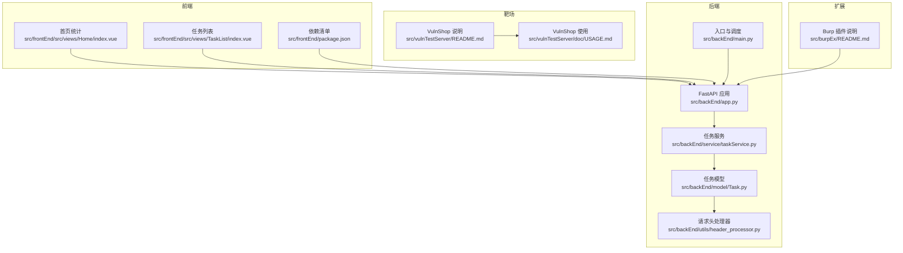
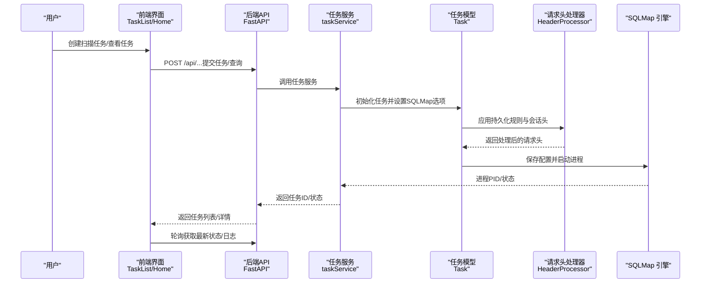
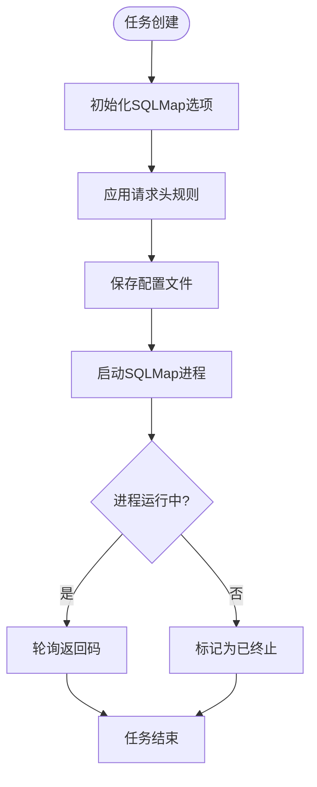
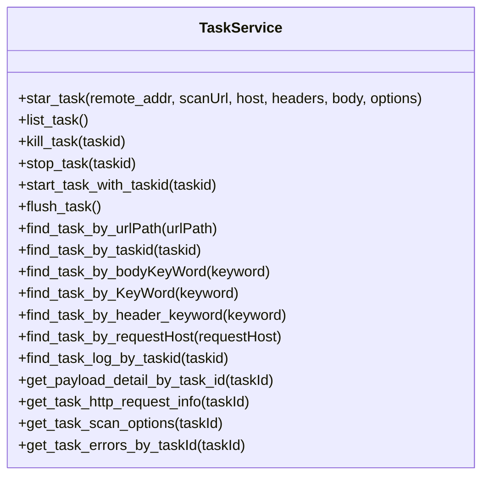
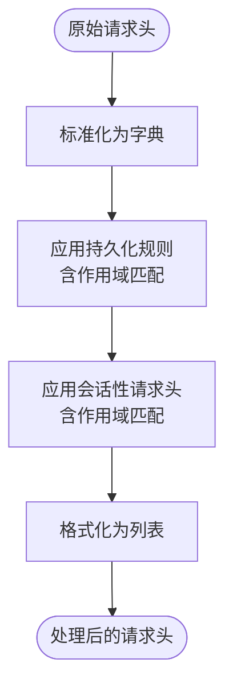
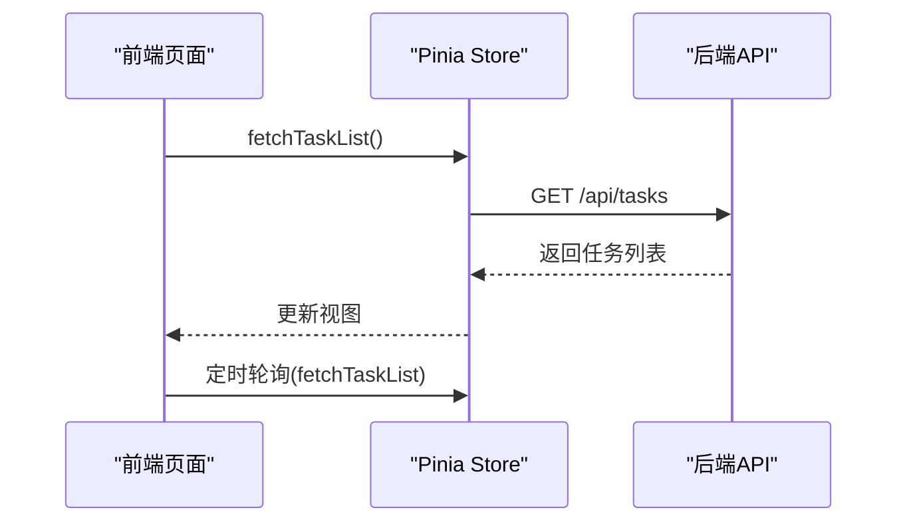
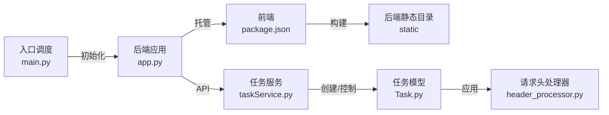

# 使用指南

<cite>
**本文引用的文件**
- [README.md](file://README.md)
- [doc/USAGE_GUIDE.md](file://doc/USAGE_GUIDE.md)
- [src/backEnd/app.py](file://src/backEnd/app.py)
- [src/backEnd/main.py](file://src/backEnd/main.py)
- [src/backEnd/model/Task.py](file://src/backEnd/model/Task.py)
- [src/backEnd/service/taskService.py](file://src/backEnd/service/taskService.py)
- [src/backEnd/utils/header_processor.py](file://src/backEnd/utils/header_processor.py)
- [src/frontEnd/package.json](file://src/frontEnd/package.json)
- [src/frontEnd/src/views/Home/index.vue](file://src/frontEnd/src/views/Home/index.vue)
- [src/frontEnd/src/views/TaskList/index.vue](file://src/frontEnd/src/views/TaskList/index.vue)
- [src/frontEnd/README.md](file://src/frontEnd/README.md)
- [src/vulnTestServer/README.md](file://src/vulnTestServer/README.md)
- [src/vulnTestServer/doc/USAGE.md](file://src/vulnTestServer/doc/USAGE.md)
- [src/burpEx/README.md](file://src/burpEx/README.md)
</cite>

## 目录
1. [简介](#简介)
2. [项目结构](#项目结构)
3. [核心组件](#核心组件)
4. [架构总览](#架构总览)
5. [详细组件分析](#详细组件分析)
6. [依赖关系分析](#依赖关系分析)
7. [性能与可用性建议](#性能与可用性建议)
8. [故障排查](#故障排查)
9. [结论](#结论)
10. [附录](#附录)

## 简介
本使用指南面向安全研究人员与测试工程师，帮助您快速搭建并使用 SQLMap Web UI 平台，完成 SQL 注入扫描任务管理、实时日志查看、请求头规则配置、与 VulnShop 靶场联动测试，以及通过 Burp Suite/Chrome 扩展便捷提交扫描任务。平台采用前后端分离架构：后端基于 FastAPI + SQLMap，前端基于 Vue 3 + TypeScript + PrimeVue，同时提供内置 VulnShop 靶场用于教学与练习。

## 项目结构
- 后端（FastAPI + SQLMap 集成）：负责任务生命周期管理、请求头规则应用、与 SQLMap 引擎交互、数据库持久化与日志采集。
- 前端（Vue 3 + TypeScript）：提供任务列表、任务详情、请求头规则配置、主题切换、自动轮询刷新等界面。
- VulnShop 靶场：内置的 SQL 注入测试环境，支持多种注入类型与难度级别。
- 扩展插件：Burp Suite 插件与 Chrome 扩展，用于从浏览器或 Burp 直接向后端提交扫描任务。

图表来源
- [src/frontEnd/src/views/Home/index.vue](file://src/frontEnd/src/views/Home/index.vue#L1-L697)
- [src/frontEnd/src/views/TaskList/index.vue](file://src/frontEnd/src/views/TaskList/index.vue#L1-L800)
- [src/frontEnd/package.json](file://src/frontEnd/package.json#L1-L39)
- [src/backEnd/app.py](file://src/backEnd/app.py#L1-L74)
- [src/backEnd/main.py](file://src/backEnd/main.py#L1-L163)
- [src/backEnd/model/Task.py](file://src/backEnd/model/Task.py#L1-L209)
- [src/backEnd/service/taskService.py](file://src/backEnd/service/taskService.py#L1-L535)
- [src/backEnd/utils/header_processor.py](file://src/backEnd/utils/header_processor.py#L1-L292)
- [src/vulnTestServer/README.md](file://src/vulnTestServer/README.md#L1-L163)
- [src/vulnTestServer/doc/USAGE.md](file://src/vulnTestServer/doc/USAGE.md#L1-L412)
- [src/burpEx/README.md](file://src/burpEx/README.md#L1-L112)

章节来源
- [README.md](file://README.md#L1-L232)
- [doc/USAGE_GUIDE.md](file://doc/USAGE_GUIDE.md#L1-L322)

## 核心组件
- 任务模型与引擎交互：负责初始化 SQLMap 选项、保存配置、启动/停止/终止进程，并维护任务状态。
- 任务服务：提供任务创建、查询、停止、删除、批量操作、日志与错误查询等接口。
- 请求头规则处理：将持久化规则与会话性请求头合并应用到扫描请求，支持作用域匹配与替换策略。
- 前端界面：首页统计、任务列表、自动轮询、批量操作、主题切换等。
- VulnShop 靶场：内置的 SQL 注入练习环境，支持多种注入类型与难度级别。
- 扩展插件：Burp Suite 与 Chrome 扩展，用于从浏览器或 Burp 直接提交扫描任务。

章节来源
- [src/backEnd/model/Task.py](file://src/backEnd/model/Task.py#L1-L209)
- [src/backEnd/service/taskService.py](file://src/backEnd/service/taskService.py#L1-L535)
- [src/backEnd/utils/header_processor.py](file://src/backEnd/utils/header_processor.py#L1-L292)
- [src/frontEnd/src/views/Home/index.vue](file://src/frontEnd/src/views/Home/index.vue#L1-L697)
- [src/frontEnd/src/views/TaskList/index.vue](file://src/frontEnd/src/views/TaskList/index.vue#L1-L800)
- [src/vulnTestServer/README.md](file://src/vulnTestServer/README.md#L1-L163)
- [src/burpEx/README.md](file://src/burpEx/README.md#L1-L112)

## 架构总览
后端通过 FastAPI 提供 REST API，前端通过代理访问后端接口；任务创建时，后端将 SQLMap 参数写入临时配置并启动子进程；请求头规则在任务启动前应用到 SQLMap 配置；前端通过定时轮询更新任务状态与日志。

图表来源
- [src/backEnd/service/taskService.py](file://src/backEnd/service/taskService.py#L1-L535)
- [src/backEnd/model/Task.py](file://src/backEnd/model/Task.py#L1-L209)
- [src/backEnd/utils/header_processor.py](file://src/backEnd/utils/header_processor.py#L1-L292)
- [src/frontEnd/src/views/TaskList/index.vue](file://src/frontEnd/src/views/TaskList/index.vue#L1-L800)
- [src/frontEnd/src/views/Home/index.vue](file://src/frontEnd/src/views/Home/index.vue#L1-L697)

## 详细组件分析

### 任务生命周期与引擎交互
- 任务初始化：从 SQLMap 的 optDict 与默认值构建 AttribDict 选项，启用批处理与禁用彩色输出，设置 IPC 数据库路径。
- 请求头规则应用：在启动前将持久化规则与会话性请求头合并，生成最终 headers 字符串写入 SQLMap 选项。
- 引擎启动/停止/终止：通过 Popen 启动 sqlmap.py --api，支持终止与返回码查询。
- 状态判定：根据进程是否结束与任务状态映射，动态更新运行/终止状态。

图表来源
- [src/backEnd/model/Task.py](file://src/backEnd/model/Task.py#L1-L209)

章节来源
- [src/backEnd/model/Task.py](file://src/backEnd/model/Task.py#L1-L209)

### 任务服务与数据库交互
- 任务创建：校验 SQLMap 选项合法性，生成任务ID，设置用户选项，启动任务进程。
- 任务查询：聚合错误数、日志数、数据条数，计算注入状态，返回任务列表与统计。
- 任务控制：停止、终止、删除、批量删除、清空任务池。
- 日志与错误：按任务ID查询日志与错误记录，支持分页与排序。
- 扫描选项：返回任务使用的 SQLMap 选项集合。

图表来源
- [src/backEnd/service/taskService.py](file://src/backEnd/service/taskService.py#L1-L535)

章节来源
- [src/backEnd/service/taskService.py](file://src/backEnd/service/taskService.py#L1-L535)

### 请求头规则处理与作用域匹配
- 规则应用顺序：按优先级排序持久化规则，逐条应用替换策略（替换/追加/前置/条件/UPSERT）。
- 作用域匹配：支持精确匹配、前缀匹配、域名匹配、正则匹配，仅对匹配 URL 的请求应用规则。
- 会话性请求头：按优先级排序，覆盖持久化规则，实现动态会话头注入。
- 预览能力：提供预览接口，返回原始与处理后的请求头及应用规则描述。

图表来源
- [src/backEnd/utils/header_processor.py](file://src/backEnd/utils/header_processor.py#L1-L292)

章节来源
- [src/backEnd/utils/header_processor.py](file://src/backEnd/utils/header_processor.py#L1-L292)

### 前端界面与自动轮询
- 首页统计：展示任务总数、运行中、等待中、已完成、失败、已停止、已终止与注入情况统计。
- 任务列表：支持筛选、排序、批量操作（停止/删除/删除全部）、自动轮询刷新、跳转到任务详情/日志/错误。
- 轮询策略：根据运行中任务数量与页面可见性动态启停轮询，减少不必要的请求。

图表来源
- [src/frontEnd/src/views/Home/index.vue](file://src/frontEnd/src/views/Home/index.vue#L1-L697)
- [src/frontEnd/src/views/TaskList/index.vue](file://src/frontEnd/src/views/TaskList/index.vue#L1-L800)

章节来源
- [src/frontEnd/src/views/Home/index.vue](file://src/frontEnd/src/views/Home/index.vue#L1-L697)
- [src/frontEnd/src/views/TaskList/index.vue](file://src/frontEnd/src/views/TaskList/index.vue#L1-L800)

### VulnShop 靶场使用
- 支持的注入类型：基于错误、联合查询、布尔盲注、时间盲注、堆叠查询、二次注入。
- 难度级别：Easy/Medium/Hard，分别对应无防护、简单过滤、严格过滤。
- 配置与重置：通过 Web 界面或 API 切换难度，支持一键重置数据库。
- 使用示例：提供各注入类型的接口与 payload 示例，便于学习与测试。

章节来源
- [src/vulnTestServer/README.md](file://src/vulnTestServer/README.md#L1-L163)
- [src/vulnTestServer/doc/USAGE.md](file://src/vulnTestServer/doc/USAGE.md#L1-L412)

### 扩展插件使用
- Burp Suite 插件：支持 Legacy API 与 Montoya API 两个版本，提供右键菜单“发送到 SQLMap WebUI”，支持默认配置与常用配置管理。
- Chrome 扩展：加载扩展后配置后端地址，右键发送请求到后端进行扫描。

章节来源
- [src/burpEx/README.md](file://src/burpEx/README.md#L1-L112)

## 依赖关系分析
- 前端依赖：Vue 3、TypeScript、PrimeVue、Axios、Pinia、Vite 等，构建产物输出至后端静态目录，由 FastAPI 托管。
- 后端依赖：FastAPI、uvicorn、apscheduler、SQLMap（third_party 集成）、SQLite（IPC 数据库）。
- 扩展插件：OkHttp、Gson、SLF4J/Logback 等，用于 HTTP 通信与日志记录。

图表来源
- [src/frontEnd/package.json](file://src/frontEnd/package.json#L1-L39)
- [src/backEnd/app.py](file://src/backEnd/app.py#L1-L74)
- [src/backEnd/main.py](file://src/backEnd/main.py#L1-L163)
- [src/backEnd/service/taskService.py](file://src/backEnd/service/taskService.py#L1-L535)
- [src/backEnd/model/Task.py](file://src/backEnd/model/Task.py#L1-L209)
- [src/backEnd/utils/header_processor.py](file://src/backEnd/utils/header_processor.py#L1-L292)

章节来源
- [src/frontEnd/package.json](file://src/frontEnd/package.json#L1-L39)
- [src/frontEnd/README.md](file://src/frontEnd/README.md#L1-L168)
- [src/backEnd/app.py](file://src/backEnd/app.py#L1-L74)
- [src/backEnd/main.py](file://src/backEnd/main.py#L1-L163)

## 性能与可用性建议
- 自动轮询：前端根据运行中任务数量与页面可见性动态启停轮询，降低后端压力。
- 批处理与禁用彩色输出：后端在任务初始化时强制启用批处理与禁用彩色输出，提升稳定性与一致性。
- 作用域匹配：请求头规则按 URL 作用域应用，避免对无关请求造成干扰。
- 跨域与健康检查：后端开放 CORS 并提供健康检查端点，便于前端监控后端可用性。

章节来源
- [src/frontEnd/src/views/TaskList/index.vue](file://src/frontEnd/src/views/TaskList/index.vue#L1-L800)
- [src/backEnd/model/Task.py](file://src/backEnd/model/Task.py#L1-L209)
- [src/backEnd/app.py](file://src/backEnd/app.py#L1-L74)

## 故障排查
- 后端服务启动失败：检查 Python 版本与依赖安装，确认 uv 同步与第三方依赖可用。
- 前端无法连接后端：检查跨域配置与后端服务是否运行，确认开发环境代理与生产环境同域部署。
- VulnShop 无法访问：确认端口 9527 未被占用，使用 127.0.0.1 而非 localhost。
- Burp 插件无法发送请求：检查后端服务器地址配置与网络连通性。
- 扫描任务 Pending：检查 SQLMap 集成与后端日志，定位具体错误原因。

章节来源
- [doc/USAGE_GUIDE.md](file://doc/USAGE_GUIDE.md#L295-L322)
- [README.md](file://README.md#L188-L197)

## 结论
SQLMap Web UI 提供了从任务创建、规则配置、实时监控到靶场练习的完整工作流。通过前后端分离与扩展插件集成，用户可以在不同场景下高效开展 SQL 注入测试与学习。建议在本地隔离环境中使用，并遵循安全声明与免责声明。

## 附录
- 快速开始与端口说明：后端 API 8775、前端开发 5173、VulnShop 9527。
- 安全声明：仅限授权测试使用，严禁在未授权系统或生产环境使用。

章节来源
- [README.md](file://README.md#L119-L126)
- [doc/USAGE_GUIDE.md](file://doc/USAGE_GUIDE.md#L1-L322)