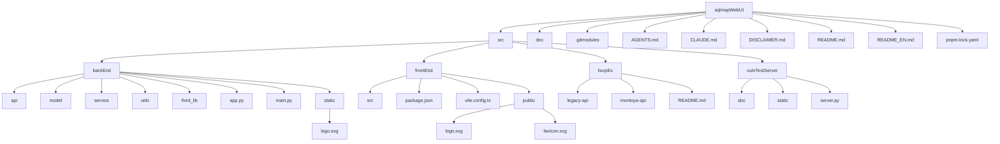
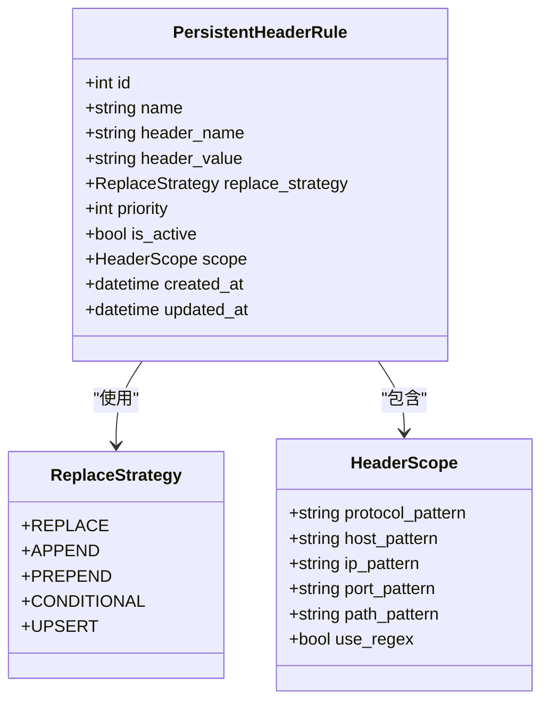
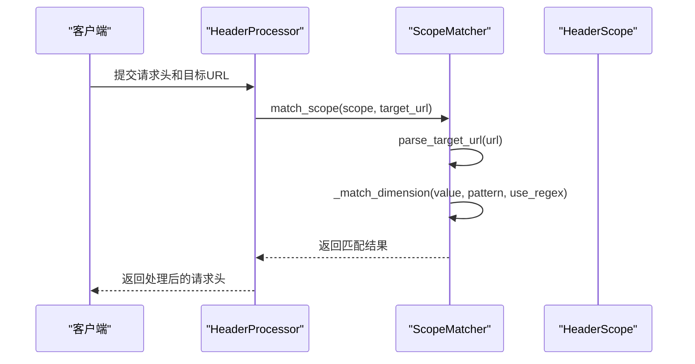
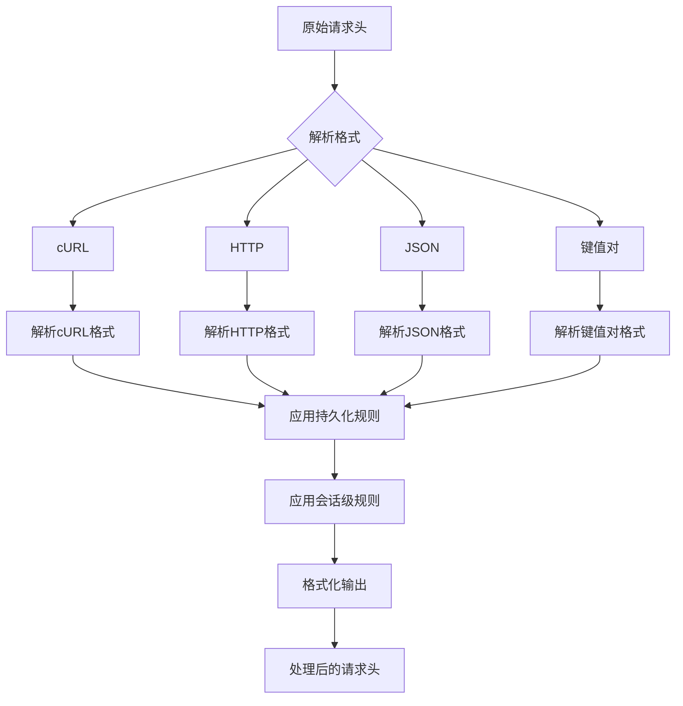
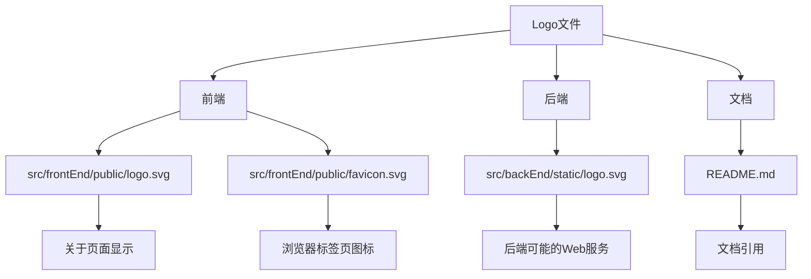

# 关于与帮助系统

<cite>
**本文档引用的文件**   
- [README.md](file://README.md)
- [USAGE_GUIDE.md](file://doc/USAGE_GUIDE.md)
- [HEADER_CONFIG_USER_GUIDE.md](file://doc/HEADER_CONFIG_USER_GUIDE.md)
- [headerController.py](file://src/backEnd/api/commonApi/headerController.py)
- [headerRuleService.py](file://src/backEnd/service/headerRuleService.py)
- [PersistentHeaderRule.py](file://src/backEnd/model/PersistentHeaderRule.py)
- [HeaderScope.py](file://src/backEnd/model/HeaderScope.py)
- [scope_matcher.py](file://src/backEnd/utils/scope_matcher.py)
- [header_processor.py](file://src/backEnd/utils/header_processor.py)
- [header_parser.py](file://src/backEnd/utils/header_parser.py)
- [AboutDialog.java](file://src/burpEx/legacy-api/src/main/java/com/sqlmapwebui/burp/dialogs/AboutDialog.java)
- [AboutDialog.java](file://src/burpEx/montoya-api/src/main/java/com/sqlmapwebui/burp/dialogs/AboutDialog.java)
- [index.vue](file://src/frontEnd/src/views/About/index.vue)
- [logo.svg](file://src/frontEnd/public/logo.svg)
- [logo.svg](file://src/backEnd/static/logo.svg)
- [index.html](file://src/frontEnd/index.html)
</cite>

## 更新摘要
**已更新内容**   
- 新增关于项目新Logo集成的说明，涵盖前端Web界面、BurpSuite插件及文档中的使用情况
- 新增前端关于页面、BurpSuite插件关于对话框及文档中Logo展示方式的详细说明
- 更新了项目结构图以反映Logo文件位置
- 新增了关于页面和插件对话框中Logo绘制机制的说明

## 目录
1. [简介](#简介)
2. [项目结构](#项目结构)
3. [核心功能](#核心功能)
4. [请求头规则管理](#请求头规则管理)
5. [作用域匹配机制](#作用域匹配机制)
6. [请求头处理流程](#请求头处理流程)
7. [API接口说明](#api接口说明)
8. [使用指南](#使用指南)
9. [故障排查](#故障排查)
10. [项目Logo集成](#项目logo集成)

## 简介

SQLMap Web UI 是一个现代化的 SQL 注入测试平台，为安全研究人员提供便捷的测试环境。该系统集成了任务管理、扫描配置、请求头规则管理、Burp Suite 和 Chrome 扩展集成等核心功能，并内置 VulnShop 漏洞靶场用于学习和测试。

本系统基于 FastAPI 和 Vue 3 构建，采用前后端分离架构，支持多种请求格式解析（cURL、PowerShell、fetch、原始 HTTP），并提供可视化配置界面，降低使用门槛。

**Section sources**
- [README.md](file://README.md#L1-L310)

## 项目结构

项目采用模块化设计，主要分为后端、前端、扩展插件和漏洞靶场四个部分：

**Diagram sources**
- [README.md](file://README.md#L173-L207)

## 核心功能

系统提供以下核心功能：

| 功能 | 说明 |
|------|------|
| 任务管理 | 创建、监控、停止 SQL 注入扫描任务 |
| 扫描配置管理 | 支持默认配置、常用配置、历史配置的 CRUD 操作 |
| HTTP 请求解析 | 支持 cURL、PowerShell、fetch、原始 HTTP 等多种格式自动解析 |
| 批量操作 | 支持批量停止、删除、导入任务 |
| 请求头规则管理 | 支持持久化规则和会话级规则，支持作用域配置 |
| 扩展集成 | 支持 Chrome 扩展和 Burp Suite 插件 |
| VulnShop 靶场 | 内置包含 8 种 SQL 注入漏洞类型的测试环境 |

**Section sources**
- [README.md](file://README.md#L17-L84)

## 请求头规则管理

系统提供两种类型的请求头规则管理：持久化规则和会话级规则。

### 持久化规则

持久化规则存储在数据库中，长期有效，支持以下配置：

- **规则名称**：规则的唯一标识
- **Header 名称**：请求头字段名称
- **Header 值**：请求头字段值
- **替换策略**：完全替换、追加、前置、条件替换、UPSERT
- **优先级**：0-100，数值越大优先级越高
- **作用域配置**：灵活的 URL 匹配规则

**Diagram sources**
- [PersistentHeaderRule.py](file://src/backEnd/model/PersistentHeaderRule.py#L19-L32)
- [HeaderScope.py](file://src/backEnd/model/HeaderScope.py#L14-L32)

### 会话级规则

会话级规则存储在内存中，具有临时性，支持 TTL 自动过期，适用于临时测试场景。

**Section sources**
- [README.md](file://README.md#L52-L63)
- [HEADER_CONFIG_USER_GUIDE.md](file://doc/HEADER_CONFIG_USER_GUIDE.md#L98-L141)

## 作用域匹配机制

作用域匹配器负责判断请求头规则是否应用于特定的目标 URL，支持关键字匹配和正则表达式匹配两种模式。

### 匹配逻辑

- **scope 为 None**：表示全局生效，返回 True
- **scope.is_empty() 为 True**：表示全局生效，返回 True
- **所有配置的维度必须同时匹配**（AND 逻辑）

### 匹配维度

| 维度 | 说明 | 示例 |
|------|------|------|
| 协议匹配 | 匹配 http 或 https | `https` 或 `http,https` |
| 主机名匹配 | 匹配域名（支持通配符） | `api.example.com` 或 `*.example.com` |
| IP 匹配 | 匹配 IP 地址（支持通配符） | `192.168.1.100` 或 `192.168.*` |
| 端口匹配 | 匹配端口号（支持多个） | `443` 或 `80,443,8080` |
| 路径匹配 | 匹配 URL 路径（支持通配符） | `/api/*` 或 `/v1/users` |

**Diagram sources**
- [scope_matcher.py](file://src/backEnd/utils/scope_matcher.py#L19-L142)
- [header_processor.py](file://src/backEnd/utils/header_processor.py#L89-L151)

## 请求头处理流程

请求头处理流程包括解析、应用规则和格式化三个阶段。

### 处理流程

1. **解析阶段**：将原始请求头转换为字典格式
2. **应用规则**：按优先级顺序应用持久化规则和会话级规则
3. **格式化阶段**：将处理后的请求头转换回列表格式

### 替换策略

| 策略 | 说明 |
|------|------|
| REPLACE | 完全替换现有值 |
| APPEND | 追加到现有值后面 |
| PREPEND | 前置到现有值前面 |
| CONDITIONAL | 条件性替换 |
| UPSERT | 如果存在则替换，如果不存在则新增 |

**Diagram sources**
- [header_processor.py](file://src/backEnd/utils/header_processor.py#L12-L258)
- [header_parser.py](file://src/backEnd/utils/header_parser.py#L11-L306)

## API接口说明

系统提供 RESTful API 接口用于请求头规则管理。

### 持久化规则接口

| 方法 | 路径 | 说明 |
|------|------|------|
| POST | /commonApi/header/persistent-header-rules | 创建持久化规则 |
| GET | /commonApi/header/persistent-header-rules | 获取规则列表 |
| GET | /commonApi/header/persistent-header-rules/{rule_id} | 获取单个规则 |
| PUT | /commonApi/header/persistent-header-rules/{rule_id} | 更新规则 |
| DELETE | /commonApi/header/persistent-header-rules/{rule_id} | 删除规则 |

### 会话级规则接口

| 方法 | 路径 | 说明 |
|------|------|------|
| POST | /commonApi/header/session-headers | 设置会话级规则 |
| GET | /commonApi/header/session-headers | 获取会话级规则 |
| DELETE | /commonApi/header/session-headers | 清除会话级规则 |
| DELETE | /commonApi/header/session-headers/{header_name} | 删除单个会话级规则 |

**Section sources**
- [headerController.py](file://src/backEnd/api/commonApi/headerController.py#L68-L270)

## 使用指南

### 创建持久化规则

1. 进入「配置」→「Header 规则管理」标签页
2. 点击「添加规则」
3. 填写规则信息：
   - 规则名称、Header 名称、Header 值
   - 替换策略、优先级
   - 可选：配置作用域限定生效范围
4. 保存规则

### 批量导入请求头

1. 准备请求头文本（每行一个请求头）
2. 使用「文本导入」功能
3. 设置默认优先级和替换策略
4. 确认批量创建

**Section sources**
- [USAGE_GUIDE.md](file://doc/USAGE_GUIDE.md#L232-L241)
- [HEADER_CONFIG_USER_GUIDE.md](file://doc/HEADER_CONFIG_USER_GUIDE.md#L17-L32)

## 故障排查

### 规则不生效

**可能原因**：
- 规则被禁用
- 作用域配置不匹配
- 优先级被其他规则覆盖

**解决方法**：
1. 检查规则状态是否为「启用」
2. 检查作用域配置是否匹配目标 URL
3. 检查是否有更高优先级的规则

### 会话 Headers 看不到

**可能原因**：
- 已过期（超过 TTL）
- 浏览器会话已清除
- 后端服务重启

**解决方法**：
1. 重新添加 Session Headers
2. 设置更长的 TTL
3. 考虑使用持久化规则

**Section sources**
- [HEADER_CONFIG_USER_GUIDE.md](file://doc/HEADER_CONFIG_USER_GUIDE.md#L268-L292)

## 项目Logo集成

项目引入了新的Logo设计，采用盾牌与注射针头结合的概念，象征着安全防护与SQL注入测试的结合。该Logo在前端Web界面、BurpSuite插件以及项目文档中均有展示。

### 前端Web界面Logo

在前端Web界面中，Logo通过以下方式展示：

1. **状态栏图标**：位于`src/frontEnd/public/favicon.svg`，作为浏览器标签页的favicon
2. **关于页面**：位于`src/frontEnd/src/views/About/index.vue`，在关于页面的顶部显示
3. **项目根目录**：位于`src/frontEnd/public/logo.svg`，用于README.md等文档引用

在关于页面中，Logo通过``方式引用，显示在应用信息区域。

**Section sources**
- [index.vue](file://src/frontEnd/src/views/About/index.vue#L23)
- [favicon.svg](file://src/frontEnd/public/favicon.svg)
- [logo.svg](file://src/frontEnd/public/logo.svg)
- [index.html](file://src/frontEnd/index.html#L5)

### BurpSuite插件Logo

在BurpSuite插件中，Logo通过Java2D图形库动态绘制，而非使用静态图片文件。这种实现方式确保了在不同分辨率和DPI设置下的清晰显示。

1. **自定义Logo组件**：在`AboutDialog.java`中定义了`LogoPanel`内部类，继承自`JPanel`
2. **绘制逻辑**：通过`paintComponent`方法使用`Graphics2D`进行矢量绘制
3. **设计元素**：
   - 盾牌形状：使用`Path2D`创建，代表安全防护
   - 渐变填充：从紫色(`#8B5CF6`)到青色(`#06B6D4`)的线性渐变
   - 注射器：包含针筒主体、刻度线、针头和推杆，代表SQL注入测试
   - 高光效果：增加视觉层次感

Logo在关于对话框的"关于"标签页中显示，位于标题和版本信息的左侧。

**Section sources**
- [AboutDialog.java](file://src/burpEx/legacy-api/src/main/java/com/sqlmapwebui/burp/dialogs/AboutDialog.java#L19-L98)
- [AboutDialog.java](file://src/burpEx/montoya-api/src/main/java/com/sqlmapwebui/burp/dialogs/AboutDialog.java#L19-L98)

### Logo设计说明

项目Logo采用SVG矢量格式，确保在不同尺寸下都能保持清晰。设计包含以下元素：

- **盾牌形状**：象征安全防护，保护系统免受攻击
- **注射针头**：代表SQL注入测试，精准定位漏洞
- **渐变色彩**：紫色到青色的过渡，体现现代感和技术感
- **数据流元素**：包含SQL相关的符号(`;`, `'`, `--`)，强调功能定位

Logo在不同场景下的使用规范：

| 场景 | 文件路径 | 尺寸 | 用途 |
|------|---------|------|------|
| Web界面 | src/frontEnd/public/logo.svg | 120×120 | README.md和关于页面 |
| Web图标 | src/frontEnd/public/favicon.svg | 32×32 | 浏览器标签页图标 |
| 后端静态资源 | src/backEnd/static/logo.svg | 512×512 | 后端服务可能的Web界面 |

**Section sources**
- [logo.svg](file://src/frontEnd/public/logo.svg)
- [favicon.svg](file://src/frontEnd/public/favicon.svg)
- [logo.svg](file://src/backEnd/static/logo.svg)
- [README.md](file://README.md#L4)

### Logo文件结构

项目中的Logo文件分布在前后端不同的目录中，以满足各自的需求：

这种分布结构确保了Logo在不同组件中的可用性，同时保持了文件的组织清晰。

**Diagram sources**
- [README.md](file://README.md#L4)
- [index.vue](file://src/frontEnd/src/views/About/index.vue#L23)
- [AboutDialog.java](file://src/burpEx/legacy-api/src/main/java/com/sqlmapwebui/burp/dialogs/AboutDialog.java#L19-L98)