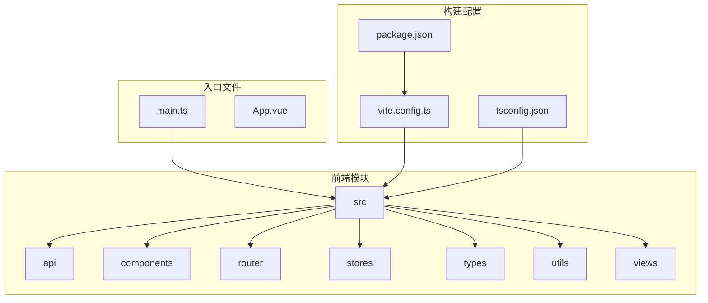
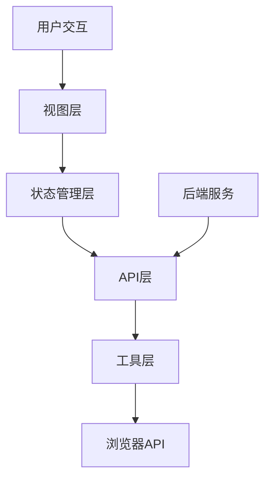
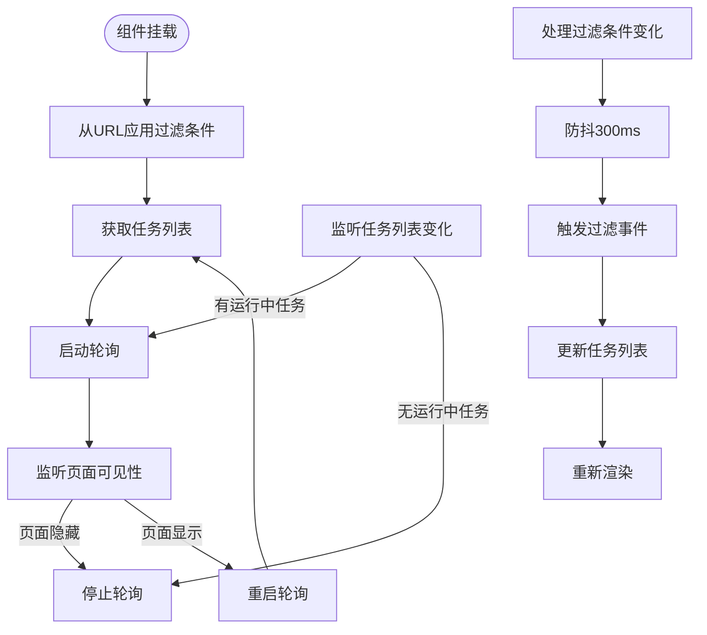
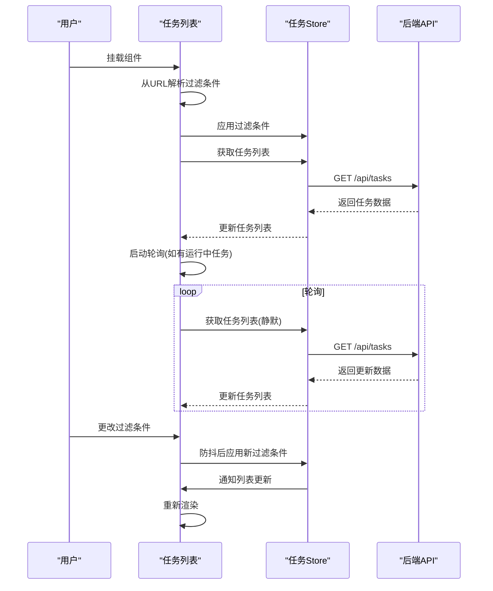
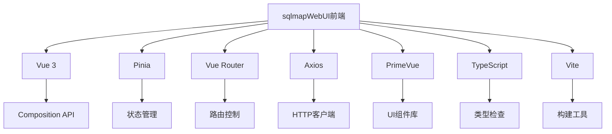

# 前端功能增强

<cite>
**本文档引用的文件**   
- [main.ts](file://src/frontEnd/src/main.ts)
- [package.json](file://src/frontEnd/package.json)
- [vite.config.ts](file://src/frontEnd/vite.config.ts)
- [App.vue](file://src/frontEnd/src/App.vue)
- [index.ts](file://src/frontEnd/src/router/index.ts)
- [request.ts](file://src/frontEnd/src/api/request.ts)
- [task.ts](file://src/frontEnd/src/stores/task.ts)
- [auth.ts](file://src/frontEnd/src/stores/auth.ts)
- [useSmartPolling.ts](file://src/frontEnd/src/utils/useSmartPolling.ts)
- [TaskList/index.vue](file://src/frontEnd/src/views/TaskList/index.vue)
- [TaskFilter.vue](file://src/frontEnd/src/components/TaskFilter.vue)
- [TaskDetail/index.vue](file://src/frontEnd/src/views/TaskDetail/index.vue)
- [task.ts](file://src/frontEnd/src/types/task.ts)
- [format.ts](file://src/frontEnd/src/utils/format.ts)
- [guards.ts](file://src/frontEnd/src/router/guards.ts)
</cite>

## 目录
1. [简介](#简介)
2. [项目结构](#项目结构)
3. [核心组件](#核心组件)
4. [架构概览](#架构概览)
5. [详细组件分析](#详细组件分析)
6. [依赖分析](#依赖分析)
7. [性能考虑](#性能考虑)
8. [故障排除指南](#故障排除指南)
9. [结论](#结论)
10. [附录](#附录)（如有必要）

## 简介
本项目是一个基于Vue 3和PrimeVue的现代化前端应用，旨在为sqlmap提供一个功能丰富、用户体验优秀的Web界面。前端功能增强主要体现在智能轮询、双模式认证、高级过滤和统计可视化等方面。系统支持本地访问和远程访问两种模式，通过环境变量进行配置。前端通过Vite构建，集成了TypeScript、Pinia状态管理、Vue Router路由控制等现代前端技术栈。UI组件库采用PrimeVue，提供了丰富的交互组件和美观的视觉设计。

## 项目结构
前端项目采用标准的Vue 3 + Vite项目结构，遵循模块化设计原则。src目录下包含api、components、router、stores、types、utils和views等核心模块，实现了关注点分离。项目配置文件包括vite.config.ts、package.json等，定义了构建、代理和依赖管理。静态资源通过Vite的构建流程处理，最终输出到后端的static目录，实现前后端的无缝集成。

**图表来源**
- [main.ts](file://src/frontEnd/src/main.ts#L1-L16)
- [vite.config.ts](file://src/frontEnd/vite.config.ts#L1-L74)
- [package.json](file://src/frontEnd/package.json#L1-L39)

**章节来源**
- [main.ts](file://src/frontEnd/src/main.ts#L1-L16)
- [vite.config.ts](file://src/frontEnd/vite.config.ts#L1-L74)
- [package.json](file://src/frontEnd/package.json#L1-L39)

## 核心组件
前端核心组件包括任务管理、认证控制、API封装和智能轮询等。任务管理通过Pinia store实现状态管理，提供任务列表、过滤、排序和批量操作功能。认证控制支持本地和远程双模式，通过路由守卫实现访问控制。API封装基于Axios，提供了请求拦截、响应处理、错误提示和自动重试机制。智能轮询Hook结合页面可见性、网络状态和后端健康检查，实现了高效的数据同步。

**章节来源**
- [task.ts](file://src/frontEnd/src/stores/task.ts#L1-L390)
- [auth.ts](file://src/frontEnd/src/stores/auth.ts#L1-L175)
- [request.ts](file://src/frontEnd/src/api/request.ts#L1-L230)
- [useSmartPolling.ts](file://src/frontEnd/src/utils/useSmartPolling.ts#L1-L210)

## 架构概览
系统采用分层架构，从前到后分为视图层、状态管理层、API层和工具层。视图层由Vue组件构成，负责用户界面展示和交互。状态管理层使用Pinia管理应用状态，实现组件间的状态共享。API层封装了与后端的通信逻辑，提供统一的请求接口。工具层包含格式化、验证、存储等通用工具函数。各层之间通过清晰的接口进行通信，降低了耦合度，提高了代码的可维护性。

**图表来源**
- [App.vue](file://src/frontEnd/src/App.vue#L1-L33)
- [main.ts](file://src/frontEnd/src/main.ts#L1-L16)
- [stores/index.ts](file://src/frontEnd/src/stores/index.ts#L1-L7)

## 详细组件分析

### 任务列表组件分析
任务列表组件是系统的核心功能之一，提供了任务的展示、过滤、排序和操作功能。组件通过Pinia store获取任务数据，使用DataTable组件进行展示，支持分页、排序和选择。过滤功能包括URL关键字、报文关键字、状态、时间范围和注入状态等多种条件，通过防抖技术优化性能。统计信息以汇总行和弹出框的形式展示，提供了直观的数据概览。

#### 对于复杂逻辑组件：

**图表来源**
- [TaskList/index.vue](file://src/frontEnd/src/views/TaskList/index.vue#L1-L800)
- [TaskFilter.vue](file://src/frontEnd/src/components/TaskFilter.vue#L1-L598)

#### 对于API/服务组件：

**图表来源**
- [TaskList/index.vue](file://src/frontEnd/src/views/TaskList/index.vue#L1-L800)
- [task.ts](file://src/frontEnd/src/stores/task.ts#L1-L390)
- [request.ts](file://src/frontEnd/src/api/request.ts#L1-L230)

**章节来源**
- [TaskList/index.vue](file://src/frontEnd/src/views/TaskList/index.vue#L1-L800)
- [TaskFilter.vue](file://src/frontEnd/src/components/TaskFilter.vue#L1-L598)
- [task.ts](file://src/frontEnd/src/stores/task.ts#L1-L390)

### 任务详情组件分析
任务详情组件提供了任务的全面信息展示，包括基础信息、HTTP请求、扫描配置、扫描结果、任务日志和错误记录等多个标签页。组件根据任务状态动态显示操作按钮，如停止、删除等。通过Tabs组件实现标签页切换，每个标签页按需加载数据，优化了性能。组件支持URL参数控制默认激活的标签页，提升了用户体验。

**章节来源**
- [TaskDetail/index.vue](file://src/frontEnd/src/views/TaskDetail/index.vue#L1-L301)

## 依赖分析
前端项目依赖主要分为运行时依赖和开发依赖。运行时依赖包括Vue 3、Pinia、Vue Router、Axios、PrimeVue等核心框架和库。开发依赖包括Vite、TypeScript、ESLint、Prettier等构建和开发工具。项目通过pnpm进行依赖管理，确保了依赖的一致性和可重现性。Vite配置中定义了别名和代理，简化了模块导入和跨域请求。

**图表来源**
- [package.json](file://src/frontEnd/package.json#L1-L39)
- [vite.config.ts](file://src/frontEnd/vite.config.ts#L1-L74)

**章节来源**
- [package.json](file://src/frontEnd/package.json#L1-L39)
- [vite.config.ts](file://src/frontEnd/vite.config.ts#L1-L74)

## 性能考虑
前端性能优化主要体现在以下几个方面：首先，通过Vite的ES模块原生支持，实现了快速的开发服务器启动和热更新。其次，使用Pinia进行状态管理，避免了不必要的组件重新渲染。再次，API请求封装中实现了自动重试和错误处理，提高了系统的健壮性。此外，任务列表的轮询策略根据任务状态和页面可见性动态调整，减少了不必要的网络请求。最后，组件按需加载和代码分割进一步优化了初始加载性能。

## 故障排除指南
常见问题包括后端连接失败、认证问题和数据同步异常。对于后端连接失败，首先检查后端服务是否正常运行，然后确认Vite代理配置是否正确。对于认证问题，检查环境变量配置和Token存储状态。对于数据同步异常，检查轮询逻辑和网络状态。系统提供了详细的错误提示和日志记录，帮助快速定位问题。健康检查功能可以实时监控后端服务状态，及时发现和报告问题。

**章节来源**
- [request.ts](file://src/frontEnd/src/api/request.ts#L1-L230)
- [auth.ts](file://src/frontEnd/src/stores/auth.ts#L1-L175)
- [useSmartPolling.ts](file://src/frontEnd/src/utils/useSmartPolling.ts#L1-L210)

## 结论
本前端系统通过现代化的技术栈和精心的设计，为sqlmap提供了一个功能强大、用户体验优秀的Web界面。双模式认证、智能轮询、高级过滤和统计可视化等特性显著提升了系统的可用性和效率。代码结构清晰，模块化程度高，便于维护和扩展。未来可以进一步优化性能，增加更多可视化功能，提升用户体验。

## 附录
### API定义
| 端点 | 方法 | 描述 | 请求体 | 响应 |
| --- | --- | --- | --- | --- |
| /api/tasks | GET | 获取任务列表 | 无 | 任务数组 |
| /api/tasks | POST | 创建任务 | 任务数据 | 新任务信息 |
| /api/tasks/{id} | DELETE | 删除任务 | 无 | 无 |
| /api/tasks/{id}/stop | POST | 停止任务 | 无 | 无 |
| /api/login | POST | 用户登录 | 登录凭据 | Token和用户信息 |

**章节来源**
- [task.ts](file://src/frontEnd/src/stores/task.ts#L1-L390)
- [auth.ts](file://src/frontEnd/src/stores/auth.ts#L1-L175)

### 核心组件属性定义
| 组件 | 属性 | 类型 | 描述 |
| --- | --- | --- | --- |
| TaskList | filters | TaskFilters | 任务过滤条件 |
| TaskList | loading | boolean | 加载状态 |
| TaskFilter | filteredCount | number | 过滤后任务数 |
| TaskFilter | totalCount | number | 总任务数 |
| TaskDetail | activeTab | string | 激活的标签页 |

**章节来源**
- [TaskList/index.vue](file://src/frontEnd/src/views/TaskList/index.vue#L1-L800)
- [TaskFilter.vue](file://src/frontEnd/src/components/TaskFilter.vue#L1-L598)
- [TaskDetail/index.vue](file://src/frontEnd/src/views/TaskDetail/index.vue#L1-L301)