# 后端服务文档

<cite>
**本文档中引用的文件**
- [app.py](file://src/backEnd/app.py)
- [main.py](file://src/backEnd/main.py)
- [config.py](file://src/backEnd/config.py)
- [authController.py](file://src/backEnd/api/commonApi/authController.py)
- [configController.py](file://src/backEnd/api/commonApi/configController.py)
- [headerController.py](file://src/backEnd/api/commonApi/headerController.py)
- [headerRuleService.py](file://src/backEnd/service/headerRuleService.py)
- [DataStore.py](file://src/backEnd/model/DataStore.py)
- [Database.py](file://src/backEnd/model/Database.py)
- [HeaderDatabase.py](file://src/backEnd/model/HeaderDatabase.py)
- [Task.py](file://src/backEnd/model/Task.py)
- [task_monitor.py](file://src/backEnd/utils/task_monitor.py)
- [auth.py](file://src/backEnd/utils/auth.py)
- [header_processor.py](file://src/backEnd/utils/header_processor.py)
- [header_parser.py](file://src/backEnd/utils/header_parser.py)
</cite>

## 目录
1. [简介](#简介)
2. [项目结构](#项目结构)
3. [核心组件](#核心组件)
4. [架构概述](#架构概述)
5. [详细组件分析](#详细组件分析)
6. [依赖分析](#依赖分析)
7. [性能考虑](#性能考虑)
8. [故障排除指南](#故障排除指南)
9. [结论](#结论)

## 简介
本项目是一个基于FastAPI的后端服务，为SQLMap Web UI提供API接口。该服务主要功能包括任务管理、请求头规则管理、认证和配置管理。后端服务通过集成SQLMap工具，为前端提供漏洞扫描能力。服务采用模块化设计，包含API控制器、业务服务、数据模型和工具类等组件，实现了请求头处理、任务调度、数据库管理等功能。

## 项目结构

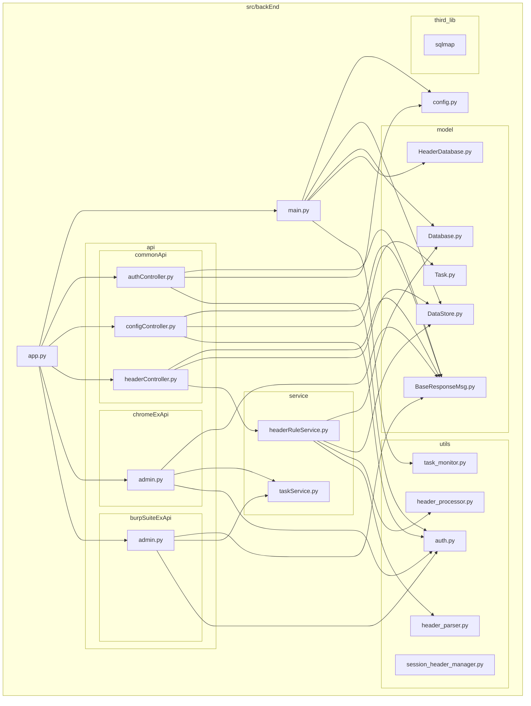

**图表来源**
- [app.py](file://src/backEnd/app.py)
- [main.py](file://src/backEnd/main.py)
- [config.py](file://src/backEnd/config.py)
- [authController.py](file://src/backEnd/api/commonApi/authController.py)
- [configController.py](file://src/backEnd/api/commonApi/configController.py)
- [headerController.py](file://src/backEnd/api/commonApi/headerController.py)
- [headerRuleService.py](file://src/backEnd/service/headerRuleService.py)
- [DataStore.py](file://src/backEnd/model/DataStore.py)
- [Database.py](file://src/backEnd/model/Database.py)
- [HeaderDatabase.py](file://src/backEnd/model/HeaderDatabase.py)
- [Task.py](file://src/backEnd/model/Task.py)
- [task_monitor.py](file://src/backEnd/utils/task_monitor.py)
- [auth.py](file://src/backEnd/utils/auth.py)
- [header_processor.py](file://src/backEnd/utils/header_processor.py)
- [header_parser.py](file://src/backEnd/utils/header_parser.py)

**章节来源**
- [app.py](file://src/backEnd/app.py)
- [main.py](file://src/backEnd/main.py)
- [config.py](file://src/backEnd/config.py)
- [authController.py](file://src/backEnd/api/commonApi/authController.py)
- [configController.py](file://src/backEnd/api/commonApi/configController.py)
- [headerController.py](file://src/backEnd/api/commonApi/headerController.py)

## 核心组件

后端服务的核心组件包括API控制器、业务服务、数据模型和工具类。API控制器负责处理HTTP请求，业务服务实现核心业务逻辑，数据模型定义数据结构，工具类提供通用功能。

**章节来源**
- [app.py](file://src/backEnd/app.py#L1-L76)
- [main.py](file://src/backEnd/main.py#L1-L163)
- [config.py](file://src/backEnd/config.py#L1-L8)

## 架构概述

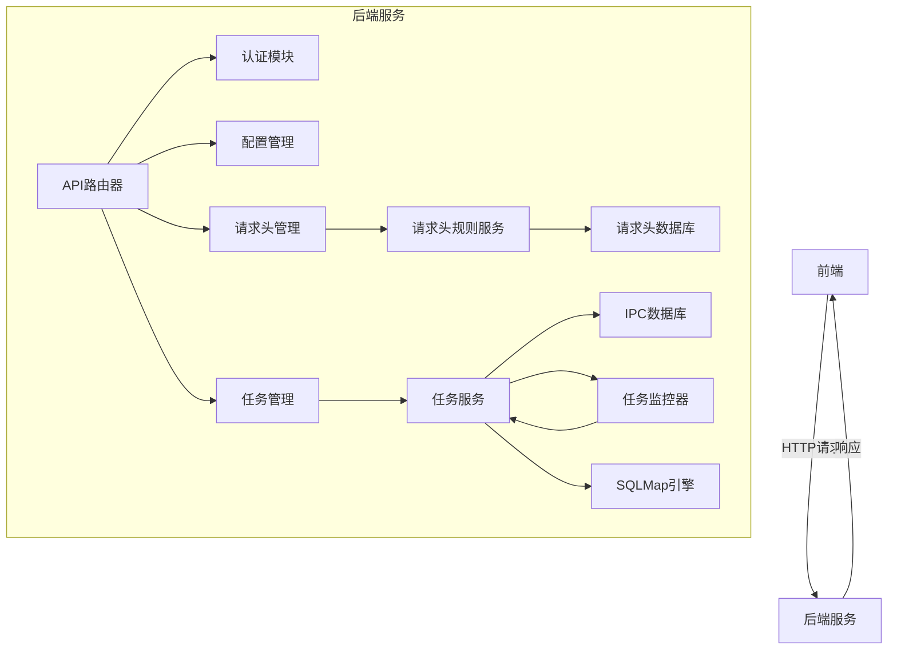

**图表来源**
- [app.py](file://src/backEnd/app.py)
- [main.py](file://src/backEnd/main.py)
- [headerRuleService.py](file://src/backEnd/service/headerRuleService.py)
- [taskService.py](file://src/backEnd/service/taskService.py)
- [task_monitor.py](file://src/backEnd/utils/task_monitor.py)

## 详细组件分析

### API控制器分析

#### 认证控制器
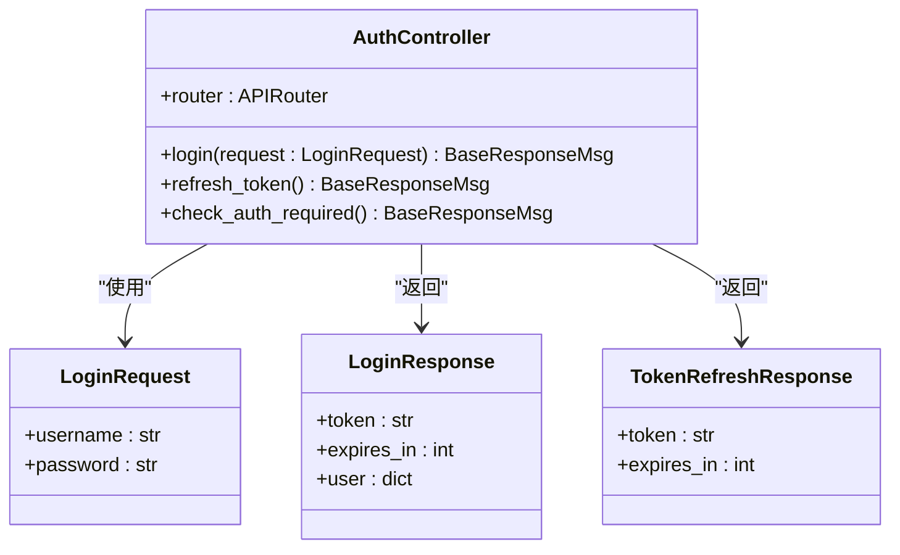

**图表来源**
- [authController.py](file://src/backEnd/api/commonApi/authController.py#L1-L150)

#### 配置控制器
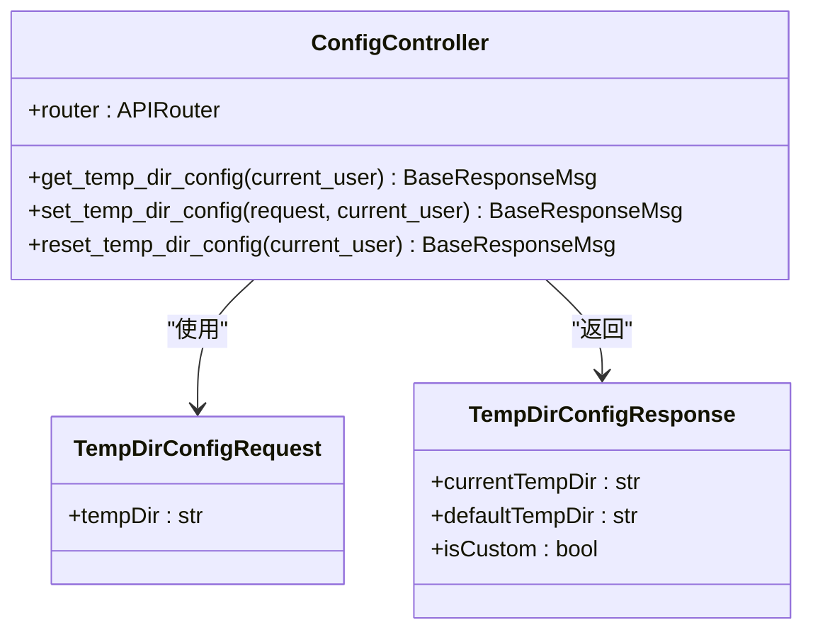

**图表来源**
- [configController.py](file://src/backEnd/api/commonApi/configController.py#L1-L173)

#### 请求头控制器
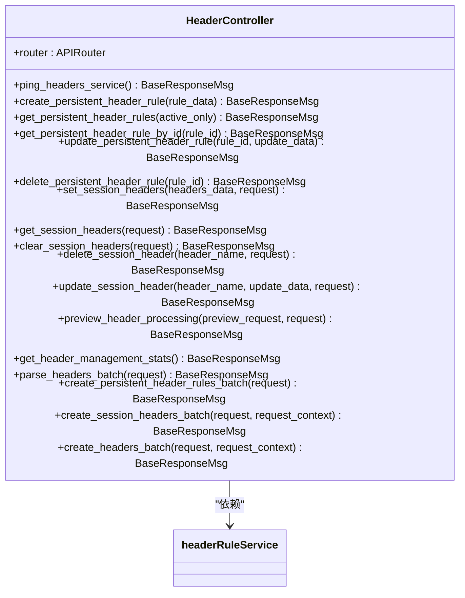

**图表来源**
- [headerController.py](file://src/backEnd/api/commonApi/headerController.py#L1-L481)

### 业务服务分析

#### 请求头规则服务
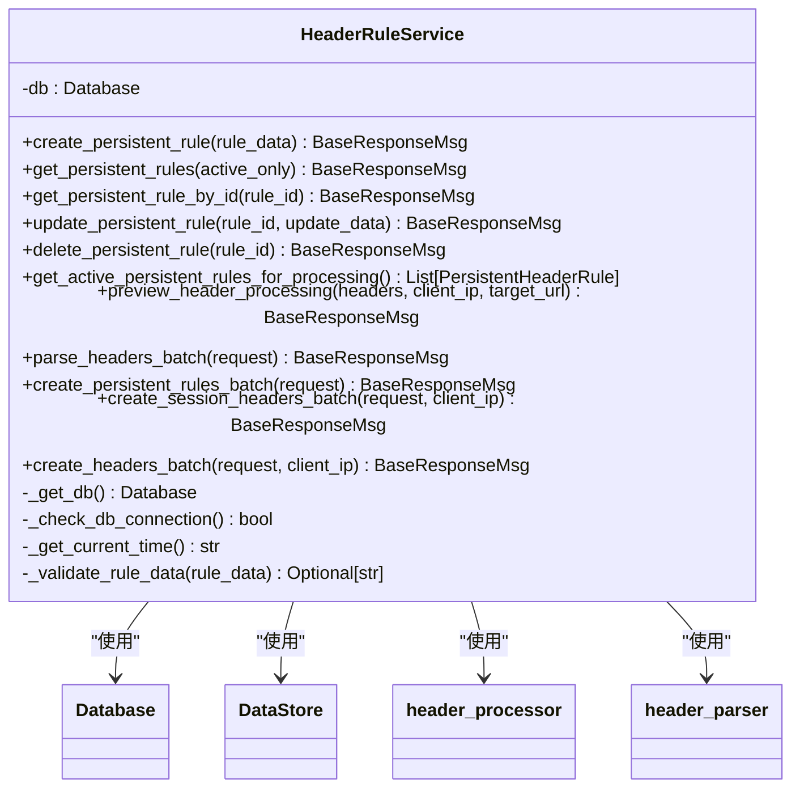

**图表来源**
- [headerRuleService.py](file://src/backEnd/service/headerRuleService.py#L1-L976)

### 数据模型分析

#### 数据存储模型
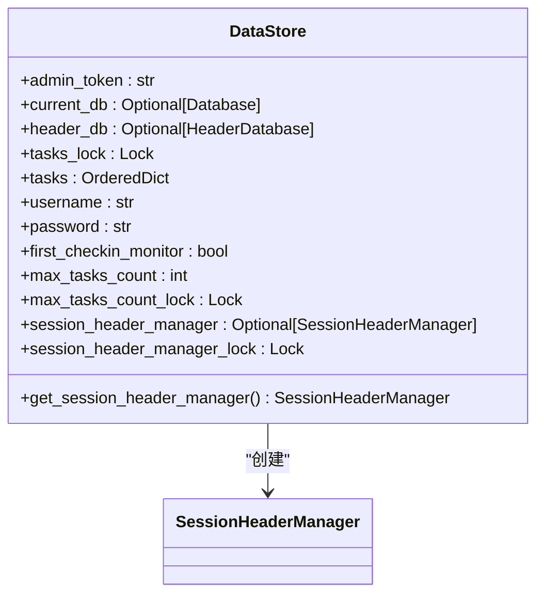

**图表来源**
- [DataStore.py](file://src/backEnd/model/DataStore.py#L1-L34)

#### 数据库模型
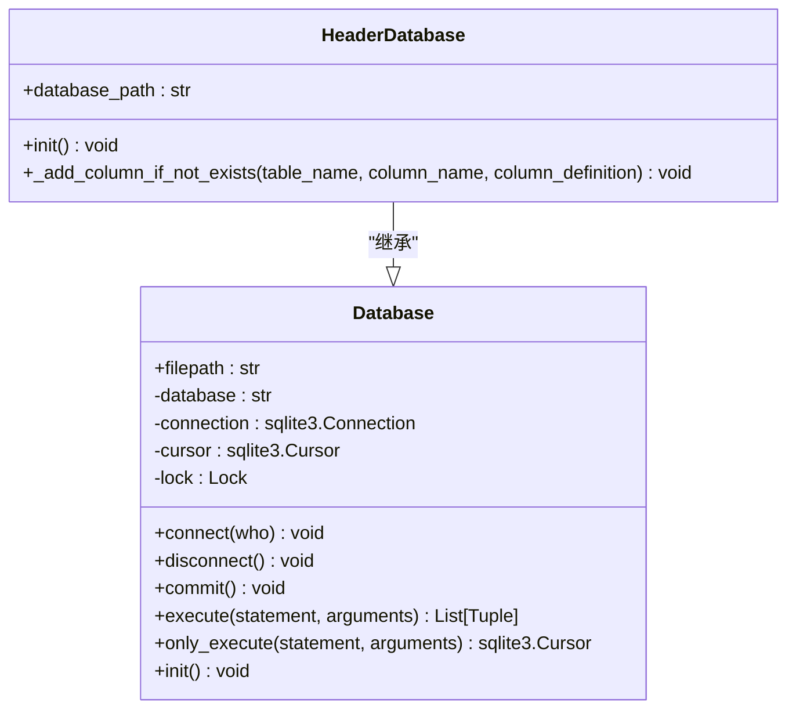

**图表来源**
- [Database.py](file://src/backEnd/model/Database.py#L1-L99)
- [HeaderDatabase.py](file://src/backEnd/model/HeaderDatabase.py#L1-L126)

### 工具类分析

#### 请求头处理器
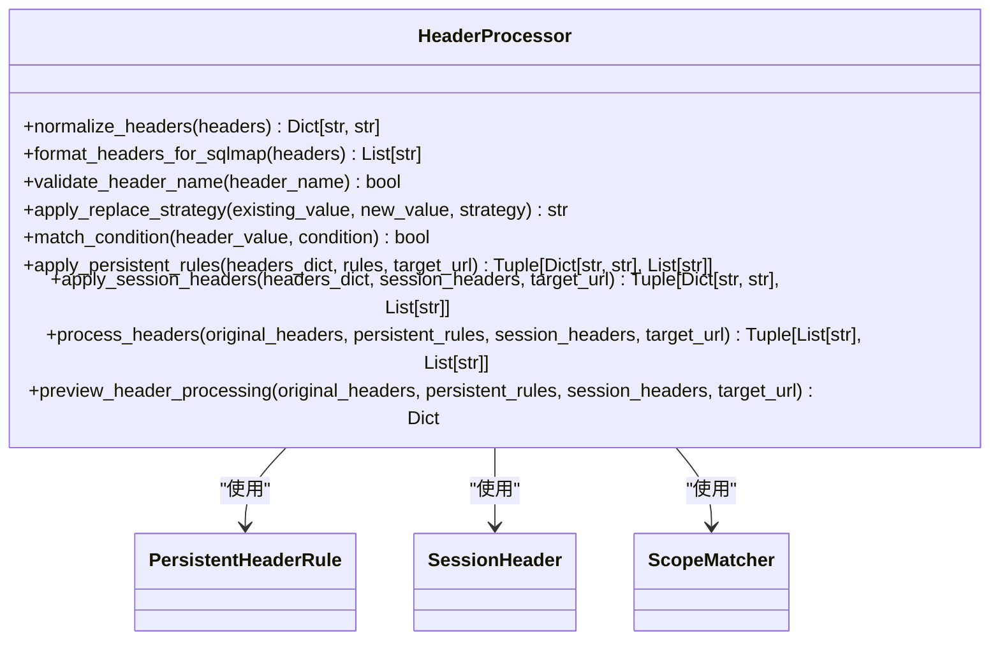

**图表来源**
- [header_processor.py](file://src/backEnd/utils/header_processor.py#L1-L292)

#### 请求头解析器
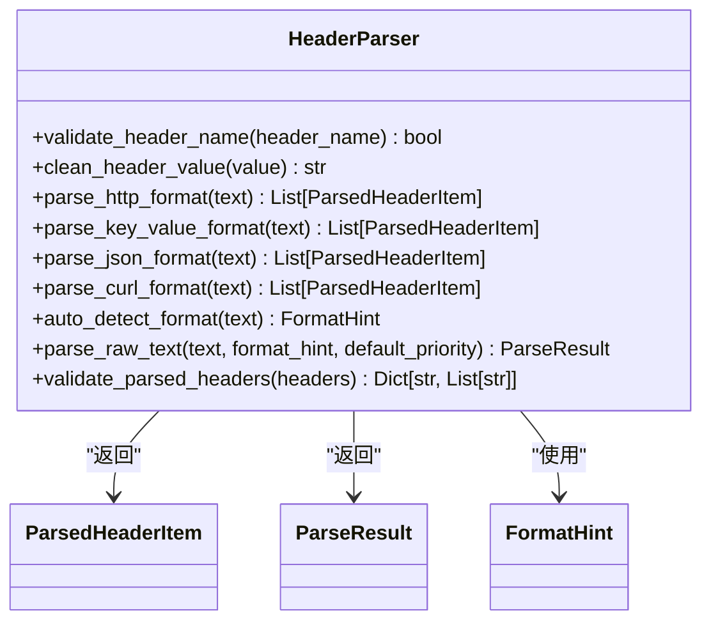

**图表来源**
- [header_parser.py](file://src/backEnd/utils/header_parser.py#L1-L343)

## 依赖分析

```mermaid
graph TD
app[app.py] --> main[main.py]
main[main.py] --> config[config.py]
main[main.py] --> DataStore[DataStore.py]
main[main.py] --> Database[Database.py]
main[main.py] --> HeaderDatabase[HeaderDatabase.py]
main[main.py] --> task_monitor[task_monitor.py]
app[app.py] --> authController[authController.py]
app[app.py] --> configController[configController.py]
app[app.py] --> headerController[headerController.py]
app[app.py] --> chromeAdmin[admin.py]
app[app.py] --> burpAdmin[admin.py]
authController[authController.py] --> BaseResponseMsg[BaseResponseMsg.py]
authController[authController.py] --> config[config.py]
authController[authController.py] --> auth[auth.py]
configController[configController.py] --> BaseResponseMsg[BaseResponseMsg.py]
configController[configController.py] --> Task[Task.py]
configController[configController.py] --> auth[auth.py]
headerController[headerController.py] --> BaseResponseMsg[BaseResponseMsg.py]
headerController[headerController.py] --> DataStore[DataStore.py]
headerController[headerController.py] --> headerRuleService[headerRuleService.py]
headerRuleService[headerRuleService.py] --> Database[Database.py]
headerRuleService[headerRuleService.py] --> DataStore[DataStore.py]
headerRuleService[headerRuleService.py] --> header_processor[header_processor.py]
headerRuleService[headerRuleService.py] --> header_parser[header_parser.py]
chromeAdmin[admin.py] --> BaseResponseMsg[BaseResponseMsg.py]
chromeAdmin[admin.py] --> taskService[taskService.py]
chromeAdmin[admin.py] --> auth[auth.py]
burpAdmin[admin.py] --> BaseResponseMsg[BaseResponseMsg.py]
burpAdmin[admin.py] --> taskService[taskService.py]
burpAdmin[admin.py] --> auth[auth.py]
Task[Task.py] --> TaskStatus[TaskStatus.py]
Task[Task.py] --> Database[Database.py]
task_monitor[task_monitor.py] --> DataStore[DataStore.py]
task_monitor[task_monitor.py] --> TaskStatus[TaskStatus.py]
DataStore[DataStore.py] --> Database[Database.py]
DataStore[DataStore.py] --> HeaderDatabase[HeaderDatabase.py]
DataStore[DataStore.py] --> session_header_manager[session_header_manager.py]
HeaderDatabase[HeaderDatabase.py] --> Database[Database.py]
header_processor[header_processor.py] --> PersistentHeaderRule[PersistentHeaderRule.py]
header_processor[header_processor.py] --> SessionHeader[SessionHeader.py]
header_processor[header_processor.py] --> ScopeMatcher[scope_matcher.py]
header_parser[header_parser.py] --> ParsedHeaderItem[ParsedHeaderItem.py]
header_parser[header_parser.py] --> ParseResult[ParseResult.py]
header_parser[header_parser.py] --> FormatHint[FormatHint.py]
```

**图表来源**
- [app.py](file://src/backEnd/app.py)
- [main.py](file://src/backEnd/main.py)
- [config.py](file://src/backEnd/config.py)
- [authController.py](file://src/backEnd/api/commonApi/authController.py)
- [configController.py](file://src/backEnd/api/commonApi/configController.py)
- [headerController.py](file://src/backEnd/api/commonApi/headerController.py)
- [headerRuleService.py](file://src/backEnd/service/headerRuleService.py)
- [DataStore.py](file://src/backEnd/model/DataStore.py)
- [Database.py](file://src/backEnd/model/Database.py)
- [HeaderDatabase.py](file://src/backEnd/model/HeaderDatabase.py)
- [Task.py](file://src/backEnd/model/Task.py)
- [task_monitor.py](file://src/backEnd/utils/task_monitor.py)
- [auth.py](file://src/backEnd/utils/auth.py)
- [header_processor.py](file://src/backEnd/utils/header_processor.py)
- [header_parser.py](file://src/backEnd/utils/header_parser.py)

**章节来源**
- [app.py](file://src/backEnd/app.py)
- [main.py](file://src/backEnd/main.py)
- [config.py](file://src/backEnd/config.py)
- [authController.py](file://src/backEnd/api/commonApi/authController.py)
- [configController.py](file://src/backEnd/api/commonApi/configController.py)
- [headerController.py](file://src/backEnd/api/commonApi/headerController.py)
- [headerRuleService.py](file://src/backEnd/service/headerRuleService.py)
- [DataStore.py](file://src/backEnd/model/DataStore.py)
- [Database.py](file://src/backEnd/model/Database.py)
- [HeaderDatabase.py](file://src/backEnd/model/HeaderDatabase.py)
- [Task.py](file://src/backEnd/model/Task.py)
- [task_monitor.py](file://src/backEnd/utils/task_monitor.py)
- [auth.py](file://src/backEnd/utils/auth.py)
- [header_processor.py](file://src/backEnd/utils/header_processor.py)
- [header_parser.py](file://src/backEnd/utils/header_parser.py)

## 性能考虑

后端服务在性能方面有以下考虑：

1. **任务调度**：通过`task_monitor.py`中的`monitor`函数实现任务调度，根据CPU使用率动态调整最大任务数，确保系统资源合理利用。

2. **数据库连接**：使用SQLite数据库，通过`Database`类的`execute`方法实现线程安全的数据库操作，避免数据库锁问题。

3. **内存管理**：在`DataStore`类中使用`OrderedDict`存储任务，便于任务管理和清理。

4. **异步处理**：API控制器使用`async`关键字定义异步函数，提高并发处理能力。

5. **缓存机制**：`DataStore`类中的`session_header_manager`使用单例模式，避免重复创建实例。

**章节来源**
- [task_monitor.py](file://src/backEnd/utils/task_monitor.py#L1-L94)
- [Database.py](file://src/backEnd/model/Database.py#L1-L99)
- [DataStore.py](file://src/backEnd/model/DataStore.py#L1-L34)

## 故障排除指南

### 常见问题及解决方案

1. **数据库连接失败**
   - 检查数据库文件路径是否正确
   - 确保数据库文件有读写权限
   - 检查数据库是否被其他进程占用

2. **任务无法启动**
   - 检查`DataStore.max_tasks_count`是否设置合理
   - 确认SQLMap引擎路径是否正确
   - 检查任务配置是否完整

3. **请求头处理失败**
   - 验证请求头名称格式是否符合规范
   - 检查请求头值是否过长
   - 确认请求头规则配置是否正确

4. **认证失败**
   - 检查客户端IP是否在允许范围内
   - 确认认证令牌是否正确
   - 验证认证配置是否启用

**章节来源**
- [Database.py](file://src/backEnd/model/Database.py#L1-L99)
- [task_monitor.py](file://src/backEnd/utils/task_monitor.py#L1-L94)
- [header_processor.py](file://src/backEnd/utils/header_processor.py#L1-L292)
- [auth.py](file://src/backEnd/utils/auth.py#L1-L23)

## 结论

本后端服务文档详细介绍了SQLMap Web UI后端服务的架构、组件和功能。服务采用模块化设计，具有良好的可扩展性和维护性。通过FastAPI框架提供RESTful API，实现了任务管理、请求头规则管理、认证和配置管理等功能。服务与SQLMap引擎集成，为前端提供漏洞扫描能力。整体架构清晰，组件职责明确，为系统的稳定运行提供了保障。