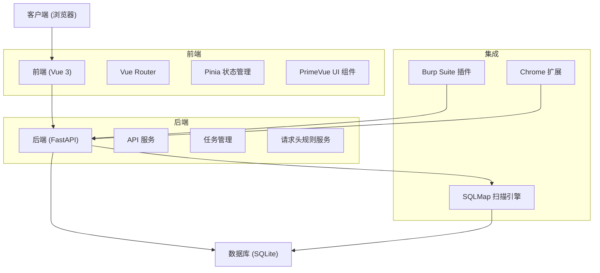
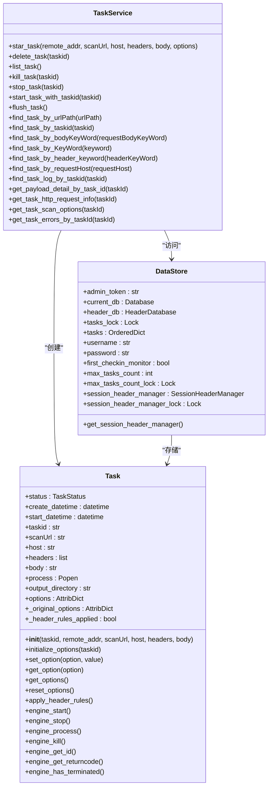
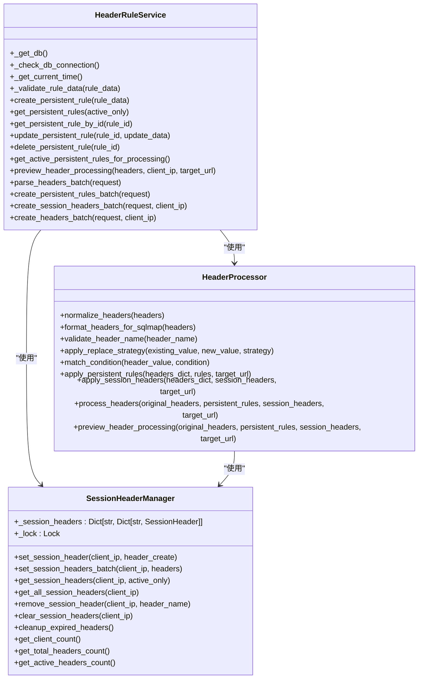
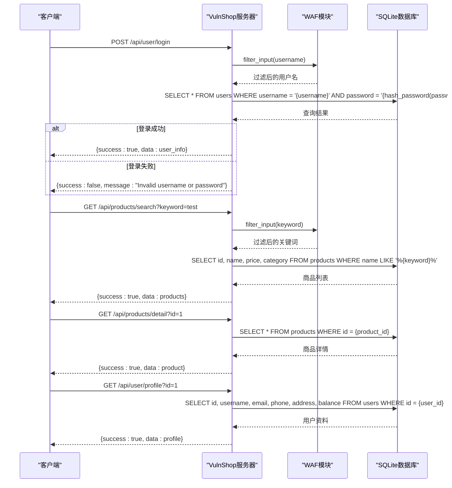
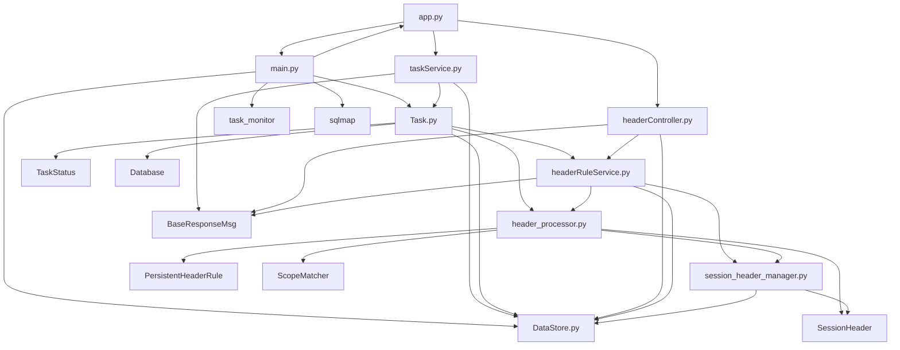

# 漏洞测试实验室

<cite>
**本文档引用的文件**   
- [README.md](file://README.md)
- [app.py](file://src/backEnd/app.py)
- [main.py](file://src/backEnd/main.py)
- [config.py](file://src/backEnd/config.py)
- [DataStore.py](file://src/backEnd/model/DataStore.py)
- [Task.py](file://src/backEnd/model/Task.py)
- [taskService.py](file://src/backEnd/service/taskService.py)
- [task_monitor.py](file://src/backEnd/utils/task_monitor.py)
- [headerController.py](file://src/backEnd/api/commonApi/headerController.py)
- [headerRuleService.py](file://src/backEnd/service/headerRuleService.py)
- [header_processor.py](file://src/backEnd/utils/header_processor.py)
- [session_header_manager.py](file://src/backEnd/utils/session_header_manager.py)
- [server.py](file://src/vulnTestServer/server.py)
</cite>

## 目录
1. [简介](#简介)
2. [项目结构](#项目结构)
3. [核心组件](#核心组件)
4. [架构概述](#架构概述)
5. [详细组件分析](#详细组件分析)
6. [依赖分析](#依赖分析)
7. [性能考虑](#性能考虑)
8. [故障排除指南](#故障排除指南)
9. [结论](#结论)

## 简介
漏洞测试实验室是一个现代化的SQLMap Web界面，为安全研究人员提供便捷的SQL注入测试平台。该项目集成了SQLMap自动化检测工具，提供了任务管理、实时日志监控、扫描结果展示等功能。系统内置VulnShop漏洞靶场，包含8种SQL注入漏洞类型，支持亮色/暗色主题切换，提供完整的购物流程模拟。项目采用前后端分离架构，后端使用FastAPI框架，前端使用Vue 3框架，通过Burp Suite插件和Chrome扩展实现与安全测试工具的集成。

## 项目结构

```mermaid
graph TD
sqlmapWebUI["sqlmapWebUI/"]
src["src/"]
backEnd["backEnd/"]
frontEnd["frontEnd/"]
burpEx["burpEx/"]
vulnTestServer["vulnTestServer/"]
doc["doc/"]
src --> backEnd
src --> frontEnd
src --> burpEx
src --> vulnTestServer
backEnd --> api
backEnd --> model
backEnd --> service
backEnd --> utils
backEnd --> third_lib
backEnd --> app.py
backEnd --> main.py
api --> chromeExApi
api --> burpSuiteExApi
api --> commonApi
model --> Task.py
model --> DataStore.py
model --> Database.py
model --> TaskStatus.py
service --> taskService.py
service --> headerRuleService.py
utils --> task_monitor.py
utils --> header_processor.py
utils --> session_header_manager.py
third_lib --> sqlmap
frontEnd --> src
frontEnd --> package.json
frontEnd --> pnpm-lock.yaml
src --> api
src --> components
src --> stores
src --> views
src --> utils
burpEx --> legacy-api
burpEx --> montoya-api
vulnTestServer --> server.py
vulnTestServer --> database.py
vulnTestServer --> waf.py
doc --> README.md
doc --> USAGE_GUIDE.md
doc --> FEATURE_UPDATES.md
sqlmapWebUI --> src
sqlmapWebUI --> doc
sqlmapWebUI --> .gitignore
sqlmapWebUI --> README.md
```

**图源**
- [README.md](file://README.md#L127-L161)

**本节源**
- [README.md](file://README.md#L127-L161)

## 核心组件

漏洞测试实验室的核心组件包括任务管理、请求头规则处理、扫描引擎集成和漏洞靶场。任务管理组件负责创建、监控和管理SQL注入扫描任务，通过TaskService类实现任务的生命周期管理。请求头规则处理组件支持持久化规则和会话性请求头，允许用户灵活配置自定义请求头规则。扫描引擎集成组件将SQLMap工具封装为API服务，实现自动化扫描。漏洞靶场组件提供了一个包含多种SQL注入漏洞的模拟电商平台，用于安全测试和教育目的。

**本节源**
- [README.md](file://README.md#L17-L52)
- [app.py](file://src/backEnd/app.py#L1-L74)
- [main.py](file://src/backEnd/main.py#L1-L163)

## 架构概述

**图源**
- [app.py](file://src/backEnd/app.py#L1-L74)
- [main.py](file://src/backEnd/main.py#L1-L163)
- [server.py](file://src/vulnTestServer/server.py#L1-L685)

**本节源**
- [app.py](file://src/backEnd/app.py#L1-L74)
- [main.py](file://src/backEnd/main.py#L1-L163)

## 详细组件分析

### 任务管理组件分析

任务管理组件是漏洞测试实验室的核心功能之一，负责处理SQL注入扫描任务的整个生命周期。该组件通过TaskService类实现，提供了创建、启动、停止、删除和查询任务的功能。每个任务在创建时会分配一个唯一的任务ID，并存储在DataStore的有序字典中。任务状态包括新建(New)、可运行(Runnable)、运行中(Running)、阻塞(Blocked)和终止(Terminated)。

**图源**
- [Task.py](file://src/backEnd/model/Task.py#L20-L209)
- [taskService.py](file://src/backEnd/service/taskService.py#L46-L534)
- [DataStore.py](file://src/backEnd/model/DataStore.py#L9-L34)

**本节源**
- [Task.py](file://src/backEnd/model/Task.py#L1-L209)
- [taskService.py](file://src/backEnd/service/taskService.py#L1-L535)
- [DataStore.py](file://src/backEnd/model/DataStore.py#L1-L34)

### 请求头规则组件分析

请求头规则组件提供了灵活的请求头管理功能，支持持久化规则和会话性请求头。持久化规则存储在数据库中，具有名称、优先级、作用域等属性，可以配置不同的替换策略。会话性请求头基于客户端IP地址管理，具有生存时间(TTL)和优先级，适用于临时的请求头设置。该组件通过HeaderRuleService类实现业务逻辑，HeaderProcessor类处理请求头的解析和应用。

**图源**
- [headerRuleService.py](file://src/backEnd/service/headerRuleService.py#L32-L800)
- [header_processor.py](file://src/backEnd/utils/header_processor.py#L12-L292)
- [session_header_manager.py](file://src/backEnd/utils/session_header_manager.py#L14-L260)

**本节源**
- [headerRuleService.py](file://src/backEnd/service/headerRuleService.py#L1-L800)
- [header_processor.py](file://src/backEnd/utils/header_processor.py#L1-L292)
- [session_header_manager.py](file://src/backEnd/utils/session_header_manager.py#L1-L260)

### 漏洞靶场组件分析

漏洞靶场组件提供了一个包含多种SQL注入漏洞的模拟电商平台，用于安全测试和教育目的。该组件通过Python内置的HTTPServer实现，提供了8种不同类型的SQL注入漏洞，包括基于错误的注入、联合查询注入、布尔盲注、时间盲注、堆叠查询注入和二次注入。靶场支持3种难度级别，配合WAF防护，提供了完整的购物流程模拟。

**图源**
- [server.py](file://src/vulnTestServer/server.py#L37-L685)

**本节源**
- [server.py](file://src/vulnTestServer/server.py#L1-L685)

## 依赖分析

**图源**
- [app.py](file://src/backEnd/app.py#L1-L74)
- [main.py](file://src/backEnd/main.py#L1-L163)
- [taskService.py](file://src/backEnd/service/taskService.py#L1-L535)
- [Task.py](file://src/backEnd/model/Task.py#L1-L209)
- [DataStore.py](file://src/backEnd/model/DataStore.py#L1-L34)
- [headerController.py](file://src/backEnd/api/commonApi/headerController.py#L1-L463)
- [headerRuleService.py](file://src/backEnd/service/headerRuleService.py#L1-L800)
- [header_processor.py](file://src/backEnd/utils/header_processor.py#L1-L292)
- [session_header_manager.py](file://src/backEnd/utils/session_header_manager.py#L1-L260)

**本节源**
- [app.py](file://src/backEnd/app.py#L1-L74)
- [main.py](file://src/backEnd/main.py#L1-L163)
- [taskService.py](file://src/backEnd/service/taskService.py#L1-L535)

## 性能考虑

漏洞测试实验室在性能方面进行了多项优化。任务监控器(task_monitor)使用BackgroundScheduler定期检查任务状态，动态调整最大并发任务数，根据CPU使用率和逻辑核心数决定可同时运行的任务数量。系统通过DataStore的线程锁(tasks_lock)确保多线程环境下的数据一致性，避免竞态条件。请求头处理组件采用高效的字符串操作和正则表达式匹配，确保请求头处理的性能。SQLMap扫描任务在独立进程中运行，避免阻塞主线程，提高系统的响应性。

**本节源**
- [task_monitor.py](file://src/backEnd/utils/task_monitor.py#L1-L94)
- [config.py](file://src/backEnd/config.py#L1-L8)
- [main.py](file://src/backEnd/main.py#L107-L156)

## 故障排除指南

当遇到问题时，可以按照以下步骤进行排查：

1. **检查服务状态**：访问`/api/health`端点检查后端服务是否正常运行。
2. **查看日志**：检查后端日志文件，查找错误信息和异常堆栈。
3. **验证数据库连接**：确保DataStore.current_db和DataStore.header_db连接正常。
4. **检查任务状态**：使用`list_task`接口查看任务列表和状态。
5. **验证请求头规则**：使用`preview_header_processing`接口预览请求头处理结果。
6. **检查WAF配置**：如果请求被阻止，检查WAF的过滤规则和难度级别。

常见问题包括数据库连接失败、任务启动失败、请求头规则不生效等。对于数据库连接问题，确保DataStore在main.py中正确初始化。对于任务启动失败，检查SQLMap的安装路径和配置文件。对于请求头规则问题，验证规则的优先级、作用域和替换策略设置是否正确。

**本节源**
- [main.py](file://src/backEnd/main.py#L137-L149)
- [taskService.py](file://src/backEnd/service/taskService.py#L58-L87)
- [headerRuleService.py](file://src/backEnd/service/headerRuleService.py#L77-L85)
- [task_monitor.py](file://src/backEnd/utils/task_monitor.py#L37-L40)

## 结论

漏洞测试实验室是一个功能完善的SQL注入测试平台，集成了任务管理、请求头规则处理、扫描引擎集成和漏洞靶场等核心功能。系统采用现代化的技术栈，前后端分离架构，提供了友好的用户界面和丰富的API接口。通过深入分析代码结构和组件关系，我们可以更好地理解系统的运行机制和设计原理。该平台不仅适用于安全研究人员进行SQL注入测试，也可作为教育工具帮助学习者理解SQL注入漏洞的原理和防御方法。