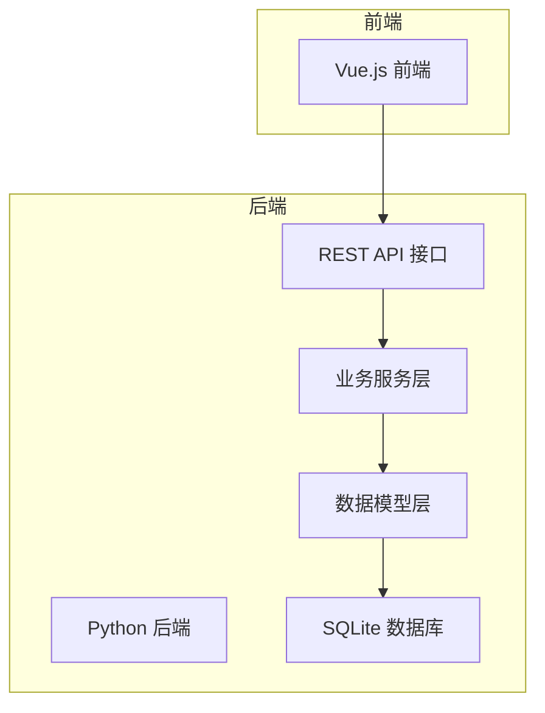
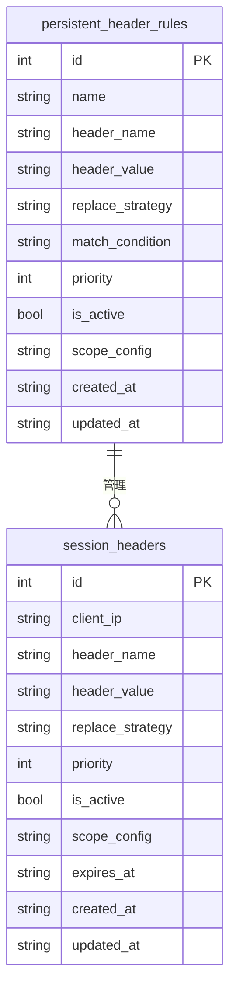
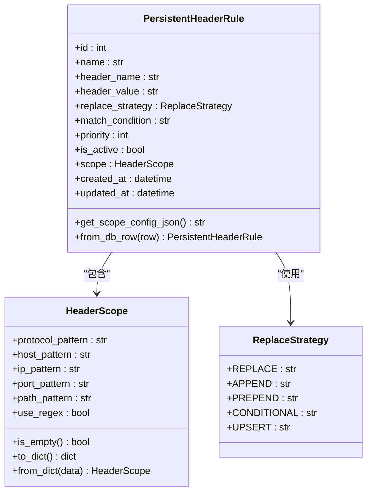
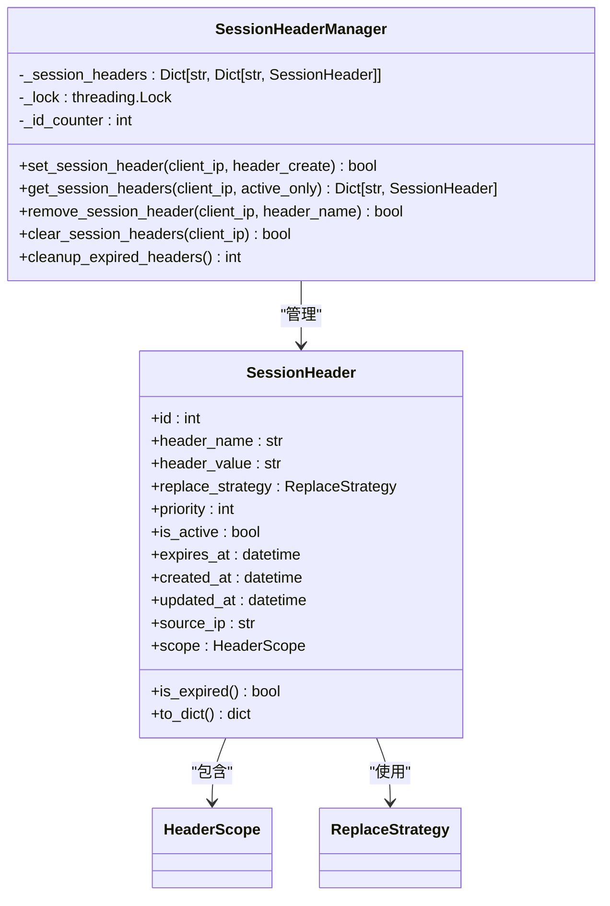
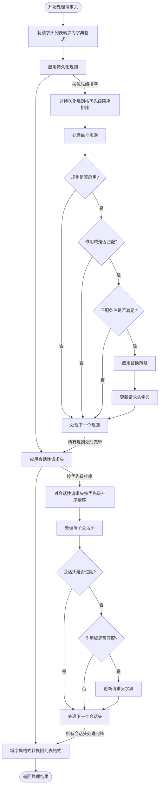
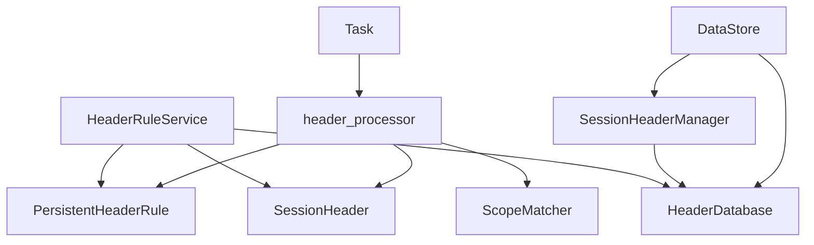

# 漏洞测试实验室数据库结构

<cite>
**本文档中引用的文件**   
- [Database.py](file://src/backEnd/model/Database.py)
- [HeaderDatabase.py](file://src/backEnd/model/HeaderDatabase.py)
- [PersistentHeaderRule.py](file://src/backEnd/model/PersistentHeaderRule.py)
- [SessionHeader.py](file://src/backEnd/model/SessionHeader.py)
- [HeaderScope.py](file://src/backEnd/model/HeaderScope.py)
- [Task.py](file://src/backEnd/model/Task.py)
- [DataStore.py](file://src/backEnd/model/DataStore.py)
- [headerRuleService.py](file://src/backEnd/service/headerRuleService.py)
- [header_processor.py](file://src/backEnd/utils/header_processor.py)
- [session_header_manager.py](file://src/backEnd/utils/session_header_manager.py)
</cite>

## 目录
1. [简介](#简介)
2. [项目结构](#项目结构)
3. [核心组件](#核心组件)
4. [数据库架构概述](#数据库架构概述)
5. [详细组件分析](#详细组件分析)
6. [依赖关系分析](#依赖关系分析)
7. [性能考虑](#性能考虑)
8. [故障排除指南](#故障排除指南)
9. [结论](#结论)

## 简介
本项目是一个漏洞测试实验室系统，其核心功能是管理SQL注入测试任务和相关的请求头规则。系统采用SQLite数据库来持久化存储持久化请求头规则和会话性请求头，同时利用内存存储来提高会话性请求头的访问性能。数据库设计支持复杂的请求头管理功能，包括作用域匹配、优先级排序、多种替换策略等，为安全测试提供了灵活的请求头控制能力。

## 项目结构
该项目采用典型的前后端分离架构，后端使用Python实现，前端使用Vue.js。后端的数据库相关组件主要位于`src/backEnd/model`目录下，包括数据库连接管理、数据模型定义和业务逻辑服务。系统通过独立的`HeaderDatabase`类管理请求头相关的数据，与主任务数据库分离，实现了关注点分离的设计原则。

**图表来源**
- [Database.py](file://src/backEnd/model/Database.py)
- [HeaderDatabase.py](file://src/backEnd/model/HeaderDatabase.py)

**章节来源**
- [Database.py](file://src/backEnd/model/Database.py)
- [HeaderDatabase.py](file://src/backEnd/model/HeaderDatabase.py)

## 核心组件
系统的核心组件包括数据库管理类、持久化请求头规则模型、会话性请求头模型和作用域模型。`HeaderDatabase`类负责管理独立的请求头数据库，`PersistentHeaderRule`类定义了持久化请求头规则的数据结构，`SessionHeader`类管理临时的会话性请求头，而`HeaderScope`类则定义了规则的作用域匹配逻辑。这些组件共同构成了一个完整的请求头管理系统。

**章节来源**
- [PersistentHeaderRule.py](file://src/backEnd/model/PersistentHeaderRule.py)
- [SessionHeader.py](file://src/backEnd/model/SessionHeader.py)
- [HeaderScope.py](file://src/backEnd/model/HeaderScope.py)

## 数据库架构概述
系统的数据库架构采用双数据库设计，一个用于主任务管理，另一个专门用于请求头管理。请求头管理数据库包含两个核心表：`persistent_header_rules`用于存储持久化的请求头规则，`session_headers`用于存储临时的会话性请求头。这种设计实现了数据的逻辑分离，提高了系统的可维护性和扩展性。

**图表来源**
- [HeaderDatabase.py](file://src/backEnd/model/HeaderDatabase.py#L26-L68)
- [Database.py](file://src/backEnd/model/Database.py#L81-L98)

**章节来源**
- [HeaderDatabase.py](file://src/backEnd/model/HeaderDatabase.py)
- [Database.py](file://src/backEnd/model/Database.py)

## 详细组件分析

### 持久化请求头规则分析
持久化请求头规则是系统的核心功能之一，允许用户定义长期有效的请求头规则。这些规则可以设置优先级、替换策略和作用域，为不同的测试场景提供灵活的请求头控制。

**图表来源**
- [PersistentHeaderRule.py](file://src/backEnd/model/PersistentHeaderRule.py)
- [HeaderScope.py](file://src/backEnd/model/HeaderScope.py)

**章节来源**
- [PersistentHeaderRule.py](file://src/backEnd/model/PersistentHeaderRule.py)
- [HeaderScope.py](file://src/backEnd/model/HeaderScope.py)

### 会话性请求头分析
会话性请求头提供了一种临时的请求头管理机制，适用于需要短期生效的测试场景。这些请求头与客户端IP地址关联，并具有过期时间，系统会自动清理过期的会话头。

**图表来源**
- [SessionHeader.py](file://src/backEnd/model/SessionHeader.py)
- [session_header_manager.py](file://src/backEnd/utils/session_header_manager.py)

**章节来源**
- [SessionHeader.py](file://src/backEnd/model/SessionHeader.py)
- [session_header_manager.py](file://src/backEnd/utils/session_header_manager.py)

### 请求头处理流程分析
请求头处理流程是系统的核心业务逻辑，负责在SQLMap扫描前应用持久化规则和会话性请求头。处理流程按照优先级顺序执行规则，并支持作用域匹配，确保请求头的正确应用。

**图表来源**
- [header_processor.py](file://src/backEnd/utils/header_processor.py)
- [headerRuleService.py](file://src/backEnd/service/headerRuleService.py)

**章节来源**
- [header_processor.py](file://src/backEnd/utils/header_processor.py)
- [headerRuleService.py](file://src/backEnd/service/headerRuleService.py)

## 依赖关系分析
系统的组件之间存在清晰的依赖关系。`HeaderRuleService`依赖于`HeaderDatabase`进行数据持久化，`Task`类依赖于`header_processor`来应用请求头规则，而`header_processor`又依赖于`PersistentHeaderRule`和`SessionHeader`模型。这种分层依赖结构确保了代码的可维护性和可测试性。

**图表来源**
- [headerRuleService.py](file://src/backEnd/service/headerRuleService.py)
- [Task.py](file://src/backEnd/model/Task.py)
- [header_processor.py](file://src/backEnd/utils/header_processor.py)
- [session_header_manager.py](file://src/backEnd/utils/session_header_manager.py)
- [DataStore.py](file://src/backEnd/model/DataStore.py)

**章节来源**
- [headerRuleService.py](file://src/backEnd/service/headerRuleService.py)
- [Task.py](file://src/backEnd/model/Task.py)
- [header_processor.py](file://src/backEnd/utils/header_processor.py)

## 性能考虑
系统在设计时考虑了多个性能优化点。首先，使用SQLite数据库的连接池和锁机制来处理并发访问。其次，会话性请求头在内存中缓存，减少了数据库查询次数。此外，系统为关键字段创建了索引，如`is_active`和`priority`字段，以提高查询性能。最后，请求头处理流程按照优先级排序，避免了不必要的规则匹配。

**章节来源**
- [Database.py](file://src/backEnd/model/Database.py)
- [HeaderDatabase.py](file://src/backEnd/model/HeaderDatabase.py)
- [header_processor.py](file://src/backEnd/utils/header_processor.py)

## 故障排除指南
当遇到数据库相关问题时，可以按照以下步骤进行排查：首先检查数据库文件是否存在且可访问；其次查看日志中是否有数据库连接错误；然后确认数据库表结构是否正确；最后检查是否有未处理的异常导致事务未提交。对于请求头规则不生效的问题，需要检查规则的启用状态、优先级设置和作用域匹配条件。

**章节来源**
- [Database.py](file://src/backEnd/model/Database.py)
- [HeaderDatabase.py](file://src/backEnd/model/HeaderDatabase.py)
- [headerRuleService.py](file://src/backEnd/service/headerRuleService.py)

## 结论
该漏洞测试实验室的数据库结构设计合理，功能完整。通过双数据库设计实现了关注点分离，使用Pydantic模型确保了数据的类型安全和验证。系统支持复杂的请求头管理功能，包括作用域匹配、优先级排序和多种替换策略，为安全测试提供了强大的支持。代码结构清晰，依赖关系明确，具有良好的可维护性和扩展性。