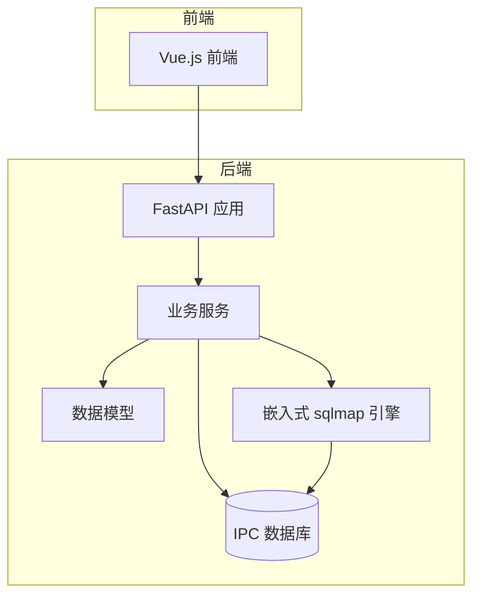
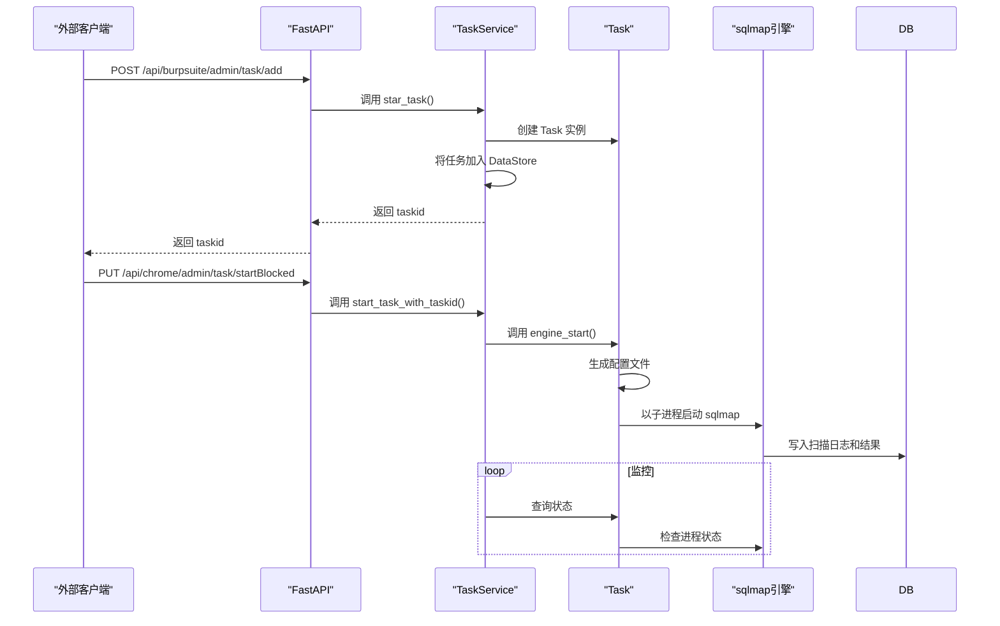
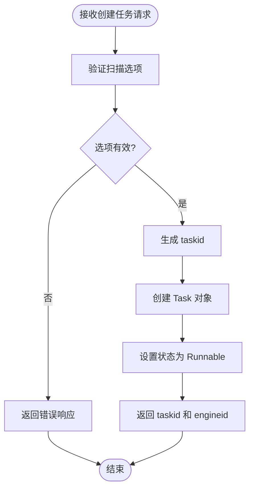
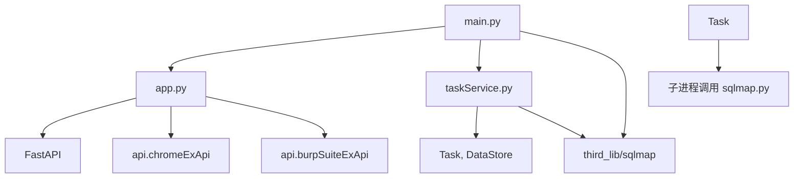

# 项目概述

<cite>
**本文档引用的文件**
- [main.py](file://src/backEnd/main.py)
- [app.py](file://src/backEnd/app.py)
- [taskService.py](file://src/backEnd/service/taskService.py)
- [Task.py](file://src/backEnd/model/Task.py)
- [TaskStatus.py](file://src/backEnd/model/TaskStatus.py)
- [admin.py](file://src/backEnd/api/chromeExApi/admin.py)
- [admin.py](file://src/backEnd/api/burpSuiteExApi/admin.py)
- [config.py](file://src/backEnd/config.py)
</cite>

## 目录
1. [简介](#简介)
2. [项目结构](#项目结构)
3. [核心组件](#核心组件)
4. [架构概述](#架构概述)
5. [详细组件分析](#详细组件分析)
6. [依赖分析](#依赖分析)
7. [性能考虑](#性能考虑)
8. [故障排除指南](#故障排除指南)
9. [结论](#结论)

## 简介
sqlmapWebUI项目是一个为sqlmap工具提供Web图形化界面和REST API服务的现代化应用。该项目通过FastAPI框架构建，旨在提升sqlmap工具的易用性，支持批量操作，并实现对SQL注入扫描任务的全生命周期管理。系统作为安全测试自动化的重要组成部分，充当了前端界面与底层sqlmap引擎之间的桥梁。其核心价值在于提供直观的用户界面、实时的任务状态监控以及与Chrome扩展、Burp Suite插件等外部系统的无缝集成。

## 项目结构
项目采用分层架构设计，主要分为后端（backEnd）和可能存在的前端静态资源。后端核心位于`src/backEnd`目录下，包含API接口、数据模型、业务服务和第三方库集成。`api`目录定义了与外部系统（如Chrome扩展和Burp Suite）交互的路由。`model`目录包含了任务、状态、请求/响应等核心数据结构。`service`目录封装了业务逻辑，特别是任务的创建、管理与查询。`third_lib/sqlmap`是嵌入的sqlmap工具核心库。`main.py`是应用的入口点，负责初始化环境和启动服务。

**图源**
- [main.py](file://src/backEnd/main.py#L1-L155)
- [app.py](file://src/backEnd/app.py#L1-L44)
- [taskService.py](file://src/backEnd/service/taskService.py#L1-L531)

**本节来源**
- [main.py](file://src/backEnd/main.py#L1-L155)
- [app.py](file://src/backEnd/app.py#L1-L44)

## 核心组件
项目的核心组件围绕任务（Task）的管理展开。`Task`模型（`model/Task.py`）代表一个SQL注入扫描实例，封装了扫描目标URL、HTTP请求头、请求体以及扫描配置选项。`TaskService`（`service/taskService.py`）是核心业务逻辑的提供者，负责处理所有与任务相关的操作，如创建、启动、停止、查询和删除。`DataStore`类提供了对任务池和IPC数据库的线程安全访问。`TaskStatus`枚举定义了任务的生命周期状态（新建、可运行、运行中、已阻塞、已终止）。

**本节来源**
- [Task.py](file://src/backEnd/model/Task.py#L1-L206)
- [taskService.py](file://src/backEnd/service/taskService.py#L1-L531)
- [TaskStatus.py](file://src/backEnd/model/TaskStatus.py#L1-L8)

## 架构概述
系统采用客户端-服务器架构。外部客户端（如浏览器中的Chrome扩展或Burp Suite插件）通过HTTP请求与FastAPI后端进行通信。后端接收到创建任务的请求后，`TaskService`会创建一个`Task`对象，并将其持久化到内存中的任务池（由`DataStore`管理）。当任务被启动时，系统会为该任务生成一个临时的配置文件，并以子进程的方式调用嵌入的sqlmap引擎，同时通过IPC数据库与引擎进行通信以获取扫描状态和结果。一个后台调度器（`BackgroundScheduler`）会定期运行`monitor`函数，用于清理已完成的任务。

**图源**
- [main.py](file://src/backEnd/main.py#L1-L155)
- [taskService.py](file://src/backEnd/service/taskService.py#L63-L87)
- [Task.py](file://src/backEnd/model/Task.py#L155-L174)

## 详细组件分析

### 任务服务分析
`TaskService`类是整个系统的大脑，它暴露了多个异步方法来管理任务。

#### 任务创建与启动
`star_task`方法是创建新任务的入口。它接收来自Burp Suite插件的请求参数，包括目标URL、请求头、请求体和扫描选项。该方法会验证选项的有效性，生成唯一的`taskid`，创建`Task`对象并初始化其状态为`Runnable`。`start_task_with_taskid`方法则用于将一个已创建但被阻塞的任务状态变更为`Runnable`，为启动做准备。

**图源**
- [taskService.py](file://src/backEnd/service/taskService.py#L63-L87)
- [Task.py](file://src/backEnd/model/Task.py#L18-L45)

#### 任务生命周期管理
`TaskService`提供了完整的任务控制功能：
- `stop_task`: 停止一个正在运行的任务，将其状态设为`Blocked`。
- `kill_task`: 终止一个任务，强制杀死其子进程，并将状态设为`Terminated`。
- `delete_task`: 从任务池中删除一个任务，如果任务正在运行，则先终止它。
- `flush_task`: 清空整个任务池，终止所有正在运行的任务。

**本节来源**
- [taskService.py](file://src/backEnd/service/taskService.py#L159-L223)

### API接口分析
项目通过FastAPI的`APIRouter`提供了两组API接口。

#### Burp Suite插件接口
位于`api/burpSuiteExApi/admin.py`，主要提供`/task/add`端点，用于接收Burp Suite插件发送的扫描请求。该接口会提取HTTP请求的详细信息（URL、头、体）并创建新的扫描任务。

#### Chrome扩展接口
位于`api/chromeExApi/admin.py`，提供了一套更全面的管理接口，包括任务的增删改查（CRUD）、状态控制、日志查询和结果获取。这些接口是Web UI与后端交互的主要通道。

**本节来源**
- [admin.py](file://src/backEnd/api/burpSuiteExApi/admin.py#L1-L36)
- [admin.py](file://src/backEnd/api/chromeExApi/admin.py#L1-L117)

## 依赖分析
项目的主要依赖关系清晰。`app.py`依赖于`FastAPI`框架和`api`模块来构建Web服务。`taskService.py`是核心，它依赖于`model`模块中的`Task`、`DataStore`等数据模型，以及`third_lib/sqlmap`提供的底层扫描能力。`Task`模型在内部通过子进程调用`third_lib/sqlmap/sqlmap.py`来执行实际的扫描工作。`main.py`作为启动器，负责将`third_lib/sqlmap`的路径加入`sys.path`，确保其可以被正确导入。

**图源**
- [main.py](file://src/backEnd/main.py#L1-L155)
- [app.py](file://src/backEnd/app.py#L1-L44)
- [taskService.py](file://src/backEnd/service/taskService.py#L1-L531)

**本节来源**
- [main.py](file://src/backEnd/main.py#L1-L155)
- [app.py](file://src/backEnd/app.py#L1-L44)
- [taskService.py](file://src/backEnd/service/taskService.py#L1-L531)

## 性能考虑
系统通过将每个扫描任务作为独立的子进程运行，实现了任务间的隔离，避免了单个任务的阻塞影响其他任务。使用内存中的`DataStore`和基于文件的IPC数据库进行通信，保证了数据交换的效率。然而，创建大量子进程可能会消耗较多系统资源。`config.py`中定义的`MAX_TASKS_COUNT`（当前为3）是一个潜在的性能调优点，用于限制并发任务数，防止系统过载。定期的`monitor`任务有助于及时清理已完成的任务，释放资源。

## 故障排除指南
常见问题可能包括：
1.  **任务无法启动**：检查`taskService.py`中的`star_task`方法日志，确认是否因不支持的选项或配置问题导致。
2.  **无法连接数据库**：检查`main.py`中`Database.filepath`的生成和`DataStore.current_db`的初始化是否成功。
3.  **找不到sqlmap.py**：确保`third_lib/sqlmap`目录存在且包含`sqlmap.py`文件，`Task`类的`engine_start`方法会按多个路径尝试查找。
4.  **跨域问题**：`app.py`中已配置`CORSMiddleware`允许特定来源，确保客户端的请求来源在`allow_origins`列表中。

**本节来源**
- [taskService.py](file://src/backEnd/service/taskService.py#L63-L87)
- [main.py](file://src/backEnd/main.py#L1-L155)
- [Task.py](file://src/backEnd/model/Task.py#L155-L174)
- [app.py](file://src/backEnd/app.py#L1-L44)

## 结论
sqlmapWebUI项目成功地将命令行工具sqlmap封装成了一个现代化的Web服务。它通过清晰的分层架构和RESTful API设计，极大地提升了工具的可用性和集成能力。系统能够高效地管理多个扫描任务的全生命周期，并通过IPC机制与底层引擎进行通信。未来可考虑增强认证机制、优化资源管理以及提供更丰富的扫描结果可视化功能。