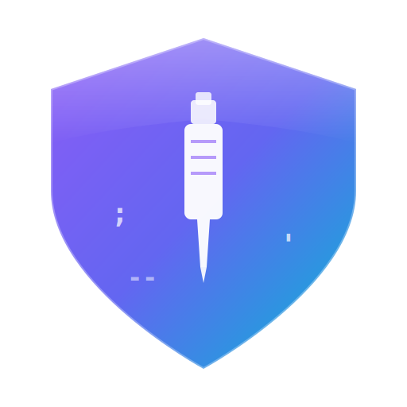

# SQLMap Web UI

<p align="center">
  
</p>

<p align="center">
  
  
  
  
  
</p>

<p align="center">
  <a href="README.md">中文</a> | <b>English</b>
</p>

A modern SQLMap web interface that provides a convenient SQL injection testing platform for security researchers. **Built-in VulnShop Lab** for hands-on practice.

## Features

### SQL Injection Scanning Platform
- **Task Management**: Create, monitor, and stop SQL injection scanning tasks
- **Real-time Logs**: View real-time log output during task execution
- **Scan Results**: Intuitive display of injection points and payload information
- **HTTP Request Viewer**: Complete display of raw HTTP request information
- **Enhanced Task List**:
  - Multi-dimensional filtering (URL/message keywords, status, date range, injection status)
  - Multi-field sorting (Task ID, status, creation time)
  - Summary statistics row (real-time task statistics display)
  - Smart polling (automatically adjusts refresh frequency based on task status)

### Scan Configuration Management 🆕
- **Default Configuration**: Set global default scan parameters
- **Preset Configurations**: Save commonly used configuration combinations with full CRUD support
- **History Configurations**: View configurations used in past scans
- **Guided Editor**: Visually configure SQLMap parameters without memorizing command line
- **Parameter Preview**: Real-time preview of generated command line parameters

### HTTP Request Parsing 🆕
- Support for automatic parsing of multiple request formats:
  - cURL (Bash/CMD)
  - PowerShell Invoke-WebRequest
  - JavaScript fetch
  - Raw HTTP message
- **Smart Format Detection**: Automatically identify input format
- **Code Editor**: Line numbers, syntax highlighting, search filter

### Batch Operations
- **Batch Stop**: Stop multiple running tasks at once
- **Batch Delete**: Delete completed or failed tasks in bulk
- **Batch Import**: Support batch import of HTTP requests to create scan tasks
- **Select All/Deselect**: Convenient task selection operations

### Header Rules Management
- **Persistent Rules**: Create long-term header rules with full CRUD support
- **Session-level Rules**: Set temporary headers with TTL auto-expiration
- **Scope Configuration**: Flexible URL matching rules
  - Protocol matching (http/https)
  - Hostname matching (supports wildcards `*.example.com`)
  - Port matching (supports multiple ports `80,443,8080`)
  - Path matching (supports wildcards `/api/*`)
  - Regular expression matching
- **Priority Control**: Support 0-100 priority settings
- **Replace Strategies**: Full replace, append, conditional replace, and more
- **Batch Import**: Support importing headers from text in bulk

### Extension Integration
- **Burp Suite Plugin**: Supports both Legacy API and Montoya API versions
  - Right-click menu for quick request sending
  - Configurable scan parameters (Level, Risk, DBMS, Technique)
  - Default configuration and saved presets management
  - Activity logging

### VulnShop Vulnerability Lab 🎯
Built-in e-commerce platform simulation with 8 types of SQL injection vulnerabilities:

| Vulnerability Type | Endpoint | Description |
|-------------------|----------|-------------|
| Error-based | POST /api/user/login | Error-based injection |
| Union-based | GET /api/user/profile | Union query injection |
| Boolean-blind | GET /api/products/search | Boolean blind injection |
| Time-based | GET /api/products/detail | Time-based blind injection |
| Stacked Queries | GET /api/orders/query | Stacked queries injection |
| 2nd Order | POST /api/user/register | Second-order injection |

**Lab Features**:
- 🎨 Modern UI with light/dark theme toggle
- 🛒 Complete shopping flow: browse products, cart, checkout
- ⚙️ 3 difficulty levels (Easy/Medium/Hard) with WAF protection
- 🔄 One-click database reset
- 📱 Optimized for Chrome browser on PC

## Tech Stack

### Backend
- **FastAPI** - High-performance asynchronous web framework
- **SQLMap** - Automatic SQL injection detection tool
- **Python 3.13+** - Runtime environment
- **SQLite** - Database storage
- **uv** - Modern Python package manager

### Frontend
- **Vue 3** - Progressive JavaScript framework
- **TypeScript** - Type-safe JavaScript
- **PrimeVue** - Enterprise-grade UI component library
- **Pinia** - Vue state management
- **Vite** - Next-generation frontend build tool

### Extensions
- **Burp Suite Plugin**
  - Montoya API (Java 17+, Burp 2023.1+)
  - Legacy API (Java 11+)

## Quick Start

### Requirements

- Python 3.13+
- Node.js 20+
- pnpm 9+
- Java 17+ (Burp Montoya API) or Java 11+ (Legacy API)

### Backend Installation

```bash
# Enter backend directory
cd src/backEnd

# Install dependencies with uv
uv sync --extra thirdparty

# Start service
uv run python main.py
```

### Frontend Installation

```bash
# Enter frontend directory
cd src/frontEnd

# Install dependencies
pnpm install

# Development mode
pnpm run dev

# Build for production
pnpm run build
```

### Start VulnShop Lab

```bash
# Enter lab directory
cd src/vulnTestServer

# Install dependencies (if not installed)
pip install flask

# Start server
python server.py
```

### Access Application

| Service | Address |
|---------|---------|
| Frontend dev server | http://localhost:5173 |
| Backend API server | http://localhost:8775 |
| VulnShop Lab | http://127.0.0.1:9527 |

## Project Structure

```
sqlmapWebUI/
├── src/
│   ├── backEnd/                 # Backend code
│   │   ├── api/                 # API routes
│   │   │   ├── chromeExApi/     # Chrome browser page API
│   │   │   ├── burpSuiteExApi/  # Burp Suite API
│   │   │   └── commonApi/       # Common API (auth/headers/config)
│   │   ├── model/               # Data models
│   │   ├── service/             # Business logic
│   │   ├── utils/               # Utility functions
│   │   ├── third_lib/sqlmap/    # SQLMap integration
│   │   ├── app.py               # FastAPI application
│   │   └── main.py              # Entry point
│   ├── frontEnd/                # Frontend code
│   │   ├── src/
│   │   │   ├── api/             # API requests
│   │   │   ├── components/      # Common components
│   │   │   ├── stores/          # Pinia stores
│   │   │   ├── types/           # TypeScript types
│   │   │   ├── utils/           # Utility functions
│   │   │   └── views/           # Page views
│   │   └── vite.config.ts       # Vite configuration
│   ├── burpEx/                  # Burp Suite extensions
│   │   ├── legacy-api/          # Legacy API (Java 11)
│   │   └── montoya-api/         # Montoya API (Java 17)
│   └── vulnTestServer/          # VulnShop vulnerability lab
│       ├── static/              # Frontend static assets
│       ├── server.py            # HTTP server
│       ├── database.py          # Database management
│       └── waf.py               # WAF module
└── doc/                         # Documentation
```

## Usage Guide

### Create Scan Task

1. Click "New Task" on the task list page
2. Enter target URL or import HTTP request
3. Configure scan parameters (optional)
4. Click "Start Scan"

### View Task Results

1. Click the target task in the task list
2. View basic info, HTTP request, scan configuration
3. View scan results and injection payloads
4. View real-time task logs

### Using VulnShop Lab

1. Start the lab server: `python server.py`
2. Visit http://127.0.0.1:9527 in your browser
3. Login with test accounts (admin/admin123 or test/test)
4. Follow page prompts to test various injection types

### Burp Suite Integration

1. Build plugin: `mvn clean package -DskipTests`
2. Load JAR file in Burp Suite
3. Configure backend server address
4. Right-click request and select "Send to SQLMap WebUI"

### Header Rules Configuration

1. Go to "Config" → "Header Rules Management" tab
2. Click "Add Rule"
3. Fill in rule information:
   - Rule name, Header name, Header value
   - Replace strategy, Priority
   - Optional: Configure scope to limit effective range
4. Save the rule

For detailed usage, please refer to [doc/USAGE_GUIDE.md](doc/USAGE_GUIDE.md)

## Security Notice

**Important**: This tool is for authorized security testing only.

- Only test on systems with explicit authorization
- Do not use on production or unauthorized systems
- VulnShop Lab binds to localhost only - never expose to public network

Please read the [Disclaimer](DISCLAIMER.md) before use.

## Changelog

### v1.7.9 (2025-12)
- Added project Logo design (shield + injection syringe concept)
- Web: Updated favicon, status bar, and About page Logo
- BurpSuite Plugin: Added Help/About dialog (usage help, license, disclaimer)
- BurpSuite Plugin: About page uses Java2D custom Logo drawing
- Fixed PrimeVue 4 component deprecation warnings (TabView → Tabs)
- Fixed JLabel HTML rendering issue in BurpSuite plugin
- Updated project documentation with Logo display

### v1.7.7 (2025-12)
- Updated all project documentation to reflect latest features
- Improved AGENTS.md and CLAUDE.md AI programming guides
- Optimized user usage guide documentation

### v1.7.6 (2025-12)
- Added scan configuration preset management (default/preset/history)
- Added guided parameter editor
- Added HTTP request parser (supports cURL/PowerShell/fetch/raw HTTP)
- Added code editor component (line numbers, syntax highlighting, search)
- Frontend code modular refactoring
- Fixed fetch parser escaped quotes handling issue

### v1.6.0 (2025-12)
- Added header rules scope configuration feature
- Added session-level header management
- Added batch header import functionality
- Added summary statistics row to task list
- Enhanced task filters (date range, injection status)
- Optimized smart polling strategy
- Updated project documentation

### v1.5.1 (2025-12)
- Updated project documentation
- Improved Burp Suite plugin integration
- Fixed backend configuration issues

### v1.5.0 (2025-12)
- Added VulnShop SQL injection testing lab
- Support for 8 SQL injection vulnerability types
- Modern UI with light/dark theme support
- Complete shopping flow simulation
- 3 difficulty levels with WAF protection

## License

This project is licensed under the [MIT License](LICENSE).

## Contributing

Issues and Pull Requests are welcome!

1. Fork this repository
2. Create feature branch (`git checkout -b feature/AmazingFeature`)
3. Commit changes (`git commit -m 'Add some AmazingFeature'`)
4. Push to branch (`git push origin feature/AmazingFeature`)
5. Submit Pull Request

## Acknowledgments

- [SQLMap](https://github.com/sqlmapproject/sqlmap) - Powerful SQL injection automation tool
- [FastAPI](https://fastapi.tiangolo.com/) - Modern Python web framework
- [Vue.js](https://vuejs.org/) - Progressive JavaScript framework
- [PrimeVue](https://primevue.org/) - Vue UI component library
